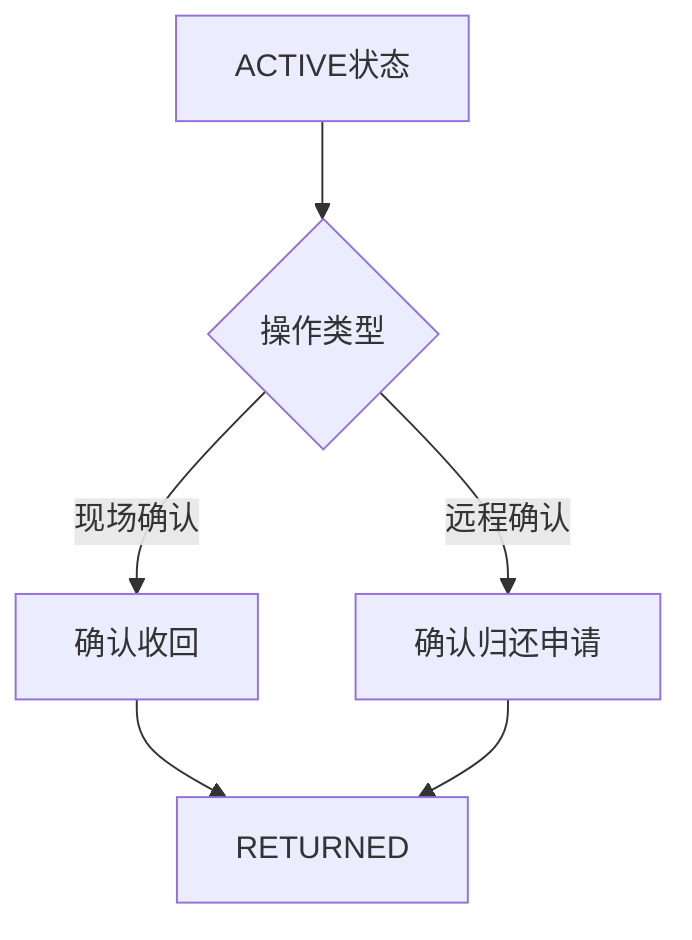
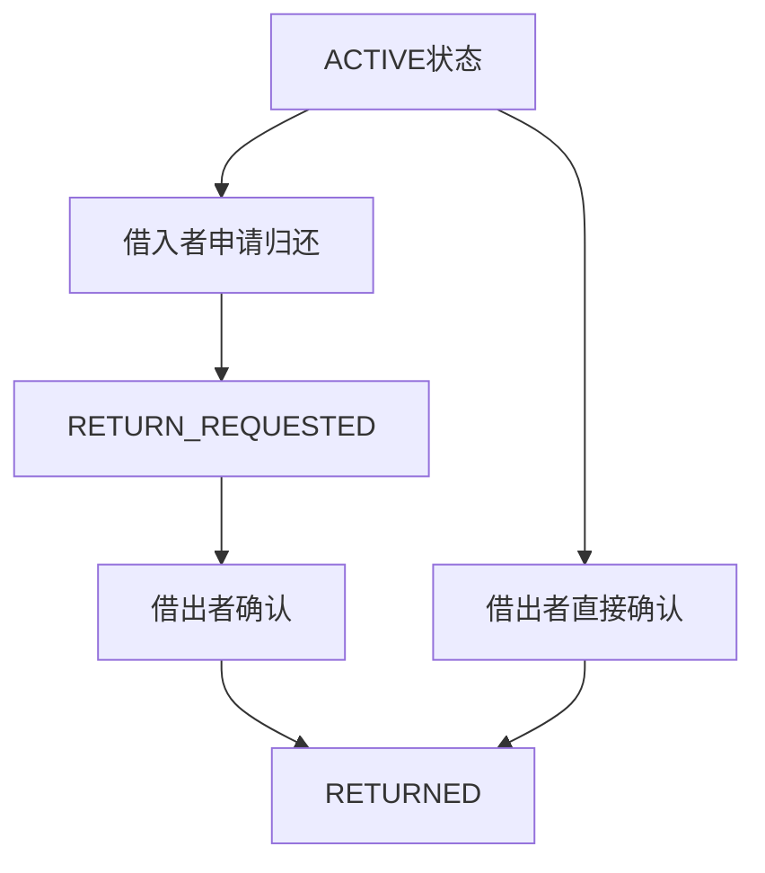

出者确认归还申请 借出者对 RETURN\_REQUESTED 状态的处理

与借出者“确认归还”是否有冲突呢，借出者开始可以直接归还，分析一下里面的逻辑，不写代码。

<br />

<br />

很好的问题！让我分析一下这两个功能的逻辑关系和潜在冲突：

## 🤔 逻辑分析

### 当前实现

**借出者"确认归还"** (`POST /api/borrows/{id}/return`)：

- 状态：`ACTIVE` → `RETURNED`
- 逻辑：借出者直接确认物品已归还，物品状态变为 `AVAILABLE`
- 适用场景：借入者主动归还，借出者现场确认

**借出者确认归还申请** (`POST /api/borrows/{id}/approve` - 需要新增)：

- 状态：`RETURN_REQUESTED` → `RETURNED`
- 逻辑：借出者确认借入者的归还申请，物品状态变为 `AVAILABLE`
- 适用场景：借入者申请归还，借出者远程确认

### 🔄 状态流转对比

```
场景1: 直接归还（当前实现）
ACTIVE ──[借出者确认收回]──> RETURNED

场景2: 申请归还（需要实现）
ACTIVE ──[借入者申请]──> RETURN_REQUESTED ──[借出者确认]──> RETURNED
```

### ⚠️ 潜在冲突分析

#### 1. **状态冲突**

- 如果借出者在 `RETURN_REQUESTED` 状态下点击"确认收回"，会跳过申请确认直接归还
- 这可能导致借入者申请被忽略，用户体验不佳

#### 2. **业务逻辑冲突**

- **直接归还**：适用于现场确认，物品确实已归还
- **申请确认**：适用于远程确认，借入者已归还但借出者不在现场

#### 3. **权限冲突**

- 两个功能都是借出者操作，但针对不同状态
- 需要明确区分操作权限和适用场景

### 💡 解决方案

#### 方案1：状态区分 + 功能分离



#### 方案2：统一归还确认 + 申请记录



### 🎯 推荐方案

**采用方案2**，原因：

1. **用户体验**：借入者申请归还后，借出者可以看到申请记录
2. **业务完整性**：所有归还流程都有记录可查
3. **灵活性**：借出者可以选择直接确认或等待申请

### 📋 具体实现逻辑

#### 借出者操作逻辑：

1. **当状态为** **`ACTIVE`**：
   - 可以直接"确认收回"（适用于现场确认）
   - 可以等待借入者申请归还
2. **当状态为** **`RETURN_REQUESTED`**：
   - 只能"确认归还申请"（适用于远程确认）
   - 不能直接"确认收回"（避免跳过申请）

#### 界面显示逻辑：

| 当前状态               | 可用按钮   | 说明       |
| :----------------- | :----- | :------- |
| `ACTIVE`           | 确认收回   | 直接确认归还   |
| `ACTIVE`           | -      | 等待借入者申请  |
| `RETURN_REQUESTED` | 确认归还申请 | 确认借入者的申请 |
| `RETURN_REQUESTED` | -      | 等待借出者确认  |

### 🔍 业务场景分析

#### 场景1：现场归还

- 借入者带着物品归还
- 借出者现场确认
- 使用"确认收回"功能
- 状态：`ACTIVE` → `RETURNED`

#### 场景2：远程归还

- 借入者将物品放在指定地点
- 借入者申请归还
- 借出者远程确认
- 使用"确认归还申请"功能
- 状态：`ACTIVE` → `RETURN_REQUESTED` → `RETURNED`

#### 场景3：超期归还

- 借入者超期归还
- 借出者直接确认
- 使用"确认收回"功能
- 状态：`OVERDUE` → `RETURNED`

### ✅ 结论

两个功能**没有冲突**，而是互补的：

- **确认收回**：适用于现场确认的直接归还
- **确认归还申请**：适用于远程确认的申请归还

关键是要在界面和状态管理上明确区分这两个功能的使用场景，让用户根据实际情况选择合适的操作方式。
