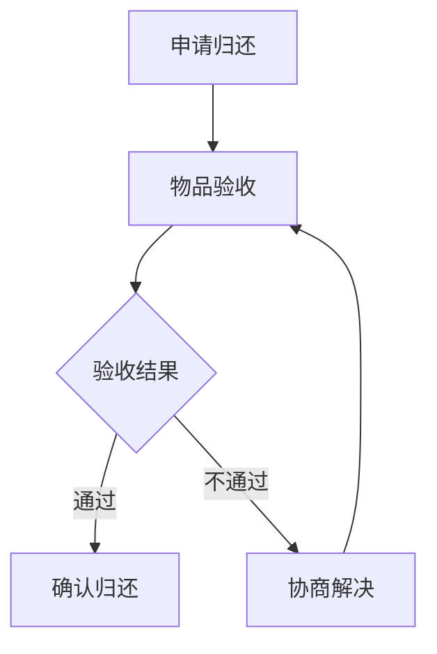

# 借阅模块可拓展性与接口占位

> 本文档记录借阅模块的现有实现、待实现功能、接口占位以及可拓展方向，供后续开发优化参考

## 📋 目录

1. [现有实现](#现有实现)
2. [待实现功能](#待实现功能)
3. [接口占位](#接口占位)
4. [可拓展方向](#可拓展方向)
5. [优化建议](#优化建议)
6. [技术债务](#技术债务)

## 🎯 现有实现

### 已实现的核心功能

| 功能 | 接口 | 角色 | 状态变化 | 实现状态 |
|------|------|------|----------|----------|
| 提交借阅申请 | `POST /api/borrows` | 借入者 | `PENDING` | ✅ |
| 同意申请 | `POST /api/borrows/{id}/approve` | 借出者 | `PENDING → APPROVED` | ✅ |
| 拒绝申请 | `POST /api/borrows/{id}/approve` | 借出者 | `PENDING → REJECTED` | ✅ |
| 确认取件 | `POST /api/borrows/{id}/pickup` | 借入者 | `APPROVED → ACTIVE` | ✅ |
| 申请归还 | `POST /api/borrows/{id}/apply-return` | 借入者 | `ACTIVE → RETURN_REQUESTED` | ✅ |
| 提醒归还 | `POST /api/borrows/{id}/remind` | 借出者 | `ACTIVE` (记录提醒) | ✅ |
| 确认收回 | `POST /api/borrows/{id}/return` | 借出者 | `ACTIVE → RETURNED` | ✅ |
| 取消借阅 | `POST /api/borrows/{id}/cancel` | 借入者 | `PENDING/APPROVED → CANCELLED` | ✅ |

### 已实现的查询接口

| 接口 | 功能 | 角色 | 实现状态 |
|------|------|------|----------|
| `GET /api/borrows/{id}` | 借阅详情 | 双方 | ✅ |
| `GET /api/borrows/my/borrowed` | 我借入的 | 借入者 | ✅ |
| `GET /api/borrows/my/lent` | 我借出的 | 借出者 | ✅ |
| `GET /api/borrows/my/pending` | 待处理申请 | 借出者 | ✅ |

## ⚠️ 待实现功能

### 高优先级

| 功能 | 接口 | 角色 | 状态变化 | 说明 |
|------|------|------|----------|------|
| 确认归还申请 | `POST /api/borrows/{id}/approve-return` | 借出者 | `RETURN_REQUESTED → RETURNED` | 借出者确认借入者的归还申请 |
| 归还申请列表 | `GET /api/borrows/my/return-requests` | 借出者 | - | 查看所有待确认的归还申请 |
| 超期自动检测 | 定时任务 | 系统 | `ACTIVE → OVERDUE` | 系统自动检测并更新超期状态 |

### 中优先级

| 功能 | 接口 | 角色 | 说明 |
|------|------|------|------|
| 消息通知系统 | WebSocket/API | 双方 | 申请、审批、提醒等通知 |
| 归还申请拒绝 | `POST /api/borrows/{id}/reject-return` | 借出者 | 借出者拒绝归还申请 |
| 批量操作 | `POST /api/borrows/batch` | 双方 | 批量处理借阅记录 |

### 低优先级

| 功能 | 接口 | 角色 | 说明 |
|------|------|------|------|
| 评价系统 | `POST /api/borrows/{id}/review` | 双方 | 借阅完成后互评 |
| 信用分计算 | 定时任务 | 系统 | 基于借阅行为计算信用分 |
| 统计报表 | `GET /api/borrows/stats` | 管理员 | 借阅数据统计 |

## 📍 接口占位

### 已预留的接口路径

| 接口 | 方法 | 功能描述 | 状态 |
|------|------|----------|------|
| `/api/borrows/{id}/approve-return` | POST | 确认归还申请 | 占位 |
| `/api/borrows/my/return-requests` | GET | 归还申请列表 | 占位 |
| `/api/borrows/{id}/reject-return` | POST | 拒绝归还申请 | 占位 |
| `/api/borrows/batch` | POST | 批量操作 | 占位 |
| `/api/borrows/{id}/review` | POST | 评价借阅 | 占位 |
| `/api/borrows/stats` | GET | 借阅统计 | 占位 |

### 前端方法占位

| 方法 | 功能 | 实现状态 |
|------|------|----------|
| `applyReturn` | 申请归还 | ✅ 已实现 |
| `approveReturnRequest` | 确认归还申请 | 占位 |
| `rejectReturnRequest` | 拒绝归还申请 | 占位 |
| `getReturnRequests` | 获取归还申请 | 占位 |
| `batchProcessBorrows` | 批量处理 | 占位 |
| `reviewBorrow` | 评价借阅 | 占位 |

## 🚀 可拓展方向

### 1. 业务流程拓展

#### 1.1 多阶段归还流程

**拓展点**：
- 增加物品验收环节
- 支持归还条件检查
- 提供协商机制

#### 1.2 预约系统

**功能**：
- 支持物品预约
- 预约排队机制
- 预约通知

**接口**：
- `POST /api/borrows/{id}/reserve` - 预约物品
- `GET /api/borrows/reservations` - 我的预约

#### 1.3 共享圈拓展

**功能**：
- 社区内共享
- 好友圈共享
- 组织内共享

**接口**：
- `GET /api/borrows/community` - 社区内借阅
- `GET /api/borrows/friends` - 好友圈借阅

### 2. 技术架构拓展

#### 2.1 微服务拆分

**拆分方案**：
- `borrow-service` - 借阅核心服务
- `notification-service` - 通知服务
- `review-service` - 评价服务
- `stats-service` - 统计服务

**优势**：
- 独立部署和扩展
- 服务间解耦
- 提高系统稳定性

#### 2.2 缓存策略

**缓存方案**：
- Redis 缓存热点数据
- 借阅状态缓存
- 用户统计数据缓存

**接口**：
- `GET /api/borrows/cache` - 缓存管理

#### 2.3 事件驱动架构

**事件**：
- `BorrowCreatedEvent` - 借阅创建
- `BorrowApprovedEvent` - 借阅批准
- `BorrowReturnedEvent` - 借阅归还

**优势**：
- 系统解耦
- 异步处理
- 可扩展性强

### 3. 用户体验优化

#### 3.1 智能推荐

**功能**：
- 基于借阅历史推荐
- 基于社区热度推荐
- 个性化推荐

**接口**：
- `GET /api/borrows/recommendations` - 推荐借阅

#### 3.2 移动端适配

**功能**：
- 响应式设计
- 移动端专属功能
- 推送通知

**接口**：
- `POST /api/borrows/mobile/register` - 设备注册

#### 3.3 无障碍访问

**功能**：
- 屏幕阅读器支持
- 键盘导航
- 高对比度模式

**接口**：
- `GET /api/borrows/accessibility` - 无障碍设置

## 💡 优化建议

### 1. 性能优化

| 优化点 | 建议方案 | 预期效果 |
|--------|----------|----------|
| 数据库查询 | 添加索引、优化查询 | 提升查询性能 |
| 缓存策略 | Redis 缓存热点数据 | 减少数据库压力 |
| 批量操作 | 实现批量 API | 减少网络请求 |
| 异步处理 | 消息队列处理非实时任务 | 提高系统响应速度 |

### 2. 安全性优化

| 优化点 | 建议方案 | 预期效果 |
|--------|----------|----------|
| 权限控制 | 细粒度权限检查 | 防止越权操作 |
| 数据验证 | 服务端数据校验 | 防止恶意数据 |
| 防刷机制 | 接口访问限制 | 防止滥用 |
| 敏感信息 | 加密存储 | 保护用户隐私 |

### 3. 代码质量优化

| 优化点 | 建议方案 | 预期效果 |
|--------|----------|----------|
| 代码结构 | 模块化设计 | 提高可维护性 |
| 错误处理 | 统一异常处理 | 提升系统稳定性 |
| 日志管理 | 结构化日志 | 便于问题排查 |
| 测试覆盖 | 单元测试 + 集成测试 | 保证代码质量 |

## 🔧 技术债务

### 1. 待重构代码

| 模块 | 问题 | 建议方案 |
|------|------|----------|
| BorrowService | 方法过长 | 拆分方法，提高可读性 |
| UserServiceImpl | 全表扫描 | 使用分页查询，添加索引 |
| 错误处理 | 异常抛出方式不一致 | 统一异常处理机制 |
| 状态管理 | 硬编码状态值 | 使用枚举和常量 |

### 2. 待完善文档

| 文档类型 | 内容 | 优先级 |
|----------|------|--------|
| API 文档 | 完整的 API 接口文档 | 高 |
| 架构文档 | 系统架构设计说明 | 高 |
| 数据库文档 | 数据库设计与索引优化 | 中 |
| 部署文档 | 部署流程与环境配置 | 中 |

## 📅 开发计划

### 短期计划（1-2周）

1. ✅ 实现核心借阅流程
2. 实现确认归还申请功能
3. 完善错误处理机制
4. 补充单元测试

### 中期计划（1-2个月）

1. 实现消息通知系统
2. 开发移动端适配
3. 优化数据库性能
4. 完善统计分析功能

### 长期计划（3-6个月）

1. 微服务拆分
2. 智能推荐系统
3. 社区生态建设
4. 国际化支持

## 🔍 监控与维护

### 监控指标

| 指标 | 监控方式 | 预警阈值 |
|------|----------|----------|
| API 响应时间 | Prometheus + Grafana | > 500ms |
| 错误率 | ELK 日志分析 | > 1% |
| 数据库性能 | MySQL 监控 | 查询时间 > 1s |
| 系统负载 | 服务器监控 | CPU > 80% |

### 维护建议

1. **定期备份**：数据库定期备份
2. **日志清理**：定期清理过期日志
3. **性能分析**：定期进行性能分析
4. **安全审计**：定期安全扫描

## 📝 总结

借阅模块是邻里共享平台的核心功能之一，目前已实现基础的借阅流程，但仍有很大的拓展空间。通过本文档的规划，可以在保持核心功能稳定的同时，逐步拓展更多高级功能，提升用户体验和系统性能。

### 核心价值

1. **促进社区共享**：通过便捷的借阅流程，鼓励社区成员共享物品
2. **建立信任体系**：通过评价和信用分系统，建立社区信任
3. **环保理念**：减少物品闲置，促进资源循环利用
4. **技术创新**：不断优化技术架构，提升系统性能和可靠性

---

**文档更新时间**：2026-03-30  
**文档版本**：1.0  
**编写者**：开发团队
