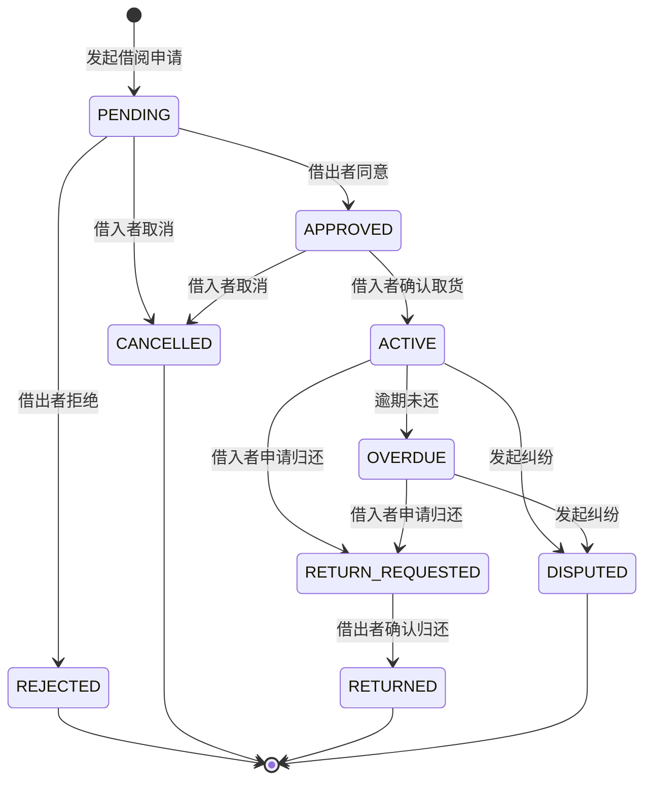
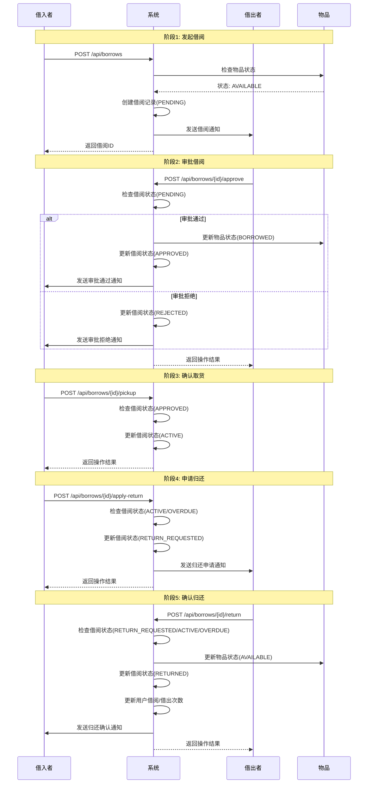
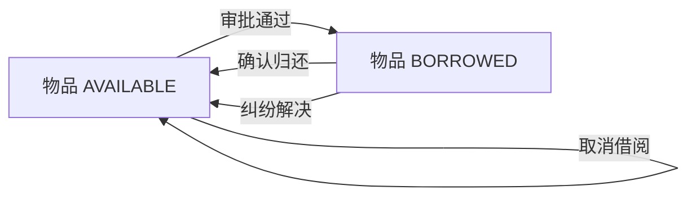
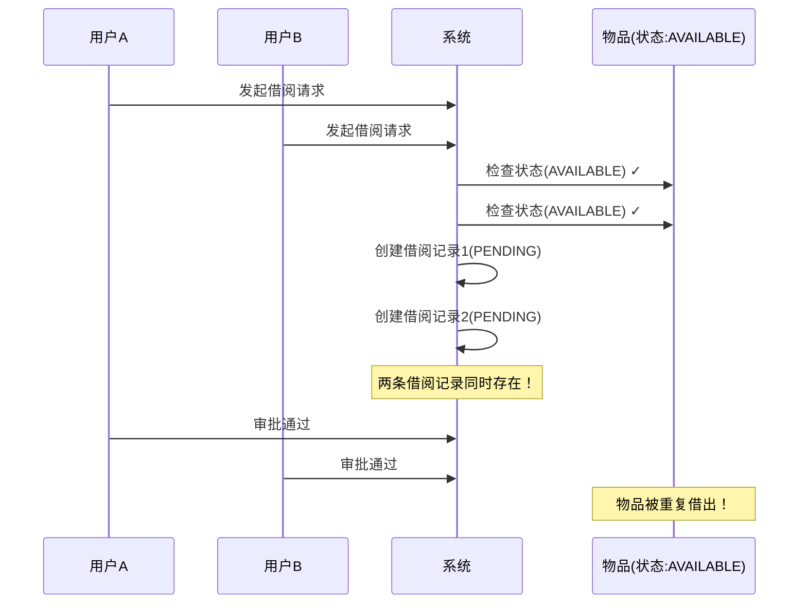

# 借阅模块流程文档

## 一、模块概述

借阅模块是邻里共享平台的核心功能，实现用户之间物品借用、归还的完整流程。

### 涉及实体

| 实体 | 说明 |
|-----|------|
| Borrow | 借阅记录 |
| Item | 物品 |
| User | 用户（借入者/借出者） |
| Message | 消息通知 |

### 借阅状态流转



---

## 二、完整借阅流程



---

## 三、API接口列表

| 接口 | 方法 | 说明 | 调用角色 |
|-----|------|------|---------|
| `/api/borrows` | POST | 发起借阅申请 | 借入者 |
| `/api/borrows/{id}/approve` | POST | 审批借阅申请 | 借出者 |
| `/api/borrows/{id}/pickup` | POST | 确认取货 | 借入者 |
| `/api/borrows/{id}/apply-return` | POST | 申请归还 | 借入者 |
| `/api/borrows/{id}/return` | POST | 确认归还 | 借出者 |
| `/api/borrows/{id}/cancel` | POST | 取消借阅 | 借入者 |
| `/api/borrows/{id}/remind` | POST | 催促归还 | 借出者 |
| `/api/borrows/{id}` | GET | 获取借阅详情 | 双方 |
| `/api/borrows/my/borrowed` | GET | 我的借入列表 | 借入者 |
| `/api/borrows/my/lent` | GET | 我的借出列表 | 借出者 |
| `/api/borrows/my/pending` | GET | 待处理借阅 | 借出者 |

---

## 四、状态变更矩阵

| 当前状态 | 可执行操作 | 目标状态 | 操作者 |
|---------|-----------|---------|-------|
| - | 发起借阅 | PENDING | 借入者 |
| PENDING | 审批通过 | APPROVED | 借出者 |
| PENDING | 审批拒绝 | REJECTED | 借出者 |
| PENDING | 取消借阅 | CANCELLED | 借入者 |
| APPROVED | 确认取货 | ACTIVE | 借入者 |
| APPROVED | 取消借阅 | CANCELLED | 借入者 |
| ACTIVE | 申请归还 | RETURN_REQUESTED | 借入者 |
| ACTIVE | 确认归还 | RETURNED | 借出者 |
| ACTIVE | 发起纠纷 | DISPUTED | 双方 |
| ACTIVE | 逾期 | OVERDUE | 系统自动 |
| OVERDUE | 申请归还 | RETURN_REQUESTED | 借入者 |
| OVERDUE | 确认归还 | RETURNED | 借出者 |
| RETURN_REQUESTED | 确认归还 | RETURNED | 借出者 |

---

## 五、物品状态联动



| 操作 | 物品状态变化 |
|-----|-------------|
| 发起借阅 | 无变化 |
| 审批通过 | AVAILABLE → BORROWED |
| 审批拒绝 | 无变化 |
| 取消借阅 | 无变化 |
| 确认归还 | BORROWED → AVAILABLE |
| 纠纷解决 | BORROWED → AVAILABLE |

---

## 六、问题分析

### 🔴 严重问题：并发借阅

#### 问题描述

当多个用户同时发起借阅申请时，可能导致同一物品被多次借出。

#### 问题场景



#### 问题根源

```java
// BorrowService.java 第66-68行
if (item.getStatus() != ItemStatus.AVAILABLE) {
    throw new BusinessException(ErrorCode.ITEM_NOT_AVAILABLE);
}
```

该检查**没有使用数据库锁**，在高并发情况下：
1. 线程A检查物品状态为AVAILABLE
2. 线程B检查物品状态仍为AVAILABLE
3. 线程A创建借阅记录
4. 线程B也创建借阅记录
5. 两条借阅记录都进入PENDING状态

#### 影响范围

- 同一物品可能被多次借出
- 数据不一致
- 用户体验混乱

---

### 🟡 中等问题：审批时未二次检查

#### 问题描述

审批通过时，只检查了借阅状态是否为PENDING，未检查物品当前状态。

#### 问题场景

```
T1: 用户A 发起借阅 → 物品状态 AVAILABLE
T2: 管理员下架物品 → 物品状态 PENDING_REVIEW
T3: 借出者审批通过 → 物品状态被改为 BORROWED
```

**结果**：已下架物品被借出。

#### 问题代码

```java
// BorrowService.java 第121-132行
if (borrow.getStatus() != BorrowStatus.PENDING) {
    throw new BusinessException(ErrorCode.BORROW_STATUS_INVALID);
}

if (request.approved()) {
    borrow.setStatus(BorrowStatus.APPROVED);
    borrow.getItem().setStatus(ItemStatus.BORROWED); // 未检查物品当前状态
    // ...
}
```

---

### 🟡 中等问题：取消借阅后物品状态未恢复

#### 问题描述

当借阅状态为APPROVED时取消借阅，物品状态仍为BORROWED，未恢复为AVAILABLE。

#### 问题场景

```
T1: 借阅审批通过 → 物品状态 BORROWED
T2: 借入者取消借阅 → 借阅状态 CANCELLED
T3: 物品状态仍为 BORROWED → 物品无法被再次借出
```

#### 问题代码

```java
// BorrowService.java 第240-254行
public void cancelBorrow(Long borrowId, Long borrowerId) {
    // ...
    borrow.setStatus(BorrowStatus.CANCELLED);
    borrowRepository.save(borrow);
    // 未恢复物品状态！
}
```

---

### 🟢 低优先级问题

| 问题 | 说明 |
|-----|------|
| 逾期未自动处理 | 没有定时任务检查并更新逾期借阅状态 |
| 信用分机制缺失 | 逾期扣分、按时归还加分等机制未实现 |
| 催促归还限制 | 每天只能催促一次，但未检查是否同一天 |

---

## 七、修复建议

### P0 - 并发借阅问题修复

#### 方案1：乐观锁（推荐）

```java
// Item实体添加版本号
@Version
private Long version;

// 创建借阅时使用原子操作
@Modifying
@Query("UPDATE Item SET status = :newStatus WHERE id = :id AND status = :oldStatus")
int updateStatusIfAvailable(@Param("id") Long id, 
                            @Param("oldStatus") ItemStatus oldStatus,
                            @Param("newStatus") ItemStatus newStatus);
```

#### 方案2：悲观锁

```java
@Lock(LockModeType.PESSIMISTIC_WRITE)
@Query("SELECT i FROM Item i WHERE i.id = :id")
Optional<Item> findByIdWithLock(@Param("id") Long id);
```

### P1 - 审批时二次检查

```java
if (request.approved()) {
    // 二次检查物品状态
    if (borrow.getItem().getStatus() != ItemStatus.AVAILABLE) {
        throw new BusinessException(ErrorCode.ITEM_NOT_AVAILABLE);
    }
    // ...
}
```

### P2 - 取消借阅时恢复物品状态

```java
public void cancelBorrow(Long borrowId, Long borrowerId) {
    // ...
    if (borrow.getStatus() == BorrowStatus.APPROVED) {
        borrow.getItem().setStatus(ItemStatus.AVAILABLE);
    }
    borrow.setStatus(BorrowStatus.CANCELLED);
    // ...
}
```

---

## 八、修复优先级总结

| 优先级 | 问题 | 风险等级 | 修复复杂度 |
|-------|------|---------|-----------|
| P0 | 并发借阅 | 高 | 中 |
| P1 | 审批时未二次检查 | 中 | 低 |
| P2 | 取消借阅后物品状态未恢复 | 中 | 低 |
| P3 | 逾期自动处理 | 低 | 中 |
| P3 | 信用分机制 | 低 | 高 |
