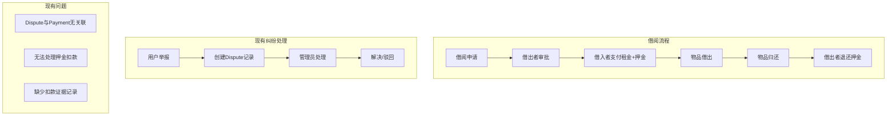
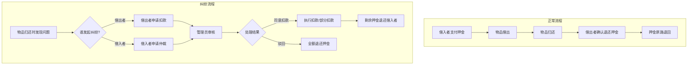
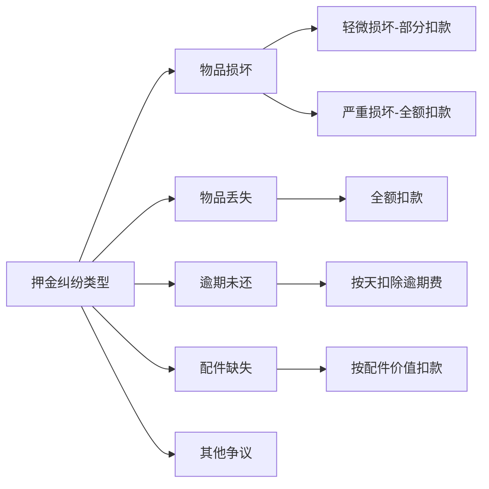
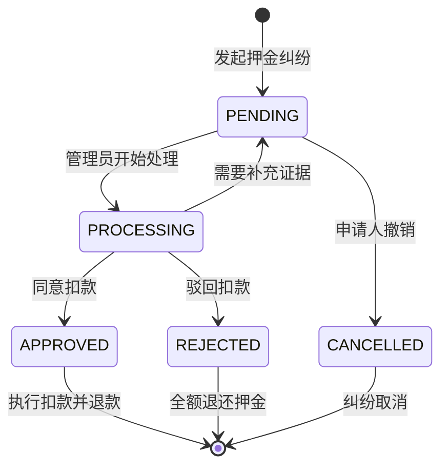
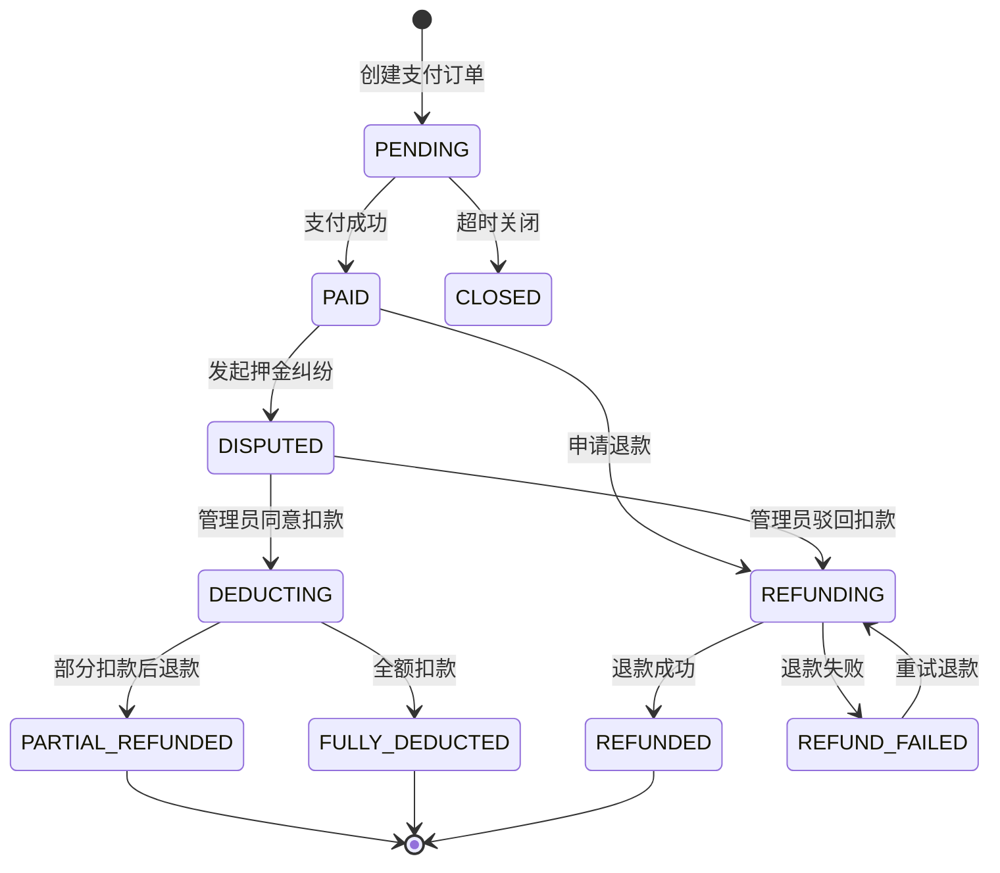
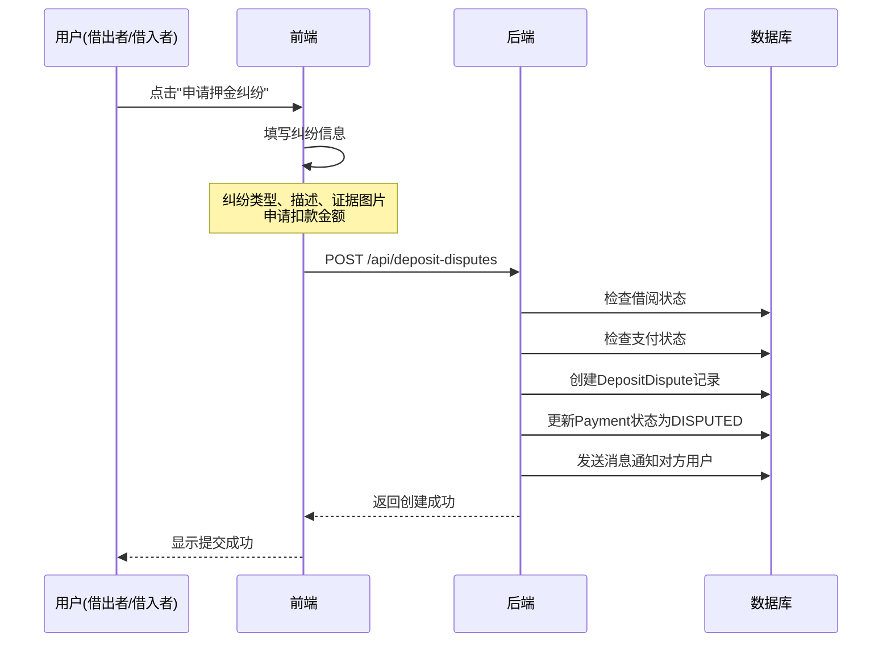
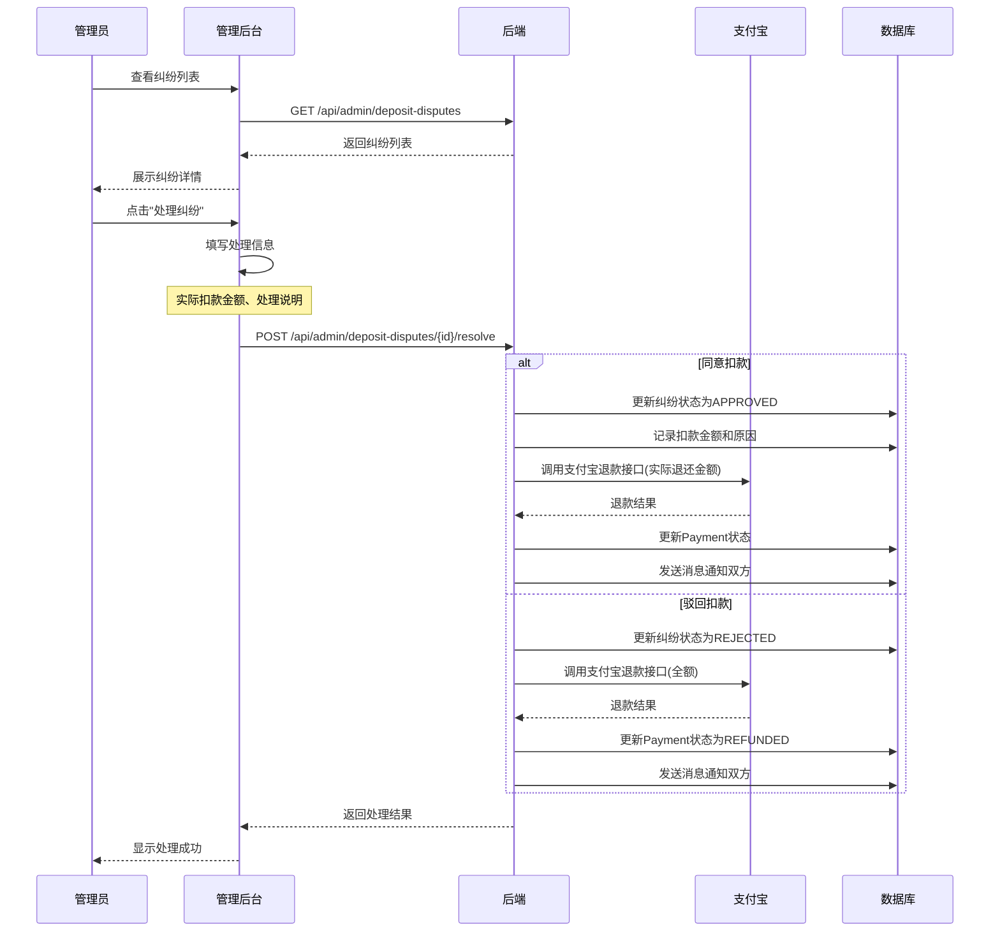
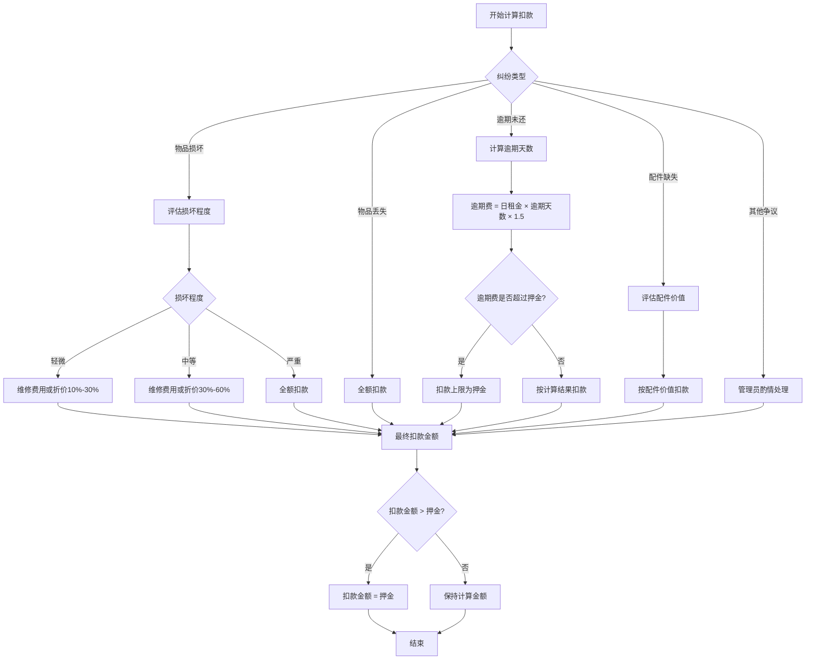

# 押金纠纷处理设计文档

## 一、背景与目标

### 1.1 背景
在邻里共享平台中，借阅物品涉及押金机制。当物品在借阅过程中发生损坏、丢失或逾期等情况时，需要管理员介入处理押金纠纷，决定是否扣款及扣款金额。

### 1.2 目标
- 设计完整的押金纠纷处理流程
- 支持全额/部分扣款
- 保障借入者和借出者的权益
- 提供管理员操作依据和记录

---

## 二、现状分析

### 2.1 现有系统架构



### 2.2 现有数据结构

| 表名 | 说明 | 与押金纠纷的关系 |
|------|------|-----------------|
| `payments` | 支付记录 | 存储押金金额，但只能全额退款 |
| `disputes` | 纠纷记录 | 记录纠纷信息，但无扣款关联 |
| `borrows` | 借阅记录 | 关联支付和纠纷 |

### 2.3 现有问题

1. **Dispute与Payment无关联**：纠纷处理无法直接影响押金状态
2. **无法部分扣款**：现有退款逻辑只支持全额退还押金
3. **缺少扣款证据**：没有记录扣款原因、证据图片等
4. **缺少扣款类型**：无法区分损坏、丢失、逾期等不同情况

---

## 三、设计方案

### 3.1 整体流程



### 3.2 押金纠纷类型



### 3.3 数据库设计

#### 3.3.1 扩展 Payment 表

```sql
-- 新增字段
ALTER TABLE payments ADD COLUMN deduction_amount DECIMAL(10,2) DEFAULT 0.00 COMMENT '扣款金额';
ALTER TABLE payments ADD COLUMN deduction_reason VARCHAR(500) COMMENT '扣款原因';
ALTER TABLE payments ADD COLUMN deduction_type VARCHAR(20) COMMENT '扣款类型: DAMAGE/LOSS/OVERDUE/MISSING_PARTS/OTHER';
ALTER TABLE payments ADD COLUMN deduction_evidence VARCHAR(2000) COMMENT '扣款证据图片JSON数组';
ALTER TABLE payments ADD COLUMN actual_refund_amount DECIMAL(10,2) COMMENT '实际退还金额';
```

#### 3.3.2 新增 DepositDispute 表（押金纠纷专用）

```sql
CREATE TABLE IF NOT EXISTS deposit_disputes (
    id BIGINT AUTO_INCREMENT PRIMARY KEY COMMENT '押金纠纷ID',
    payment_id BIGINT NOT NULL COMMENT '支付记录ID',
    borrow_id BIGINT NOT NULL COMMENT '借阅ID',
    
    -- 申请人信息
    initiator_id BIGINT NOT NULL COMMENT '发起人ID',
    initiator_type VARCHAR(20) NOT NULL COMMENT '发起人类型: LENDER/BORROWER',
    
    -- 纠纷信息
    dispute_type VARCHAR(20) NOT NULL COMMENT '纠纷类型: DAMAGE/LOSS/OVERDUE/MISSING_PARTS/OTHER',
    description VARCHAR(1000) NOT NULL COMMENT '纠纷描述',
    evidence_images VARCHAR(2000) COMMENT '证据图片JSON数组',
    
    -- 扣款申请
    claim_amount DECIMAL(10,2) NOT NULL COMMENT '申请扣款金额',
    claim_reason VARCHAR(500) COMMENT '申请扣款理由',
    
    -- 处理结果
    status VARCHAR(20) DEFAULT 'PENDING' COMMENT '状态: PENDING/PROCESSING/APPROVED/REJECTED/CANCELLED',
    actual_deduction DECIMAL(10,2) COMMENT '实际扣款金额',
    resolution VARCHAR(500) COMMENT '处理说明',
    
    -- 管理员信息
    handler_id BIGINT COMMENT '处理管理员ID',
    handled_at TIMESTAMP NULL COMMENT '处理时间',
    
    -- 时间戳
    created_at TIMESTAMP DEFAULT CURRENT_TIMESTAMP,
    updated_at TIMESTAMP DEFAULT CURRENT_TIMESTAMP ON UPDATE CURRENT_TIMESTAMP,
    
    INDEX idx_payment (payment_id),
    INDEX idx_borrow (borrow_id),
    INDEX idx_initiator (initiator_id),
    INDEX idx_status (status),
    FOREIGN KEY (payment_id) REFERENCES payments(id),
    FOREIGN KEY (borrow_id) REFERENCES borrows(id),
    FOREIGN KEY (initiator_id) REFERENCES users(id),
    FOREIGN KEY (handler_id) REFERENCES users(id)
) ENGINE=InnoDB DEFAULT CHARSET=utf8mb4 COLLATE=utf8mb4_unicode_ci COMMENT='押金纠纷表';
```

### 3.4 状态流转



### 3.5 支付状态扩展



---

## 四、核心功能设计

### 4.1 发起押金纠纷



### 4.2 管理员处理纠纷



### 4.3 扣款金额计算



---

## 五、API接口设计

### 5.1 用户端接口

| 接口 | 方法 | 说明 |
|------|------|------|
| `/api/deposit-disputes` | POST | 发起押金纠纷 |
| `/api/deposit-disputes/{id}` | GET | 获取纠纷详情 |
| `/api/deposit-disputes/{id}/cancel` | POST | 撤销纠纷申请 |
| `/api/deposit-disputes/my` | GET | 获取我的纠纷列表 |

### 5.2 管理员接口

| 接口 | 方法 | 说明 |
|------|------|------|
| `/api/admin/deposit-disputes` | GET | 获取纠纷列表(分页) |
| `/api/admin/deposit-disputes/{id}` | GET | 获取纠纷详情 |
| `/api/admin/deposit-disputes/{id}/resolve` | POST | 处理纠纷 |
| `/api/admin/deposit-disputes/stats` | GET | 获取纠纷统计 |

### 5.3 接口详细设计

#### 发起押金纠纷

```json
// POST /api/deposit-disputes
// Request
{
    "borrowId": 123,
    "disputeType": "DAMAGE",
    "description": "物品表面有明显划痕，影响使用",
    "evidenceImages": [
        "https://xxx.com/img1.jpg",
        "https://xxx.com/img2.jpg"
    ],
    "claimAmount": 50.00,
    "claimReason": "维修费用预估50元"
}

// Response
{
    "code": 0,
    "message": "success",
    "data": {
        "id": 1,
        "status": "PENDING",
        "createdAt": "2026-04-15T10:00:00"
    }
}
```

#### 管理员处理纠纷

```json
// POST /api/admin/deposit-disputes/{id}/resolve
// Request
{
    "action": "approve",  // approve / reject
    "actualDeduction": 30.00,  // 实际扣款金额
    "resolution": "经核实，物品确实有划痕，但维修费用低于申请金额，按30元扣款"
}

// Response
{
    "code": 0,
    "message": "success",
    "data": {
        "id": 1,
        "status": "APPROVED",
        "actualDeduction": 30.00,
        "actualRefundAmount": 70.00,  // 押金100 - 扣款30
        "handledAt": "2026-04-15T11:00:00"
    }
}
```

---

## 六、前端界面设计

### 6.1 用户端 - 发起纠纷弹窗

```
┌─────────────────────────────────────────────────────┐
│              申请押金纠纷                      [X]  │
├─────────────────────────────────────────────────────┤
│                                                     │
│  纠纷类型:  [物品损坏 ▼]                            │
│                                                     │
│  纠纷描述:                                          │
│  ┌─────────────────────────────────────────────┐   │
│  │ 物品表面有明显划痕，影响使用...              │   │
│  └─────────────────────────────────────────────┘   │
│                                                     │
│  证据图片:                                          │
│  ┌─────┐ ┌─────┐ ┌─────┐                          │
│  │ img │ │ img │ │  +  │                          │
│  └─────┘ └─────┘ └─────┘                          │
│                                                     │
│  申请扣款金额: [  50.00  ] 元                       │
│  (押金总额: 100.00 元)                              │
│                                                     │
│  申请理由:                                          │
│  ┌─────────────────────────────────────────────┐   │
│  │ 维修费用预估50元                              │   │
│  └─────────────────────────────────────────────┘   │
│                                                     │
│  ┌─────────────────────────────────────────────┐   │
│  │              提交申请                        │   │
│  └─────────────────────────────────────────────┘   │
│                                                     │
└─────────────────────────────────────────────────────┘
```

### 6.2 管理端 - 纠纷处理界面

```
┌─────────────────────────────────────────────────────────────────────┐
│ 押金纠纷管理                                                          │
├─────────────────────────────────────────────────────────────────────┤
│ 状态筛选: [全部 ▼] [待处理 ▼]                                        │
├─────────────────────────────────────────────────────────────────────┤
│ ┌─────────────────────────────────────────────────────────────────┐ │
│ │ #1 物品损坏 - 待处理                                             │ │
│ │ 借阅: 电钻 (ID: 123)                                             │ │
│ │ 发起人: 张三(借出者) | 对方: 李四(借入者)                          │ │
│ │ 申请扣款: 50.00元 | 押金: 100.00元                                │ │
│ │ 时间: 2026-04-15 10:00                                           │ │
│ │                                                  [查看详情]       │ │
│ └─────────────────────────────────────────────────────────────────┘ │
│ ┌─────────────────────────────────────────────────────────────────┐ │
│ │ #2 物品丢失 - 处理中                                             │ │
│ │ ...                                                              │ │
│ └─────────────────────────────────────────────────────────────────┘ │
└─────────────────────────────────────────────────────────────────────┘

纠纷详情弹窗:
┌─────────────────────────────────────────────────────────────────────┐
│                     纠纷详情 #1                              [X]    │
├─────────────────────────────────────────────────────────────────────┤
│ 基本信息:                                                            │
│   借阅物品: 电钻                                                     │
│   借阅时间: 2026-04-10 ~ 2026-04-12                                  │
│   押金金额: 100.00元                                                 │
│   发起人: 张三 (借出者)                                              │
│                                                                     │
│ 纠纷信息:                                                            │
│   类型: 物品损坏                                                     │
│   描述: 物品表面有明显划痕，影响使用                                  │
│   申请扣款: 50.00元                                                  │
│   理由: 维修费用预估50元                                             │
│                                                                     │
│ 证据图片:                                                            │
│   ┌─────┐ ┌─────┐                                                  │
│   │ img │ │ img │  [点击放大]                                       │
│   └─────┘ └─────┘                                                  │
│                                                                     │
│ 处理操作:                                                            │
│   ┌─────────────────────────────────────────────────────────────┐   │
│   │ ○ 同意扣款    扣款金额: [  30.00  ] 元                        │   │
│   │ ○ 驳回申请    全额退还押金                                    │   │
│   └─────────────────────────────────────────────────────────────┘   │
│                                                                     │
│ 处理说明:                                                            │
│   ┌─────────────────────────────────────────────────────────────┐   │
│   │ 经核实，物品确实有划痕，但维修费用低于申请金额...              │   │
│   └─────────────────────────────────────────────────────────────┘   │
│                                                                     │
│                              [取消]  [确认处理]                      │
└─────────────────────────────────────────────────────────────────────┘
```

---

## 七、消息通知设计

### 7.1 通知场景

| 场景 | 接收者 | 消息内容 |
|------|--------|---------|
| 发起纠纷 | 对方用户 | "您涉及的借阅订单发生了押金纠纷，请关注处理进度" |
| 管理员开始处理 | 双方用户 | "您的押金纠纷正在处理中" |
| 同意扣款 | 借入者 | "押金纠纷已处理，扣款XX元，剩余押金已退还" |
| 同意扣款 | 借出者 | "押金纠纷已处理，已为您扣款XX元" |
| 驳回扣款 | 借入者 | "押金纠纷已处理，押金已全额退还" |
| 驳回扣款 | 借出者 | "押金纠纷已处理，押金已全额退还给借入者" |

---

## 八、安全与风控

### 8.1 权限控制

- 只有借出者和借入者可以发起押金纠纷
- 管理员可以处理纠纷
- 超级管理员可以复核已处理的纠纷

### 8.2 金额限制

- 扣款金额不能超过押金总额
- 管理员扣款金额不能超过申请金额的150%（防止误操作）

### 8.3 操作日志

- 记录所有纠纷操作日志
- 包括操作人、操作时间、操作内容

---

## 九、开发计划

### 9.1 后端开发

| 任务 | 预估时间 | 优先级 |
|------|---------|--------|
| 数据库表创建/扩展 | 0.5天 | P0 |
| DepositDispute实体和Repository | 0.5天 | P0 |
| DepositDisputeService服务层 | 1天 | P0 |
| 用户端Controller | 0.5天 | P0 |
| 管理端Controller | 0.5天 | P0 |
| 支付宝部分退款逻辑 | 0.5天 | P0 |
| 消息通知集成 | 0.5天 | P1 |

### 9.2 前端开发

| 任务 | 预估时间 | 优先级 |
|------|---------|--------|
| 用户端纠纷弹窗组件 | 1天 | P0 |
| 管理端纠纷列表页面 | 1天 | P0 |
| 管理端纠纷详情弹窗 | 1天 | P0 |
| 消息通知展示 | 0.5天 | P1 |

---

## 十、附录

### 10.1 枚举定义

```java
// 纠纷类型
public enum DepositDisputeType {
    DAMAGE("物品损坏"),
    LOSS("物品丢失"),
    OVERDUE("逾期未还"),
    MISSING_PARTS("配件缺失"),
    OTHER("其他争议");
}

// 纠纷状态
public enum DepositDisputeStatus {
    PENDING("待处理"),
    PROCESSING("处理中"),
    APPROVED("已同意扣款"),
    REJECTED("已驳回"),
    CANCELLED("已撤销");
}

// 发起人类型
public enum InitiatorType {
    LENDER("借出者"),
    BORROWER("借入者");
}
```

### 10.2 错误码

| 错误码 | 说明 |
|--------|------|
| 6001 | 借阅不存在 |
| 6002 | 支付记录不存在 |
| 6003 | 押金已退还 |
| 6004 | 纠纷已存在 |
| 6005 | 无权操作 |
| 6006 | 扣款金额超过押金 |
| 6007 | 纠纷已处理 |
| 6008 | 退款失败 |
