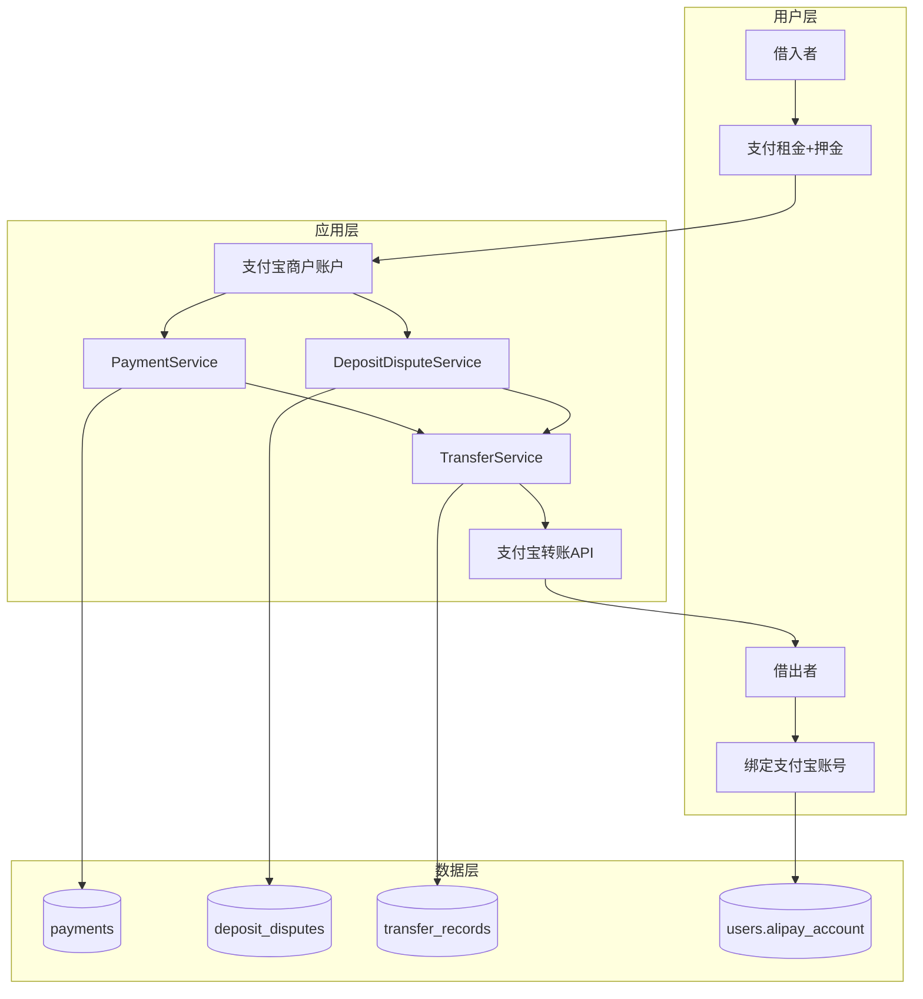
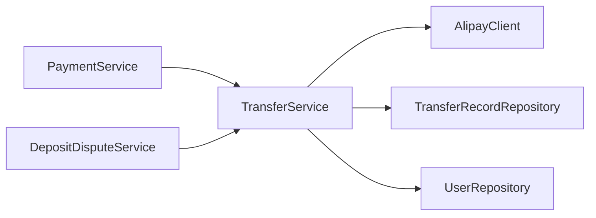
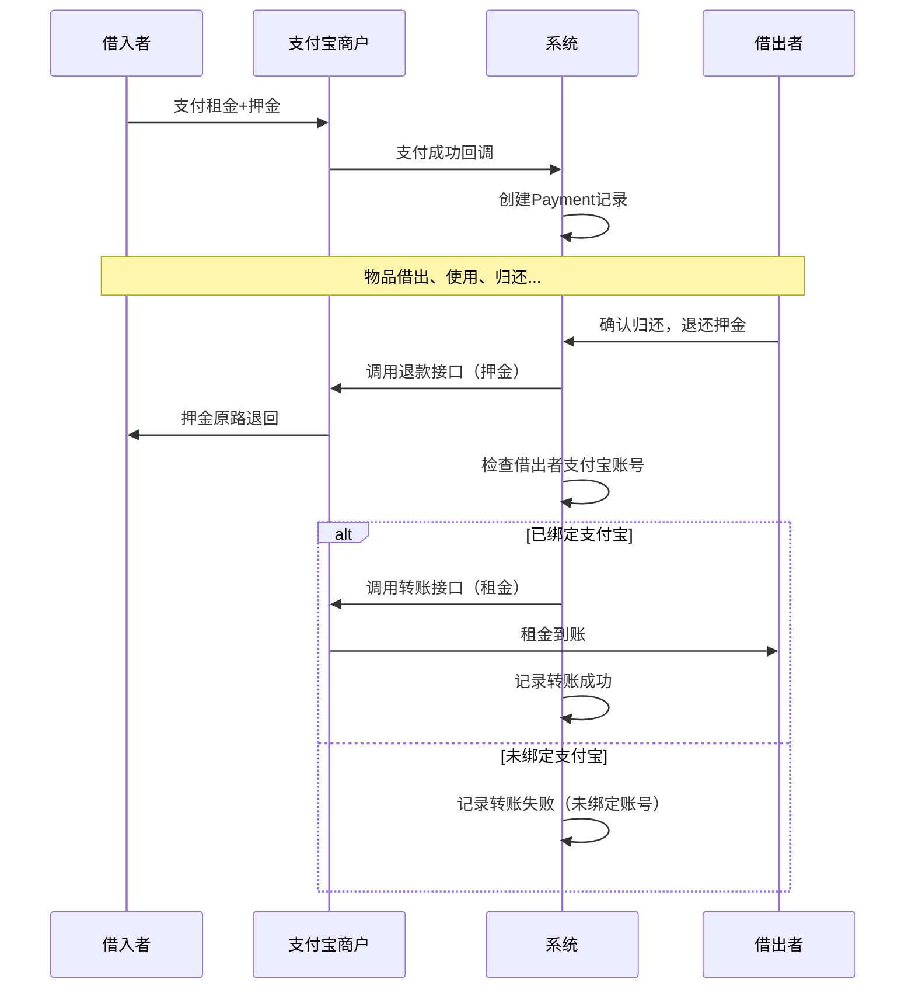
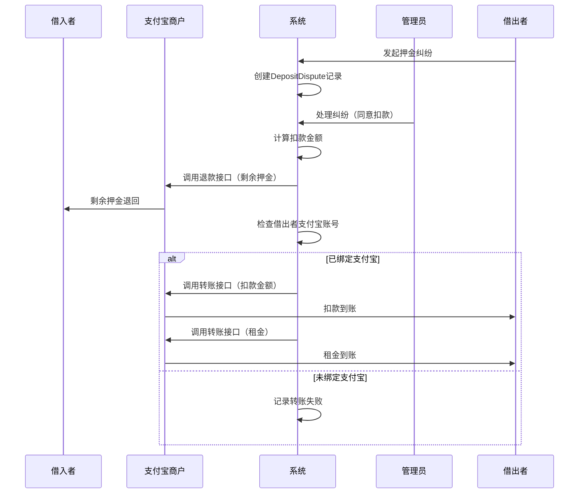

# 支付宝转账功能开发文档

## 一、功能概述

### 1.1 背景

在邻里共享平台中，借阅物品涉及租金和押金的资金流转。原有设计中，借入者支付的租金和押金直接进入支付宝商户账户，但借出者无法收到租金，扣款也无法转给借出者。本功能通过集成支付宝「单笔转账」接口，实现资金自动结算给借出者。

### 1.2 目标

- 租金自动转账给借出者
- 押金扣款自动转账给借出者
- 用户可绑定/修改支付宝账号
- 转账记录可追溯

---

## 二、系统架构

### 2.1 整体架构



### 2.2 模块依赖



---

## 三、资金流转流程

### 3.1 正常借阅流程



### 3.2 押金纠纷流程



### 3.3 资金流转汇总

| 场景 | 押金处理 | 租金处理 | 扣款处理 |
|------|---------|---------|---------|
| 正常归还 | 原路退回借入者 | 转账给借出者 | - |
| 纠纷-同意扣款 | 部分退回借入者 | 转账给借出者 | 转账给借出者 |
| 纠纷-驳回 | 全额退回借入者 | 转账给借出者 | - |

---

## 四、关键技术实现

### 4.1 支付宝转账接口

使用支付宝「单笔转账到支付宝账户」接口（`alipay.fund.trans.uni.transfer`）：

```java
AlipayFundTransUniTransferRequest request = new AlipayFundTransUniTransferRequest();
AlipayFundTransUniTransferModel model = new AlipayFundTransUniTransferModel();

// 商户订单号（唯一）
model.setOutBizNo(outBizNo);

// 转账金额（元）
model.setTransAmount(amount.toPlainString());

// 产品码：免密转账
model.setProductCode("TRANS_ACCOUNT_NO_PWD");

// 业务场景：直接转账
model.setBizScene("DIRECT_TRANSFER");

// 收款方信息
Participant payeeInfo = new Participant();
payeeInfo.setIdentity(alipayAccount);      // 支付宝账号
payeeInfo.setIdentityType("ALIPAY_LOGON_ID"); // 账号类型
payeeInfo.setName(nickname);               // 真实姓名（可选）
model.setPayeeInfo(payeeInfo);

request.setBizModel(model);
AlipayFundTransUniTransferResponse response = alipayClient.execute(request);
```

**关键参数说明：**

| 参数 | 说明 |
|------|------|
| `out_biz_no` | 商户转账唯一订单号，用于幂等性控制 |
| `trans_amount` | 转账金额，单位：元 |
| `product_code` | 固定值 `TRANS_ACCOUNT_NO_PWD`，免密转账 |
| `biz_scene` | 固定值 `DIRECT_TRANSFER`，直接转账场景 |
| `payee_info.identity` | 收款方支付宝账号（手机号/邮箱） |
| `payee_info.identity_type` | `ALIPAY_LOGON_ID` 表示登录账号 |

### 4.2 幂等性设计

防止重复转账：

```java
// 1. 检查是否已成功转账
if (transferRecordRepository.existsByBorrowIdAndTransferTypeAndStatus(
        borrowId, transferType, TransferStatus.SUCCESS)) {
    log.info("该借阅已成功转账，跳过");
    return null;
}

// 2. 唯一订单号生成
private String generateOutBizNo(Long borrowId, TransferType transferType) {
    String timestamp = LocalDateTime.now().format(DateTimeFormatter.ofPattern("yyyyMMddHHmmss"));
    int random = ThreadLocalRandom.current().nextInt(1000, 9999);
    String prefix = transferType == TransferType.RENT ? "TR" : "TD";
    return prefix + timestamp + borrowId + random;
}
```

**订单号规则：**
- 租金转账：`TR + 时间戳 + 借阅ID + 随机数`
- 扣款转账：`TD + 时间戳 + 借阅ID + 随机数`

### 4.3 容错设计

转账失败不影响主流程：

```java
// PaymentService.java - 退还押金时
if (payment.getRentAmount().compareTo(BigDecimal.ZERO) > 0) {
    try {
        transferService.transferToLender(payment, payment.getRentAmount(), TransferType.RENT);
        log.info("租金已转账给借出者");
    } catch (Exception e) {
        // 转账失败只记录日志，不影响押金退还
        log.warn("租金转账失败，不影响押金退还: {}", e.getMessage());
    }
}
```

**容错策略：**

| 异常情况 | 处理方式 |
|---------|---------|
| 借出者未绑定支付宝 | 记录转账失败状态，原因：未绑定账号 |
| 支付宝接口异常 | 记录转账失败状态，原因：接口异常 |
| 转账金额为零 | 跳过转账，不创建记录 |
| 已成功转账 | 跳过转账，返回null |

### 4.4 数据库设计

#### users 表扩展

```sql
ALTER TABLE users ADD COLUMN alipay_account VARCHAR(64) COMMENT '支付宝账号';
```

#### transfer_records 表

```sql
CREATE TABLE transfer_records (
    id BIGINT AUTO_INCREMENT PRIMARY KEY,
    payment_id BIGINT COMMENT '关联支付记录ID',
    borrow_id BIGINT NOT NULL COMMENT '借阅ID',
    to_user_id BIGINT NOT NULL COMMENT '转入用户ID',
    transfer_type VARCHAR(20) NOT NULL COMMENT '转账类型: RENT/DEDUCTION',
    amount DECIMAL(10,2) NOT NULL COMMENT '转账金额',
    out_biz_no VARCHAR(64) NOT NULL UNIQUE COMMENT '商户转账唯一订单号',
    alipay_order_id VARCHAR(64) COMMENT '支付宝转账订单号',
    payee_account VARCHAR(64) NOT NULL COMMENT '收款方支付宝账号',
    status VARCHAR(20) DEFAULT 'PENDING' COMMENT '状态: PENDING/SUCCESS/FAILED',
    fail_reason VARCHAR(500) COMMENT '失败原因',
    created_at TIMESTAMP DEFAULT CURRENT_TIMESTAMP,
    updated_at TIMESTAMP DEFAULT CURRENT_TIMESTAMP ON UPDATE CURRENT_TIMESTAMP,
    INDEX idx_borrow (borrow_id),
    INDEX idx_to_user (to_user_id),
    INDEX idx_status (status)
);
```

---

## 五、前端实现

### 5.1 支付宝账号绑定入口

在「账号设置 → 账号安全」区域新增支付宝绑定：

```
┌─────────────────────────────────────────────────────────────┐
│ 账号安全                                                     │
├─────────────────────────────────────────────────────────────┤
│ ┌─────────────────────────────────────────────────────────┐ │
│ │ 📱 绑定手机          138****8888              ✓ 已绑定  │ │
│ └─────────────────────────────────────────────────────────┘ │
│ ┌─────────────────────────────────────────────────────────┐ │
│ │ 🔒 登录密码          ••••••••                  [修改密码]│ │
│ └─────────────────────────────────────────────────────────┘ │
│ ┌─────────────────────────────────────────────────────────┐ │
│ │ 💰 支付宝账号        user@example.com       ✓ 已绑定   │ │
│ │                      用于接收租金和扣款        [修改]    │ │
│ └─────────────────────────────────────────────────────────┘ │
└─────────────────────────────────────────────────────────────┘
```

### 5.2 绑定弹窗

```
┌─────────────────────────────────────────────┐
│         绑定支付宝账号                 [X]  │
├─────────────────────────────────────────────┤
│  ℹ️ 绑定支付宝账号后，租金和扣款将自动       │
│     转入您的支付宝账户。                     │
│                                             │
│  支付宝账号                                  │
│  ┌─────────────────────────────────────┐   │
│  │ 请输入支付宝登录账号（手机号/邮箱）   │   │
│  └─────────────────────────────────────┘   │
│                                             │
│  ┌─────────────────────────────────────┐   │
│  │            确认绑定                  │   │
│  └─────────────────────────────────────┘   │
└─────────────────────────────────────────────┘
```

---

## 六、API接口

### 6.1 用户端接口

| 接口 | 方法 | 说明 |
|------|------|------|
| `/api/users/me` | PUT | 更新用户信息（包含 alipayAccount） |

### 6.2 内部服务接口

| 服务 | 方法 | 说明 |
|------|------|------|
| `TransferService.transferToLender` | `TransferRecord` | 执行转账给借出者 |
| `TransferService.getTransferByBorrowId` | `List<TransferRecord>` | 获取借阅的转账记录 |
| `TransferService.getTransferByUserId` | `List<TransferRecord>` | 获取用户的转账记录 |

---

## 七、待优化项

### 7.1 高优先级

| 问题 | 描述 | 建议方案 |
|------|------|---------|
| 转账重试机制 | 转账失败后无自动重试 | 新增定时任务，扫描失败记录重试 |
| 转账通知 | 用户不知道转账结果 | 发送消息通知用户转账成功/失败 |
| 转账记录查询 | 用户无法查看转账记录 | 新增「我的收入」页面展示转账记录 |

### 7.2 中优先级

| 问题 | 描述 | 建议方案 |
|------|------|---------|
| 支付宝账号验证 | 未验证账号是否真实存在 | 调用支付宝「查询支付宝用户信息」接口验证 |
| 实名认证 | 未验证账号与用户身份一致 | 要求用户上传身份证，人工审核 |
| 批量转账 | 多笔订单逐笔转账效率低 | 支持批量转账接口 |

### 7.3 低优先级

| 问题 | 描述 | 建议方案 |
|------|------|---------|
| 转账限额 | 单笔转账有限额 | 大额转账分批处理 |
| 对账功能 | 无自动对账 | 每日对账任务，核对转账记录 |
| 资金池 | 资金直接从商户账户转出 | 建立资金池账户，统一管理 |

---

## 八、测试要点

### 8.1 功能测试

- [ ] 用户绑定/修改支付宝账号
- [ ] 正常归还后租金自动转账
- [ ] 纠纷扣款后自动转账
- [ ] 未绑定账号时的处理
- [ ] 重复转账的幂等性

### 8.2 异常测试

- [ ] 支付宝接口超时
- [ ] 支付宝接口返回失败
- [ ] 转账金额为零
- [ ] 并发转账请求

### 8.3 沙箱测试

使用支付宝沙箱环境测试：
1. 沙箱买家账号支付租金+押金
2. 沙箱商家账号接收款项
3. 商家账号转账给沙箱卖家账号（借出者）

---

## 九、上线检查清单

### 9.1 配置检查

- [ ] 支付宝应用已开通「单笔转账到支付宝账户」能力
- [ ] 应用私钥、支付宝公钥配置正确
- [ ] 转账额度满足业务需求

### 9.2 数据检查

- [ ] 数据库迁移脚本已执行
- [ ] 现有用户 alipayAccount 字段为空

### 9.3 监控告警

- [ ] 转账失败日志告警
- [ ] 转账成功率监控
- [ ] 资金异常告警

---

## 十、附录

### 10.1 错误码

| 错误码 | 说明 |
|--------|------|
| 7001 | 转账失败 |
| 7002 | 未绑定支付宝账号 |

### 10.2 转账状态

| 状态 | 说明 |
|------|------|
| PENDING | 待转账 |
| SUCCESS | 转账成功 |
| FAILED | 转账失败 |

### 10.3 转账类型

| 类型 | 说明 |
|------|------|
| RENT | 租金转账 |
| DEDUCTION | 扣款转账 |

### 10.4 相关文件

**后端：**
- `V10__Add_Transfer_Records.sql` - 数据库迁移
- `TransferStatus.java` - 转账状态枚举
- `TransferType.java` - 转账类型枚举
- `TransferRecord.java` - 转账记录实体
- `TransferRecordRepository.java` - 数据访问层
- `TransferService.java` - 转账服务

**前端：**
- `ProfileView.vue` - 支付宝绑定入口和弹窗
