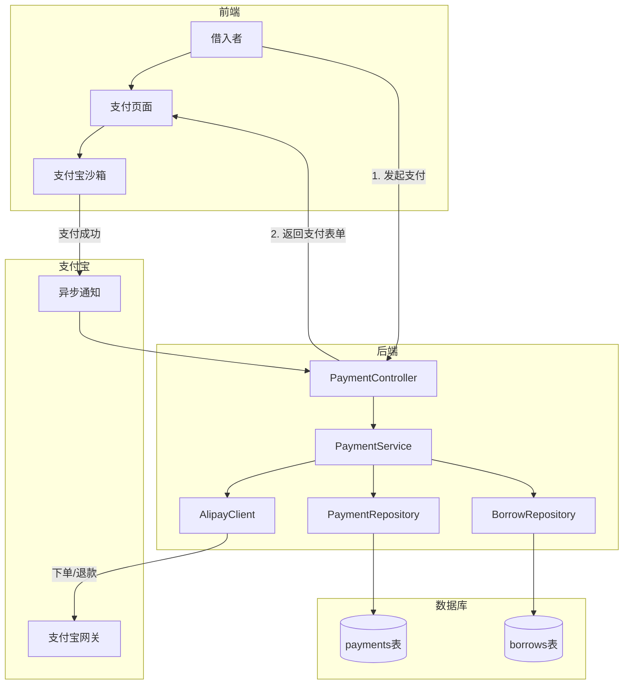
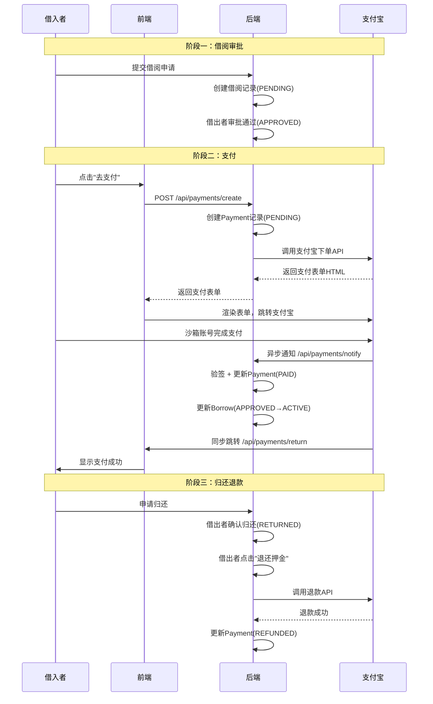
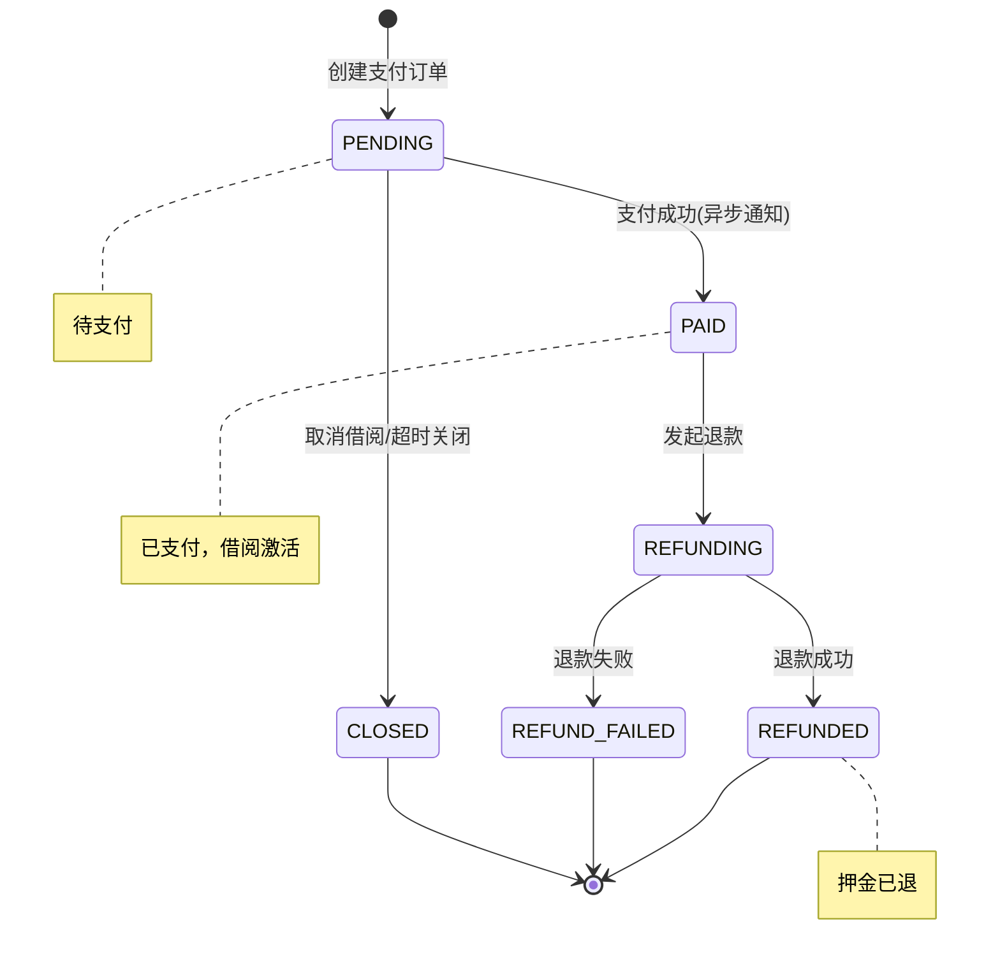
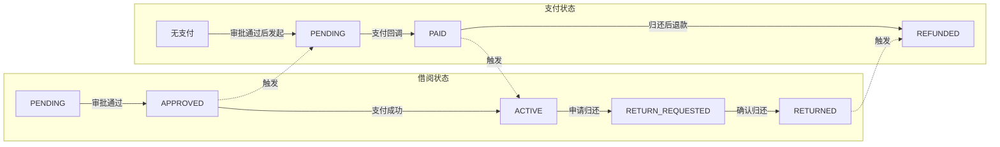
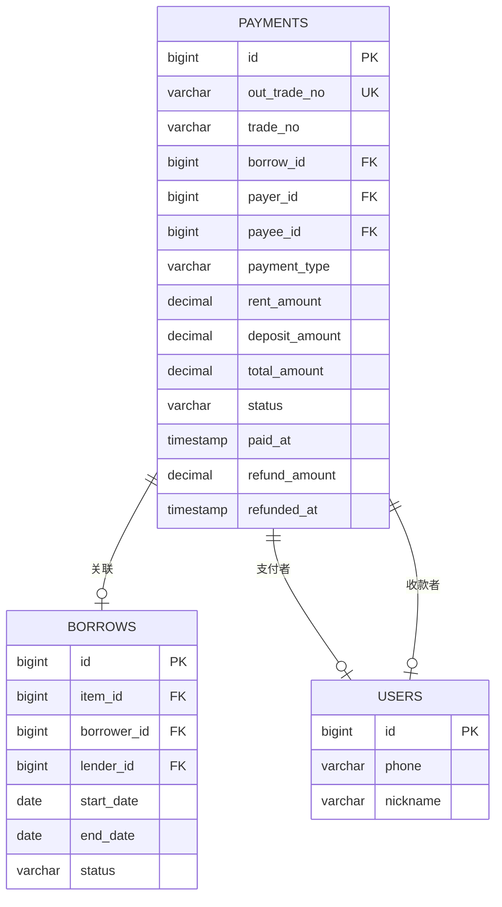

# 支付模块开发文档

> 创建时间：2026-04-15
> 技术栈：支付宝沙箱 + Spring Boot 3.3.5

***

## 一、模块概述

支付模块为邻里共享平台提供在线支付能力，支持借阅物品时支付租金和押金，归还后退还押金。采用支付宝沙箱环境进行支付模拟，便于开发测试。

### 核心功能

| 功能    | 说明                 |
| ----- | ------------------ |
| 创建支付  | 借阅审批通过后，借入者发起支付    |
| 支付宝下单 | 调用支付宝沙箱 API 生成支付表单 |
| 异步通知  | 接收支付宝支付结果回调        |
| 押金退还  | 归还确认后，借出者退还押金      |
| 支付查询  | 查询支付记录和状态          |

***

## 二、系统架构



***

## 三、支付流程

### 3.1 完整支付流程



### 3.2 状态流转图



### 3.3 借阅状态与支付状态关联



***

## 四、数据库设计

### 4.1 payments 表

```sql
CREATE TABLE payments (
    id BIGINT AUTO_INCREMENT PRIMARY KEY,
    out_trade_no VARCHAR(64) NOT NULL UNIQUE,    -- 商户订单号
    trade_no VARCHAR(64),                         -- 支付宝交易号
    borrow_id BIGINT NOT NULL,                    -- 关联借阅ID
    payer_id BIGINT NOT NULL,                     -- 支付者ID
    payee_id BIGINT NOT NULL,                     -- 收款者ID
    payment_type VARCHAR(20) NOT NULL,            -- 支付类型
    rent_amount DECIMAL(10,2) DEFAULT 0.00,       -- 租金金额
    deposit_amount DECIMAL(10,2) DEFAULT 0.00,    -- 押金金额
    total_amount DECIMAL(10,2) NOT NULL,          -- 总金额
    status VARCHAR(20) DEFAULT 'PENDING',         -- 支付状态
    paid_at TIMESTAMP NULL,                       -- 支付时间
    refund_trade_no VARCHAR(64),                  -- 退款交易号
    refund_amount DECIMAL(10,2),                  -- 退款金额
    refunded_at TIMESTAMP NULL,                   -- 退款时间
    item_snapshot VARCHAR(200),                   -- 物品名称快照
    created_at TIMESTAMP DEFAULT CURRENT_TIMESTAMP,
    updated_at TIMESTAMP DEFAULT CURRENT_TIMESTAMP ON UPDATE CURRENT_TIMESTAMP
);
```

### 4.2 字段说明

| 字段              | 类型            | 说明                                                 |
| --------------- | ------------- | -------------------------------------------------- |
| out\_trade\_no  | VARCHAR(64)   | 商户订单号，格式：NS + 时间戳 + borrowId + 随机数                 |
| trade\_no       | VARCHAR(64)   | 支付宝返回的交易号                                          |
| payment\_type   | VARCHAR(20)   | RENT(租金) / DEPOSIT(押金) / RENT\_AND\_DEPOSIT(租金+押金) |
| rent\_amount    | DECIMAL(10,2) | 租金 = 日租金 × 借阅天数                                    |
| deposit\_amount | DECIMAL(10,2) | 押金，从物品表获取                                          |
| total\_amount   | DECIMAL(10,2) | 总金额 = 租金 + 押金                                      |

### 4.3 ER 关系图



***

## 五、API 接口

### 5.1 接口列表

| 方法   | 路径                               | 说明           | 认证 |
| ---- | -------------------------------- | ------------ | -- |
| POST | /api/payments/create             | 创建支付，返回支付宝表单 | 需要 |
| POST | /api/payments/notify             | 支付宝异步通知      | 无  |
| GET  | /api/payments/return             | 支付宝同步跳转      | 无  |
| GET  | /api/payments/borrow/{borrowId}  | 查询借阅的支付记录    | 需要 |
| GET  | /api/payments/order/{outTradeNo} | 按订单号查询       | 需要 |
| GET  | /api/payments/my/paid            | 我支付的记录       | 需要 |
| GET  | /api/payments/my/received        | 我收到的支付       | 需要 |
| POST | /api/payments/{borrowId}/refund  | 退还押金         | 需要 |

### 5.2 创建支付

**请求**

```http
POST /api/payments/create
Authorization: Bearer {token}
Content-Type: application/json

{
    "borrowId": 123
}
```

**响应**

```json
{
    "code": 0,
    "message": "OK",
    "data": {
        "paymentForm": "<form action=\"https://openapi-sandbox.dl.alipaydev.com/gateway.do\" method=\"POST\">...</form>"
    }
}
```

**前端处理**

```javascript
// 将返回的表单HTML写入页面并自动提交
document.body.innerHTML = response.paymentForm;
document.forms[0].submit();
```

### 5.3 支付宝异步通知

支付宝服务器会向配置的 `notify_url` 发送 POST 请求：

```
POST /api/payments/notify
Content-Type: application/x-www-form-urlencoded

out_trade_no=NS202604151234561234567&trade_no=2026041522001401234567890&trade_status=TRADE_SUCCESS&...
```

后端处理流程：

1. 提取所有参数
2. 使用支付宝公钥验签
3. 验证 `trade_status` 为 `TRADE_SUCCESS` 或 `TRADE_FINISHED`
4. 更新 Payment 状态为 PAID
5. 更新 Borrow 状态为 ACTIVE
6. 返回 `success` 字符串

### 5.4 退还押金

**请求**

```http
POST /api/payments/123/refund
Authorization: Bearer {token}
```

**响应**

```json
{
    "code": 0,
    "message": "OK",
    "data": {
        "status": "REFUNDED"
    }
}
```

**前置条件**

- 借阅状态为 RETURNED
- 支付状态为 PAID
- 押金金额 > 0
- 操作者为借出者

***

## 六、配置说明

### 6.1 application.properties 配置

```properties
# 支付宝沙箱配置
alipay.app-id=9021000142655174
alipay.private-key=MIIEvgIBADANBgkqhkiG9w0BAQEFA...
alipay.public-key=MIIBIjANBgkqhkiG9w0BAQEFAAOCAQ8A...
alipay.gateway=https://openapi-sandbox.dl.alipaydev.com/gateway.do
alipay.notify-url=http://localhost:8080/api/payments/notify
alipay.return-url=http://localhost:5173/payment/result
alipay.sign-type=RSA2
alipay.charset=UTF-8
alipay.format=json
```

### 6.2 配置项说明

| 配置项         | 说明     | 获取方式           |
| ----------- | ------ | -------------- |
| app-id      | 沙箱应用ID | 支付宝开放平台 → 沙箱应用 |
| private-key | 应用私钥   | 使用密钥生成工具生成     |
| public-key  | 支付宝公钥  | 沙箱应用页面获取       |
| gateway     | 支付宝网关  | 沙箱固定值          |
| notify-url  | 异步通知地址 | 需公网可访问，可用内网穿透  |
| return-url  | 同步跳转地址 | 前端支付结果页面       |

### 6.3 密钥生成

```bash
# 下载支付宝密钥生成工具
# https://opendocs.alipay.com/common/02kipk

# 生成密钥对（选择 RSA2(SHA256)密钥）
# 得到：应用私钥、应用公钥

# 将应用公钥上传到沙箱应用
# 获取：支付宝公钥
```

***

## 七、代码结构

```
backend/demo/src/main/java/com/neighbor/
├── config/
│   └── AlipayConfig.java          # 支付宝配置类
├── controller/api/
│   └── PaymentController.java     # 支付接口控制器
├── dto/
│   ├── CreatePaymentRequest.java  # 创建支付请求
│   └── PaymentDTO.java            # 支付记录DTO
├── entity/
│   └── Payment.java               # 支付实体
├── enums/
│   ├── PaymentStatus.java         # 支付状态枚举
│   └── PaymentType.java           # 支付类型枚举
├── repository/
│   └── PaymentRepository.java     # 数据访问层
└── service/
    ├── PaymentService.java        # 支付服务
    └── BorrowService.java         # 借阅服务(已修改)

backend/demo/src/main/resources/
└── db/migration/
    └── V8__Add_Payments_Table.sql # 数据库迁移脚本
```

***

## 八、错误码

| 错误码  | 说明          |
| ---- | ----------- |
| 6001 | 支付记录不存在     |
| 6002 | 该借阅已支付      |
| 6003 | 支付金额不能为零    |
| 6004 | 支付宝接口错误     |
| 6005 | 退款失败        |
| 6006 | 无押金可退       |
| 6007 | 押金已退还       |
| 6008 | 支付状态不允许当前操作 |

***

## 九、测试指南

### 9.1 沙箱账号

支付宝沙箱提供买家和卖家账号用于测试：

| 角色 | 账号                    | 密码      |
| -- | --------------------- | ------- |
| 买家 | <xxxxxxx@sandbox.com> | 支付宝登录密码 |
| 卖家 | <xxxxxxx@sandbox.com> | -       |

在沙箱应用页面可查看完整账号信息。

### 9.2 测试流程

1. 启动后端服务
2. 使用借入者账号登录
3. 申请借阅物品
4. 借出者审批通过
5. 点击"去支付"，跳转支付宝沙箱
6. 使用沙箱买家账号登录并支付
7. 支付成功后自动跳转回前端
8. 检查借阅状态是否变为"借用中"
9. 归还后测试押金退款

### 9.3 内网穿透

异步通知需要公网可访问的地址，开发时可使用内网穿透工具：

```bash
# 使用 ngrok
ngrok http 8080

# 将生成的公网地址配置到 notify-url
alipay.notify-url=https://xxx.ngrok.io/api/payments/notify
```

***

## 十、注意事项

1. **密钥安全**：生产环境不要将私钥提交到代码仓库，使用环境变量或配置中心管理
2. **金额计算**：租金按借阅天数计算，包含起止日期当天
3. **并发处理**：支付回调可能重复发送，需要幂等处理
4. **状态一致性**：支付成功后同时更新 Payment 和 Borrow 状态，使用事务保证
5. **退款限制**：只能退还押金部分，租金不退

***

## 十一、后续优化

- [ ] 支付超时自动关闭
- [ ] 支付失败重试机制
- [ ] 退款失败人工处理入口
- [ ] 支付记录导出
- [ ] 对账功能

***

> 文档由 AI 助手生成，用于记录支付模块开发详情。

