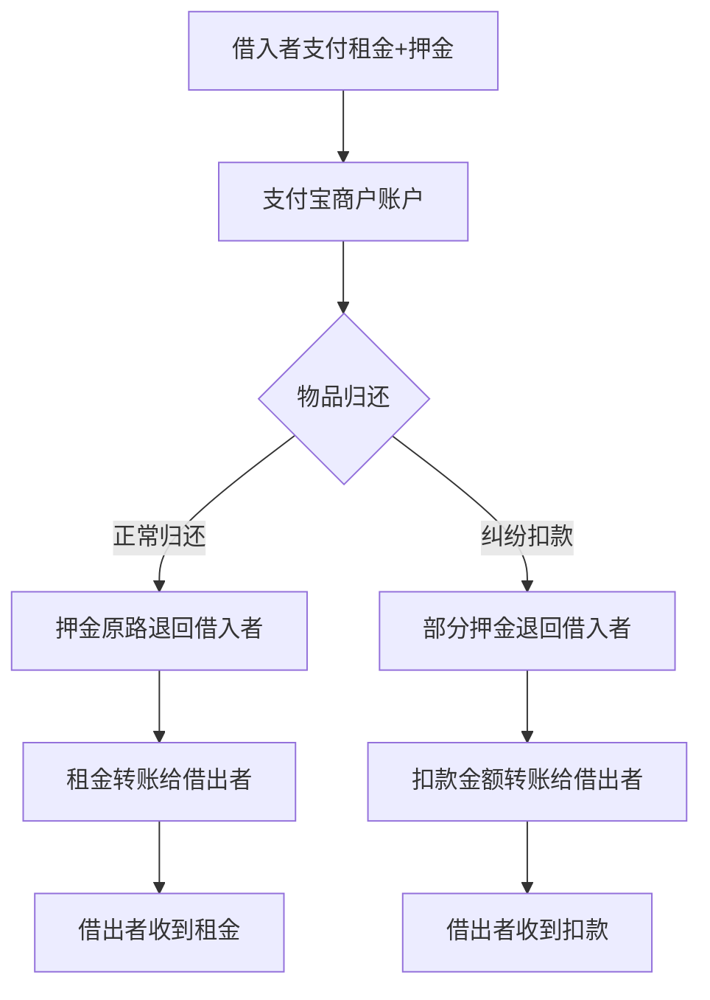
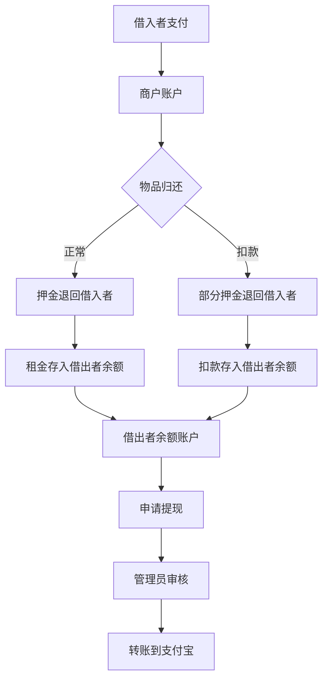

1租金和扣款的押金 怎么给到借出者

2嗯 方案一，进行开发

<br />

这是一个很好的问题！让我分析当前的资金流转设计：

## 当前资金流转分析

```
┌─────────────────────────────────────────────────────────────────┐
│                        当前支付流程                              │
├─────────────────────────────────────────────────────────────────┤
│                                                                 │
│  借入者 ──(租金+押金)──▶ 支付宝商户账户                          │
│                                                                 │
│  归还时：                                                        │
│  ┌─────────────────────────────────────────────────────────┐   │
│  │ 正常退还：支付宝商户 ──(押金)──▶ 借入者（原路退回）        │   │
│  │                                                          │   │
│  │ 纠纷扣款：                                                │   │
│  │   支付宝商户 ──(部分押金)──▶ 借入者（原路退回）            │   │
│  │   扣款金额 ──▶ 留在商户账户 ❓                            │   │
│  └─────────────────────────────────────────────────────────┘   │
│                                                                 │
│  租金：目前没有给到借出者！❓                                    │
│                                                                 │
└─────────────────────────────────────────────────────────────────┘
```

## 问题发现

当前设计存在两个问题：

1. **租金没有给到借出者**：借入者支付的租金直接进入商户账户，没有转给借出者
2. **扣款押金没有给到借出者**：纠纷扣款后，扣款金额留在商户账户

## 解决方案

### 方案一：支付宝转账（推荐）

使用支付宝的「单笔转账到支付宝账户」接口，将租金和扣款押金转给借出者：



**需要新增：**

- 支付宝转账接口集成
- User表新增 `alipayAccount` 字段（支付宝账号）
- 新增转账记录表

### 方案二：账户余额系统

建立用户账户余额系统，租金和扣款存入余额，用户可提现：



**需要新增：**

- `user_balances` 表（用户余额）
- `balance_transactions` 表（余额流水）
- 提现申请功能

### 方案三：简化版 - 线下结算（最快实现）

扣款和租金记录在系统中，管理员线下转账后标记已结算：

```sql
-- 在 payments 表新增字段
ALTER TABLE payments ADD COLUMN rent_settled BOOLEAN DEFAULT FALSE COMMENT '租金是否已结算';
ALTER TABLE payments ADD COLUMN rent_settled_at TIMESTAMP NULL COMMENT '租金结算时间';

ALTER TABLE payments ADD COLUMN deduction_settled BOOLEAN DEFAULT FALSE COMMENT '扣款是否已结算';
ALTER TABLE payments ADD COLUMN deduction_settled_at TIMESTAMP NULL COMMENT '扣款结算时间';
```

***

## 建议

考虑到开发成本和实际需求，建议分阶段实现：

| 阶段   | 方案        | 工作量  | 适用场景      |
| :--- | :-------- | :--- | :-------- |
| 第一阶段 | 方案三：线下结算  | 0.5天 | 快速上线，人工处理 |
| 第二阶段 | 方案一：支付宝转账 | 2天   | 自动化转账     |
| 第三阶段 | 方案二：账户余额  | 3天   | 完整的账户体系   |

***

您希望采用哪种方案？如果选择**方案一（支付宝转账）**，我可以立即开始开发：

1. 新增支付宝转账接口
2. User表新增支付宝账号字段
3. 租金自动转账逻辑
4. 扣款自动转账逻辑

<br />

<br />

***

## 支付宝转账功能开发完成

### 资金流转设计

```
┌─────────────────────────────────────────────────────────────────┐
│                     完整资金流转                                  │
├─────────────────────────────────────────────────────────────────┤
│                                                                 │
│  借入者 ──(租金+押金)──▶ 支付宝商户账户                          │
│                                                                 │
│  正常归还：                                                      │
│  ├─ 押金 ──(原路退回)──▶ 借入者                                 │
│  └─ 租金 ──(支付宝转账)──▶ 借出者支付宝账号                      │
│                                                                 │
│  纠纷扣款：                                                      │
│  ├─ 部分押金 ──(原路退回)──▶ 借入者                             │
│  ├─ 扣款金额 ──(支付宝转账)──▶ 借出者支付宝账号                  │
│  └─ 租金 ──(支付宝转账)──▶ 借出者支付宝账号                      │
│                                                                 │
│  纠纷驳回：                                                      │
│  ├─ 全额押金 ──(原路退回)──▶ 借入者                             │
│  └─ 租金 ──(支付宝转账)──▶ 借出者支付宝账号                      │
│                                                                 │
└─────────────────────────────────────────────────────────────────┘
```

### 后端新增文件

| 文件                                                                                                                                    | 说明                                                 |
| :------------------------------------------------------------------------------------------------------------------------------------ | :------------------------------------------------- |
| [V10\_\_Add\_Transfer\_Records.sql](file:///d:/ai练/fast/backend/demo/src/main/resources/db/migration/V10__Add_Transfer_Records.sql)   | 数据库迁移：users表新增alipay\_account + transfer\_records表 |
| [TransferStatus.java](file:///d:/ai练/fast/backend/demo/src/main/java/com/neighbor/enums/TransferStatus.java)                          | 转账状态枚举                                             |
| [TransferType.java](file:///d:/ai练/fast/backend/demo/src/main/java/com/neighbor/enums/TransferType.java)                              | 转账类型枚举（RENT/DEDUCTION）                             |
| [TransferRecord.java](file:///d:/ai练/fast/backend/demo/src/main/java/com/neighbor/entity/TransferRecord.java)                         | 转账记录实体                                             |
| [TransferRecordRepository.java](file:///d:/ai练/fast/backend/demo/src/main/java/com/neighbor/repository/TransferRecordRepository.java) | 转账记录数据访问层                                          |
| [TransferService.java](file:///d:/ai练/fast/backend/demo/src/main/java/com/neighbor/service/TransferService.java)                      | 核心转账服务（支付宝单笔转账接口）                                  |

### 后端修改文件

| 文件                                                                                                                           | 修改内容                                              |
| :--------------------------------------------------------------------------------------------------------------------------- | :------------------------------------------------ |
| [User.java](file:///d:/ai练/fast/backend/demo/src/main/java/com/neighbor/entity/User.java)                                    | 新增 alipayAccount 字段                               |
| [UserDTO.java](file:///d:/ai练/fast/backend/demo/src/main/java/com/neighbor/dto/UserDTO.java)                                 | 新增 alipayAccount 字段                               |
| [UserServiceImpl.java](file:///d:/ai练/fast/backend/demo/src/main/java/com/neighbor/service/impl/UserServiceImpl.java)        | 支持更新 alipayAccount                                |
| [PaymentService.java](file:///d:/ai练/fast/backend/demo/src/main/java/com/neighbor/service/PaymentService.java)               | 退还押金时自动转账租金                                       |
| [DepositDisputeService.java](file:///d:/ai练/fast/backend/demo/src/main/java/com/neighbor/service/DepositDisputeService.java) | 扣款后自动转账租金+扣款                                      |
| [ErrorCode.java](file:///d:/ai练/fast/backend/demo/src/main/java/com/neighbor/enums/ErrorCode.java)                           | 新增 TRANSFER\_FAILED/TRANSFER\_ACCOUNT\_NOT\_BOUND |

### 前端修改文件

| 文件                                                                        | 修改内容                   |
| :------------------------------------------------------------------------ | :--------------------- |
| [ProfileView.vue](file:///d:/ai练/fast/frontend/src/views/ProfileView.vue) | 账号安全区域新增支付宝绑定入口 + 绑定弹窗 |

### 关键技术点

1. **支付宝转账API**：使用 `alipay.fund.trans.uni.transfer`（单笔转账到支付宝账户），产品码 `TRANS_ACCOUNT_NO_PWD`，免密转账
2. **转账安全**：借出者未绑定支付宝账号时，记录转账失败状态，不影响主流程
3. **幂等性**：通过 `outBizNo` 唯一订单号 + `existsByBorrowIdAndTransferTypeAndStatus` 防止重复转账
4. **容错设计**：转账失败不影响押金退还和纠纷处理，转账异常被 catch 并记录日志

