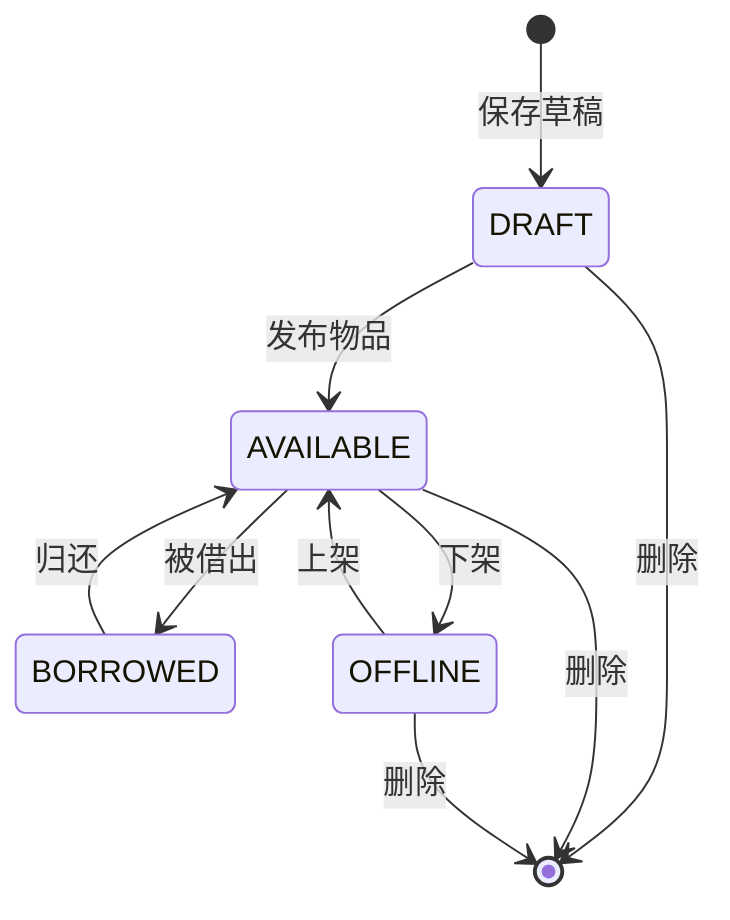
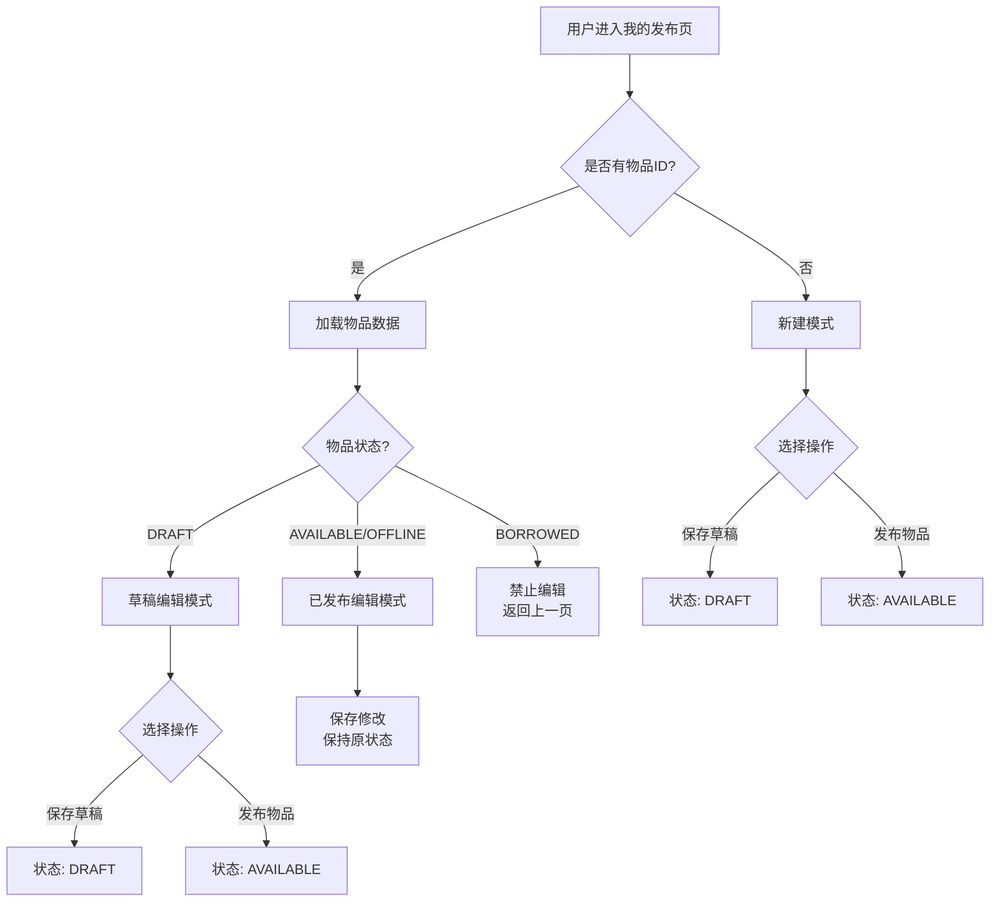
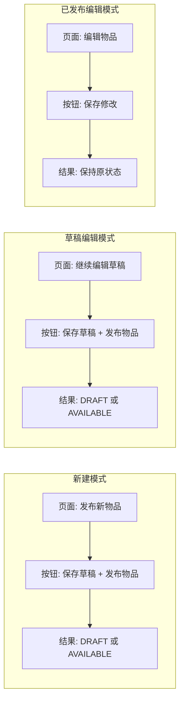
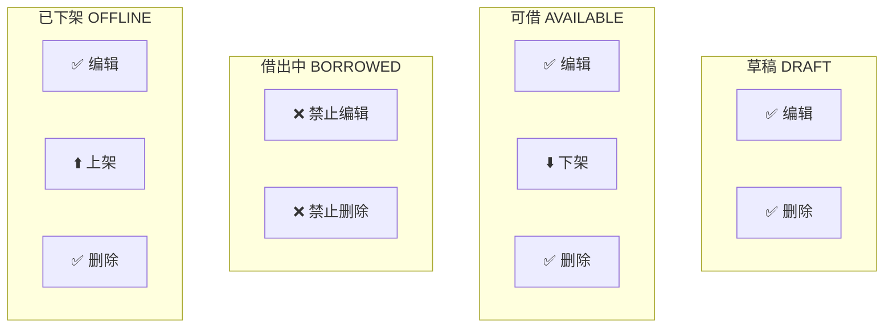
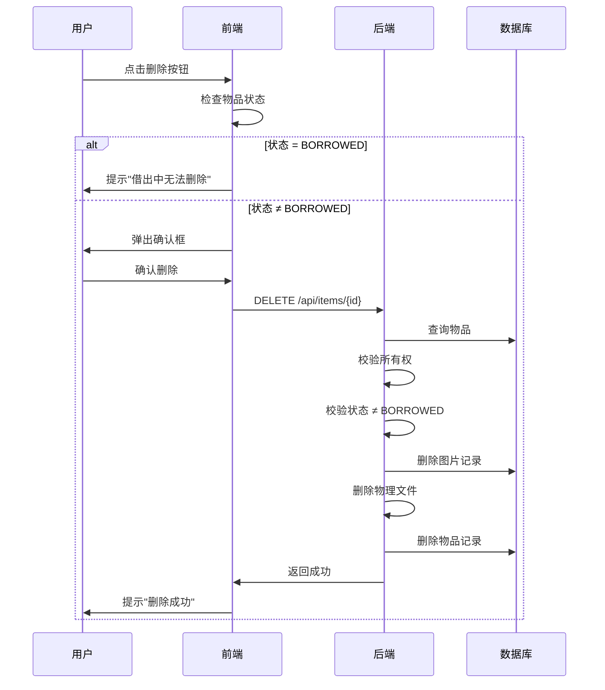

# 物品模块 - 核心概念与运作机制

## 目录

1. [物品状态定义](#1-物品状态定义)
2. [状态流转图](#2-状态流转图)
3. [编辑模式说明](#3-编辑模式说明)
4. [操作权限矩阵](#4-操作权限矩阵)
5. [关键代码位置](#5-关键代码位置)

***

## 1. 物品状态定义

物品（Item）共有 5 种状态，存储在数据库 `items.status` 字段：

| 状态枚举        | 中文描述 | 数据库值      | 说明             |
| ----------- | ---- | --------- | -------------- |
| `DRAFT`     | 草稿   | DRAFT     | 未发布的物品，只有物主可见  |
| `AVAILABLE` | 可借   | AVAILABLE | 已发布上线，可被其他用户借阅 |
| `BORROWED`  | 借出中  | BORROWED  | 已被借出，归还前不可再借   |
| `OFFLINE`   | 已下架  | OFFLINE   | 物主主动下架，不对外展示   |
| `DELETED`   | 已删除  | DELETED   | 软删除（当前使用硬删除）   |

```java
// 后端枚举定义：backend/demo/src/main/java/com/neighbor/enums/ItemStatus.java
public enum ItemStatus {
    DRAFT("草稿"),
    AVAILABLE("可借"),
    BORROWED("借出中"),
    OFFLINE("已下架"),
    DELETED("已删除");
}
```

***

## 2. 状态流转图

### 2.1 整体状态流转



### 2.2 状态流转说明

| 触发动作 | 状态变化                 | 触发方式          |
| ---- | -------------------- | ------------- |
| 保存草稿 | → DRAFT              | 发布页点击"保存草稿"   |
| 发布物品 | DRAFT → AVAILABLE    | 草稿编辑页点击"发布物品" |
| 被借出  | AVAILABLE → BORROWED | 借阅申请被接受       |
| 归还物品 | BORROWED → AVAILABLE | 物主确认归还        |
| 下架   | AVAILABLE → OFFLINE  | 物主点击"下架"按钮    |
| 上架   | OFFLINE → AVAILABLE  | 物主点击"上架"按钮    |
| 删除   | → 物理删除               | 物主点击"删除"按钮    |

### 2.3 用户操作流程



***

## 3. 编辑模式说明

### 3.1 页面路由

发布/编辑页面统一使用 `/publish` 路由：

| 路由             | 模式   | 说明           |
| -------------- | ---- | ------------ |
| `/publish`     | 新建模式 | 创建全新物品       |
| `/publish/:id` | 编辑模式 | 根据物品状态区分具体行为 |

### 3.2 模式判断逻辑

**核心原则**：基于物品实际状态判断，而非 URL 参数

```typescript
// 前端代码：frontend/src/views/PublishView.vue

// 物品实际状态（从后端获取）
const itemStatus = ref<string>('')

// 加载物品时保存状态
const loadItemData = async () => {
  const item = await itemApi.getItemById(id)
  itemStatus.value = item.status  // 保存实际状态
}

// 模式判断
const isNew = computed(() => !route.params.id)           // 无 ID = 新建
const isDraft = computed(() => itemStatus.value === 'DRAFT')  // 状态 = 草稿
const isEdit = computed(() => !!route.params.id && !isDraft.value)  // 有 ID 且非草稿 = 编辑
```

### 3.3 三种模式对比



| 模式    | 判断条件      | 页面标题   | 按钮组合            | 保存后状态             |
| ----- | --------- | ------ | --------------- | ----------------- |
| 新建    | `isNew`   | 发布新物品  | `保存草稿` + `发布物品` | AVAILABLE         |
| 草稿编辑  | `isDraft` | 继续编辑草稿 | `保存草稿` + `发布物品` | DRAFT / AVAILABLE |
| 已发布编辑 | `isEdit`  | 编辑物品   | `保存修改`          | 保持原状态             |

### 3.4 按钮行为

```typescript
// 保存草稿
if (isDraft.value) {
  await itemApi.updateItem(id, { ...data, status: 'DRAFT' })
} else {
  await itemApi.saveDraft(data)
}

// 发布物品
if (isDraft.value) {
  await itemApi.updateItem(id, { ...data, status: 'AVAILABLE' })
} else {
  await itemApi.createItem(data)
}

// 保存修改（保持原状态）
await itemApi.updateItem(id, data)
```

***

## 4. 操作权限矩阵

### 4.1 物品操作按钮（个人中心 - 我的发布）



| 物品状态      |  编辑 | 上架/下架 |  删除 | 说明          |
| --------- | :-: | :---: | :-: | ----------- |
| DRAFT     |  ✅  |   -   |  ✅  | 草稿可编辑、删除    |
| AVAILABLE |  ✅  |   下架  |  ✅  | 在线可编辑、下架、删除 |
| BORROWED  |  ❌  |   -   |  ❌  | 借出中禁止一切操作   |
| OFFLINE   |  ✅  |   上架  |  ✅  | 下架可编辑、上架、删除 |

### 4.2 编辑页按钮显示

| 模式    | 保存草稿 | 发布物品 | 保存修改 |
| ----- | :--: | :--: | :--: |
| 新建    |   ✅  |   ✅  |   -  |
| 草稿编辑  |   ✅  |   ✅  |   -  |
| 已发布编辑 |   -  |   -  |   ✅  |

### 4.3 安全校验流程



***

## 5. 关键代码位置

### 5.1 后端

| 功能         | 文件路径                                                                         |
| ---------- | ---------------------------------------------------------------------------- |
| 状态枚举       | `backend/demo/src/main/java/com/neighbor/enums/ItemStatus.java`              |
| 物品实体       | `backend/demo/src/main/java/com/neighbor/entity/Item.java`                   |
| Controller | `backend/demo/src/main/java/com/neighbor/controller/api/ItemController.java` |
| Service    | `backend/demo/src/main/java/com/neighbor/service/impl/ItemServiceImpl.java`  |

### 5.2 前端

| 功能   | 文件路径                                 |
| ---- | ------------------------------------ |
| 发布页  | `frontend/src/views/PublishView.vue` |
| 个人中心 | `frontend/src/views/ProfileView.vue` |
| 草稿箱  | `frontend/src/views/DraftsView.vue`  |
| API  | `frontend/src/api/item.ts`           |

***

## 6. 常见问题

### Q1: 为什么编辑页可以编辑借出中的物品？

**A**: 不可以。前端有 `disabled` 限制，后端有状态校验。

### Q2: 上架和下架有什么区别？

**A**: 下架将状态改为 OFFLINE，物品不再展示；上架将状态改回 AVAILABLE。

### Q3: 删除物品会删除图片吗？

**A**: 会。后端删除时会清理 `item_images` 表记录和物理文件。

### Q4: 为什么保存后图片重复添加？

**A**: 已修复。原因是 JPA 实体缺少 `orphanRemoval = true`。
