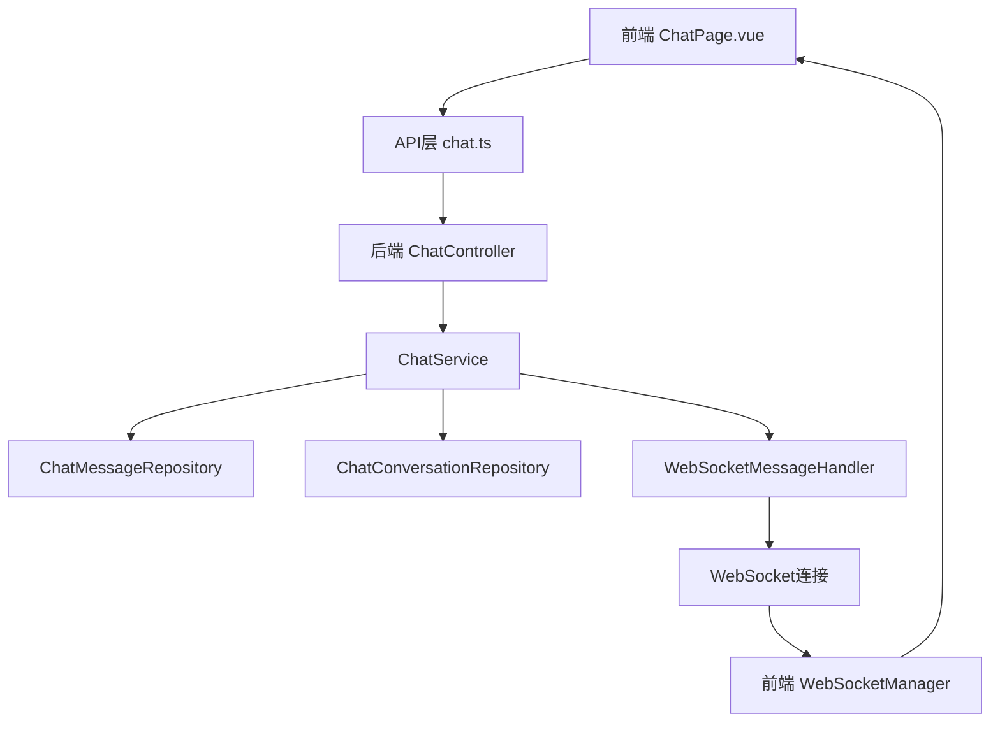
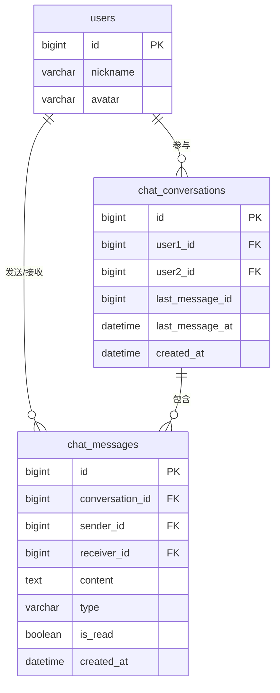
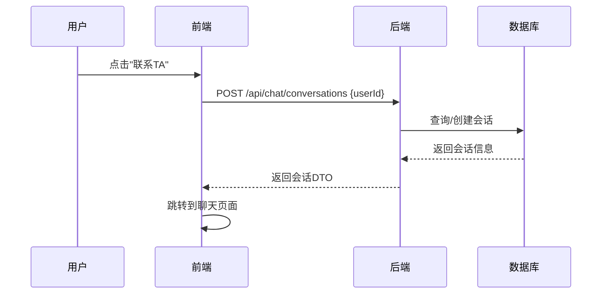
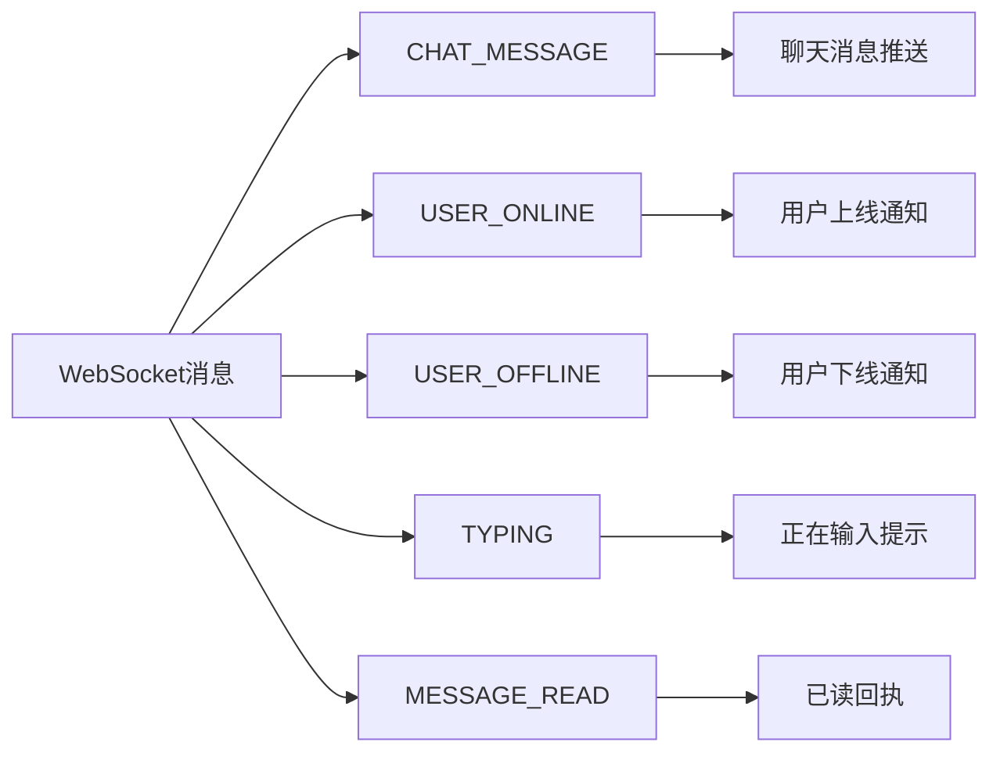
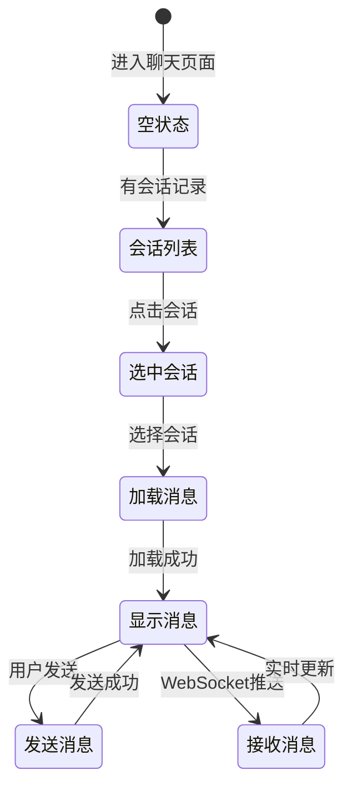
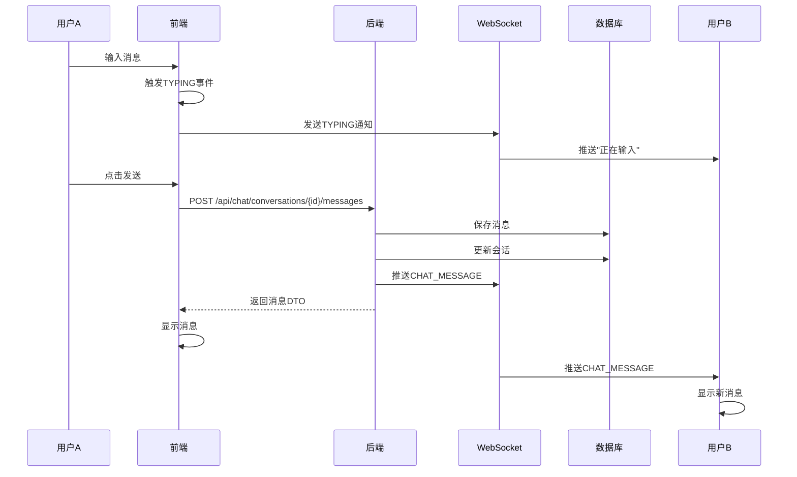
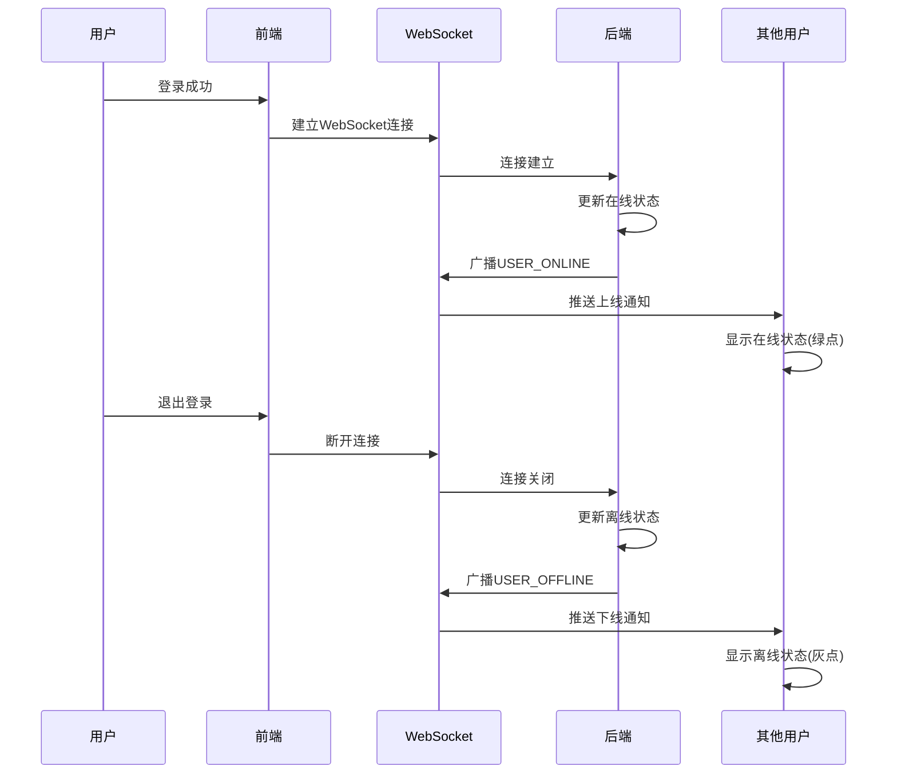

# 邻里共享平台 - 实时聊天功能实现文档

> 文档版本: v1.0  
> 创建时间: 2026-05-03  
> 作者: AI开发助手

---

## 一、功能概述

### 1.1 功能定位

实时聊天功能是邻里共享平台的核心社交功能，支持用户之间进行一对一实时沟通，主要用于：
- 物品借用咨询
- 借阅事宜沟通
- 社区邻里交流

### 1.2 核心功能

- ✅ 一对一实时聊天
- ✅ 会话管理（创建、列表、选择）
- ✅ 消息存储和加载
- ✅ 未读消息统计
- ✅ 在线状态显示
- ✅ 实时消息推送
- ✅ 正在输入提示
- ✅ 已读回执

---

## 二、技术架构

### 2.1 整体架构



### 2.2 技术栈

| 层级 | 技术 | 说明 |
|------|------|------|
| 前端框架 | Vue 3 + TypeScript | 响应式UI |
| 状态管理 | Pinia | 用户状态 |
| 实时通信 | WebSocket | 消息推送 |
| 后端框架 | Spring Boot 3.3.5 | REST API |
| 数据库 | MySQL 8.x | 数据存储 |
| ORM | Spring Data JPA | 数据访问 |

---

## 三、数据库设计

### 3.1 ER图



### 3.2 表结构

#### 会话表 (chat_conversations)

```sql
CREATE TABLE chat_conversations (
    id BIGINT PRIMARY KEY AUTO_INCREMENT,
    user1_id BIGINT NOT NULL COMMENT '用户1 ID（较小的用户ID）',
    user2_id BIGINT NOT NULL COMMENT '用户2 ID（较大的用户ID）',
    last_message_id BIGINT COMMENT '最后一条消息ID',
    last_message_at DATETIME COMMENT '最后消息时间',
    created_at DATETIME DEFAULT CURRENT_TIMESTAMP,
    updated_at DATETIME DEFAULT CURRENT_TIMESTAMP ON UPDATE CURRENT_TIMESTAMP,
    
    UNIQUE KEY uk_users (user1_id, user2_id),
    FOREIGN KEY (user1_id) REFERENCES users(id) ON DELETE CASCADE,
    FOREIGN KEY (user2_id) REFERENCES users(id) ON DELETE CASCADE
);
```

**设计说明**：
- `user1_id` 和 `user2_id` 保证 `user1_id < user2_id`，确保两个用户之间只有一个会话
- `last_message_id` 和 `last_message_at` 用于会话列表排序

#### 消息表 (chat_messages)

```sql
CREATE TABLE chat_messages (
    id BIGINT PRIMARY KEY AUTO_INCREMENT,
    conversation_id BIGINT NOT NULL COMMENT '会话ID',
    sender_id BIGINT NOT NULL COMMENT '发送者ID',
    receiver_id BIGINT NOT NULL COMMENT '接收者ID',
    content TEXT NOT NULL COMMENT '消息内容',
    type VARCHAR(20) DEFAULT 'TEXT' COMMENT '消息类型',
    is_read BOOLEAN DEFAULT FALSE COMMENT '是否已读',
    created_at DATETIME DEFAULT CURRENT_TIMESTAMP,
    
    INDEX idx_conversation (conversation_id, created_at),
    INDEX idx_unread (receiver_id, is_read),
    FOREIGN KEY (conversation_id) REFERENCES chat_conversations(id) ON DELETE CASCADE
);
```

---

## 四、后端实现

### 4.1 模块结构

```
backend/demo/src/main/java/com/neighbor/chat/
├── entity/
│   ├── ChatConversation.java
│   └── ChatMessage.java
├── enums/
│   └── MessageType.java
├── dto/
│   ├── ChatMessageDTO.java
│   ├── ConversationDTO.java
│   ├── SendMessageRequest.java
│   └── UserStatusDTO.java
├── repository/
│   ├── ChatConversationRepository.java
│   └── ChatMessageRepository.java
├── service/
│   └── ChatService.java
└── controller/
    └── ChatController.java
```

### 4.2 核心API接口

#### 会话相关



| 接口 | 方法 | 说明 |
|------|------|------|
| `/api/chat/conversations` | GET | 获取会话列表 |
| `/api/chat/conversations` | POST | 创建或获取会话 |
| `/api/chat/conversations/{id}/messages` | GET | 获取聊天记录 |
| `/api/chat/conversations/{id}/messages` | POST | 发送消息 |
| `/api/chat/conversations/{id}/read` | PUT | 标记已读 |
| `/api/chat/users/{userId}/status` | GET | 获取用户在线状态 |
| `/api/chat/unread-count` | GET | 获取未读消息数 |

### 4.3 WebSocket消息类型



#### 消息格式示例

**聊天消息**：
```json
{
  "type": "CHAT_MESSAGE",
  "data": {
    "id": 123,
    "conversationId": 1,
    "senderId": 1,
    "receiverId": 2,
    "content": "你好，在吗？",
    "type": "TEXT",
    "isRead": false,
    "createdAt": "2026-05-03T10:30:00"
  }
}
```

**在线状态**：
```json
{
  "type": "USER_ONLINE",
  "data": {
    "userId": 2
  }
}
```

**正在输入**：
```json
{
  "type": "TYPING",
  "data": {
    "userId": 1,
    "isTyping": true
  }
}
```

---

## 五、前端实现

### 5.1 页面结构

```
frontend/src/views/
└── ChatPage.vue (左右栏布局)
    ├── 左侧：会话列表
    │   ├── 会话项
    │   │   ├── 用户头像 + 在线状态
    │   │   ├── 用户昵称
    │   │   ├── 最后一条消息
    │   │   └── 未读消息数
    │   └── 空状态提示
    └── 右侧：聊天窗口
        ├── 顶部：用户信息 + 在线状态
        ├── 中间：消息列表
        │   ├── 消息气泡（自己/对方）
        │   ├── 正在输入提示
        │   └── 自动滚动
        └── 底部：输入框 + 发送按钮
```

### 5.2 状态流程



### 5.3 WebSocket集成

```typescript
// 消息监听
wsManager.on('CHAT_MESSAGE', handleChatMessage)
wsManager.on('USER_ONLINE', handleUserOnline)
wsManager.on('USER_OFFLINE', handleUserOffline)
wsManager.on('TYPING', handleTyping)

// 发送消息
wsManager.send({
  type: 'TYPING',
  data: { receiverId: 2, isTyping: true }
})
```

---

## 六、核心流程

### 6.1 发起聊天流程

```mermaid
flowchart TD
    A[用户浏览物品详情] --> B[看到物品主人信息]
    B --> C{是否登录?}
    C -->|否| D[跳转登录页]
    C -->|是| E[点击"联系TA"按钮]
    E --> F[调用API创建会话]
    F --> G{会话是否存在?}
    G -->|否| H[创建新会话]
    G -->|是| I[获取已有会话]
    H --> J[跳转聊天页面]
    I --> J
    J --> K[开始聊天]
```

### 6.2 消息发送流程



### 6.3 在线状态流程



---

## 七、UI设计

### 7.1 页面布局

```
┌─────────────────────────────────────────────────────┐
│                    导航栏                            │
├────────────────┬────────────────────────────────────┤
│   会话列表      │         聊天窗口                   │
│                │                                    │
│ ┌────────────┐ │  ┌──────────────────────────────┐ │
│ │ 👤 张三 🟢  │ │  │  👤 李四 🟢 在线             │ │
│ │ 你好，在吗？ │ │  ├──────────────────────────────┤ │
│ │      10:30  │ │  │                              │ │
│ └────────────┘ │  │  你好，物品还在吗？           │ │
│                │  │                    10:25      │ │
│ ┌────────────┐ │  │                              │ │
│ │ 👤 李四 ⚫  │ │  │           在的，可以借给你   │ │
│ │ 好的，谢谢  │ │  │           10:26              │ │
│ │      昨天   │ │  │                              │ │
│ └────────────┘ │  │  对方正在输入...             │ │
│                │  │                              │ │
│                │  ├──────────────────────────────┤ │
│                │  │ [输入框]            [发送]   │ │
│                │  └──────────────────────────────┘ │
└────────────────┴────────────────────────────────────┘
```

### 7.2 组件设计

**会话项**：
- 用户头像（48x48，圆角）
- 在线状态指示器（绿点/灰点）
- 用户昵称（加粗）
- 最后一条消息（灰色，截断）
- 时间戳（小字体）
- 未读消息数（红点）

**消息气泡**：
- 自己发送：右侧，黄色背景，右下圆角
- 对方发送：左侧，灰色背景，左下圆角
- 消息内容
- 时间戳（小字体）

---

## 八、性能优化

### 8.1 数据库优化

- ✅ 会话表唯一索引 `(user1_id, user2_id)`
- ✅ 消息表复合索引 `(conversation_id, created_at)`
- ✅ 未读消息索引 `(receiver_id, is_read)`

### 8.2 前端优化

- ✅ 消息列表虚拟滚动（大量消息时）
- ✅ 防抖处理正在输入事件（2秒）
- ✅ WebSocket自动重连（最多5次）
- ✅ 心跳保活（30秒）

### 8.3 后端优化

- ✅ 会话查询优化（索引覆盖）
- ✅ 消息分页加载（每页20条）
- ✅ WebSocket连接池管理
- ✅ 在线状态内存缓存

---

## 九、安全性

### 9.1 认证授权

- ✅ WebSocket握手时验证JWT Token
- ✅ API接口需要认证
- ✅ 会话权限验证（只能查看自己的会话）

### 9.2 数据安全

- ✅ 防止SQL注入（JPA参数化查询）
- ✅ XSS防护（前端转义）
- ✅ 消息内容长度限制

---

## 十、测试要点

### 10.1 功能测试

- [ ] 创建会话
- [ ] 发送消息
- [ ] 接收消息
- [ ] 在线状态显示
- [ ] 正在输入提示
- [ ] 未读消息统计
- [ ] 消息已读标记

### 10.2 性能测试

- [ ] 大量消息加载性能
- [ ] WebSocket并发连接
- [ ] 消息推送延迟

### 10.3 异常测试

- [ ] 网络断开重连
- [ ] Token过期处理
- [ ] 并发消息处理

---

## 十一、部署说明

### 11.1 数据库迁移

```bash
# Flyway自动执行迁移脚本
# V16__Create_Chat_Tables.sql
```

### 11.2 配置要求

```properties
# WebSocket配置
spring.websocket.enabled=true

# JWT配置
app.jwt.secret=your-secret-key

# 数据库配置
spring.datasource.url=jdbc:mysql://localhost:3306/neighbor_sharing
```

---

## 十二、后续优化

### 12.1 功能扩展

- [ ] 图片消息支持
- [ ] 语音消息支持
- [ ] 消息撤回
- [ ] 消息转发
- [ ] 群聊功能

### 12.2 性能优化

- [ ] 消息缓存（Redis）
- [ ] 离线消息推送
- [ ] 消息搜索
- [ ] 消息已读回执优化

---

**文档结束**
