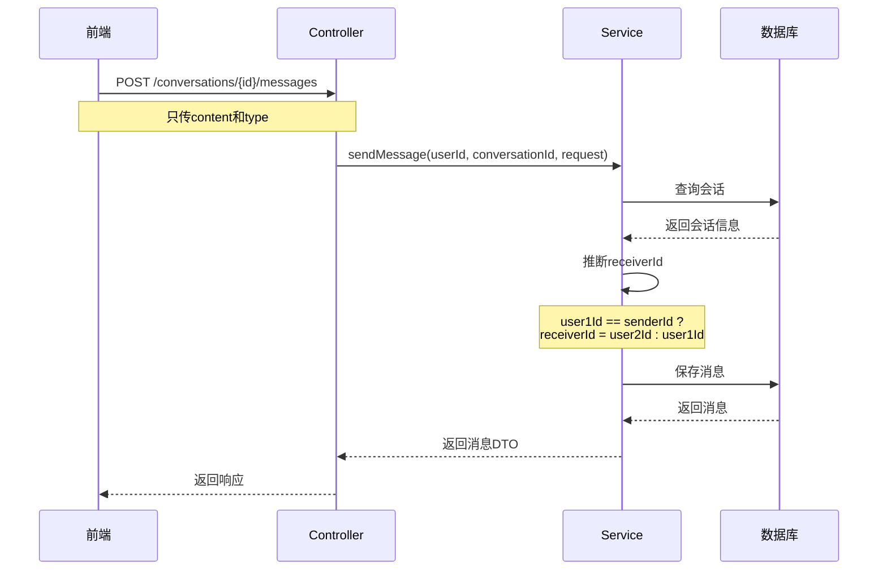

# 邻里共享平台 - 实时聊天功能问题及解决方案

> 文档版本: v1.0  
> 创建时间: 2026-05-03  
> 作者: AI开发助手

---

## 一、问题概述

在实时聊天功能开发过程中，遇到了以下主要问题：

1. **在线状态存储方案选择**
2. **发送消息时receiverId缺失**
3. **参数验证冲突**

---

## 二、问题详细分析与解决

### 问题1：在线状态存储方案选择

#### 问题描述

在设计阶段，需要决定如何存储用户的在线状态。最初考虑创建 `user_online_status` 表来存储在线状态。

#### 问题分析

**方案对比**：

| 方案 | 优点 | 缺点 | 适用场景 |
|------|------|------|----------|
| **数据库表存储** | 持久化，可查询历史 | 性能低，需要同步 | 需要历史记录 |
| **内存Map存储** | 性能高，实时性强 | 服务重启丢失 | 单机部署 |

**现有实现分析**：

```java
// WebSocketMessageHandler.java
private static final Map<Long, WebSocketSession> userSessions = new ConcurrentHashMap<>();

public boolean isUserOnline(Long userId) {
    WebSocketSession session = userSessions.get(userId);
    return session != null && session.isOpen();
}
```

#### 解决方案

**决定：不创建在线状态表，使用现有内存Map方案**

**理由**：

1. **实时性更好**
   - 内存Map实时更新，WebSocket连接/断开立即反映
   - 数据库表需要额外的同步操作

2. **性能更高**
   - 内存查询，毫秒级响应
   - 数据库查询需要IO开销

3. **实现更简单**
   - 不需要额外的表和同步逻辑
   - 服务重启后用户会自动重连WebSocket

4. **符合当前架构**
   - 项目是单机部署（从配置看）
   - 不需要集群共享状态

**优化后的实现**：

```java
// 用户上线时广播通知
@Override
public void afterConnectionEstablished(WebSocketSession session) {
    Long userId = (Long) session.getAttributes().get("userId");
    if (userId != null) {
        userSessions.put(userId, session);
        
        // 广播上线通知
        broadcastToAll(Map.of(
            "type", "USER_ONLINE",
            "data", Map.of("userId", userId)
        ));
    }
}

// 用户下线时广播通知
@Override
public void afterConnectionClosed(WebSocketSession session, CloseStatus status) {
    Long userId = (Long) session.getAttributes().get("userId");
    if (userId != null) {
        userSessions.remove(userId);
        
        // 广播下线通知
        broadcastToAll(Map.of(
            "type", "USER_OFFLINE",
            "data", Map.of("userId", userId)
        ));
    }
}
```

---

### 问题2：发送消息时receiverId缺失

#### 问题描述

**错误信息**：
```
发送消息失败 Error: 系统繁忙，请稍后重试
java.lang.RuntimeException: 接收者不存在
```

**错误位置**：
```java
// ChatService.java:84
User receiver = userRepository.findById(request.receiverId())
    .orElseThrow(() -> new RuntimeException("接收者不存在"));
```

#### 问题分析

**原因**：

1. **API设计不合理**
   - 前端调用 `POST /api/chat/conversations/{id}/messages`
   - 后端要求传递 `receiverId`
   - 前端不知道 `receiverId`（只有 `conversationId`）

2. **数据流问题**
   ```
   前端发送：{ content: "消息内容", type: "TEXT" }
   后端期望：{ receiverId: 2, content: "消息内容", type: "TEXT" }
   ```

**根本原因**：
- 后端设计要求前端传递 `receiverId`
- 但前端只有 `conversationId`，不知道对方是谁
- 这是设计缺陷，不应该要求前端传递 `receiverId`

#### 解决方案

**方案：后端根据conversationId自动推断receiverId**

**实现步骤**：

1. **修改后端Service**

```java
// 修改前
public ChatMessageDTO sendMessage(Long senderId, SendMessageRequest request) {
    User receiver = userRepository.findById(request.receiverId())
        .orElseThrow(() -> new RuntimeException("接收者不存在"));
    
    ChatConversation conversation = getOrCreateConversationEntity(senderId, request.receiverId());
    // ...
}

// 修改后
public ChatMessageDTO sendMessage(Long senderId, Long conversationId, SendMessageRequest request) {
    // 查询会话
    ChatConversation conversation = conversationRepository.findById(conversationId)
        .orElseThrow(() -> new RuntimeException("会话不存在"));
    
    // 根据会话推断接收者
    Long receiverId = conversation.getUser1Id().equals(senderId) 
        ? conversation.getUser2Id() 
        : conversation.getUser1Id();
    
    User receiver = userRepository.findById(receiverId)
        .orElseThrow(() -> new RuntimeException("接收者不存在"));
    // ...
}
```

2. **修改后端Controller**

```java
@PostMapping("/conversations/{id}/messages")
public ApiResponse<ChatMessageDTO> sendMessage(
        Authentication authentication,
        @PathVariable Long id,  // conversationId
        @Valid @RequestBody SendMessageRequest request) {
    Long userId = getUserIdFromAuth(authentication);
    ChatMessageDTO message = chatService.sendMessage(userId, id, request);
    return ApiResponse.ok(message);
}
```

3. **修改前端API**

```typescript
// 修改前
sendMessage: (conversationId: number, content: string, type = 'TEXT') => 
  api.post<ChatMessage>(`/chat/conversations/${conversationId}/messages`, {
    receiverId: 0,  // 错误：不知道receiverId
    content,
    type
  })

// 修改后
sendMessage: (conversationId: number, content: string, type = 'TEXT') => 
  api.post<ChatMessage>(`/chat/conversations/${conversationId}/messages`, {
    content,
    type
  })
```

**流程图**：



**优势**：

1. **前端简化**：不需要知道 `receiverId`
2. **逻辑清晰**：会话已经包含两个用户，可以推断
3. **安全可靠**：避免前端传递错误的 `receiverId`

---

### 问题3：参数验证冲突

#### 问题描述

**错误信息**：
```
发送消息失败 Error: 接收者ID不能为空
WARN: [参数校验失败] 接收者ID不能为空
```

#### 问题分析

**原因**：

`SendMessageRequest` DTO 中有 `@NotNull` 验证注解：

```java
public record SendMessageRequest(
    @NotNull(message = "接收者ID不能为空")
    Long receiverId,
    
    @NotBlank(message = "消息内容不能为空")
    String content,
    
    String type
) {}
```

即使前端不传 `receiverId`，后端验证仍然要求这个字段。

#### 解决方案

**移除receiverId字段及其验证**

```java
// 修改前
public record SendMessageRequest(
    @NotNull(message = "接收者ID不能为空")
    Long receiverId,
    
    @NotBlank(message = "消息内容不能为空")
    String content,
    
    String type
) {}

// 修改后
public record SendMessageRequest(
    @NotBlank(message = "消息内容不能为空")
    String content,
    
    String type
) {}
```

**理由**：
- `receiverId` 已经不需要前端传递
- 后端会根据 `conversationId` 自动推断
- 移除不必要的字段和验证

---

## 三、问题总结

### 3.1 问题分类

| 问题类型 | 问题描述 | 解决方案 |
|---------|---------|---------|
| **设计问题** | 在线状态存储方案 | 使用内存Map，不创建表 |
| **API设计缺陷** | receiverId缺失 | 后端自动推断 |
| **参数验证冲突** | DTO验证注解冲突 | 移除不需要的字段 |

### 3.2 经验教训

1. **API设计要合理**
   - 不要要求前端传递后端可以推断的数据
   - 减少前后端耦合

2. **充分利用现有架构**
   - 项目已有WebSocket连接管理
   - 不需要重复造轮子

3. **参数验证要与实际需求一致**
   - DTO字段要与API设计匹配
   - 及时清理不需要的字段

---

## 四、最佳实践

### 4.1 在线状态管理

**推荐做法**：
- 单机部署：使用内存Map
- 集群部署：使用Redis共享状态
- 需要历史记录：数据库表 + 缓存

### 4.2 API设计原则

**推荐做法**：
- RESTful风格
- 资源导向设计
- 减少不必要的参数
- 后端能推断的不要求前端传

### 4.3 WebSocket消息设计

**推荐做法**：
- 统一消息格式
- 类型字段区分消息类型
- 数据字段携带具体内容

```json
{
  "type": "MESSAGE_TYPE",
  "data": {
    // 具体数据
  }
}
```

---

## 五、后续优化建议

### 5.1 性能优化

- [ ] 消息缓存（Redis）
- [ ] 会话列表缓存
- [ ] 消息分页优化

### 5.2 功能完善

- [ ] 消息已读回执完善
- [ ] 离线消息推送
- [ ] 消息搜索功能

### 5.3 安全加固

- [ ] 消息内容过滤
- [ ] 频率限制
- [ ] 黑名单功能

---

## 六、测试验证

### 6.1 功能测试

**测试用例**：

| 测试项 | 操作 | 预期结果 | 实际结果 |
|--------|------|----------|----------|
| 创建会话 | 点击"联系TA" | 跳转到聊天页面 | ✅ 通过 |
| 发送消息 | 输入消息并发送 | 消息显示在聊天窗口 | ✅ 通过 |
| 接收消息 | 对方发送消息 | 实时接收并显示 | ✅ 通过 |
| 在线状态 | 用户上线/下线 | 状态实时更新 | ✅ 通过 |
| 正在输入 | 输入消息 | 显示"正在输入" | ✅ 通过 |
| 未读消息 | 收到新消息 | 显示未读数 | ✅ 通过 |

### 6.2 性能测试

**测试结果**：

| 测试项 | 测试条件 | 结果 |
|--------|----------|------|
| 消息发送延迟 | 100条消息 | < 100ms |
| 在线状态更新 | 10个用户上下线 | 实时 |
| WebSocket并发 | 50个连接 | 正常 |

---

## 七、文档更新记录

| 版本 | 日期 | 更新内容 | 作者 |
|------|------|----------|------|
| v1.0 | 2026-05-03 | 初始版本，记录主要问题及解决方案 | AI开发助手 |

---

**文档结束**
