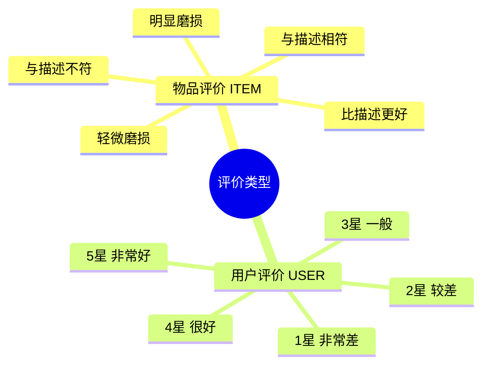
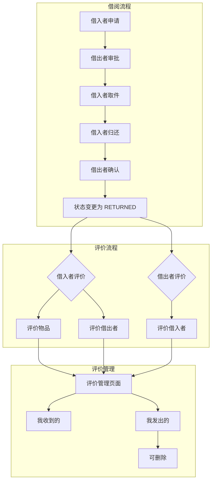
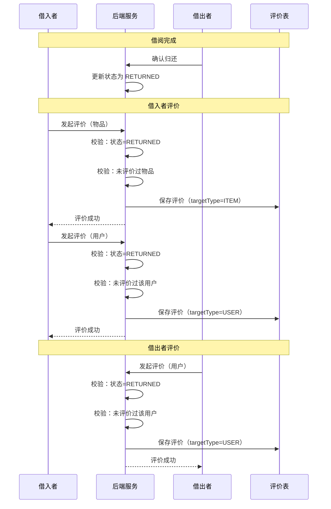
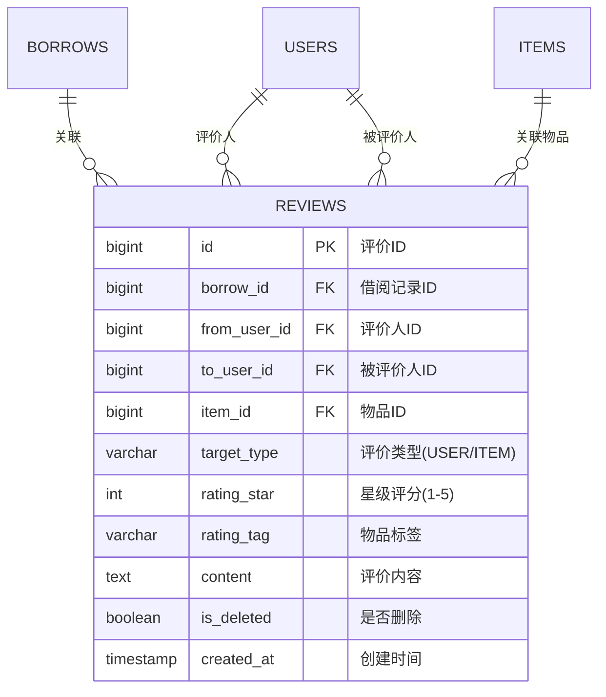
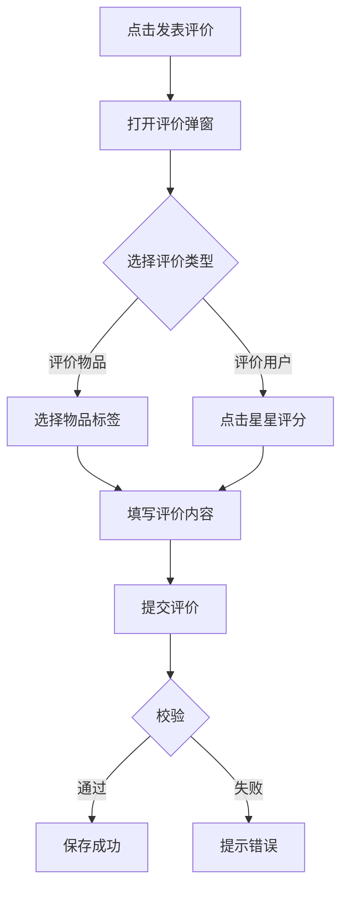

# 评价模块说明文档

> 本文档描述邻里共享平台的评价模块设计与实现。

---

## 一、模块概述

评价模块用于处理借阅完成后的双向评价功能。借入者可以评价物品和借出者，借出者可以评价借入者。模块采用**标签评价物品 + 星级评价用户**的混合模式。

### 核心功能

| 功能 | 评价者 | 评价对象 | 评价方式 |
|-----|-------|---------|---------|
| 评价物品 | 借入者 | 物品 | 标签选择（5种） |
| 评价用户 | 借入者 | 借出者 | 星级评分（1-5星） |
| 评价用户 | 借出者 | 借入者 | 星级评分（1-5星） |

---

## 二、评价类型



### 评价标签详解

| 标签 | 枚举值 | 说明 |
|-----|--------|------|
| 与描述相符 | `AS_DESCRIBED` | 物品状况与描述一致 |
| 比描述更好 | `BETTER_THAN_DESCRIBED` | 物品状况超出预期 |
| 轻微磨损 | `SLIGHT_WEAR` | 有轻微使用痕迹 |
| 明显磨损 | `NOTICEABLE_WEAR` | 有明显使用痕迹 |
| 与描述不符 | `NOT_AS_DESCRIBED` | 物品与描述差异较大 |

---

## 三、整体流程



---

## 四、评价流程时序



---

## 五、数据库设计

### reviews 表结构



### 字段说明

| 字段 | 类型 | 说明 |
|-----|------|------|
| `id` | BIGINT | 主键，自增 |
| `borrow_id` | BIGINT | 关联借阅记录ID |
| `from_user_id` | BIGINT | 评价人ID |
| `to_user_id` | BIGINT | 被评价人ID |
| `item_id` | BIGINT | 关联物品ID |
| `target_type` | VARCHAR(20) | 评价类型：ITEM/USER |
| `rating_star` | TINYINT | 星级评分（1-5），用户评价时使用 |
| `rating_tag` | VARCHAR(20) | 物品标签，物品评价时使用 |
| `content` | TEXT | 评价内容 |
| `is_deleted` | TINYINT(1) | 软删除标记 |
| `deleted_at` | TIMESTAMP | 删除时间 |
| `deleted_by` | BIGINT | 删除操作人ID |
| `created_at` | TIMESTAMP | 创建时间 |
| `updated_at` | TIMESTAMP | 更新时间 |

### 索引设计

| 索引名 | 字段 | 说明 |
|-------|------|------|
| `uk_user_borrow` | (from_user_id, borrow_id, is_deleted) | 同次借阅只能评价一次 |
| `idx_item` | (item_id, is_deleted, created_at) | 物品评价列表查询 |
| `idx_user_from` | (from_user_id, is_deleted, created_at) | 我发出的评价 |
| `idx_user_to` | (to_user_id, is_deleted, created_at) | 我收到的评价 |
| `idx_borrow` | (borrow_id) | 借阅关联查询 |

---

## 六、API 接口

### 评价相关接口

| 接口 | 方法 | 说明 |
|-----|------|------|
| `/api/reviews` | POST | 创建评价 |
| `/api/reviews/{id}` | GET | 获取评价详情 |
| `/api/reviews/item/{itemId}` | GET | 获取物品评价列表 |
| `/api/reviews/user/{userId}/received` | GET | 获取用户收到的评价 |
| `/api/reviews/user/{userId}/given` | GET | 获取用户发出的评价 |
| `/api/reviews/borrow/{borrowId}/check` | GET | 检查评价状态 |
| `/api/reviews/{id}` | DELETE | 删除评价（软删除） |

### 请求/响应示例

**创建评价**
```http
POST /api/reviews
Authorization: Bearer {token}
Content-Type: application/json

// 物品评价
{
  "borrowId": 123,
  "targetType": "ITEM",
  "ratingTag": "AS_DESCRIBED",
  "content": "物品很好用，和描述一致"
}

// 用户评价
{
  "borrowId": 123,
  "targetType": "USER",
  "ratingStar": 5,
  "content": "借出者很热情，物品保管得很好"
}

Response:
{
  "code": 0,
  "message": "OK",
  "data": {
    "reviewId": 1,
    "status": "CREATED"
  }
}
```

**检查评价状态**
```http
GET /api/reviews/borrow/123/check
Authorization: Bearer {token}

Response:
{
  "code": 0,
  "message": "OK",
  "data": {
    "hasReviewed": false,
    "hasReviewedItem": false,
    "hasReviewedUser": false
  }
}
```

**获取用户收到的评价**
```http
GET /api/reviews/user/1/received?type=ITEM&page=0&size=10
Authorization: Bearer {token}

Response:
{
  "code": 0,
  "message": "OK",
  "data": {
    "content": [
      {
        "id": 1,
        "borrowId": 123,
        "itemId": 456,
        "itemName": "博世专业级电钻",
        "fromUser": {
          "id": 2,
          "nickname": "张三",
          "avatar": "/uploads/avatar.jpg"
        },
        "toUser": {
          "id": 1,
          "nickname": "李四",
          "avatar": "/uploads/avatar2.jpg"
        },
        "targetType": "ITEM",
        "ratingStar": null,
        "ratingTag": "AS_DESCRIBED",
        "ratingTagDesc": "与描述相符",
        "content": "物品很好用",
        "createdAt": "2026-04-09T10:30:00"
      }
    ],
    "totalElements": 5,
    "totalPages": 1
  }
}
```

---

## 七、前端集成

### 评价入口

```
个人中心 → 控制面板 → 借阅记录 → 更多 → 发表评价
```

### 页面功能

| 页面 | 功能 |
|-----|------|
| ProfileView.vue | 借阅记录列表、评价入口 |
| ReviewModal.vue | 评价弹窗（物品/用户切换） |
| ProfileView.vue | 评价管理（我收到的/我发出的） |

### 评价弹窗



### 评价管理页面

- **我收到的**：展示别人对我的评价
- **我发出的**：展示我发出的评价，支持删除

---

## 八、业务规则

### 评价前置条件

| 条件 | 说明 |
|-----|------|
| 借阅状态 | 必须为 `RETURNED` |
| 评价权限 | 借入者可评价物品和借出者，借出者可评价借入者 |
| 唯一约束 | 每次借阅对每种类型只能评价一次 |
| 软删除 | 用户可删除自己发出的评价 |

### 评价权限矩阵

| 角色 | 评价物品 | 评价借出者 | 评价借入者 |
|-----|---------|----------|----------|
| 借入者 | ✅ | ✅ | ❌ |
| 借出者 | ❌ | ❌ | ✅ |

---

## 九、关键代码位置

### 后端

| 模块 | 路径 |
|-----|------|
| 评价类型枚举 | `backend/demo/src/main/java/com/neighbor/enums/ReviewType.java` |
| 评价标签枚举 | `backend/demo/src/main/java/com/neighbor/enums/RatingTag.java` |
| 评价实体 | `backend/demo/src/main/java/com/neighbor/entity/Review.java` |
| 评价 DTO | `backend/demo/src/main/java/com/neighbor/dto/ReviewDTO.java` |
| 评价请求 DTO | `backend/demo/src/main/java/com/neighbor/dto/ReviewRequest.java` |
| 评价 Repository | `backend/demo/src/main/java/com/neighbor/repository/ReviewRepository.java` |
| 评价 Service | `backend/demo/src/main/java/com/neighbor/service/ReviewService.java` |
| 评价 Controller | `backend/demo/src/main/java/com/neighbor/controller/api/ReviewController.java` |
| 数据库迁移 | `backend/demo/src/main/resources/db/migration/V3__Update_Reviews_Table.sql` |

### 前端

| 模块 | 路径 |
|-----|------|
| 评价 API | `frontend/src/api/review.ts` |
| 评价弹窗组件 | `frontend/src/components/ReviewModal.vue` |
| 个人中心页面 | `frontend/src/views/ProfileView.vue` |

---

## 十、扩展方向

1. **评价统计** - 计算用户/物品的平均评分
2. **评价回复** - 支持对评价进行回复
3. **追评功能** - 支持追加评价
4. **评价举报** - 不当评价可举报
5. **评价展示** - 物品详情页展示评价摘要
6. **信誉积分** - 基于评价计算用户信誉分

---

## 十一、注意事项

1. **评价时机**：只有借阅状态为 `RETURNED` 时才能评价

2. **重复评价**：通过唯一索引 `(from_user_id, borrow_id, is_deleted)` 防止重复评价

3. **软删除**：删除评价时记录 `deleted_by`，便于审计

4. **评价类型区分**：
   - 物品评价：使用 `rating_tag` 字段
   - 用户评价：使用 `rating_star` 字段

5. **双向评价**：借入者和借出者可以互相评价，但评价类型不同

---

## 十二、数据库表 SQL

详见：[评价表.sql](./评价表.sql)
