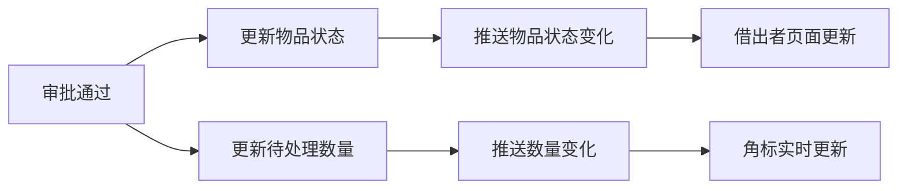

嗯 可以了 但是我现在打开两个浏览器进行借阅归还，但消息啊角标啊”我的发布“里对应物品的状态没有立马出现，分析一下 是浏览器相关的问题嘛。


让我分析一下问题：

## 问题分析

### 当前实现的消息推送流程

```
用户A 申请借用 → 发送消息给 用户B → WebSocket 推送给 用户B
                                              ↓
                                        用户B 收到通知 ✓
                                        
用户A 自己 → 没有收到任何通知 ✗
```

### 存在的问题

| 场景 | 当前行为 | 预期行为 |
|-----|---------|---------|
| 借阅申请 | 只有借出者收到通知 | ✅ 正确 |
| 审批通过 | 只有借入者收到通知 | ⚠️ 借出者不知道状态变化 |
| 物品状态变化 | 无通知 | ⚠️ 借出者看不到实时状态 |
| 角标更新 | 只更新消息角标 | ⚠️ 待处理数量没实时更新 |

### 根本原因

1. **物品状态变化没有推送** - 审批后物品状态变成 `BORROWED`，但借出者页面没有刷新
2. **待处理数量没有推送** - `pendingApprovalCount` 和 `returnRequestedCount` 没有实时更新
3. **页面数据没有实时刷新** - "我的发布"列表依赖页面刷新或重新请求

---

## 解决方案

需要增加以下推送：



---

需要我实现以下改进吗？

1. **推送物品状态变化** - 物品状态变化时通知物品所有者
2. **推送待处理数量** - 借阅状态变化时更新角标
3. **前端监听状态变化** - 实时更新"我的发布"列表