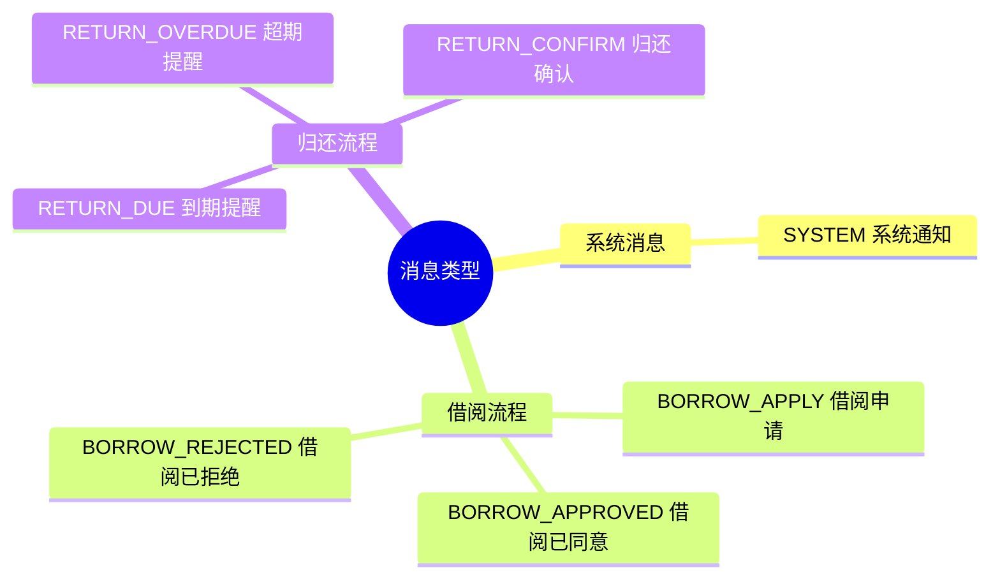
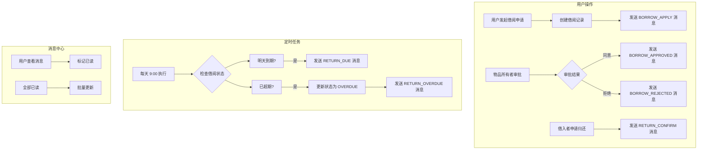
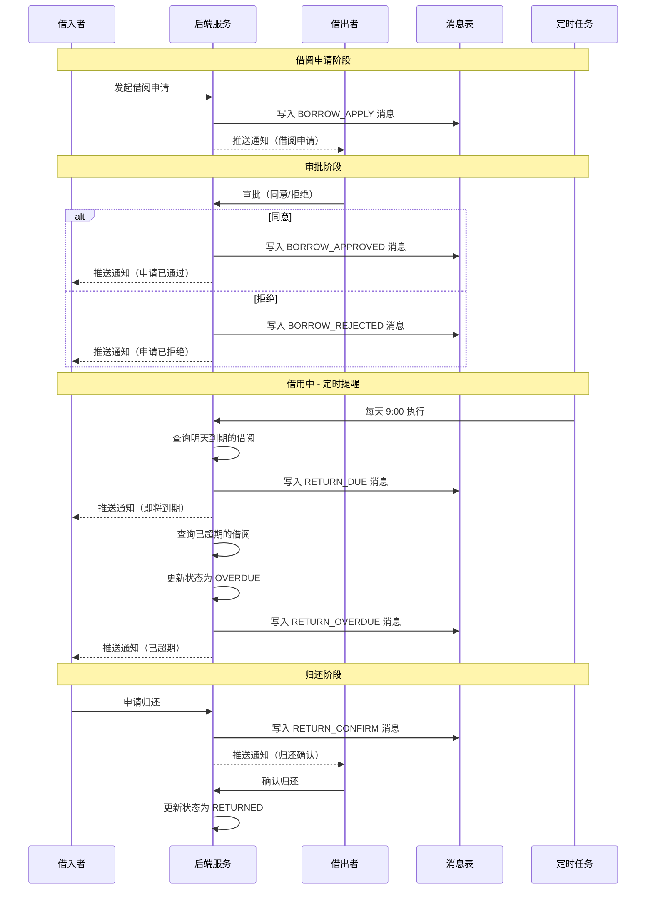
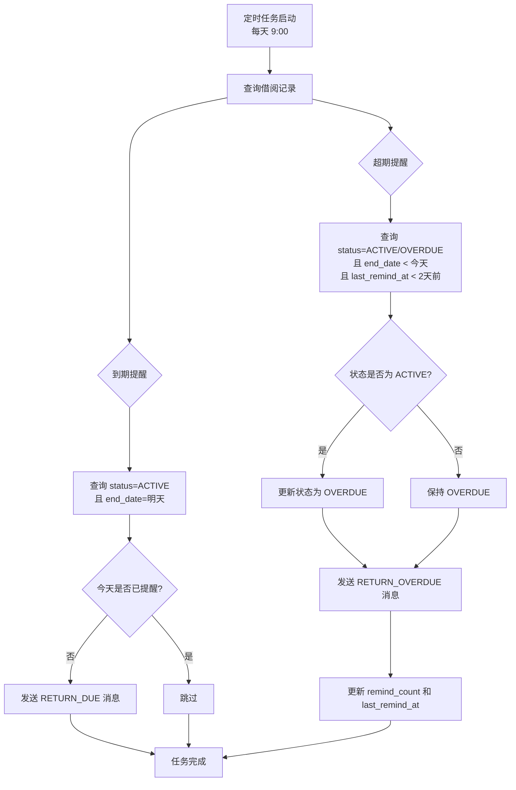
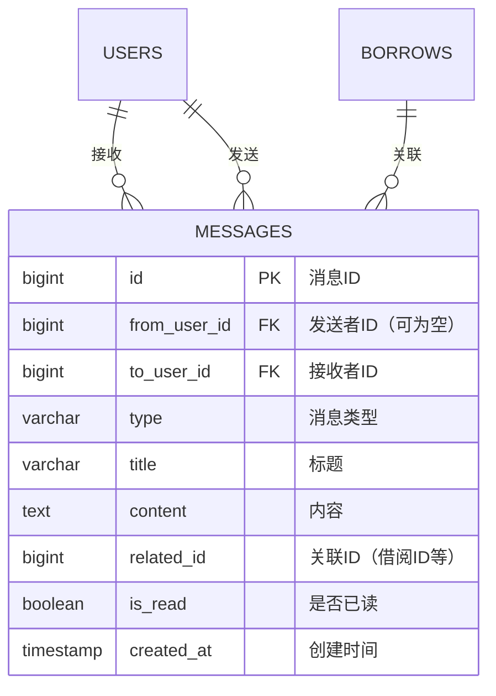
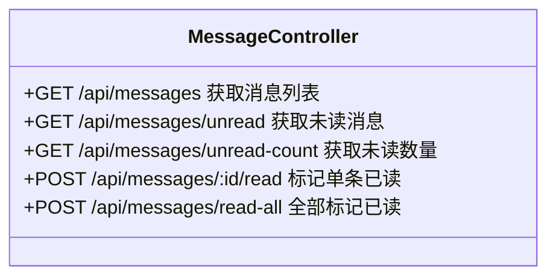

# 通知模块说明文档

> 本文档描述邻里共享平台的通知/消息模块设计与实现。

---

## 一、模块概述

通知模块用于处理平台内的各类消息通知，包括借阅申请通知、审批结果通知、归还提醒、超期提醒等。模块采用**定时任务 + 消息推送**的方式实现自动化提醒功能。

### 核心功能

| 功能 | 触发方式 | 说明 |
|-----|---------|------|
| 借阅申请通知 | 实时 | 用户发起借阅申请时，通知物品所有者 |
| 审批结果通知 | 实时 | 物品所有者审批后，通知申请人 |
| 归还申请通知 | 实时 | 借入者申请归还时，通知物品所有者 |
| 到期提醒 | 定时 | 每天早上 9 点，提醒明天到期的借阅 |
| 超期提醒 | 定时 | 每天早上 9 点，提醒已超期的借阅（隔天提醒） |

---

## 二、消息类型



### 消息类型详解

| 类型 | 枚举值 | 接收者 | 触发场景 |
|-----|--------|-------|---------|
| 系统通知 | `SYSTEM` | 全体/指定用户 | 系统公告 |
| 借阅申请 | `BORROW_APPLY` | 物品所有者 | 有人申请借用物品 |
| 借阅已同意 | `BORROW_APPROVED` | 申请人 | 借阅申请被通过 |
| 借阅已拒绝 | `BORROW_REJECTED` | 申请人 | 借阅申请被拒绝 |
| 到期提醒 | `RETURN_DUE` | 借入者 | 物品明天到期 |
| 超期提醒 | `RETURN_OVERDUE` | 借入者 | 物品已超期 |
| 归还确认 | `RETURN_CONFIRM` | 物品所有者 | 借入者申请归还 |

---

## 三、整体流程



---

## 四、借阅流程与消息触发



---

## 五、定时任务流程



### 定时任务配置

| 配置项 | 值 | 说明 |
|-------|-----|------|
| 执行时间 | `0 0 9 * * ?` | 每天早上 9 点 |
| 到期提前天数 | 1 天 | 提前 1 天提醒 |
| 超期提醒间隔 | 2 天 | 隔天提醒一次 |
| 技术方案 | Spring `@Scheduled` | 无需额外依赖 |

---

## 六、数据库设计

### messages 表结构



### 字段说明

| 字段 | 类型 | 说明 |
|-----|------|------|
| `id` | BIGINT | 主键，自增 |
| `from_user_id` | BIGINT | 发送者ID，系统消息为 NULL |
| `to_user_id` | BIGINT | 接收者ID，必填 |
| `type` | VARCHAR(20) | 消息类型枚举值 |
| `title` | VARCHAR(200) | 消息标题 |
| `content` | TEXT | 消息内容 |
| `related_id` | BIGINT | 关联业务ID（如借阅ID） |
| `is_read` | BOOLEAN | 是否已读，默认 FALSE |
| `created_at` | TIMESTAMP | 创建时间 |

### borrows 表相关字段

| 字段 | 类型 | 说明 |
|-----|------|------|
| `remind_count` | INT | 提醒次数 |
| `last_remind_at` | TIMESTAMP | 最后提醒时间 |

---

## 七、API 接口

### 消息相关接口



| 接口 | 方法 | 说明 |
|-----|------|------|
| `/api/messages` | GET | 分页获取消息列表 |
| `/api/messages/unread` | GET | 分页获取未读消息 |
| `/api/messages/unread-count` | GET | 获取未读消息数量 |
| `/api/messages/{id}/read` | POST | 标记单条消息已读 |
| `/api/messages/read-all` | POST | 全部标记已读 |

### 请求/响应示例

**获取消息列表**
```http
GET /api/messages?page=0&size=10
Authorization: Bearer {token}

Response:
{
  "code": 0,
  "message": "OK",
  "data": {
    "content": [
      {
        "id": 1,
        "type": "RETURN_DUE",
        "typeDesc": "归还提醒",
        "title": "物品即将到期",
        "content": "您借用的「博世专业级电钻」将于明天到期，请及时归还",
        "relatedId": 123,
        "isRead": false,
        "createdAt": "2026-04-06T09:00:00"
      }
    ],
    "totalElements": 5,
    "totalPages": 1,
    "number": 0,
    "size": 10
  }
}
```

**获取未读数量**
```http
GET /api/messages/unread-count
Authorization: Bearer {token}

Response:
{
  "code": 0,
  "message": "OK",
  "data": {
    "count": 3
  }
}
```

---

## 八、前端集成

### 消息入口

导航栏右上角添加消息铃铛图标，显示未读消息数量红点：

```
[ 邻里共享. ]  [发现物品] [社区论坛] [发布闲置]    [用户名] [🔔³] [我的²] [退出]
```

### 页面路由

| 路由 | 页面 | 说明 |
|-----|------|------|
| `/messages` | MessageView.vue | 消息中心页面 |

### 页面功能

- 全部消息 / 未读消息 切换
- 消息列表展示（图标、类型、标题、内容、时间）
- 点击消息标记已读
- 一键全部已读
- 分页加载

---

## 九、关键代码位置

### 后端

| 模块 | 路径 |
|-----|------|
| 消息类型枚举 | `backend/demo/src/main/java/com/neighbor/enums/MessageType.java` |
| 消息实体 | `backend/demo/src/main/java/com/neighbor/entity/Message.java` |
| 消息 DTO | `backend/demo/src/main/java/com/neighbor/dto/MessageDTO.java` |
| 消息 Repository | `backend/demo/src/main/java/com/neighbor/repository/MessageRepository.java` |
| 消息 Service | `backend/demo/src/main/java/com/neighbor/service/MessageService.java` |
| 消息 Controller | `backend/demo/src/main/java/com/neighbor/controller/api/MessageController.java` |
| 定时任务 | `backend/demo/src/main/java/com/neighbor/scheduler/ReminderScheduler.java` |

### 前端

| 模块 | 路径 |
|-----|------|
| 消息 API | `frontend/src/api/message.ts` |
| 消息中心页面 | `frontend/src/views/MessageView.vue` |
| 导航栏组件 | `frontend/src/components/MainNav.vue` |
| 路由配置 | `frontend/src/router/index.ts` |

---

## 十、扩展方向

1. **WebSocket 实时推送** - 当前为轮询模式，可升级为 WebSocket 实现实时消息推送
2. **消息模板** - 支持自定义消息模板
3. **消息订阅** - 用户可选择订阅/取消订阅某类消息
4. **短信/邮件通知** - 重要消息支持短信或邮件通知
5. **消息聚合** - 相同类型消息聚合展示，避免刷屏

---

## 十一、注意事项

1. **定时任务单机模式**：当前使用 Spring `@Scheduled`，仅适用于单机部署。如需集群部署，需迁移至 Quartz 或 XXL-JOB

2. **消息去重**：定时任务中已实现当天不重复发送到期提醒的逻辑

3. **超期状态**：定时任务会自动将超期借阅的状态从 `ACTIVE` 更新为 `OVERDUE`

4. **消息清理**：建议定期清理已读超过 30 天的消息，避免数据膨胀
