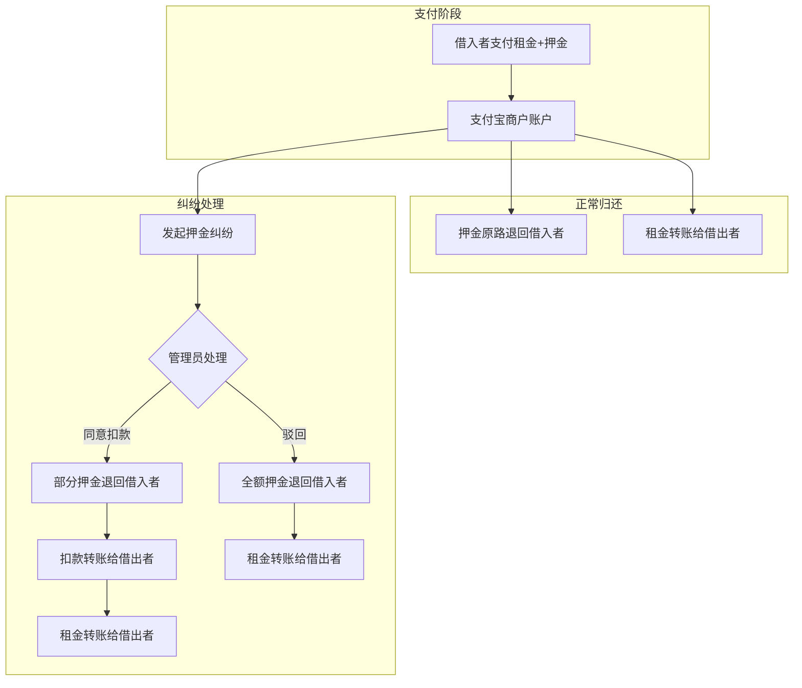

# 邻里共享平台 - 项目开发进度文档（二）

> 最后更新：2026-04-15

---

## 一、本文档概述

本文档记录 2026-04-14 至 2026-04-15 期间的开发进度，主要包含：

- 支付模块（支付宝沙箱集成）
- 押金纠纷处理系统
- 支付宝转账功能
- 管理员后台扩展

---

## 二、新增功能完成度

### 支付模块 ✅ 100%

| 功能 | 状态 | 说明 |
|-----|:----:|------|
| 支付宝沙箱配置 | ✅ | AlipayConfig + 沙箱环境 |
| 支付订单创建 | ✅ | 租金+押金合并支付 |
| 支付回调处理 | ✅ | 异步通知验签 |
| 押金退还 | ✅ | 全额退款接口 |
| 部分退款 | ✅ | 纠纷扣款后部分退款 |
| 跳过支付（测试） | ✅ | 快速测试流程 |

### 押金纠纷处理 ✅ 100%

| 功能 | 状态 | 说明 |
|-----|:----:|------|
| 发起押金纠纷 | ✅ | 借出者/借入者均可发起 |
| 纠纷类型分类 | ✅ | 损坏/丢失/逾期/配件缺失/其他 |
| 证据图片上传 | ✅ | JSON数组存储 |
| 管理员处理 | ✅ | 同意扣款/驳回/开始调查 |
| 部分扣款 | ✅ | 管理员设定实际扣款金额 |
| 消息通知 | ✅ | 处理结果通知双方 |

### 支付宝转账 ✅ 100%

| 功能 | 状态 | 说明 |
|-----|:----:|------|
| 用户绑定支付宝 | ✅ | 个人中心设置页 |
| 租金自动转账 | ✅ | 归还时转账给借出者 |
| 扣款自动转账 | ✅ | 纠纷扣款转账给借出者 |
| 转账记录存储 | ✅ | transfer_records 表 |
| 幂等性控制 | ✅ | outBizNo 唯一订单号 |
| 容错设计 | ✅ | 转账失败不影响主流程 |

### 管理员后台扩展 ✅ 100%

| 功能 | 状态 | 说明 |
|-----|:----:|------|
| 押金纠纷管理 | ✅ | 列表、详情、处理弹窗 |
| 纠纷统计 | ✅ | 待处理/处理中/已同意/已驳回 |

---

## 三、数据库变更

### 新增迁移脚本

| 版本 | 说明 | 主要内容 |
|-----|------|---------|
| V8 | 支付表 | payments 表，支付记录 |
| V9 | 押金纠纷表 | deposit_disputes 表，payments 表扩展扣款字段 |
| V10 | 转账记录表 | transfer_records 表，users 表新增 alipay_account |

### 数据库表结构

```
payments              - 支付记录表
├── id                - 主键
├── out_trade_no      - 商户订单号
├── trade_no          - 支付宝交易号
├── borrow_id         - 借阅ID
├── payer_id          - 付款人ID
├── payee_id          - 收款人ID
├── payment_type      - 支付类型
├── rent_amount       - 租金金额
├── deposit_amount    - 押金金额
├── total_amount      - 总金额
├── status            - 支付状态
├── deduction_amount  - 扣款金额（V9新增）
├── deduction_reason  - 扣款原因（V9新增）
├── deduction_type    - 扣款类型（V9新增）
├── actual_refund_amount - 实际退还金额（V9新增）
└── ...

deposit_disputes      - 押金纠纷表（V9新增）
├── id                - 主键
├── payment_id        - 支付记录ID
├── borrow_id         - 借阅ID
├── initiator_id      - 发起人ID
├── initiator_type    - 发起人类型（LENDER/BORROWER）
├── dispute_type      - 纠纷类型
├── description       - 纠纷描述
├── evidence_images   - 证据图片
├── claim_amount      - 申请扣款金额
├── status            - 纠纷状态
├── actual_deduction  - 实际扣款金额
├── resolution        - 处理说明
├── handler_id        - 处理管理员ID
└── ...

transfer_records      - 转账记录表（V10新增）
├── id                - 主键
├── payment_id        - 关联支付记录ID
├── borrow_id         - 借阅ID
├── to_user_id        - 转入用户ID
├── transfer_type     - 转账类型（RENT/DEDUCTION）
├── amount            - 转账金额
├── out_biz_no        - 商户转账订单号
├── alipay_order_id   - 支付宝转账订单号
├── payee_account     - 收款方支付宝账号
├── status            - 转账状态
├── fail_reason       - 失败原因
└── ...
```

---

## 四、新增枚举类型

### PaymentStatus（支付状态）

```java
PENDING        // 待支付
PAID           // 已支付
DISPUTED       // 纠纷中
DEDUCTING      // 扣款中
PARTIAL_REFUNDED  // 部分退款
FULLY_DEDUCTED // 全额扣款
REFUNDING      // 退款中
REFUNDED       // 已退款
REFUND_FAILED  // 退款失败
CLOSED         // 已关闭
```

### DepositDisputeType（纠纷类型）

```java
DAMAGE         // 物品损坏
LOSS           // 物品丢失
OVERDUE        // 逾期未还
MISSING_PARTS  // 配件缺失
OTHER          // 其他争议
```

### DepositDisputeStatus（纠纷状态）

```java
PENDING        // 待处理
PROCESSING     // 处理中
APPROVED       // 已同意扣款
REJECTED       // 已驳回
CANCELLED      // 已撤销
```

### TransferType（转账类型）

```java
RENT           // 租金转账
DEDUCTION      // 扣款转账
```

### TransferStatus（转账状态）

```java
PENDING        // 待转账
SUCCESS        // 转账成功
FAILED         // 转账失败
```

---

## 五、资金流转设计

### 整体流程



### 资金流转汇总

| 场景 | 押金处理 | 租金处理 | 扣款处理 |
|------|---------|---------|---------|
| 正常归还 | 原路退回借入者 | 转账给借出者 | - |
| 纠纷-同意扣款 | 部分退回借入者 | 转账给借出者 | 转账给借出者 |
| 纠纷-驳回 | 全额退回借入者 | 转账给借出者 | - |

---

## 六、新增API接口

### 支付相关

| 接口 | 方法 | 说明 |
|------|------|------|
| `/api/payments/create` | POST | 创建支付订单 |
| `/api/payments/notify` | POST | 支付宝回调 |
| `/api/payments/borrow/{id}` | GET | 获取借阅的支付信息 |
| `/api/payments/my/paid` | GET | 获取我支付的记录 |
| `/api/payments/my/received` | GET | 获取我收到的记录 |
| `/api/payments/{id}/refund` | POST | 退还押金 |
| `/api/payments/{id}/skip-pay` | POST | 跳过支付（测试） |
| `/api/payments/{id}/skip-refund` | POST | 跳过退还（测试） |

### 押金纠纷相关

| 接口 | 方法 | 说明 |
|------|------|------|
| `/api/deposit-disputes` | POST | 发起押金纠纷 |
| `/api/deposit-disputes/{id}` | GET | 获取纠纷详情 |
| `/api/deposit-disputes/my` | GET | 获取我的纠纷列表 |
| `/api/deposit-disputes/{id}/cancel` | POST | 撤销纠纷 |

### 管理员接口扩展

| 接口 | 方法 | 说明 |
|------|------|------|
| `/api/admin/deposit-disputes` | GET | 获取纠纷列表 |
| `/api/admin/deposit-disputes/{id}` | GET | 获取纠纷详情 |
| `/api/admin/deposit-disputes/{id}/resolve` | POST | 处理纠纷 |
| `/api/admin/deposit-disputes/stats` | GET | 获取纠纷统计 |

---

## 七、新增文件清单

### 后端新增文件

```
backend/demo/src/main/java/com/neighbor/
├── config/
│   └── AlipayConfig.java              # 支付宝配置
├── entity/
│   ├── Payment.java                   # 支付实体
│   ├── DepositDispute.java            # 押金纠纷实体
│   └── TransferRecord.java            # 转账记录实体
├── enums/
│   ├── PaymentStatus.java             # 支付状态枚举
│   ├── PaymentType.java               # 支付类型枚举
│   ├── DepositDisputeType.java        # 纠纷类型枚举
│   ├── DepositDisputeStatus.java      # 纠纷状态枚举
│   ├── InitiatorType.java             # 发起人类型枚举
│   ├── TransferType.java              # 转账类型枚举
│   └── TransferStatus.java            # 转账状态枚举
├── repository/
│   ├── PaymentRepository.java         # 支付数据访问
│   ├── DepositDisputeRepository.java  # 纠纷数据访问
│   └── TransferRecordRepository.java  # 转账数据访问
├── dto/
│   ├── PaymentDTO.java                # 支付DTO
│   ├── CreatePaymentRequest.java      # 创建支付请求
│   ├── DepositDisputeDTO.java         # 纠纷DTO
│   ├── CreateDepositDisputeRequest.java
│   └── ResolveDepositDisputeRequest.java
├── service/
│   ├── PaymentService.java            # 支付服务
│   ├── DepositDisputeService.java     # 纠纷服务
│   └── TransferService.java           # 转账服务
└── controller/api/
    ├── PaymentController.java         # 支付控制器
    └── DepositDisputeController.java  # 纠纷控制器

backend/demo/src/main/resources/db/migration/
├── V8__Add_Payments_Table.sql         # 支付表迁移
├── V9__Add_Deposit_Disputes.sql       # 纠纷表迁移
└── V10__Add_Transfer_Records.sql      # 转账表迁移
```

### 前端新增文件

```
frontend/src/
├── api/
│   ├── payment.ts                     # 支付API
│   └── depositDispute.ts              # 纠纷API
└── components/
    ├── PaymentModal.vue               # 支付弹窗
    ├── DepositDisputeModal.vue        # 发起纠纷弹窗
    └── admin/
        └── AdminDepositDisputes.vue   # 管理端纠纷列表
```

### 前端修改文件

```
frontend/src/
├── views/
│   ├── ProfileView.vue                # 集成支付/纠纷/支付宝绑定
│   └── AdminView.vue                  # 新增押金纠纷导航
└── api/
    └── admin.ts                       # 新增纠纷管理接口
```

---

## 八、关键代码位置

### 后端核心服务

| 服务 | 路径 | 说明 |
|-----|------|------|
| PaymentService | `service/PaymentService.java` | 支付创建、退款、跳过支付 |
| DepositDisputeService | `service/DepositDisputeService.java` | 纠纷创建、处理、扣款退款 |
| TransferService | `service/TransferService.java` | 支付宝转账、记录查询 |

### 前端核心组件

| 组件 | 路径 | 说明 |
|-----|------|------|
| PaymentModal | `components/PaymentModal.vue` | 支付弹窗，显示租金押金 |
| DepositDisputeModal | `components/DepositDisputeModal.vue` | 发起纠纷弹窗 |
| AdminDepositDisputes | `components/admin/AdminDepositDisputes.vue` | 管理端纠纷列表 |

---

## 九、支付宝集成说明

### 沙箱环境配置

```yaml
# application.yml
alipay:
  app-id: 沙箱应用APPID
  private-key: 应用私钥
  public-key: 支付宝公钥
  gateway-url: https://openapi-sandbox.dl.alipaydev.com/gateway.do
  notify-url: http://域名/api/payments/notify
  return-url: http://前端域名/payment/result
```

### 关键接口

| 接口 | 用途 |
|------|------|
| `alipay.trade.page.pay` | PC网页支付 |
| `alipay.trade.refund` | 退款 |
| `alipay.fund.trans.uni.transfer` | 单笔转账 |

### 转账接口参数

```java
model.setProductCode("TRANS_ACCOUNT_NO_PWD");  // 免密转账
model.setBizScene("DIRECT_TRANSFER");          // 直接转账
payeeInfo.setIdentityType("ALIPAY_LOGON_ID");  // 登录账号
```

---

## 十、待优化项

### 高优先级

| 问题 | 建议方案 |
|------|---------|
| 转账重试机制 | 定时任务扫描失败记录重试 |
| 转账通知 | 发送消息通知用户转账结果 |
| 转账记录查询页面 | 新增「我的收入」页面 |

### 中优先级

| 问题 | 建议方案 |
|------|---------|
| 支付宝账号验证 | 调用支付宝接口验证账号真实性 |
| 实名认证 | 要求上传身份证人工审核 |
| 批量转账 | 支持批量转账接口 |

### 低优先级

| 问题 | 建议方案 |
|------|---------|
| 转账限额处理 | 大额转账分批处理 |
| 自动对账 | 每日对账任务 |
| 资金池管理 | 建立统一资金池账户 |

---

## 十一、相关文档

| 文档 | 路径 |
|-----|------|
| 支付模块开发文档 | `开发进度文档/支付模块/支付模块开发文档.md` |
| 押金纠纷处理设计文档 | `开发进度文档/支付模块/押金纠纷处理设计文档.md` |
| 支付宝转账功能开发文档 | `开发进度文档/支付模块/支付宝转账功能开发文档.md` |
| 项目开发进度总览（一） | `开发进度文档/项目开发进度总览.md` |

---

## 十二、测试要点

### 支付模块测试

- [ ] 创建支付订单，跳转支付宝沙箱
- [ ] 支付成功回调，状态更新
- [ ] 押金退款，原路退回
- [ ] 跳过支付（测试模式）

### 纠纷模块测试

- [ ] 借出者发起纠纷
- [ ] 借入者发起纠纷
- [ ] 管理员同意扣款
- [ ] 管理员驳回申请
- [ ] 部分退款到账

### 转账模块测试

- [ ] 用户绑定支付宝账号
- [ ] 正常归还后租金转账
- [ ] 纠纷扣款转账
- [ ] 未绑定账号时的处理

---

## 十三、项目整体进度

### 功能完成度更新

| 模块 | 原进度 | 现进度 | 说明 |
|------|:------:|:------:|------|
| 核心闭环 | 100% | 100% | 无变化 |
| 体验优化 | 100% | 100% | 无变化 |
| 扩展功能 | 95% | 100% | 支付模块完成 |
| 高级功能 | 0% | 80% | 支付模拟完成，碳排放待开发 |

### 当前整体进度

```
███████████████████████████████████░░░░░ 85%
```

---

> 文档由 AI 助手生成，用于记录项目开发进度和后续参考。
> 
> 上一份文档：[项目开发进度总览.md](file:///d:/ai练/fast/开发进度文档/项目开发进度总览.md)
