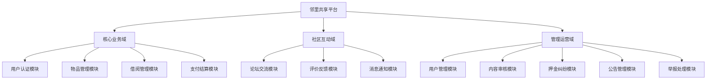

# 3.2 功能需求分析

## 3.2.1 功能模块划分

邻里共享平台的功能需求源于社区居民物品共享与邻里交流的实际场景。通过对目标用户群体的调研分析，平台需要支撑三类核心角色的日常操作：普通用户（包括借入者和借出者）、论坛参与者和平台管理员。基于角色职责的差异，系统功能划分为三大域、十二个子模块。

如图 3.3 所示，功能模块按业务域进行分组，形成清晰的层次结构。

图 3.3 系统功能模块划分图

核心业务域包含四个模块，支撑平台最基础的共享流程。用户认证模块提供身份识别能力，是所有业务的入口；物品管理模块管理可共享的资源；借阅管理模块实现物品流转的核心流程；支付结算模块处理资金往来。

社区互动域包含三个模块，促进用户之间的交流联结。论坛交流模块提供内容分享场所；评价反馈模块建立信用体系；消息通知模块保障信息及时触达。

管理运营域包含五个模块，为平台健康发展提供治理手段。用户管理模块维护用户账号；内容审核模块过滤违规信息；押金纠纷模块处理交易争议；公告管理模块发布官方通知；举报处理模块响应用户投诉。

如表 3.1 所示，各模块的职责边界和协作关系得到明确定义。

表 3.1 功能模块职责说明

| 模块名称 | 所属域 | 核心职责 | 协作模块 |
|:--------|:------|:--------|:--------|
| 用户认证模块 | 核心业务 | 用户注册、登录、身份认证、个人信息维护 | 所有模块 |
| 物品管理模块 | 核心业务 | 物品发布、编辑、上下架、图片管理、分类检索 | 借阅管理、支付结算 |
| 借阅管理模块 | 核心业务 | 借阅申请、审批、取货确认、归还确认、逾期提醒 | 物品管理、支付结算、消息通知 |
| 支付结算模块 | 核心业务 | 租金计算、支付宝下单、异步回调、押金退还 | 借阅管理、押金纠纷 |
| 论坛交流模块 | 社区互动 | 帖子发布、评论回复、点赞互动、内容标签 | 消息通知、内容审核 |
| 评价反馈模块 | 社区互动 | 双向评分、评价标签、信用分计算 | 用户认证、借阅管理 |
| 消息通知模块 | 社区互动 | WebSocket 实时推送、消息列表、已读标记 | 借阅管理、论坛交流 |
| 用户管理模块 | 管理运营 | 用户列表查询、账号状态管理、权限控制 | 用户认证 |
| 内容审核模块 | 管理运营 | 敏感词过滤、自动审核、人工复核 | 物品管理、论坛交流 |
| 押金纠纷模块 | 管理运营 | 纠纷处理、扣款退款仲裁 | 支付结算、借阅管理 |
| 公告管理模块 | 管理运营 | 公告发布、编辑、展示、过期下线 | 论坛交流 |
| 举报处理模块 | 管理运营 | 举报处理、内容管理、结果通知 | 论坛交流、内容审核 |

以下各节按模块逐一展开详细的功能需求说明。

## 3.2.2 用户认证模块需求

用户认证模块是平台的基础入口，承担身份识别和权限控制职责。该模块面向所有平台用户，提供注册、登录、信息维护三类功能。

注册功能采用隐式注册模式，用户首次使用手机号验证码登录时自动完成账号创建，无需独立的注册流程。该设计降低使用门槛，将注册成本降至零。注册时系统自动生成随机昵称和默认头像，用户后续可在个人中心修改。

登录功能支持两种方式：手机号验证码登录和密码登录。验证码登录为默认方式，适合移动端场景；密码登录为备选方式，适合偏好传统认证方式的用户。验证码通过短信通道发送，有效期 5 分钟，错误输入超过 3 次后需等待 60 秒重新获取。

个人信息维护功能允许用户修改昵称、头像、所属社区、楼栋单元等资料。头像上传支持裁剪预览，图片格式限制为 JPEG 和 PNG，大小不超过 5MB。社区信息变更需经过地址认证流程，确保用户归属社区的真实性。

如表 3.2 所示，用户认证模块的功能需求清单明确了每个功能的输入、处理和输出。

表 3.2 用户认证模块功能需求

| 功能名称 | 输入 | 处理 | 输出 | 优先级 |
|:--------|:-----|:-----|:-----|:------:|
| 手机号登录 | 手机号、验证码 | 校验验证码、查询或创建用户、生成令牌 | JWT 令牌、用户信息 | 高 |
| 密码登录 | 手机号、密码 | 校验密码、生成令牌 | JWT 令牌、用户信息 | 中 |
| 获取用户信息 | JWT 令牌 | 解析令牌、查询用户资料 | 用户详细信息 | 高 |
| 更新用户信息 | 修改字段 | 校验字段、更新记录 | 更新后的用户信息 | 中 |
| 上传头像 | 图片文件 | 格式校验、压缩存储、更新路径 | 图片访问 URL | 中 |

## 3.2.3 物品管理模块需求

物品管理模块是平台的核心资源管理单元，支撑共享物品从创建到下架的完整生命周期。该模块面向物品所有者和浏览者两类角色提供差异化功能。

物品发布功能允许用户填写物品信息并提交审核。必填字段包括物品名称、分类、描述、日租金和押金；选填字段包括物品故事、归还要求、标签和图片。发布方式支持立即发布和保存草稿两种，草稿状态可随时编辑后提交。

物品编辑功能允许所有者在物品处于草稿、待审核或可借用状态时修改信息。已下架物品可重新编辑后上架。编辑时图片支持增删和排序调整。

物品浏览功能面向所有用户，支持关键词搜索、分类筛选、社区筛选和排序切换。列表展示物品主图、名称、价格和社区信息。详情页展示完整信息、图片轮播、所有者资料和操作按钮。

物品审核功能面向管理员，对待审核物品进行通过或拒绝处理。审核通过后物品在首页展示，拒绝后所有者收到原因通知并可修改后重新提交。

如表 3.3 所示，物品管理模块的功能需求清单涵盖了物品全生命周期的操作。

表 3.3 物品管理模块功能需求

| 功能名称 | 输入 | 处理 | 输出 | 优先级 |
|:--------|:-----|:-----|:-----|:------:|
| 发布物品 | 物品信息、图片 | 敏感词检测、保存记录、创建审核任务 | 物品 ID、审核状态 | 高 |
| 编辑物品 | 修改字段 | 校验权限、更新记录 | 更新后的物品信息 | 高 |
| 下架物品 | 物品 ID | 校验权限、更新状态 | 下架成功提示 | 高 |
| 查询物品列表 | 筛选条件、分页参数 | 构建查询、执行分页 | 物品列表、分页信息 | 高 |
| 查询物品详情 | 物品 ID | 查询记录、累加浏览量 | 物品详细信息 | 高 |
| 审核物品 | 审核决策、原因 | 校验权限、更新状态、发送通知 | 审核结果 | 高 |

## 3.2.4 借阅管理模块需求

借阅管理模块实现物品共享的核心业务流程，连接借入者和借出者完成从申请到归还的闭环。该模块是平台商业价值的关键承载点。

借阅申请功能允许用户向可借用物品发起借阅请求。申请时需选择起止日期（最早明天，最长 30 天）和填写用途。提交后物品状态锁定，防止并发申请。

审批功能允许借出者对申请进行通过或拒绝处理。通过后进入支付流程，拒绝后释放物品状态并可填写拒绝原因。

支付功能在审批通过后激活，借入者需在 24 小时内完成支付，超时自动取消。支付金额包括租金（日租金乘以天数）和押金两部分。

取货确认功能在支付完成后激活，借入者确认收到物品后借阅状态变更为"借用中"，计时开始。

归还功能包括申请归还和确认归还两个动作。借入者发起归还申请后，借出者检查物品完好后确认归还，触发押金退还。

提醒功能允许借出者向借入者发送归还提醒，每日最多 3 次，间隔不少于 2 小时。

如表 3.4 所示，借阅管理模块的功能需求清单明确了状态流转的各个节点。

表 3.4 借阅管理模块功能需求

| 功能名称 | 输入 | 处理 | 输出 | 优先级 |
|:--------|:-----|:-----|:-----|:------:|
| 提交申请 | 物品 ID、日期、用途 | 校验物品状态、创建记录、锁定物品 | 借阅 ID | 高 |
| 审批申请 | 借阅 ID、决策 | 校验权限、更新状态、发送通知 | 审批结果 | 高 |
| 确认取货 | 借阅 ID | 校验状态、更新为借用中 | 取货成功 | 高 |
| 申请归还 | 借阅 ID | 校验状态、更新为归还待确认 | 归还申请成功 | 高 |
| 确认归还 | 借阅 ID | 校验权限、触发退款 | 归还成功 | 高 |
| 提醒归还 | 借阅 ID | 校验频率、发送通知 | 提醒成功 | 中 |

## 3.2.5 支付结算模块需求

支付结算模块处理借阅流程中的资金往来，集成第三方支付平台实现在线支付。该模块面向借入者和借出者提供支付和退款功能。

创建支付订单功能在借阅审批通过后激活。服务端计算租金和押金金额，生成唯一订单号，调用支付宝接口创建支付订单，返回支付表单供前端渲染。

支付通知功能接收支付宝的异步通知，验签后更新支付状态，激活借阅记录。同时处理重复通知的幂等性，确保同一笔交易仅处理一次。

退款功能在借阅归还确认后触发。全额退款直接调用支付宝退款接口，部分扣除需先经过纠纷处理流程。退款成功后更新支付记录状态。

支付查询功能允许用户查看历史支付记录，包括待支付、已支付、已退款等状态的订单。

如表 3.5 所示，支付结算模块的功能需求清单涵盖了资金流转的各个环节。

表 3.5 支付结算模块功能需求

| 功能名称 | 输入 | 处理 | 输出 | 优先级 |
|:--------|:-----|:-----|:-----|:------:|
| 创建支付订单 | 借阅 ID | 计算金额、生成订单号、调用支付宝 | 支付表单 | 高 |
| 处理支付通知 | 通知参数 | 验签、幂等校验、更新状态 | 处理结果 | 高 |
| 查询支付记录 | 用户 ID | 查询关联记录 | 支付列表 | 中 |
| 退还押金 | 借阅 ID、决策 | 校验权限、调用退款接口 | 退款结果 | 高 |

## 3.2.6 论坛交流模块需求

论坛交流模块为社区用户提供内容分享和互动场所，促进邻里关系建立。该模块面向所有注册用户，支持发帖、评论、点赞等操作。

发帖功能允许用户发布四种类型的内容：日常分享、感谢信、求助、技能交换。帖子支持文字、图片和标签，发布时经过敏感词自动检测。

评论功能允许用户对帖子发表看法，支持嵌套回复结构。一级评论直接关联帖子，二级回复关联一级评论，最多支持两层嵌套。

点赞功能允许用户对帖子或评论表达认同，采用 Toggle 模式，同一按钮完成点赞和取消操作。

浏览功能支持按最新或最热排序，按类型筛选，关键词搜索。帖子详情页展示完整内容和评论列表。

如表 3.6 所示，论坛交流模块的功能需求清单明确了内容生产和消费的操作。

表 3.6 论坛交流模块功能需求

| 功能名称 | 输入 | 处理 | 输出 | 优先级 |
|:--------|:-----|:-----|:-----|:------:|
| 发布帖子 | 内容、类型、图片 | 敏感词检测、保存记录 | 帖子 ID | 高 |
| 发表评论 | 帖子 ID、内容 | 敏感词检测、保存记录 | 评论 ID | 高 |
| 点赞/取消 | 目标类型、目标 ID | 校验状态、更新计数 | 最新计数 | 高 |
| 查询帖子列表 | 筛选条件 | 构建查询、执行分页 | 帖子列表 | 高 |
| 删除帖子 | 帖子 ID | 校验权限、更新状态 | 删除成功 | 高 |

## 3.2.7 消息通知模块需求

消息通知模块基于 WebSocket 实现实时推送，确保用户及时感知业务事件。该模块面向所有注册用户，自动触发和主动查询相结合。

实时推送功能在以下事件触发：借阅状态变更、收到新评论、被点赞、系统公告。推送消息包含标题、内容和关联业务 ID。

消息列表功能允许用户查看历史消息，支持按类型筛选和分页加载。未读消息显示红色圆点标识。

已读标记功能允许用户单条或批量标记消息为已读，已读后角标计数相应减少。

定时提醒功能每日早晨检查即将逾期和已逾期的借阅记录，自动发送提醒通知。

如表 3.7 所示，消息通知模块的功能需求清单明确了消息的生成和消费。

表 3.7 消息通知模块功能需求

| 功能名称 | 输入 | 处理 | 输出 | 优先级 |
|:--------|:-----|:-----|:-----|:------:|
| 实时推送 | 业务事件 | 创建消息、查询在线状态、推送 | 推送成功/失败 | 高 |
| 查询消息列表 | 用户 ID、筛选条件 | 查询记录、分页返回 | 消息列表 | 高 |
| 标记已读 | 消息 ID | 更新已读状态 | 更新成功 | 中 |
| 定时提醒 | 定时触发 | 扫描逾期记录、发送通知 | 提醒发送 | 中 |

## 3.2.8 管理员模块需求

管理员模块为平台运营人员提供内容治理和交易仲裁能力。该模块仅面向具备 ADMIN 角色的用户，通过独立后台界面访问。

用户管理功能提供用户列表查询、账号状态管理（禁用/恢复）、角色分配。

物品审核功能展示待审核物品列表，支持通过和拒绝操作，拒绝时需填写原因。

押金纠纷功能展示纠纷申请列表，支持全额退还、部分扣除、全额扣除三种处理方式。

举报处理功能展示举报工单列表，支持删除内容、驳回举报、转人工三种处理方式。

敏感词管理功能提供敏感词的增删改查，支持批量导入。

公告管理功能提供社区公告的发布、编辑和删除。

如表 3.8 所示，管理员模块的功能需求清单明确了运营人员的操作权限。

表 3.8 管理员模块功能需求

| 功能名称 | 输入 | 处理 | 输出 | 优先级 |
|:--------|:-----|:-----|:-----|:------:|
| 用户管理 | 查询条件、操作决策 | 查询记录、更新状态 | 操作结果 | 高 |
| 物品审核 | 审核决策、原因 | 更新状态、发送通知 | 审核结果 | 高 |
| 押金纠纷处理 | 处理决策、金额 | 调用退款、更新记录 | 处理结果 | 高 |
| 举报处理 | 处理决策 | 更新内容状态、通知举报人 | 处理结果 | 高 |
| 敏感词管理 | 词汇内容 | 增删改查、同步词库 | 操作结果 | 中 |
| 公告管理 | 公告内容 | 保存记录、展示更新 | 操作结果 | 中 |
