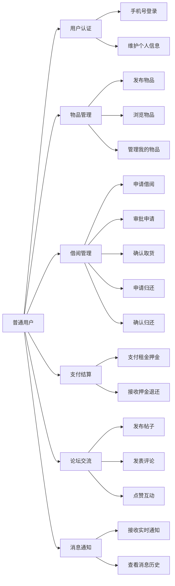
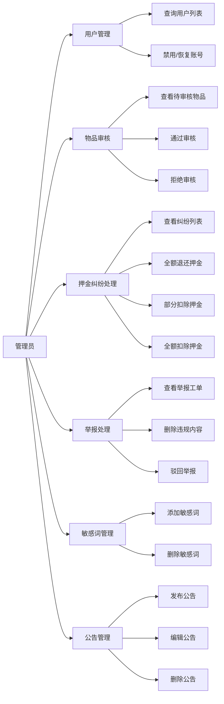

# 3.4 用例分析

## 3.4.1 普通用户用例

普通用户是平台的主要使用者，涵盖借入者、借出者和论坛参与者三种角色身份。如图 3.1 所示，普通用户用例图展示了用户与系统核心功能之间的交互关系。

图 3.1 普通用户用例图

**用例 UC01：手机号登录**

参与者：普通用户
前置条件：用户已安装浏览器并访问平台网址
基本流程：
1. 用户在登录页输入手机号
2. 系统校验手机号格式正确
3. 用户点击"获取验证码"按钮
4. 系统生成 6 位数字验证码并发送至用户手机
5. 用户输入收到的验证码
6. 用户点击"登录"按钮
7. 系统校验验证码正确且未过期
8. 系统查询用户记录，不存在则自动创建新用户
9. 系统生成 JWT 访问令牌和刷新令牌
10. 系统返回用户信息和令牌
11. 前端存储令牌并跳转至首页

扩展流程：
- 2a. 手机号格式错误：系统提示"请输入正确的手机号"
- 4a. 验证码发送失败：系统提示"发送失败，请稍后重试"
- 7a. 验证码错误：系统提示"验证码错误，请重新输入"
- 7b. 验证码过期：系统提示"验证码已过期，请重新获取"

后置条件：用户登录成功，可访问需要认证的功能

**用例 UC02：发布物品**

参与者：普通用户（物品所有者）
前置条件：用户已登录
基本流程：
1. 用户点击导航栏"发布"按钮
2. 系统展示物品发布表单
3. 用户填写物品名称、选择分类、输入描述
4. 用户上传物品图片（至少 1 张，最多 9 张）
5. 用户设置日租金和押金金额
6. 用户选择发布方式（立即发布或保存草稿）
7. 用户点击"提交"按钮
8. 系统校验必填字段完整
9. 系统执行敏感词检测
10. 系统保存物品记录，状态设为"待审核"
11. 系统返回发布成功提示

扩展流程：
- 8a. 必填字段缺失：系统提示"请完善物品信息"
- 9a. 命中敏感词：系统提示"内容包含敏感词，请修改后重试"
- 10a. 保存草稿：物品状态设为"草稿"，不进入审核流程

后置条件：物品创建成功，等待管理员审核

**用例 UC03：申请借阅**

参与者：普通用户（借入者）
前置条件：用户已登录，物品状态为"可借用"
基本流程：
1. 用户在物品详情页点击"申请借阅"按钮
2. 系统展示借阅申请表单
3. 用户选择借阅起止日期
4. 用户填写借阅用途
5. 用户勾选同意协议
6. 用户点击"提交申请"按钮
7. 系统校验日期合法性和用户信用分
8. 系统校验物品状态仍为"可借用"
9. 系统创建借阅记录，状态设为"申请中"
10. 系统更新物品状态为"借用中"
11. 系统向借出者发送审批通知
12. 系统返回申请成功提示

扩展流程：
- 7a. 信用分不足：系统提示"信用分不足，无法申请该物品"
- 8a. 物品状态变更：系统提示"物品已被他人申请，请刷新页面"
- 11a. 通知发送失败：记录失败日志，不影响主流程

后置条件：借阅申请提交成功，等待借出者审批

**用例 UC04：支付租金押金**

参与者：普通用户（借入者）
前置条件：借阅状态为"已批准"
基本流程：
1. 用户在借阅详情页点击"去支付"按钮
2. 系统展示支付确认页，显示金额明细
3. 用户确认金额无误后点击"立即支付"
4. 系统创建支付订单，调用支付宝接口
5. 系统返回支付宝支付表单
6. 前端渲染表单并自动提交跳转
7. 用户在支付宝页面完成支付
8. 支付宝异步通知系统支付成功
9. 系统验签并更新支付状态为"已支付"
10. 系统更新借阅状态为"借用中"
11. 系统向双方发送支付成功通知

扩展流程：
- 4a. 订单创建失败：系统提示"支付服务异常，请稍后重试"
- 8a. 异步通知延迟：前端定时查询支付状态，最多查询 10 次
- 8b. 支付失败：系统提示"支付失败，请重新支付"

后置条件：支付成功，借阅激活

**用例 UC05：发布帖子**

参与者：普通用户
前置条件：用户已登录
基本流程：
1. 用户在论坛页点击发布框
2. 系统展开完整编辑器
3. 用户选择帖子类型
4. 用户输入帖子内容
5. 用户可选上传图片和添加标签
6. 用户点击"发布"按钮
7. 系统执行敏感词检测
8. 系统保存帖子记录
9. 系统返回发布成功提示

扩展流程：
- 7a. 命中敏感词：系统提示"内容包含敏感词，请修改后重试"

后置条件：帖子发布成功，在论坛展示

## 3.4.2 管理员用例

管理员是平台的运营人员，负责内容审核、交易仲裁和系统管理。如图 3.2 所示，管理员用例图展示了管理员与后台功能之间的交互关系。

图 3.2 管理员用例图

**用例 UC06：物品审核**

参与者：管理员
前置条件：管理员已登录后台，存在待审核物品
基本流程：
1. 管理员进入"物品审核"页面
2. 系统展示待审核物品列表
3. 管理员点击某物品的"审核"按钮
4. 系统展示物品详情和审核操作区
5. 管理员查看物品信息和图片
6. 管理员选择"通过"或"拒绝"
7. 若选择拒绝，管理员填写拒绝原因
8. 管理员点击"确认"按钮
9. 系统更新物品状态
10. 系统记录审核日志
11. 系统向所有者发送审核结果通知
12. 系统返回操作成功提示

扩展流程：
- 6a. 物品信息不完整：管理员选择拒绝并注明原因
- 9a. 状态更新失败：系统提示"操作失败，请重试"

后置条件：物品审核完成，状态更新

**用例 UC07：押金纠纷仲裁**

参与者：管理员
前置条件：存在待处理的押金纠纷
基本流程：
1. 管理员进入"押金纠纷"页面
2. 系统展示纠纷列表
3. 管理员点击某纠纷的"处理"按钮
4. 系统展示纠纷详情，包括借阅信息、双方陈述和证据
5. 管理员查看支付记录和押金金额
6. 管理员选择处理方式：全额退还、部分扣除或全额扣除
7. 若选择部分扣除，管理员输入扣除金额和原因
8. 管理员点击"确认处理"按钮
9. 系统校验扣除金额不超过押金总额
10. 系统调用支付宝退款接口（如适用）
11. 系统更新纠纷状态为"已处理"
12. 系统向双方发送处理结果通知

扩展流程：
- 9a. 扣除金额超限：系统提示"扣除金额不能超过押金总额"
- 10a. 退款接口调用失败：系统记录失败，管理员可手动重试

后置条件：纠纷处理完成，资金操作执行

**用例 UC08：举报处理**

参与者：管理员
前置条件：存在待处理的举报工单
基本流程：
1. 管理员进入"举报处理"页面
2. 系统展示举报工单列表
3. 管理员点击某工单的"处理"按钮
4. 系统展示举报详情，包括举报原因和原内容
5. 管理员查看被举报的帖子或评论内容
6. 管理员选择处理方式：删除内容、驳回举报或转人工
7. 若选择删除内容，管理员填写删除原因
8. 管理员点击"确认"按钮
9. 系统执行处理决策
10. 系统更新举报状态
11. 系统向举报人发送处理结果通知
12. 系统返回操作成功提示

扩展流程：
- 6a. 内容确实违规：管理员选择删除内容
- 6b. 内容无违规：管理员选择驳回举报
- 6c. 情况复杂：管理员选择转人工，由上级处理

后置条件：举报处理完成，相关状态更新
