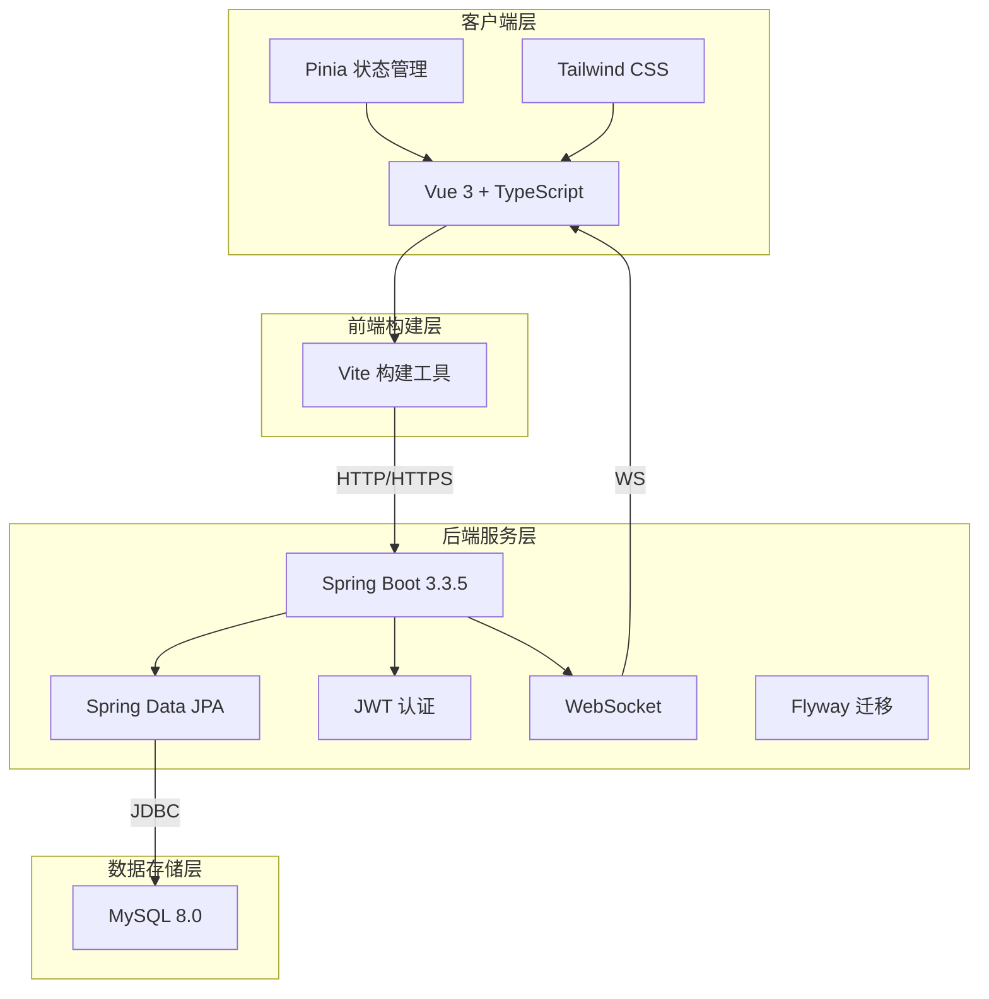
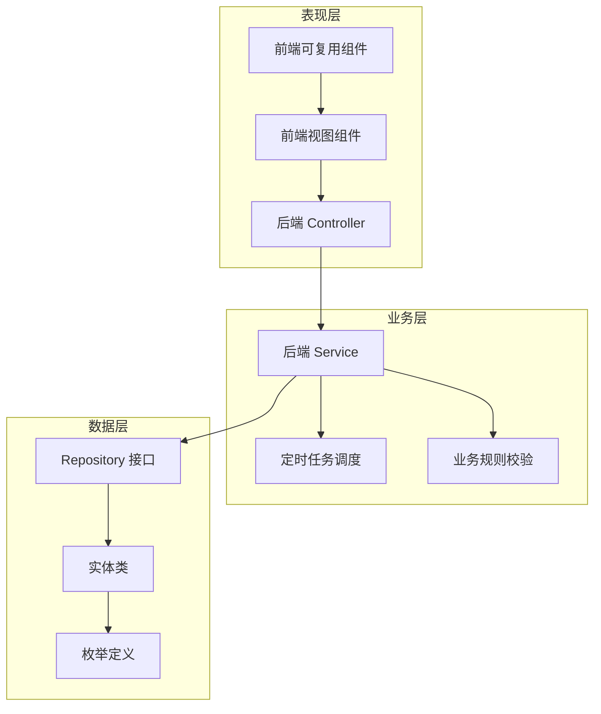
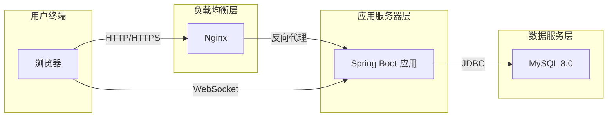

# 4.1 系统总体架构设计

## 4.1.1 系统架构概述

邻里共享平台采用前后端分离的B/S（Browser/Server）架构模式，整体系统架构分为前端展示层、后端服务层和数据存储层三个层次。系统设计遵循高内聚、低耦合的原则，各功能模块之间通过清晰定义的接口进行通信，便于后期维护和功能扩展。

本系统旨在为社区居民提供一个便捷的物品共享平台，用户可以通过手机号验证码或密码登录系统，浏览并搜索社区内的共享物品，发布自己的物品供他人借用，同时可以申请借用他人发布的物品。系统通过WebSocket技术实现实时消息推送，确保用户能够及时获取借阅申请、审批结果等重要通知。管理员后台提供用户管理、物品审核、纠纷处理等功能，保障平台的正常运营。

系统架构设计充分考虑了可扩展性和可维护性，后端采用Spring Boot框架提供的RESTful API规范设计接口，前端采用Vue 3框架构建单页应用，通过Pinia进行状态管理，实现了前后端的完全解耦。数据库采用MySQL 8.0，配合Flyway进行数据库版本管理，确保数据库结构的统一和可追溯。

## 4.1.2 技术架构设计

### 后端技术栈

后端采用Spring Boot 3.3.5作为核心框架，充分利用其自动配置和starter生态的优势，快速构建企业级应用。持久层使用Spring Data JPA，它提供了强大的ORM映射能力和Repository模式，简化了数据库操作。认证授权采用JWT（JSON Web Token）机制，通过jjwt 0.12.6库实现Token的生成和验证，确保用户身份的安全性和无状态性。实时通信采用WebSocket技术，实现服务器向客户端的主动推送，提升用户体验。数据库版本管理使用Flyway，它采用声明式迁移方式，确保数据库结构的一致性和可重复部署。

### 前端技术栈

前端采用Vue 3作为核心框架，充分利用其 Composition API 实现逻辑复用和代码组织。TypeScript为项目提供了强类型支持，有效提升了代码质量和开发效率。构建工具使用Vite，它基于ES模块实现快速的开发启动和热更新。状态管理采用Pinia，它是Vue官方推荐的状态管理库，API简洁直观。样式方案采用Tailwind CSS，它通过工具类的方式实现样式定制，提高了开发效率并保证了界面的一致性。

### 技术架构图

## 4.1.3 系统分层设计

本系统采用经典的三层架构设计，从上到下依次为表现层、业务层和数据层，每一层都有明确的职责边界，层与层之间通过接口进行通信，实现了高内聚低耦合的设计目标。

### 表现层设计

表现层负责处理用户界面交互和请求转发。在前端侧，表现层由Vue 3组件构成，包括页面视图组件和可复用组件两类。页面视图组件对应具体的业务页面，如首页、详情页、发布页等；可复用组件如导航栏、图片上传器、评价弹窗等，可在多个页面中重复使用。前端通过Axios库发送HTTP请求到后端接口，并通过WebSocket与后端建立长连接，接收实时推送消息。在后端侧，表现层由Controller类组成，负责接收前端请求、参数校验、调用业务层服务、并将处理结果封装为响应返回给前端。

### 业务层设计

业务层是系统的核心逻辑处理层，位于表现层和数据层之间。在后端侧，业务层由Service类组成，负责处理具体的业务逻辑，如用户认证、物品管理、借阅流程、消息推送等。Service层调用Repository层完成数据持久化操作，同时处理业务规则校验和事务管理。业务层还包含定时任务调度模块，用于处理逾期提醒等后台任务。业务层的设计遵循单一职责原则，每个Service类专注于某一类业务领域，保持代码的清晰性和可维护性。

### 数据层设计

数据层负责数据的持久化和查询操作。在后端侧，数据层由Repository接口和实体类组成。Repository接口继承Spring Data JPA提供的JpaRepository接口，自动实现了常用的CRUD操作，同时可以通过方法命名规则或@Query注解实现复杂的自定义查询。实体类采用JPA注解映射数据库表结构，通过@OneToMany、@ManyToOne等注解定义实体间的关联关系。数据层还包含枚举类，用于定义业务相关的常量，如物品状态、借阅状态等，提高代码的可读性和可维护性。

### 系统分层架构图

## 4.1.4 系统部署架构

系统采用前后端分离的部署方式，后端服务部署在Tomcat服务器上，前端构建产物部署在Nginx服务器上。这种部署方式有利于前后端的独立开发和独立扩展，提高了系统的灵活性和可维护性。

### 部署架构设计

### 部署说明

在前端部署方面，前端项目通过Vite构建后生成静态文件，这些静态文件部署在Nginx服务器上。Nginx作为Web服务器和反向代理服务器，负责处理静态资源的请求，并将API请求转发到后端服务。Nginx还可以配置SSL证书，实现HTTPS加密传输，保障数据传输安全。

在后端部署方面，Spring Boot应用打包为JAR文件后，可以直接通过java -jar命令运行，也可以部署在外部Tomcat服务器上。后端服务监听8080端口，接受来自Nginx转发的HTTP请求和来自前端的WebSocket连接。

在数据库部署方面，MySQL 8.0数据库部署在专门的数据库服务器上，应用服务器通过网络访问数据库。数据库使用Flyway进行版本管理，每次应用启动时自动检查并执行数据库迁移脚本，确保数据库结构与应用代码保持一致。

### 环境配置

| 环境 | 前端地址 | 后端地址 | 数据库 |
|-----|---------|---------|-------|
| 开发环境 | http://localhost:5173 | http://localhost:8080 | localhost:3306 |
| 生产环境 | http://domain.com | http://domain.com:8080 | 远程数据库 |
