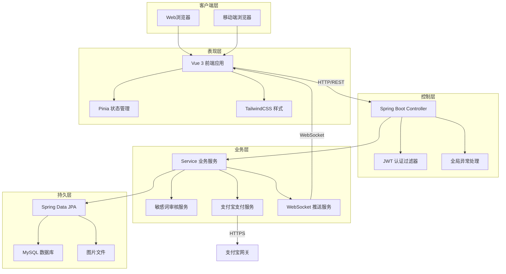
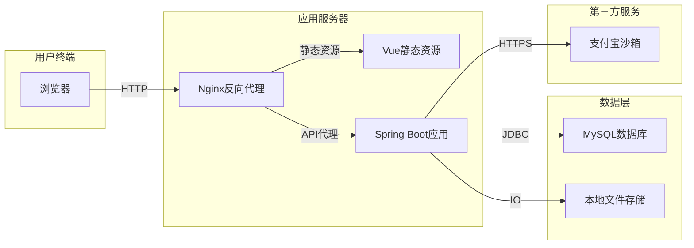

# 4.1 系统总体架构设计

## 4.1.1 系统架构选型

邻里共享平台采用前后端分离的B/S架构模式，该架构将用户界面与业务逻辑彻底解耦，前端专注于交互体验，后端专注于数据处理和业务规则。前后端通过RESTful API进行通信，数据交换格式采用JSON。此架构具备以下优势：开发团队可并行工作，提升开发效率；前后端技术栈独立演进，便于技术升级；服务端渲染压力降低，可通过CDN加速静态资源；移动端适配成本较低，同一套后端接口可支撑多终端应用。

系统整体技术选型如下：前端采用Vue 3组合式API配合TypeScript，利用Vite构建工具提升开发体验，状态管理使用Pinia，样式方案采用TailwindCSS原子化CSS框架；后端采用Spring Boot 3.3.5作为基础框架，数据持久层使用Spring Data JPA，数据库采用MySQL 8.0，数据库版本管理使用Flyway；实时通信采用WebSocket协议，在线支付接入支付宝沙箱环境，身份认证采用JWT无状态令牌机制。

## 4.1.2 技术架构图

如图4.1所示，系统采用经典的分层架构，自顶向下划分为表现层、控制层、业务层和持久层，各层职责单一且通过明确定义的接口进行交互。

图4.1 系统分层架构图

表现层由Vue 3单页应用构成，负责页面渲染、用户交互和状态管理。通过Vue Router实现前端路由控制，Pinia管理全局用户状态和消息通知状态，Axios封装HTTP请求并统一处理认证令牌和错误响应。

控制层基于Spring Boot构建RESTful API，采用Controller接收前端请求，通过JWT过滤器完成身份认证，利用全局异常处理器统一封装错误响应。该层仅负责请求转发和参数校验，不包含业务逻辑。

业务层是系统的核心，封装所有业务规则和流程控制。包括用户认证服务、物品管理服务、借阅流程服务、支付结算服务、论坛内容服务、消息推送服务等。各服务之间通过接口调用协作，敏感操作通过Spring声明式事务保证数据一致性。

持久层使用Spring Data JPA访问MySQL数据库，通过Repository接口定义数据访问契约，实体映射采用注解方式。图片等二进制资源存储于本地文件系统，数据库中仅保存相对路径。

## 4.1.3 部署架构图

如图4.2所示，系统部署采用单机集中式架构，适用于开发测试环境和初期生产环境。

图4.2 系统部署架构图

Nginx作为反向代理服务器，承担静态资源服务和API请求转发职责。前端构建后的静态文件部署于Nginx目录，后端Spring Boot应用以独立进程运行，两者通过Nginx实现统一入口和跨域处理。MySQL数据库与应用于同一服务器部署，通过本地连接访问。支付宝沙箱作为外部支付网关，通过HTTPS协议进行安全通信。

该部署架构具备部署简单、运维成本低的特点。随着用户规模增长，可平滑演进为分布式架构：前端资源接入CDN加速，后端应用水平扩展为多实例，数据库采用主从复制分离读写，文件存储迁移至对象存储服务。
