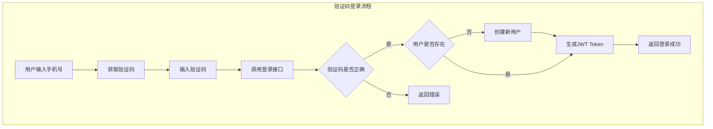
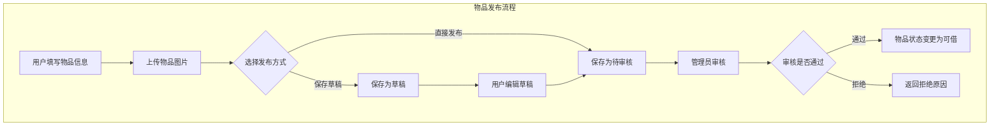
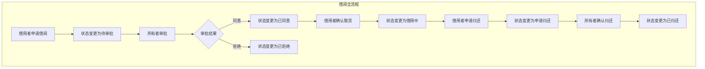
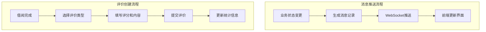
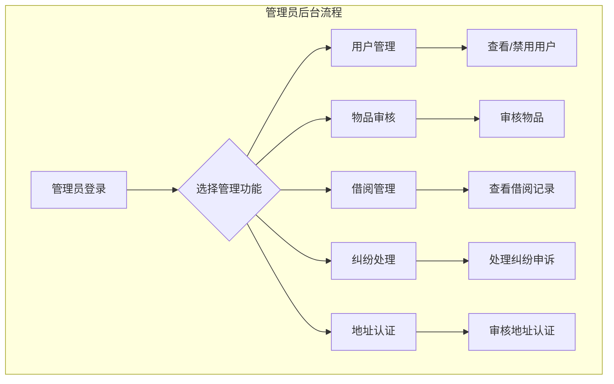

# 4.2 功能模块设计

本章将对邻里共享平台的各个功能模块进行详细设计说明，包括用户认证模块、物品管理模块、借阅管理模块、消息通知与评价模块和管理员后台模块。每个模块的设计说明将包含模块功能描述、模块架构设计和模块流程设计三个方面。

## 4.2.1 用户认证模块

### 模块功能描述

用户认证模块是整个系统的基础模块，负责用户的注册、登录和身份验证功能。该模块支持两种登录方式：手机号验证码登录和密码登录。手机号验证码登录适用于快速体验场景，用户只需输入手机号和收到的验证码即可完成登录，系统会自动为新用户创建账号。密码登录适用于需要更高安全性的场景，用户注册时设置密码，后续可通过手机号和密码进行登录。模块还提供JWT Token的生成和验证机制，确保用户身份的安全性和请求的无状态性。

### 模块架构设计

用户认证模块采用Spring Security框架与JWT相结合的方式实现认证功能。模块架构分为三个层次：认证入口层、认证服务层和数据访问层。认证入口层由AuthController类组成，负责接收前端的认证请求，包括登录请求、注册请求、验证码发送请求等。认证服务层由AuthService类组成，负责具体的认证逻辑处理，包括验证码生成与验证、用户信息校验、密码加密与比对、JWT Token生成等。数据访问层由UserRepository接口和User实体类组成，负责用户数据的持久化和查询。

### 模块流程设计

用户认证模块的核心流程包括注册流程、验证码登录流程和密码登录流程。以下分别介绍这三种流程的设计。

注册流程设计如下：用户首先调用验证码发送接口，系统验证手机号格式后生成6位数字验证码，验证码有效期为5分钟。验证码以模拟方式输出（实际开发中可对接短信服务），用户输入验证码后调用注册接口。系统验证验证码正确性后，创建新用户记录并返回登录成功信息和JWT Token。

验证码登录流程设计如下：用户输入手机号和验证码，调用验证码登录接口。系统验证手机号格式和验证码正确性，查询用户是否存在。若用户不存在则自动创建新用户，若用户存在则直接返回登录成功信息和JWT Token。

密码登录流程设计如下：用户输入手机号和密码，调用密码登录接口。系统验证手机号格式，查询用户是否存在且密码是否匹配。若验证通过则返回登录成功信息和JWT Token，若验证失败则返回错误信息。

## 4.2.2 物品管理模块

### 模块功能描述

物品管理模块是系统的核心业务模块之一，负责物品的发布、编辑、查询和下架等功能。用户可以将自己拥有的物品发布到平台上供他人借用，物品信息包括名称、描述、分类、图片、所属社区等。物品发布支持草稿功能，用户可以将未完善的物品信息保存为草稿，后续继续编辑后发布。物品管理还包括搜索和筛选功能，用户可以通过关键词搜索物品，也可以按照分类、社区等条件进行筛选。物品所有者可以随时查看、编辑或下架自己发布的物品。

### 模块架构设计

物品管理模块采用Service-Repository模式进行设计。模块架构分为三个层次：接口层、服务层和数据层。接口层由ItemController类组成，负责接收前端的物品管理请求，包括物品列表查询、物品详情查询、物品创建、物品更新、物品下架等。服务层由ItemService接口及其实现类ItemServiceImpl组成，负责具体的业务逻辑处理，包括物品数据组装、业务规则校验、物品状态管理等。数据层由ItemRepository接口、Item实体类和相关的DTO类组成，负责物品数据的持久化和查询。

### 模块流程设计

物品管理模块的核心流程包括物品发布流程、物品查询流程和物品下架流程。

物品发布流程设计如下：用户填写物品信息，包括名称、描述、分类、社区等，并上传物品图片。系统验证必填字段和数据有效性，将物品信息保存为草稿状态或直接发布。若选择直接发布，物品进入待审核状态，等待管理员审核；若选择保存草稿，物品保持草稿状态，用户可后续编辑后发布。审核通过后，物品状态变更为可借（AVAILABLE），用户可以在平台上浏览和借用。

物品查询流程设计如下：用户通过首页或搜索页面查询物品，系统支持按分类查询、按社区查询和关键词搜索三种方式。系统根据查询条件从数据库中检索符合条件的物品，返回分页后的物品列表。物品列表仅显示状态为可借的物品，已借出或已下架的物品不在列表中展示。

物品下架流程设计如下：物品所有者发起下架请求，系统验证操作权限后，将物品状态变更为已下架（OFFLINE）。已下架的物品不在平台列表中展示，但已有的借阅记录不受影响。

## 4.2.3 借阅管理模块

### 模块功能描述

借阅管理模块是系统的核心业务模块之一，负责管理物品的借阅全过程。该模块支持借用者发起借阅申请、物品所有者审批借阅申请、借阅双方确认取货和归还等核心功能。借阅流程从借用者提交借阅申请开始，经过物品所有者审批、双方确认取货、借用期间、申请归还、确认归还等阶段，形成完整的借阅闭环。模块还提供待处理借阅列表功能，帮助用户快速查看需要处理的借阅事项。模块设计了并发控制机制，防止同一物品被多人同时借用。

### 模块架构设计

借阅管理模块采用Service-Repository模式进行设计，同时引入了状态机概念管理借阅状态。模块架构分为三个层次：接口层、服务层和数据层。接口层由BorrowController类组成，负责接收前端的借阅管理请求，包括创建借阅申请、审批借阅申请、确认取货、申请归还、确认归还等。服务层由BorrowService类组成，负责具体的业务逻辑处理，包括借阅状态流转、业务规则校验、并发控制、消息推送触发等。数据层由BorrowRepository接口、Borrow实体类和相关的DTO类组成，负责借阅数据的持久化和查询。

### 模块流程设计

借阅管理模块的核心流程包括借阅申请流程、借阅审批流程和借阅归还流程。

借阅申请流程设计如下：借用者在物品详情页面点击借用按钮，选择借用开始日期、结束日期和借用用途，提交借阅申请。系统验证物品当前状态为可借、申请日期合法、用户未申请过该物品等条件，创建借阅记录并向物品所有者发送新申请通知。借阅状态变更为待审批（PENDING）。

借阅审批流程设计如下：物品所有者在待处理列表中查看借阅申请，可以选择同意或拒绝申请。若同意申请，系统使用原子更新操作将物品状态变更为已借出（BORROWED），同时将借阅状态变更为已同意（APPROVED），并通知借用者。若拒绝申请，借阅状态变更为已拒绝（REJECTED），物品状态保持可借，并通知借用者。审批过程中采用并发控制机制，确保同一物品不会被多人同时借用。

借阅归还流程设计如下：借用者在借用期满前申请归还，提交归还请求，借阅状态变更为申请归还（RETURN_REQUESTED）。物品所有者确认收到归还后，将借阅状态变更为已归还（RETURNED），同时将物品状态恢复为可借（AVAILABLE），整个借阅流程完成。

## 4.2.4 消息通知与评价模块

### 模块功能描述

消息通知与评价模块整合了消息推送和评价管理两项功能，为用户提供及时的业务通知和信任评价服务。

消息通知功能负责向用户推送各类业务通知，确保用户能够及时了解借阅申请、审批结果等重要信息。该功能采用WebSocket技术实现实时消息推送，相比传统的轮询方式具有低延迟、低资源消耗的优势。消息类型包括新借阅申请通知、借阅申请通过通知、借阅申请拒绝通知、归还申请通知、归还确认通知等。功能还提供消息列表查询、消息已读标记等能力。

评价功能用于构建社区信任机制，借用者和物品所有者可以在借阅完成后相互评价。评价类型分为物品评价和用户评价两类：物品评价用于记录借用者对物品质量和使用体验的评价；用户评价用于记录双方对彼此租借行为的评价。评价内容包含评分和文字评价两部分，系统根据评分计算物品评分和用户信誉度。

### 模块架构设计

消息通知与评价模块采用分层架构设计，整合了消息推送和评价管理两套子系统。

消息通知子系统架构分为四个层次：消息生成层在各个业务模块中触发，如BorrowService在借阅状态变更时生成相应的消息；消息存储层由MessageService和MessageRepository组成，负责消息的持久化存储；消息推送层由WebSocketPushService和WebSocketConfig组成，负责管理和维护WebSocket连接，以及向客户端推送消息；消息接收层在前端实现，通过WebSocket客户端接收和处理服务器推送的消息。

评价子系统架构分为三个层次：接口层由ReviewController类组成，负责接收前端的评价请求；服务层由ReviewService类组成，负责具体的业务逻辑处理，包括评价数据组装、评价有效性校验、评分计算等；数据层由ReviewRepository接口、Review实体类和相关的DTO类组成，负责评价数据的持久化和查询。

### 模块流程设计

消息通知与评价模块的核心流程包括消息推送流程和评价创建流程。

消息推送流程设计如下：当借阅状态发生变更时，业务服务层调用消息服务创建消息记录。消息记录包含消息类型、接收者ID、关联的业务ID、消息内容等信息。消息创建后，WebSocketPushService根据消息类型和接收者ID，从WebSocketSession管理器中获取对应的用户连接，向该连接发送消息内容。前端WebSocket客户端接收到消息后，根据消息类型进行相应的界面更新，如显示角标、弹出提示等。

评价创建流程设计如下：借阅完成后，系统提示用户进行评价。用户选择评价类型（物品评价或用户评价），填写评分和评价内容，提交评价请求。系统验证评价有效性，包括用户是否参与该借阅、是否已评价过该对象等。验证通过后创建评价记录，并根据评价结果更新相关统计信息。

## 4.2.5 管理员后台模块

### 模块功能描述

管理员后台模块为平台运营者提供系统管理功能，包括用户管理、物品审核、借阅管理、纠纷处理和地址认证等子模块。用户管理功能支持查看用户列表、禁用/启用用户账号等操作。物品审核功能支持对待审核物品进行审批操作。借阅管理功能支持查看所有借阅记录。纠纷处理功能支持处理用户提交的借阅纠纷申诉。地址认证功能支持审核用户提交的小区认证申请。

### 模块架构设计

管理员后台模块采用Service-Repository模式进行设计，同时使用权限控制确保只有管理员角色才能访问。模块架构分为三个层次：接口层、服务层和数据层。接口层由AdminController类组成，负责接收管理员的操作请求。服务层由AdminService类组成，负责具体的业务逻辑处理。数据层由各个Repository接口和实体类组成，负责数据的持久化和查询。

### 模块流程设计

管理员后台模块的核心流程包括物品审核流程和纠纷处理流程。

物品审核流程设计如下：用户发布物品后，物品进入待审核状态。管理员在后台查看待审核物品列表，审核物品信息是否合规。若审核通过，物品状态变更为可借；若审核拒绝，物品状态保持原状态，平台通知用户审核结果。

纠纷处理流程设计如下：借阅双方在借阅过程中产生纠纷时，用户可以提交纠纷申诉。管理员在后台查看纠纷列表，了解纠纷详情后进行调解。管理员可以选择支持某一方、拒绝申诉或给出其他处理方案。处理结果通知纠纷双方，相关的借阅记录和物品状态根据处理方案进行相应调整。

