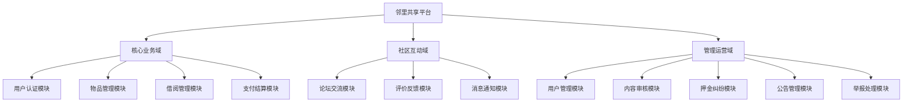

# 4.2 系统功能模块设计

## 4.2.1 模块划分总览

如图4.3所示，系统功能模块划分为三大域：核心业务域、社区互动域和管理运营域。核心业务域支撑平台的基础共享流程，社区互动域促进用户之间的交流联结，管理运营域保障平台内容质量和交易安全。

图4.3 系统功能模块结构图

各模块的职责边界和协作关系如表4.1所示。

表4.1 功能模块职责说明

| 模块名称 | 所属域 | 核心职责 | 协作模块 |
|---------|--------|---------|---------|
| 用户认证模块 | 核心业务 | 用户注册、登录、身份认证、个人信息维护 | 所有模块 |
| 物品管理模块 | 核心业务 | 物品发布、编辑、上下架、图片管理、分类检索 | 借阅管理、支付结算 |
| 借阅管理模块 | 核心业务 | 借阅申请、审批、取货确认、归还确认、逾期提醒 | 物品管理、支付结算、消息通知 |
| 支付结算模块 | 核心业务 | 租金计算、支付宝下单、异步回调、押金退还 | 借阅管理、押金纠纷 |
| 论坛交流模块 | 社区互动 | 帖子发布、评论回复、点赞互动、内容标签 | 消息通知、内容审核 |
| 评价反馈模块 | 社区互动 | 双向评分、评价标签、信用分计算 | 用户认证、借阅管理 |
| 消息通知模块 | 社区互动 | WebSocket实时推送、消息列表、已读标记 | 借阅管理、论坛交流 |
| 用户管理模块 | 管理运营 | 用户列表查询、账号状态管理、权限控制 | 用户认证 |
| 内容审核模块 | 管理运营 | 敏感词过滤、自动审核、人工复核 | 物品管理、论坛交流 |
| 押金纠纷模块 | 管理运营 | 纠纷申请、证据提交、仲裁处理、扣款退款 | 支付结算、借阅管理 |
| 公告管理模块 | 管理运营 | 公告发布、编辑、展示、过期下线 | 论坛交流 |
| 举报处理模块 | 管理运营 | 举报提交、工单分配、处理反馈、结果通知 | 论坛交流、内容审核 |

## 4.2.2 用户认证模块设计

用户认证模块负责平台所有用户的身份识别和权限控制。该模块提供手机号验证码登录和密码登录两种方式，新用户首次登录时自动完成注册流程。登录成功后服务端生成JWT令牌返回给前端，后续请求通过HTTP头部携带该令牌进行身份认证。

模块内部包含用户注册、用户登录、令牌刷新、个人信息查询、个人信息修改、头像上传等子功能。用户实体包含手机号、昵称、头像、所属社区、楼栋信息、信用分等属性。信用分基于历史借阅记录和评价反馈动态计算，影响物品借用权限。

## 4.2.3 物品管理模块设计

物品管理模块是平台的核心资源管理单元，负责共享物品的全生命周期管理。物品状态包括草稿、待审核、可借用、借用中、已下架和已删除六种，状态之间通过特定业务操作进行流转。

模块提供物品发布、草稿保存、信息编辑、主动下架、删除等功能。物品信息包含名称、分类、描述、故事、租金单价、押金金额、信用分要求、归还要求、标签等。图片支持多图上传，存储于本地文件系统，数据库记录相对路径。物品列表支持关键词搜索、分类筛选、社区筛选和排序方式切换。

## 4.2.4 借阅管理模块设计

借阅管理模块实现物品共享的核心业务流程，连接借入者和借出者完成完整的借用闭环。模块内部维护严谨的状态机，确保每个操作在正确的状态下才能执行。

借阅状态包括：申请中、已批准、借用中、归还待确认、已归还、已拒绝和已取消。状态流转规则如下：用户提交申请后进入申请中状态；借出者审批通过后进入已批准状态，此时触发支付流程；支付完成后进入借用中状态；借入者发起归还申请后进入归还待确认状态；借出者确认归还后进入已归还状态，此时触发押金退还。

模块还提供提醒归还功能，借出者可向借入者发送归还提醒，系统限制每日提醒次数防止骚扰。

## 4.2.5 支付结算模块设计

支付结算模块处理借阅流程中的资金往来，采用支付宝沙箱环境模拟真实支付场景。支付类型分为租金和押金两部分，租金根据借阅天数和日租金计算，押金由物品发布时设定。

支付流程如下：借阅审批通过后，借入者发起支付请求，服务端创建支付订单并调用支付宝接口生成支付表单；前端渲染表单并跳转至支付宝页面完成支付；支付成功后支付宝异步通知服务端，服务端验签并更新订单状态，同时激活借阅记录；物品归还确认后，借出者发起押金退还，服务端调用支付宝退款接口完成资金退回。

模块内部维护支付订单的完整状态：待支付、已支付、退款中、已退款、支付关闭。通过幂等性设计防止重复支付和重复退款。

## 4.2.6 论坛交流模块设计

论坛交流模块为社区用户提供情感联结和信息分享的场所。帖子支持四种类型：日常分享、感谢信、求助和技能交换，每种类型对应不同的社区场景。

帖子发布时经过敏感词自动检测，包含敏感词的内容将被拦截并记录审核日志。帖子列表支持最新排序和最热排序，可按类型筛选。帖子详情页展示完整内容、图片、标签、点赞数和评论数，同时自动累加浏览量。

评论系统支持嵌套回复结构，一级评论直接关联帖子，二级回复关联一级评论。点赞功能采用Toggle模式，同一接口完成点赞和取消点赞操作，自动同步点赞计数。

## 4.2.7 消息通知模块设计

消息通知模块基于WebSocket协议实现服务端到客户端的实时推送。当借阅状态变更、收到新评论、被点赞等事件发生时，服务端主动推送消息给相关用户。

消息类型包括：借阅申请通知、申请审批通知、支付提醒、归还提醒、评论回复通知、系统公告等。未读消息在导航栏显示角标，用户进入消息中心后可标记已读。

模块还包含定时任务，每日早晨检查即将逾期和已逾期的借阅记录，自动发送提醒通知给相关双方。

## 4.2.8 管理运营模块设计

管理运营模块为平台管理员提供内容治理和交易仲裁能力，包含五个子模块：

用户管理子模块提供用户列表查询、账号状态管理功能，支持禁用违规账号和恢复正常账号。

内容审核子模块基于敏感词库实现自动过滤，支持敏感词的增删改查。新发布的物品和帖子经过自动检测，命中敏感词的内容被拦截进入人工复核队列。

押金纠纷子模块处理借阅完成后的资金争议。借入者或借出者可发起纠纷申请，提交证据和索赔金额，管理员审核后进行仲裁处理，支持全额退还、部分扣款和全额扣除三种处理结果。

公告管理子模块支持社区公告的发布、编辑和删除，公告展示于论坛侧边栏，点击可查看详情。

举报处理子模块接收用户对帖子内容的举报，生成处理工单分配给管理员，管理员可删除违规内容或驳回无效举报，处理结果通知举报人。
