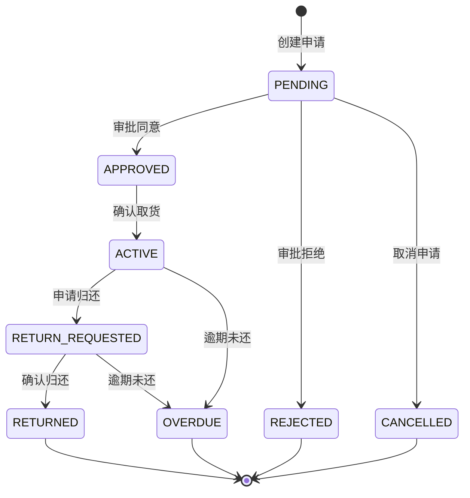

# 4.3 接口设计

本章将对邻里共享平台的接口设计进行详细说明，包括接口设计原则、各功能模块的接口清单和关键接口的详细设计。系统采用RESTful API风格设计接口，确保接口的简洁性、一致性和可扩展性。

## 4.3.1 接口设计原则

### 总体设计原则

系统接口设计遵循以下原则，确保接口的易用性和可维护性：

统一响应格式原则：所有接口采用统一的响应格式，包含状态码、消息和数据三个部分。前端可以通过统一的方式解析所有接口的响应，降低前端处理复杂度。响应格式采用ApiResponse包装类，成功的响应包含code为0和数据对象，失败的响应包含非零code和错误消息。

RESTful风格原则：接口URL采用RESTful风格，使用HTTP方法表达操作语义。GET方法用于查询资源，POST方法用于创建资源，PUT方法用于更新资源，DELETE方法用于删除资源。URL路径使用名词复数形式表示资源集合，如/api/items表示物品资源集合。

版本管理原则：接口URL包含版本号，如/api/v1/items，便于后续版本迭代和兼容。版本号放置在路径开头，如/api/v1/，后续升级可通过增加版本号实现平滑过渡。

安全认证原则：除公开接口外，其他接口需要通过JWT Token进行身份认证。Token通过HTTP Header的Authorization字段传递，格式为"Bearer {token}"。敏感操作如用户信息修改需要额外的权限验证。

### 数据格式规范

系统接口采用JSON作为数据交换格式。在处理特殊字段如数组类型时，遵循以下规范：

前端发送数据时：对于List类型字段，前端需要将数组转换为JSON字符串后再发送。例如，物品的标签字段tags应使用JSON.stringify(['标签1', '标签2'])转换为字符串后发送。

后端返回数据时：后端从数据库读取JSON字符串后，解析为List再返回给前端。前端接收到的直接是解析后的数组，可直接使用。

图片路径格式：图片路径存储相对路径格式，如items/uuid.jpg，而非完整URL。前端需要拼接基础URL后才能显示图片。

## 4.3.2 认证接口

### 接口清单

认证模块提供以下接口：

| 接口路径 | HTTP方法 | 功能说明 | 认证要求 |
|---------|---------|---------|---------|
| /api/auth/verify-code | POST | 发送验证码 | 公开 |
| /api/auth/login/phone | POST | 手机号验证码登录 | 公开 |
| /api/auth/login/password | POST | 密码登录 | 公开 |
| /api/auth/register | POST | 用户注册 | 公开 |
| /api/auth/logout | POST | 用户登出 | 需要 |
| /api/auth/me | GET | 获取当前用户信息 | 需要 |

### 验证码登录接口

验证码登录接口用于通过手机号和验证码完成快速登录，适用于新用户首次登录场景。

请求路径：POST /api/auth/login/phone

请求参数：

```json
{
  "phone": "13800138000",
  "verifyCode": "123456"
}
```

响应格式：

```json
{
  "code": 0,
  "message": "success",
  "data": {
    "token": "eyJhbGciOiJIUzI1NiJ9...",
    "userId": 1,
    "nickname": "用户昵称",
    "avatar": "/avatar/default.jpg"
  }
}
```

接口逻辑说明：首先验证手机号格式是否合法，然后验证验证码是否正确。若验证码正确且用户已存在，返回登录成功信息和JWT Token；若用户不存在，则自动创建新用户后返回登录成功信息。

### 密码登录接口

密码登录接口用于通过手机号和密码完成登录，适用于需要更高安全性的场景。

请求路径：POST /api/auth/login/password

请求参数：

```json
{
  "phone": "13800138000",
  "password": "password123"
}
```

响应格式：与验证码登录接口相同，返回JWT Token和用户基本信息。

接口逻辑说明：首先验证手机号格式是否合法，然后根据手机号查询用户并验证密码是否匹配。若验证通过，返回登录成功信息和JWT Token；若验证失败，返回错误信息。

## 4.3.3 物品接口

### 接口清单

物品管理模块提供以下接口：

| 接口路径 | HTTP方法 | 功能说明 | 认证要求 |
|---------|---------|---------|---------|
| /api/items | GET | 获取物品列表 | 公开 |
| /api/items/search | GET | 搜索物品 | 公开 |
| /api/items/{id} | GET | 获取物品详情 | 公开 |
| /api/items | POST | 发布物品 | 需要 |
| /api/items/{id} | PUT | 更新物品 | 需要 |
| /api/items/{id}/withdraw | PUT | 下架物品 | 需要 |
| /api/items/{id} | DELETE | 删除物品 | 需要 |
| /api/items/draft | POST | 保存草稿 | 需要 |
| /api/items/{id}/similar | GET | 获取相似物品 | 公开 |

### 物品列表接口

物品列表接口用于分页获取可借物品列表，支持按分类和社区筛选。

请求路径：GET /api/items

请求参数：

| 参数名 | 类型 | 必填 | 说明 |
|-------|------|-----|------|
| communityId | Long | 否 | 社区ID筛选 |
| categoryId | Long | 否 | 分类ID筛选 |
| page | Integer | 否 | 页码，从0开始，默认0 |
| size | Integer | 否 | 每页数量，默认10 |

响应格式：

```json
{
  "code": 0,
  "message": "success",
  "data": {
    "content": [
      {
        "id": 1,
        "name": "物品名称",
        "description": "物品描述",
        "pricePerDay": 10.00,
        "images": ["items/uuid1.jpg"],
        "ownerNickname": "所有者昵称",
        "ownerAvatar": "/avatar/default.jpg",
        "categoryName": "分类名称",
        "communityName": "小区名称"
      }
    ],
    "totalElements": 100,
    "totalPages": 10,
    "number": 0,
    "size": 10
  }
}
```

### 物品搜索接口

物品搜索接口用于通过关键词搜索物品。

请求路径：GET /api/items/search

请求参数：

| 参数名 | 类型 | 必填 | 说明 |
|-------|------|-----|------|
| keyword | String | 是 | 搜索关键词 |
| page | Integer | 否 | 页码，默认0 |
| size | Integer | 否 | 每页数量，默认10 |

### 物品发布接口

物品发布接口用于创建新的物品记录。

请求路径：POST /api/items

请求参数：

```json
{
  "name": "博世电钻",
  "categoryId": 1,
  "communityId": 1,
  "description": "9成新，功能完好",
  "pricePerDay": 15.00,
  "deposit": 100.00,
  "creditRequired": 7.5,
  "returnRequirements": "[\"已消毒\", \"保持原样\"]",
  "tags": "[\"专业工具\", \"露营\"]",
  "images": ["items/uuid1.jpg", "items/uuid2.jpg"]
}
```

其中，returnRequirements和tags字段需要使用JSON.stringify转换为JSON字符串后发送。

## 4.3.4 借阅接口

### 接口清单

借阅管理模块提供以下接口：

| 接口路径 | HTTP方法 | 功能说明 | 认证要求 |
|---------|---------|---------|---------|
| /api/borrows/{id} | GET | 获取借阅详情 | 需要 |
| /api/borrows | POST | 创建借阅申请 | 需要 |
| /api/borrows/{id}/approve | POST | 审批借阅申请 | 需要 |
| /api/borrows/{id}/pickup | POST | 确认取货 | 需要 |
| /api/borrows/{id}/return | POST | 确认归还 | 需要 |
| /api/borrows/{id}/cancel | POST | 取消借阅 | 需要 |
| /api/borrows/{id}/apply-return | POST | 申请归还 | 需要 |
| /api/borrows/{id}/remind | POST | 提醒归还 | 需要 |
| /api/borrows/my/borrowed | GET | 我的借入列表 | 需要 |
| /api/borrows/my/lent | GET | 我的借出列表 | 需要 |
| /api/borrows/my/pending | GET | 待审批列表 | 需要 |

### 创建借阅申请接口

创建借阅申请接口用于向物品所有者发起借用请求。

请求路径：POST /api/borrows

请求参数：

```json
{
  "itemId": 1,
  "startDate": "2024-01-15",
  "endDate": "2024-01-20",
  "purpose": "装修需要借用"
}
```

响应格式：

```json
{
  "code": 0,
  "message": "success",
  "data": {
    "borrowId": 1,
    "status": "PENDING"
  }
}
```

接口逻辑说明：系统验证物品当前状态为可借、申请日期合法、用户未申请过该物品等条件后，创建借阅记录并返回借阅ID和状态。创建成功后，系统向物品所有者发送WebSocket消息通知。

### 审批借阅申请接口

审批借阅申请接口用于物品所有者对借阅申请进行同意或拒绝操作。

请求路径：POST /api/borrows/{id}/approve

请求参数：

```json
{
  "approved": true,
  "message": "同意借用，请按时取货"
}
```

响应格式：

```json
{
  "code": 0,
  "message": "success",
  "data": {
    "status": "APPROVED"
  }
}
```

接口逻辑说明：审批时采用原子更新操作，确保在并发情况下同一物品不会被多人同时借用。更新物品状态为已借出，然后将借阅状态变更为已同意或已拒绝，最后通过WebSocket通知借用者审批结果。

### 借阅状态流转图



## 4.3.5 消息接口

### 接口清单

消息通知模块提供以下接口：

| 接口路径 | HTTP方法 | 功能说明 | 认证要求 |
|---------|---------|---------|---------|
| /api/messages | GET | 获取消息列表 | 需要 |
| /api/messages/unread | GET | 获取未读消息 | 需要 |
| /api/messages/unread-count | GET | 获取未读数量 | 需要 |
| /api/messages/{id}/read | POST | 标记已读 | 需要 |
| /api/messages/read-all | POST | 全部标记已读 | 需要 |

### 消息列表接口

消息列表接口用于分页获取用户的消息记录。

请求路径：GET /api/messages

请求参数：

| 参数名 | 类型 | 必填 | 说明 |
|-------|------|-----|------|
| page | Integer | 否 | 页码，默认0 |
| size | Integer | 否 | 每页数量，默认10 |

响应格式：

```json
{
  "code": 0,
  "message": "success",
  "data": {
    "content": [
      {
        "id": 1,
        "type": "NEW_BORROW_APPLY",
        "title": "新借阅申请",
        "content": "用户张三申请借用您的电钻",
        "isRead": false,
        "relatedId": 1,
        "createdAt": "2024-01-15T10:30:00"
      }
    ],
    "totalElements": 50,
    "totalPages": 5
  }
}
```

消息类型说明：NEW_BORROW_APPLY表示新借阅申请通知，REQUEST_APPROVED表示申请已通过通知，REQUEST_REJECTED表示申请已拒绝通知，RETURN_REQUESTED表示申请归还通知，BORROW_RETURNED表示归还已确认通知。

## 4.3.6 管理接口

### 接口清单

管理员后台模块提供以下接口：

| 接口路径 | HTTP方法 | 功能说明 | 认证要求 |
|---------|---------|---------|---------|
| /api/admin/stats | GET | 获取统计数据 | 管理员 |
| /api/admin/users | GET | 用户列表 | 管理员 |
| /api/admin/users/{id}/ban | POST | 禁用用户 | 管理员 |
| /api/admin/users/{id}/unban | POST | 启用用户 | 管理员 |
| /api/admin/items/pending-review | GET | 待审核物品 | 管理员 |
| /api/admin/items | GET | 物品列表 | 管理员 |
| /api/admin/items/{id}/audit | POST | 审核物品 | 管理员 |
| /api/admin/borrows | GET | 借阅列表 | 管理员 |
| /api/admin/disputes | GET | 纠纷列表 | 管理员 |
| /api/admin/disputes/{id}/resolve | POST | 处理纠纷 | 管理员 |
| /api/admin/address-verifies | GET | 地址认证列表 | 管理员 |
| /api/admin/address-verifies/{userId} | POST | 审批地址认证 | 管理员 |

### 统计数据接口

统计数据接口用于获取平台运营统计数据。

请求路径：GET /api/admin/stats

响应格式：

```json
{
  "code": 0,
  "message": "success",
  "data": {
    "totalUsers": 1000,
    "totalItems": 500,
    "totalBorrows": 2000,
    "pendingReviews": 10,
    "pendingDisputes": 5,
    "pendingAddressVerifies": 8
  }
}
```

### 物品审核接口

物品审核接口用于管理员对待审核物品进行审批操作。

请求路径：POST /api/admin/items/{id}/audit

请求参数：

```json
{
  "action": "approve",
  "reason": ""
}
```

action参数支持approve（通过）和reject（拒绝）两种值。拒绝时reason为必填，用于告知用户拒绝原因。
