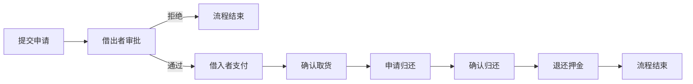
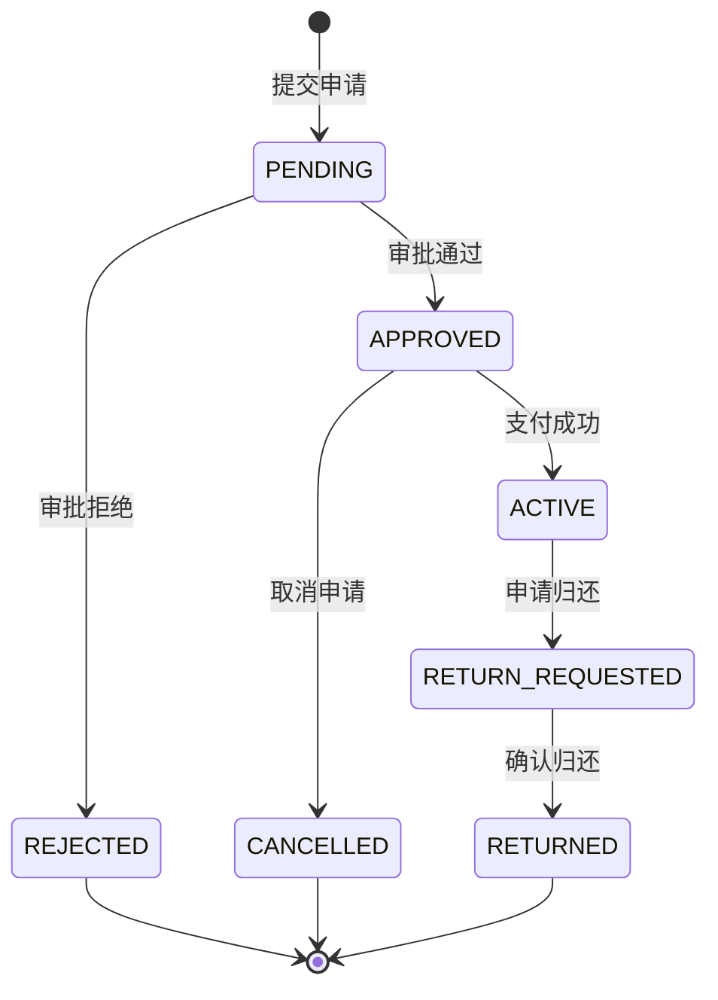
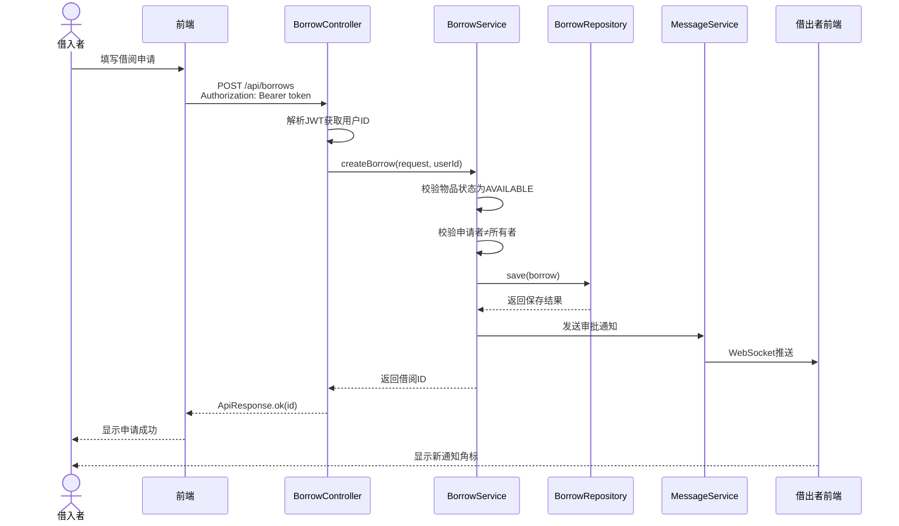
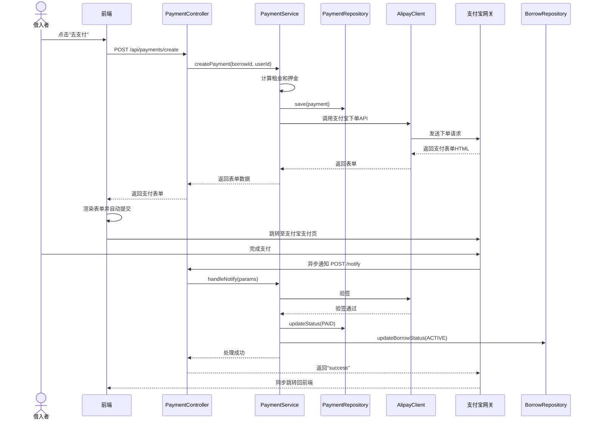
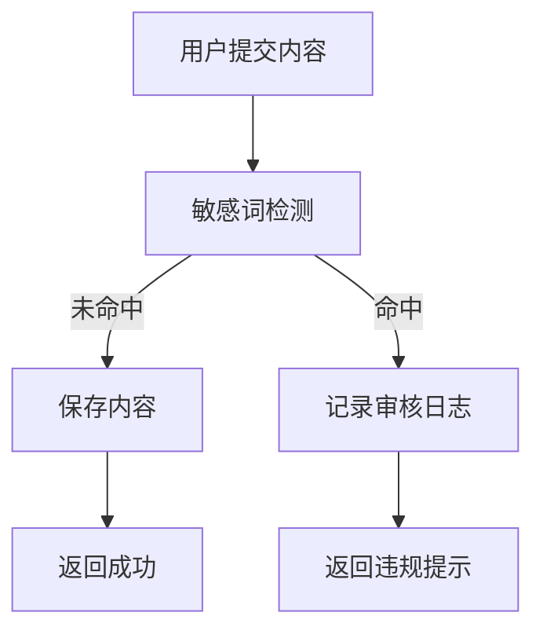
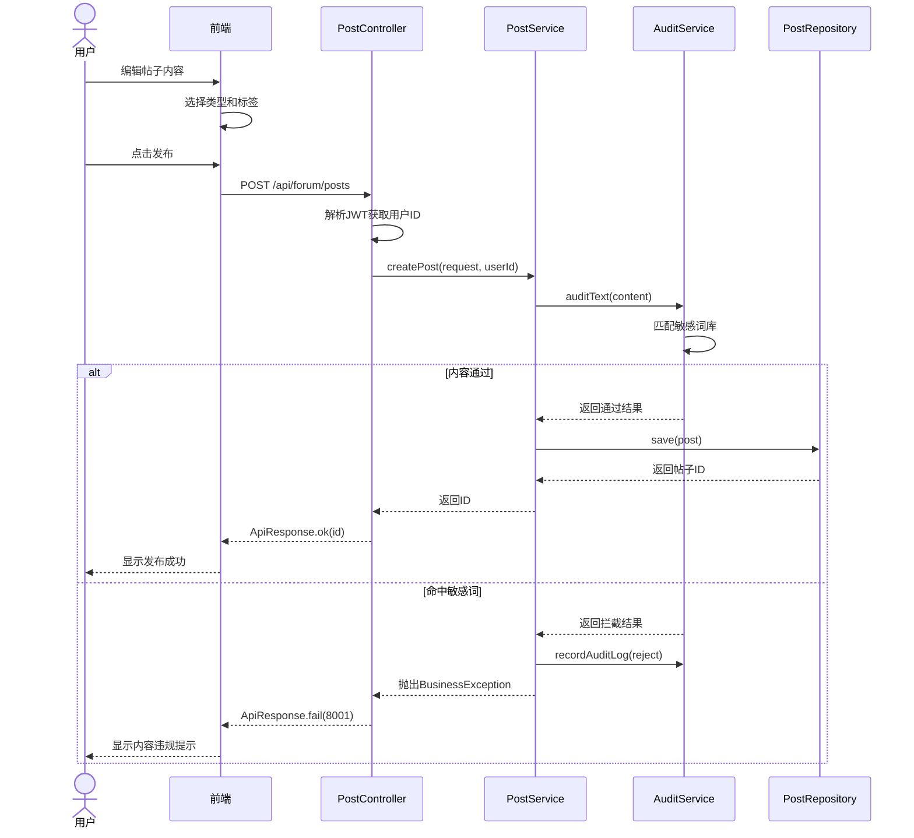
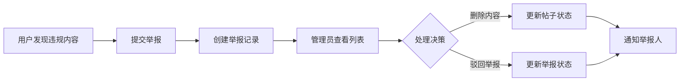
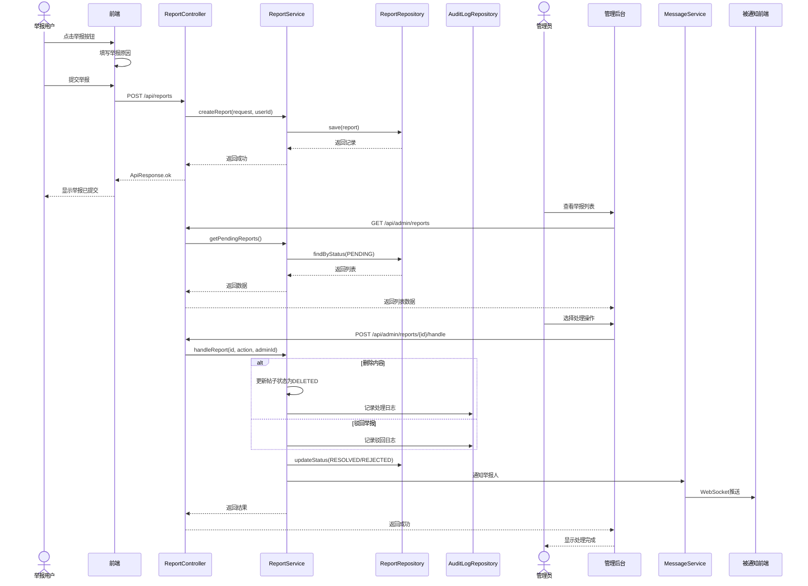
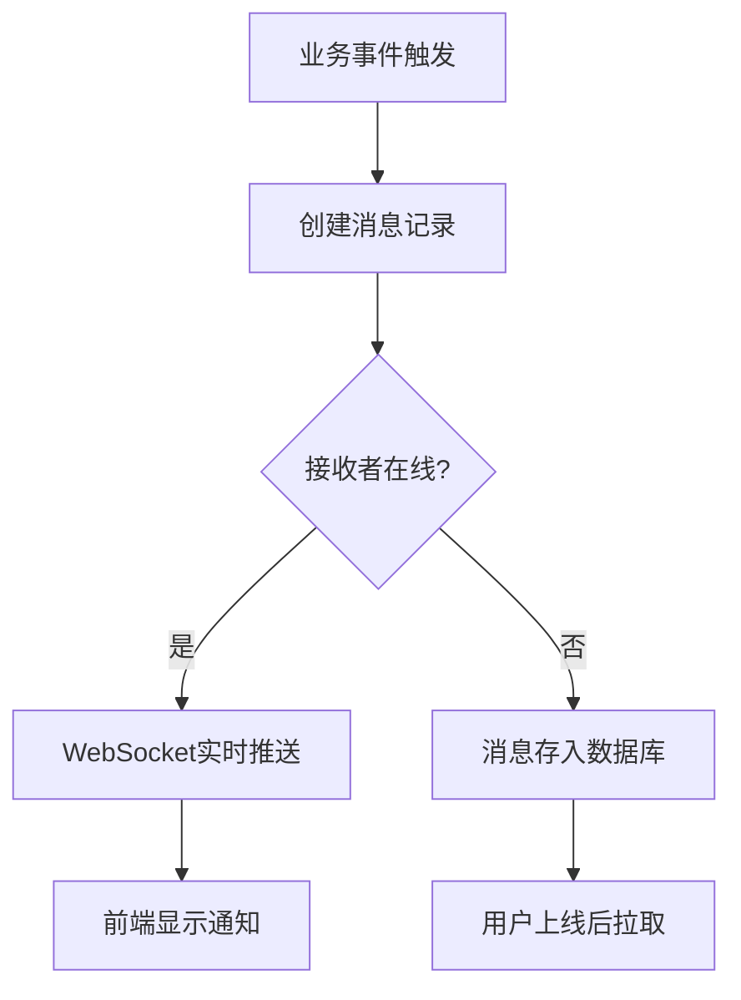
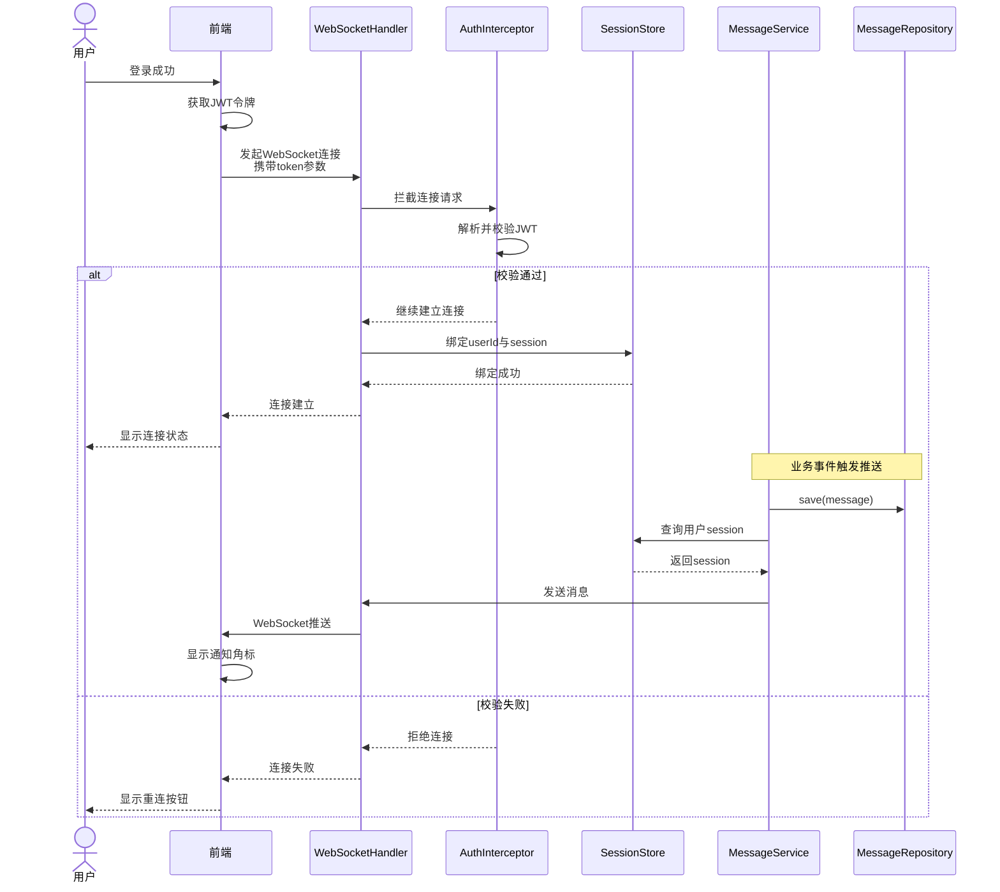

# 4.3 核心业务流程与时序设计

## 4.3.1 借阅管理流程设计

借阅管理是平台最核心的业务流程，涉及借入者、借出者、支付系统和消息通知等多个参与方。如图4.4所示，该流程由六个连续阶段构成完整的借用闭环。

图4.4 借阅管理整体流程图

每个阶段存在严格的前置条件校验。提交申请阶段校验物品状态必须为可借用，且申请者不能是物品所有者。审批阶段校验操作者必须是物品所有者。支付阶段校验借阅状态必须为已批准，且支付金额大于零。确认归还阶段校验借阅状态必须为归还待确认，且操作者为物品所有者。

如图4.5所示，借阅状态在数据库层面维护，各状态之间的合法转换关系通过状态机进行约束。

图4.5 借阅状态机转换图

如图4.6所示，借阅申请时序图展示了借入者提交申请到借出者完成审批的完整交互过程。前端首先携带JWT令牌提交申请数据，Controller解析当前用户身份后调用Service创建借阅记录，Service校验物品状态和所有者关系，通过校验后保存记录并发送审批通知给借出者。

图4.6 借阅申请时序图

如图4.7所示，支付流程时序图展示了从创建支付订单到异步回调处理的完整资金交互。借阅审批通过后，借入者触发支付，服务端创建支付订单并调用支付宝接口生成支付表单，前端渲染表单跳转至支付宝页面。用户完成支付后，支付宝服务端异步通知应用服务端，服务端验签通过后更新支付状态和借阅状态。

图4.7 支付流程时序图

## 4.3.2 论坛内容发布流程设计

论坛内容发布流程包含敏感词自动检测机制，确保社区内容符合规范。如图4.8所示，用户提交帖子或评论后，内容首先经过敏感词审核服务检测，通过检测的内容正常保存并展示，命中敏感词的内容被拦截并记录审核日志，同时向用户返回内容违规提示。

图4.8 内容发布审核流程图

如图4.9所示，帖子发布时序图展示了从用户编辑内容到帖子成功创建或拦截的完整交互。用户在前端编辑器输入内容并选择类型标签，前端提交至PostController，Controller调用PostService处理业务逻辑，Service首先调用敏感词审核服务进行内容检测，通过后将帖子保存至数据库并返回成功响应。

图4.9 帖子发布时序图

## 4.3.3 举报处理流程设计

举报处理流程连接普通用户和管理员，形成内容治理的闭环。如图4.10所示，用户在浏览帖子时发现违规内容可提交举报，填写举报原因后创建举报记录。管理员在后台查看待处理举报列表，点击处理后可选择删除违规内容或驳回无效举报，处理结果同步更新举报记录状态并通知举报人。

图4.10 举报处理流程图

如图4.11所示，举报处理时序图展示了从用户提交举报到管理员完成处理的完整交互链路。用户在前端点击帖子举报按钮，填写举报原因后提交至ReportController，Controller创建举报记录并保存。管理员在后台页面查询待处理列表，选择处理操作后更新举报记录和帖子状态，同时通过消息服务通知举报人处理结果。

图4.11 举报处理时序图

## 4.3.4 消息通知推送流程设计

消息通知模块采用WebSocket协议实现服务端主动推送。如图4.12所示，当业务事件发生时，消息服务创建通知记录并查询接收者在线状态，若接收者在线则通过WebSocket连接实时推送，若离线则消息保留至数据库待用户上线后拉取。

图4.12 消息通知推送流程图

如图4.13所示，WebSocket连接建立时序图展示了客户端从发起连接到完成身份认证的完整握手过程。客户端首先发起WebSocket连接请求，服务端拦截器从URL参数中提取JWT令牌进行校验，校验通过后建立持久连接并将用户ID与Session绑定，后续服务端可通过该Session向指定用户推送消息。

图4.13 WebSocket连接建立时序图
