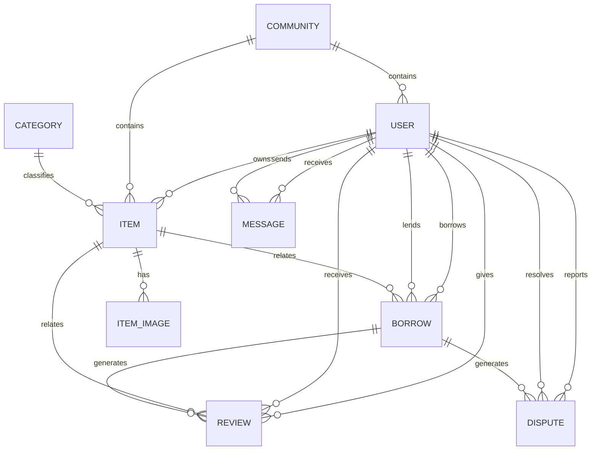

# 4.4 数据库设计

本章将对邻里共享平台的数据库设计进行详细说明，包括数据库设计原则、实体关系图（ER图）和核心表结构设计。数据库采用MySQL 8.0，使用Flyway进行版本管理，确保数据库结构的一致性和可追溯性。

## 4.4.1 数据库设计原则

### 总体设计原则

系统数据库设计遵循以下原则，确保数据存储的高效性、完整性和可扩展性：

规范化与反规范化结合原则：数据库设计首先遵循第三范式（3NF），消除数据冗余，保证数据一致性。在性能敏感的场景下，如查询统计数据时，可适当进行反规范化处理，提高查询效率。

主键设计原则：所有表使用BIGINT类型自增主键，具有唯一性和有序性。主键命名统一使用id，便于代码生成和数据库操作。

索引设计原则：针对常用查询条件创建索引，如用户表的手机号索引、物品表的分类和状态索引等。对于文本搜索字段创建FULLTEXT索引，提高全文搜索效率。

外键约束原则：表之间通过外键建立关联关系，使用ON DELETE SET NULL或ON DELETE CASCADE策略处理级联删除。对于可能频繁删除的关联数据，使用逻辑删除而非物理删除。

时间戳原则：所有表包含created_at和updated_at两个时间戳字段，记录数据的创建时间和最后更新时间，便于数据审计和问题排查。

### 数据类型选择

数据库字段类型选择遵循以下原则：字符串类型根据实际长度选择VARCHAR或TEXT，VARCHAR用于固定长度或有限长度的字符串，TEXT用于长文本内容。数值类型根据数值范围选择合适的类型，如TINYINT用于状态码、INT用于普通计数、DECIMAL用于金额。日期类型根据是否需要时间选择DATE或TIMESTAMP。

## 4.4.2 实体关系（ER图）

### 核心实体

系统包含以下核心实体：用户（User）、物品（Item）、借阅记录（Borrow）、消息（Message）、评价（Review）、社区（Community）、分类（Category）、纠纷（Dispute）。各实体之间存在如下关联关系。

### 实体关系图

### 实体说明

用户与物品为一对多关系，一个用户可以拥有多件物品。用户与借阅记录存在两种关系：作为借入者和作为借出者，均为一对多关系。用户与评价存在两种关系：作为评价者和作为被评价者，均为一对多关系。用户与消息存在两种关系：作为发送者和作为接收者，均为一对多关系。

社区与用户为一对多关系，一个社区可以包含多个用户。社区与物品为一对多关系，一个社区可以包含多件物品。分类与物品为一对多关系，一个分类可以包含多件物品。

物品与物品图片为一对多关系，一个物品可以包含多张图片。物品与借阅记录为一对多关系，一件物品可以有多条借阅记录。物品与评价为一对多关系，一件物品可以有多条评价。

借阅记录与评价为一对多关系，一条借阅记录可以生成多条评价。借阅记录与纠纷为一对多关系，一条借阅记录可以产生多条纠纷记录。

## 4.4.3 核心表结构设计

### 用户表（users）

用户表存储平台用户的基本信息，包括手机号、密码、昵称、头像、个人简介、所属社区、信用分数等字段。

| 字段名 | 数据类型 | 约束 | 说明 |
|-------|---------|------|------|
| id | BIGINT | PRIMARY KEY | 用户ID |
| phone | VARCHAR(20) | NOT NULL, UNIQUE | 手机号 |
| password | VARCHAR(255) | NULL | 密码（加密存储） |
| nickname | VARCHAR(50) | NULL | 昵称 |
| avatar | VARCHAR(500) | NULL | 头像URL |
| bio | VARCHAR(500) | NULL | 个人简介 |
| community_id | BIGINT | NULL, FK | 所属社区ID |
| building | VARCHAR(50) | NULL | 楼栋 |
| unit | VARCHAR(20) | NULL | 单元 |
| credit_score | DECIMAL(4,2) | DEFAULT 10.00 | 信用分(0-10) |
| borrow_count | INT | DEFAULT 0 | 借入次数 |
| lend_count | INT | DEFAULT 0 | 借出次数 |
| co2_saved | INT | DEFAULT 0 | 碳减排量(克) |
| status | VARCHAR(20) | DEFAULT 'ACTIVE' | 状态: ACTIVE/BANNED/DELETED |
| role | VARCHAR(20) | DEFAULT 'USER' | 角色: USER/ADMIN |
| created_at | TIMESTAMP | DEFAULT CURRENT_TIMESTAMP | 创建时间 |
| updated_at | TIMESTAMP | DEFAULT CURRENT_TIMESTAMP ON UPDATE | 更新时间 |

该表索引包括：手机号唯一索引（idx_phone）、社区ID索引（idx_community）、信用分索引（idx_credit）、角色索引（idx_role）。

### 物品表（items）

物品表存储平台物品的基本信息，包括名称、分类、描述、价格、押金、状态、标签等字段。

| 字段名 | 数据类型 | 约束 | 说明 |
|-------|---------|------|------|
| id | BIGINT | PRIMARY KEY | 物品ID |
| name | VARCHAR(100) | NOT NULL | 物品名称 |
| category_id | BIGINT | NULL, FK | 分类ID |
| description | TEXT | NULL | 物品描述 |
| story | TEXT | NULL | 背后的故事 |
| owner_id | BIGINT | NOT NULL, FK | 所有者ID |
| community_id | BIGINT | NULL, FK | 所在社区ID |
| building | VARCHAR(50) | NULL | 楼栋 |
| price_per_day | DECIMAL(10,2) | DEFAULT 0.00 | 每日租金 |
| deposit | DECIMAL(10,2) | DEFAULT 0.00 | 押金 |
| credit_required | DECIMAL(3,2) | DEFAULT 0.00 | 信用要求 |
| return_requirements | TEXT | NULL | 归还要求(JSON数组字符串) |
| status | VARCHAR(20) | DEFAULT 'DRAFT' | 状态 |
| audit_remark | VARCHAR(500) | NULL | 审核备注 |
| audited_at | TIMESTAMP | NULL | 审核时间 |
| version | INT | DEFAULT 0 | 乐观锁版本号 |
| borrow_count | INT | DEFAULT 0 | 借阅次数 |
| view_count | INT | DEFAULT 0 | 浏览次数 |
| favorite_count | INT | DEFAULT 0 | 收藏次数 |
| tags | VARCHAR(500) | NULL | 标签(JSON数组字符串) |
| created_at | TIMESTAMP | DEFAULT CURRENT_TIMESTAMP | 创建时间 |
| updated_at | TIMESTAMP | DEFAULT CURRENT_TIMESTAMP ON UPDATE | 更新时间 |
| published_at | TIMESTAMP | NULL | 发布时间 |

物品状态枚举说明：DRAFT表示草稿状态，PENDING_REVIEW表示待审核状态，AVAILABLE表示可借状态，BORROWED表示已借出状态，OFFLINE表示已下架状态，DELETED表示已删除状态。

该表索引包括：所有者ID索引（idx_owner）、分类ID索引（idx_category）、社区ID索引（idx_community）、状态索引（idx_status）、创建时间索引（idx_created）、名称和描述的全文索引（idx_name_desc）。

### 物品图片表（item_images）

物品图片表存储物品的 图片信息，支持一个物品多张图片。

| 字段名 | 数据类型 | 约束 | 说明 |
|-------|---------|------|------|
| id | BIGINT | PRIMARY KEY | 图片ID |
| item_id | BIGINT | NOT NULL, FK | 物品ID |
| url | VARCHAR(500) | NOT NULL | 图片URL |
| is_main | BOOLEAN | DEFAULT FALSE | 是否主图 |
| sort_order | INT | DEFAULT 0 | 排序 |
| created_at | TIMESTAMP | DEFAULT CURRENT_TIMESTAMP | 创建时间 |

### 借阅记录表（borrows）

借阅记录表存储借阅全过程的信息，包括借阅双方、物品、借阅时间、状态等字段。

| 字段名 | 数据类型 | 约束 | 说明 |
|-------|---------|------|------|
| id | BIGINT | PRIMARY KEY | 借阅ID |
| item_id | BIGINT | NOT NULL, FK | 物品ID |
| borrower_id | BIGINT | NOT NULL, FK | 借入者ID |
| lender_id | BIGINT | NOT NULL, FK | 借出者ID |
| start_date | DATE | NOT NULL | 开始日期 |
| end_date | DATE | NOT NULL | 结束日期 |
| actual_return_date | DATE | NULL | 实际归还日期 |
| purpose | VARCHAR(500) | NULL | 用途说明 |
| status | VARCHAR(20) | DEFAULT 'PENDING' | 状态 |
| reject_reason | VARCHAR(500) | NULL | 拒绝原因 |
| remind_count | INT | DEFAULT 0 | 提醒次数 |
| last_remind_at | TIMESTAMP | NULL | 最后提醒时间 |
| created_at | TIMESTAMP | DEFAULT CURRENT_TIMESTAMP | 创建时间 |
| updated_at | TIMESTAMP | DEFAULT CURRENT_TIMESTAMP ON UPDATE | 更新时间 |

借阅状态枚举说明：PENDING表示待审批状态，APPROVED表示已同意状态，ACTIVE表示借用中状态，RETURN_REQUESTED表示申请归还状态，RETURNED表示已归还状态，REJECTED表示已拒绝状态，CANCELLED表示已取消状态，OVERDUE表示已逾期状态。

该表索引包括：物品ID索引（idx_item）、借入者ID索引（idx_borrower）、借出者ID索引（idx_lender）、状态索引（idx_status）、日期范围索引（idx_dates）。

### 消息表（messages）

消息表存储用户接收和发送的消息记录，包括消息类型、标题、内容、关联业务ID等字段。

| 字段名 | 数据类型 | 约束 | 说明 |
|-------|---------|------|------|
| id | BIGINT | PRIMARY KEY | 消息ID |
| from_user_id | BIGINT | NULL, FK | 发送者ID |
| to_user_id | BIGINT | NOT NULL, FK | 接收者ID |
| type | VARCHAR(20) | NOT NULL | 类型 |
| title | VARCHAR(200) | NULL | 标题 |
| content | TEXT | NULL | 内容 |
| related_id | BIGINT | NULL | 关联ID |
| is_read | BOOLEAN | DEFAULT FALSE | 是否已读 |
| created_at | TIMESTAMP | DEFAULT CURRENT_TIMESTAMP | 创建时间 |

消息类型枚举说明：SYSTEM表示系统消息，BORROW表示借阅相关消息，CHAT表示聊天消息。

### 评价表（reviews）

评价表存储用户之间的评价记录，包括评价者、被评价者、评分、内容等字段。

| 字段名 | 数据类型 | 约束 | 说明 |
|-------|---------|------|------|
| id | BIGINT | PRIMARY KEY | 评价ID |
| borrow_id | BIGINT | NOT NULL, FK | 借阅ID |
| from_user_id | BIGINT | NOT NULL, FK | 评价者ID |
| to_user_id | BIGINT | NOT NULL, FK | 被评价者ID |
| item_id | BIGINT | NOT NULL, FK | 物品ID |
| type | VARCHAR(20) | NOT NULL | 评价类型 |
| rating | INT | NOT NULL | 评分(1-5) |
| content | TEXT | NULL | 评价内容 |
| created_at | TIMESTAMP | DEFAULT CURRENT_TIMESTAMP | 创建时间 |

评价类型枚举说明：ITEM表示物品评价，USER表示用户评价。

### 纠纷表（disputes）

纠纷表存储借阅过程中产生的纠纷记录，包括举报人、纠纷原因、处理结果等字段。

| 字段名 | 数据类型 | 约束 | 说明 |
|-------|---------|------|------|
| id | BIGINT | PRIMARY KEY | 纠纷ID |
| borrow_id | BIGINT | NOT NULL, FK | 借阅ID |
| reporter_id | BIGINT | NOT NULL, FK | 举报人ID |
| reason | VARCHAR(500) | NOT NULL | 纠纷原因 |
| status | VARCHAR(20) | DEFAULT 'PENDING' | 状态 |
| resolution | VARCHAR(500) | NULL | 处理结果 |
| resolved_by | BIGINT | NULL, FK | 处理人ID |
| resolved_at | TIMESTAMP | NULL | 处理时间 |
| created_at | TIMESTAMP | DEFAULT CURRENT_TIMESTAMP | 创建时间 |
| updated_at | TIMESTAMP | DEFAULT CURRENT_TIMESTAMP ON UPDATE | 更新时间 |

纠纷状态枚举说明：PENDING表示待处理状态，INVESTIGATING表示调查中状态，RESOLVED表示已解决状态，DISMISSED表示已驳回状态。

### 社区表（communities）

社区表存储社区的基本信息，包括名称、地址等字段。

| 字段名 | 数据类型 | 约束 | 说明 |
|-------|---------|------|------|
| id | BIGINT | PRIMARY KEY | 社区ID |
| name | VARCHAR(100) | NOT NULL | 社区名称 |
| address | VARCHAR(255) | NULL | 详细地址 |
| created_at | TIMESTAMP | DEFAULT CURRENT_TIMESTAMP | 创建时间 |
| updated_at | TIMESTAMP | DEFAULT CURRENT_TIMESTAMP ON UPDATE | 更新时间 |

### 分类表（categories）

分类表存储物品的分类信息，包括名称、图标、排序等字段。

| 字段名 | 数据类型 | 约束 | 说明 |
|-------|---------|------|------|
| id | BIGINT | PRIMARY KEY | 分类ID |
| name | VARCHAR(50) | NOT NULL | 分类名称 |
| icon | VARCHAR(100) | NULL | 图标标识 |
| sort_order | INT | DEFAULT 0 | 排序 |
| created_at | TIMESTAMP | DEFAULT CURRENT_TIMESTAMP | 创建时间 |

### 数据库表汇总

| 表名 | 说明 | 主键 | 外键数 |
|-----|------|------|-------|
| users | 用户表 | id | 0 |
| communities | 社区表 | id | 0 |
| categories | 分类表 | id | 0 |
| items | 物品表 | id | 3 |
| item_images | 物品图片表 | id | 1 |
| borrows | 借阅记录表 | id | 3 |
| messages | 消息表 | id | 2 |
| reviews | 评价表 | id | 4 |
| disputes | 纠纷表 | id | 3 |
| posts | 帖子表 | id | 2 |
| comments | 评论表 | id | 3 |
| likes | 点赞表 | id | 1 |
| announcements | 公告表 | id | 1 |
| skill_exchanges | 技能交换表 | id | 2 |

### 数据库版本管理

系统使用Flyway进行数据库版本管理，通过SQL脚本定义数据库结构的变更。每次应用启动时，Flyway自动检查数据库版本并执行未执行的迁移脚本，确保数据库结构与应用代码保持一致。

| 版本号 | 说明 |
|-------|------|
| V1 | 初始化表结构 |
| V2 | 初始化数据 |
| V3 | 评价表更新 |
| V4 | 评价索引 |
| V5 | 管理员和纠纷表 |
| V6 | 地址认证状态 |
| V7 | 物品表乐观锁版本号 |
