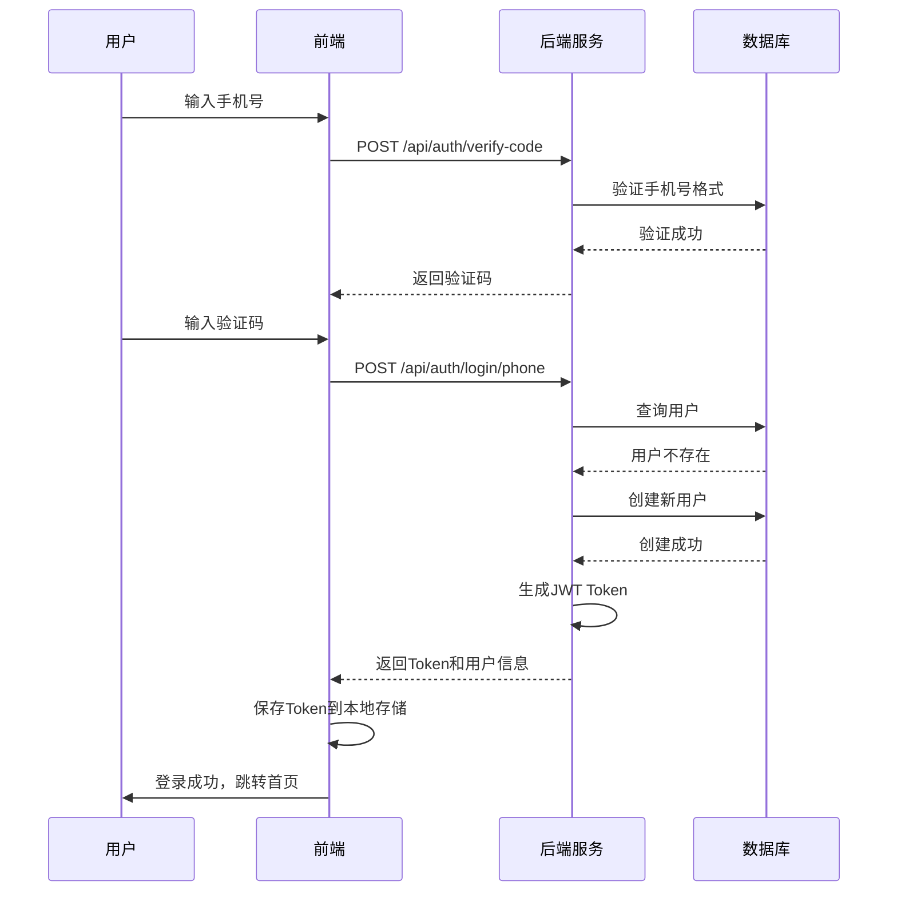
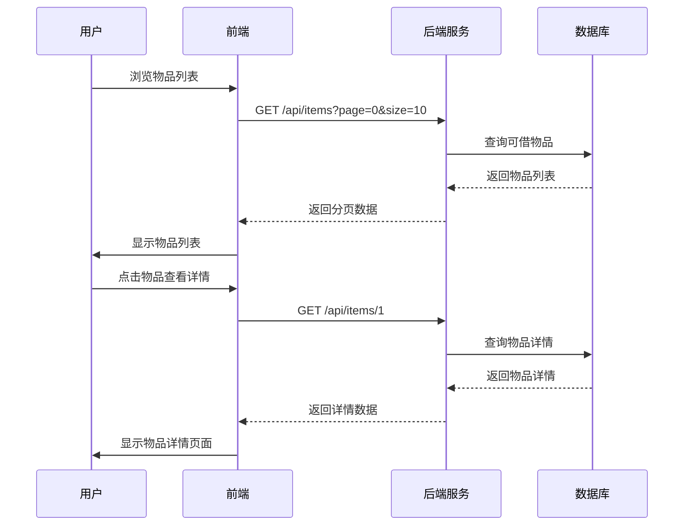
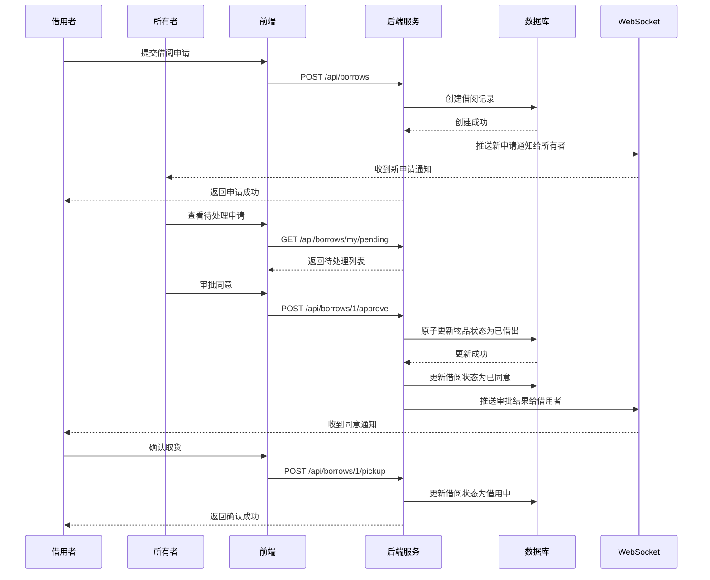
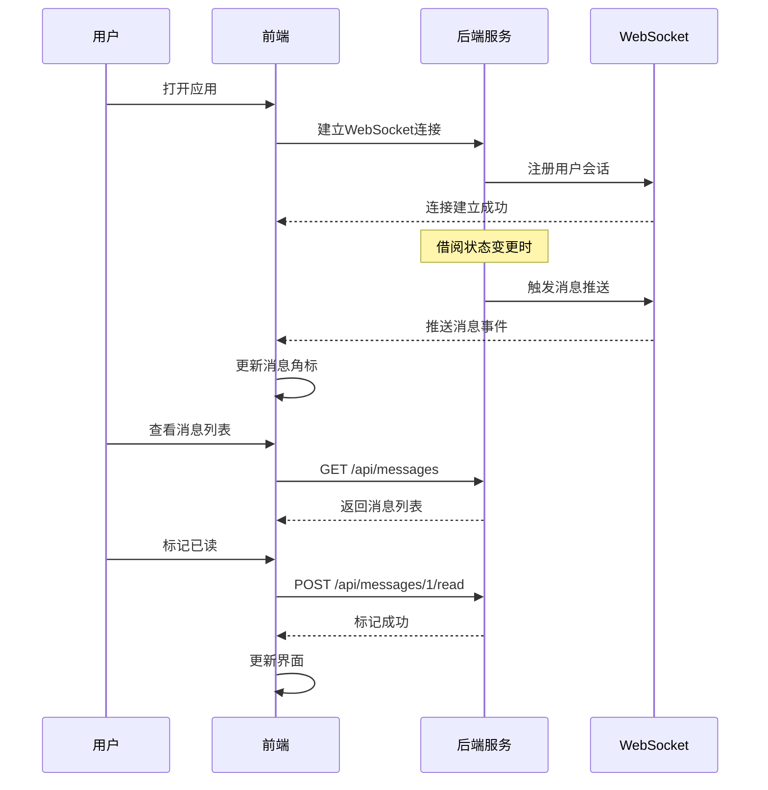
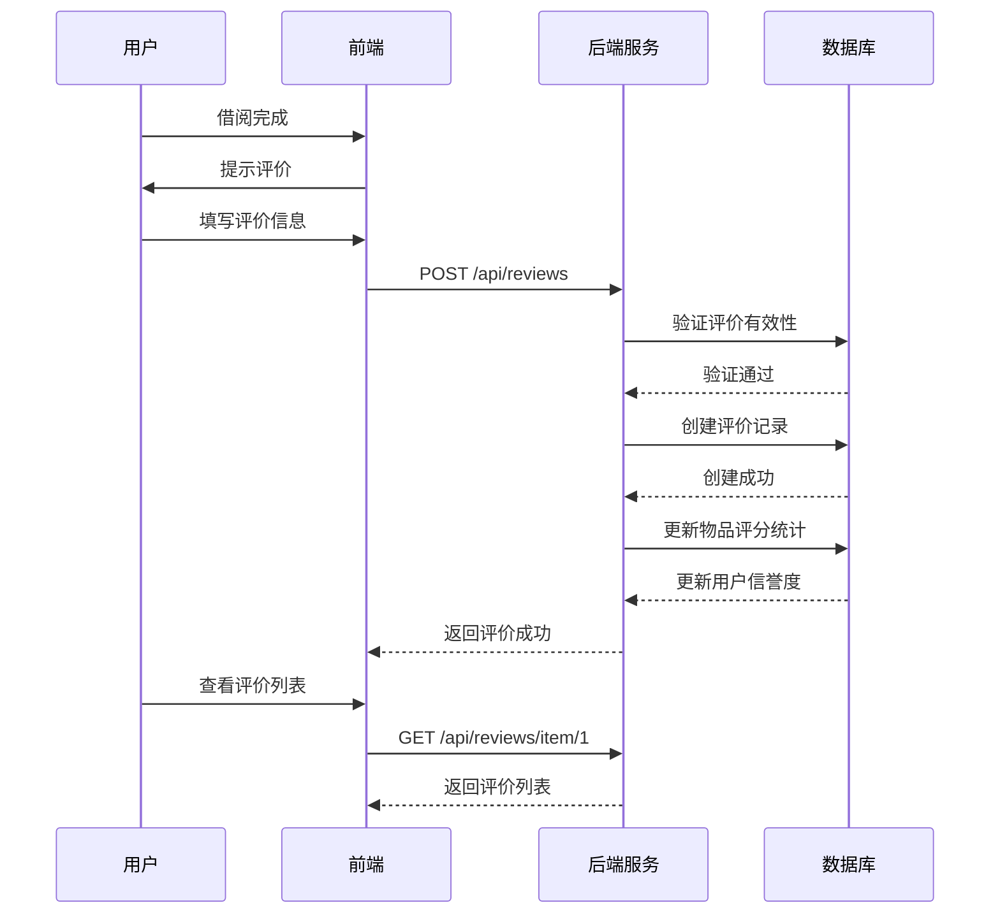
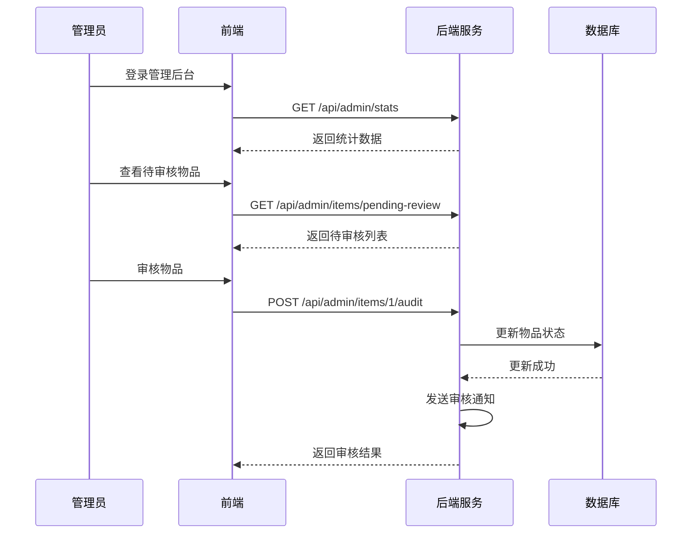

# 第五章 系统实现

本章将对邻里共享平台各功能模块的实现进行详细说明。系统实现遵循第四章的系统设计，包括前端页面实现和后端服务实现两个方面。每个模块的说明包含功能详细描述、业务流程图、时序分析和页面设计四个部分。

## 5.1 用户认证模块实现

### 5.1.1 功能描述与业务流程

用户认证模块实现用户注册、登录和身份验证功能。模块支持两种登录方式：手机号验证码登录和密码登录。验证码登录适用于新用户快速体验场景，用户输入手机号后获取验证码，输入正确验证码即可完成登录并自动创建账号。密码登录适用于需要更高安全性的场景，用户首次使用时需要先通过验证码登录后设置密码，后续可通过手机号和密码登录。

模块还实现JWT Token的生成和验证机制，用户登录成功后获得Token，后续请求通过Token进行身份认证。Token包含用户ID和角色信息，有效期为7天。

登录页面提供登录方式切换功能，用户可以根据需要选择验证码登录或密码登录。页面还提供注册链接，新用户可以通过验证码登录自动完成注册。

### 5.1.2 时序分析



### 5.1.3 页面设计与实现

登录页面采用简洁的设计风格，页面布局包含品牌标识区、登录表单区和底部链接区三个部分。

页面采用白色背景，顶部居中显示应用Logo和应用名称。登录表单区域采用卡片式设计，白色背景配合轻微阴影效果，突出表单内容。表单包含手机号输入框、验证码输入框、获取验证码按钮（验证码登录模式）或密码输入框（密码登录模式）、登录按钮。页面底部提供登录方式切换链接和用户协议链接。

页面交互设计如下：手机号输入框获得焦点时显示蓝色边框，格式错误时显示红色边框和错误提示。获取验证码按钮点击后进入60秒倒计时，倒计时期间按钮显示灰色且不可点击。登录按钮点击后显示加载状态，登录失败时显示错误提示信息。

页面布局采用Flexbox布局，垂直居中显示表单卡片。表单输入框使用Tailwind CSS的表单样式类，设置统一的圆角、边框和内边距。按钮使用主色调背景色，悬停时颜色加深。

验证码登录的核心代码实现如下：

```vue
<script setup>
import { ref } from 'vue'
import { useRouter } from 'vue-router'
import { authApi } from '../api/auth'

const router = useRouter()
const phone = ref('')
const verifyCode = ref('')
const countdown = ref(0)
const isLoading = ref(false)

const sendVerifyCode = async () => {
  if (!phone.value || countdown.value > 0) return
  await authApi.sendVerifyCode(phone.value)
  countdown.value = 60
  const timer = setInterval(() => {
    countdown.value--
    if (countdown.value <= 0) clearInterval(timer)
  }, 1000)
}

const handleLogin = async () => {
  isLoading.value = true
  try {
    const res = await authApi.loginByPhone(phone.value, verifyCode.value)
    localStorage.setItem('token', res.data.token)
    router.push('/')
  } catch (error) {
    alert(error.message)
  } finally {
    isLoading.value = false
  }
}
</script>
```

## 5.2 物品管理模块实现

### 5.2.1 功能描述与业务流程

物品管理模块实现物品的发布、编辑、查询和下架功能。用户可以将自己拥有的物品发布到平台上供他人借用，物品信息包括名称、描述、分类、社区、图片等。模块支持草稿功能，用户可以将未完善的物品保存为草稿，后续继续编辑后发布。

物品列表页面展示所有可借物品，支持按分类和社区筛选，支持关键词搜索。物品详情页面展示物品的完整信息，包括图片、描述、价格、押金、归还要求等，用户可以在详情页面发起借用申请。

物品所有者可以管理自己发布的物品，包括查看物品状态、编辑物品信息、下架物品等操作。下架后的物品不再在平台展示，但已有的借阅记录不受影响。

### 5.2.2 时序分析



### 5.2.3 页面设计与实现

物品列表页面采用网格布局展示物品卡片，每个卡片包含物品主图、名称、日租金、所有者信息等。页面顶部提供搜索框和筛选条件，右侧提供分类筛选和社区筛选。

物品卡片设计如下：卡片宽度设置为响应式，在大屏幕显示4列，中等屏幕显示3列，小屏幕显示2列。卡片内部上方显示物品主图，图片采用16:9比例，使用object-cover确保图片填充不变形。图片下方显示物品名称，采用单行省略显示。名称下方显示日租金，使用主色调字体突出显示。最下方显示所有者昵称和头像，采用小字号灰色文字。

物品详情页面采用上下布局：顶部显示图片轮播，支持左右滑动切换图片；中部显示物品基本信息，包括名称、分类、日租金、押金、信用要求等；下部显示物品描述、归还要求和标签；底部显示操作栏，包含借用按钮和收藏按钮。

物品发布页面采用表单布局，包含基本信息区、图片上传区和其他信息区。基本信息区包括物品名称、分类、描述等输入框。图片上传区提供拖拽上传和点击上传两种方式，支持多图上传和图片预览。其他信息区包括日租金、押金、信用要求等输入项，以及归还要求和标签输入框。

## 5.3 借阅管理模块实现

### 5.3.1 功能描述与业务流程

借阅管理模块实现物品借用的全流程管理，包括发起借用申请、审批借用申请、确认取货、申请归还、确认归还等核心功能。

借用者在物品详情页面点击借用按钮后，进入借用申请表单，选择借用开始日期和结束日期，填写借用用途，提交借阅申请。借阅申请提交后，物品所有者收到通知，可以在待处理列表中查看和审批申请。

物品所有者同意申请后，借用者需要在规定时间内确认取货，取货后借阅状态变更为借用中。借用期满前，借用者可以申请归还，物品所有者确认收到归还后，整个借阅流程完成。

模块还实现并发控制机制，使用乐观锁防止同一物品被多人同时借用。审批时采用原子更新操作，确保只有第一个审批通过的申请能够成功。

### 5.3.2 时序分析



### 5.3.3 页面设计与实现

借阅申请页面采用弹窗表单形式，在物品详情页面点击借用按钮后弹出。表单包含日期选择器和用途输入框两个主要字段。日期选择器使用日历组件，支持选择开始日期和结束日期，系统自动计算借用天数和总费用。用途输入框为多行文本框，用于说明借用目的。

我的借阅页面采用列表形式展示借阅记录，分为借入记录和借出记录两个标签页。每个列表项显示物品名称、图片、借用时间、状态等信息。状态采用彩色标签显示，不同状态使用不同颜色区分：待审批使用黄色、进行中使用蓝色、已完成使用绿色、已拒绝使用灰色、已取消使用灰色。

待处理页面专门展示需要用户处理的借阅事项，包括待审批的借用申请和待确认的归还申请。每个事项卡片显示申请人、物品信息、申请时间、操作按钮等信息。用户可以直接在卡片上点击同意或拒绝按钮进行快速操作。

## 5.4 消息通知模块实现

### 5.4.1 功能描述与业务流程

消息通知模块实现实时消息推送功能，确保用户能够及时了解借阅申请、审批结果等重要信息。模块采用WebSocket技术实现服务器向客户端的主动推送，相比传统的轮询方式具有低延迟、低资源消耗的优势。

消息类型包括：新借阅申请通知（推送对象为物品所有者）、借阅申请通过通知（推送对象为借用者）、借阅申请拒绝通知（推送对象为借用者）、归还申请通知（推送对象为物品所有者）、归还确认通知（推送对象为借用者）。

消息中心页面展示用户的所有消息记录，支持分页加载和未读筛选。用户点击消息可以查看详情，同时消息自动标记为已读。导航栏显示未读消息数量角标，实时更新。

### 5.4.2 时序分析



### 5.4.3 页面设计与实现

消息列表页面采用时间线布局，每条消息显示消息类型图标、标题、内容、时间和已读状态。时间线按时间倒序排列，最新的消息显示在最上方。

消息类型使用不同的图标区分：新申请使用蓝色图标、审批结果使用绿色（同意）或红色（拒绝）图标、归还通知使用橙色图标。已读消息使用灰色文字，未读消息使用加粗黑色文字并在左侧显示蓝色小圆点。

WebSocket连接管理采用单例模式，在应用启动时建立连接，页面关闭时断开连接。连接断开后自动重连，确保消息推送的可靠性。消息接收处理采用事件模式，不同类型的消息触发不同的处理逻辑。

WebSocket工具类的核心实现如下：

```typescript
class WebSocketManager {
  private ws: WebSocket
  private listeners: Map<string, Function[]> = new Map()
  private reconnectInterval: number = 3000

  constructor(url: string) {
    this.connect(url)
  }

  private connect(url: string) {
    const token = localStorage.getItem('token')
    this.ws = new WebSocket(`${url}?token=${token}`)
    
    this.ws.onmessage = (event) => {
      const data = JSON.parse(event.data)
      this.emit(data.type, data)
    }

    this.ws.onclose = () => {
      setTimeout(() => this.connect(url), this.reconnectInterval)
    }
  }

  on(event: string, callback: Function) {
    if (!this.listeners.has(event)) {
      this.listeners.set(event, [])
    }
    this.listeners.get(event).push(callback)
  }

  private emit(event: string, data: any) {
    const callbacks = this.listeners.get(event)
    if (callbacks) {
      callbacks.forEach(cb => cb(data))
    }
  }
}
```

## 5.5 评价系统模块实现

### 5.5.1 功能描述与业务流程

评价系统模块实现借阅完成后的双向评价功能，构建社区信任机制。评价类型分为物品评价和用户评价两类：物品评价记录借用者对物品质量和使用体验的评价；用户评价记录双方对彼此租借行为的评价。

评价内容包含评分和文字评价两部分。评分使用1-5分制，5分为最高分。文字评价为可选内容，用户可以选择是否填写。

系统根据评价计算物品平均评分和用户信誉度，为其他用户提供参考。评价创建后不可修改和删除，确保评价的真实性和可信度。

### 5.5.2 时序分析



### 5.5.3 页面设计与实现

评价弹窗在借阅完成后自动弹出，或者用户主动点击评价按钮时显示。弹窗包含评价类型选择、评分组件和评价内容输入框。

评分组件使用5颗星星的图标展示，点击星星进行评分，鼠标悬停时预览评分。评分使用黄色填充表示已评分，灰色轮廓表示未评分。

评价列表在物品详情页底部展示，显示该物品收到的所有评价。每条评价显示评价者头像、昵称、评分、评价内容和评价时间。评价按时间倒序排列，支持分页加载。

## 5.6 管理员后台模块实现

### 5.6.1 功能描述与业务流程

管理员后台模块为平台运营者提供系统管理功能，包括用户管理、物品审核、借阅管理、纠纷处理和地址认证五个子模块。

用户管理功能支持查看用户列表、搜索用户、禁用和启用用户账号。管理员可以查看用户的详细信息，包括信用分数、借出借入次数、碳减排贡献等。

物品审核功能支持对待审核物品进行审批操作。管理员查看物品信息后，可以选择通过或拒绝审核，拒绝时需要填写拒绝原因。

借阅管理功能支持查看所有借阅记录，管理员可以查看借阅详情，了解借阅状态和进度。

纠纷处理功能支持处理用户提交的借阅纠纷申诉。管理员了解纠纷详情后，进行调解并给出处理结果。

地址认证功能支持审核用户提交的小区认证申请。管理员核实用户提供的地址信息后，决定是否通过认证。

### 5.6.2 时序分析



### 5.6.3 页面设计与实现

管理后台采用侧边栏导航布局，左侧为功能菜单，右侧为内容区域。侧边栏包含统计概览、用户管理、物品管理、借阅管理、纠纷处理、地址认证等功能入口。

统计概览页面以卡片形式展示关键数据，包括用户总数、物品总数、借阅总次数、待审核物品数、待处理纠纷数、待审核地址数等。卡片使用不同的颜色区分数据类型，数据旁边显示相比上期的变化趋势。

列表页面采用表格布局，展示详细数据。表格支持排序、筛选和分页。每一行数据提供操作按钮，如查看详情、审核、禁用等。操作按钮根据当前数据和用户权限动态显示。

审核操作采用表单弹窗，管理员选择审核结果（通过或拒绝），填写审核备注后提交。拒绝操作必须填写拒绝原因，用于通知用户。
