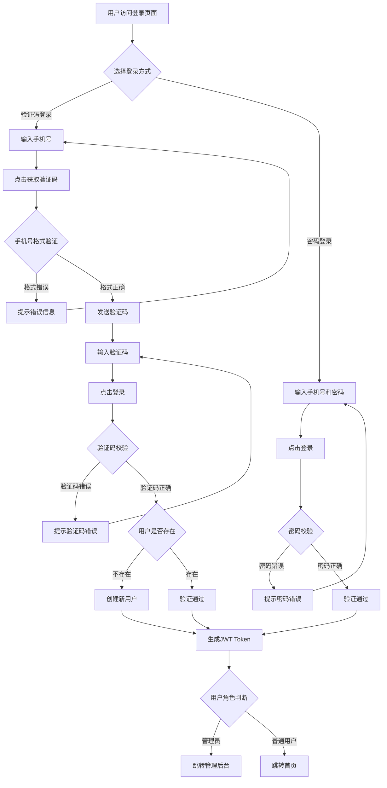
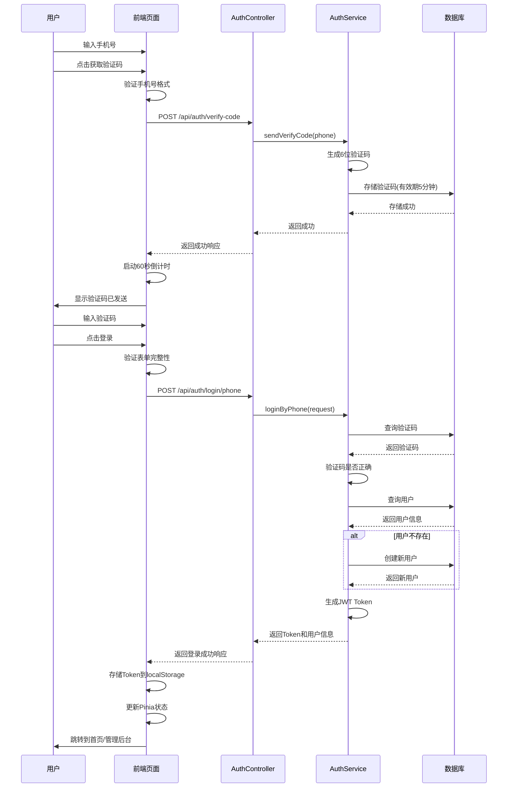
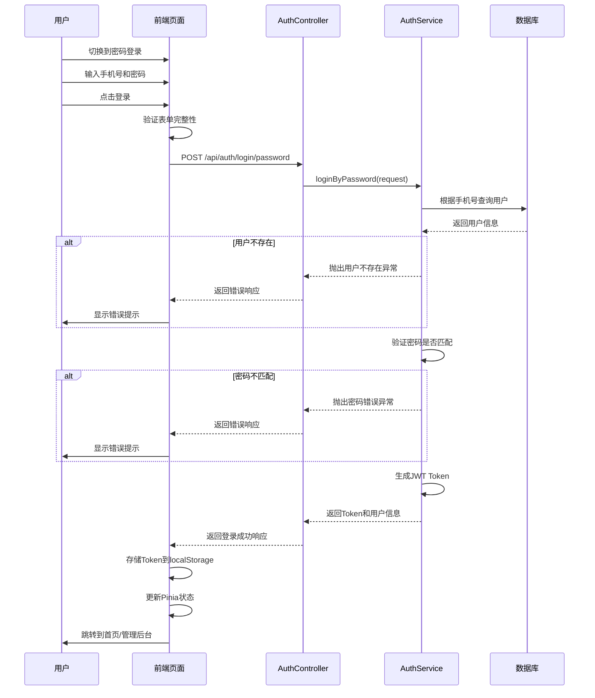

# 5.1 用户认证模块实现

## 5.1.1 功能描述与业务流程

用户认证模块是整个系统的基础模块，负责用户的注册、登录和身份验证功能。模块支持两种登录方式：手机号验证码登录和密码登录。手机号验证码登录适用于新用户快速体验场景，用户只需输入手机号和收到的验证码即可完成登录，系统会自动为新用户创建账号。密码登录适用于需要更高安全性的场景，用户首次使用时需要先通过验证码登录后设置密码，后续可通过手机号和密码登录。

模块还实现JWT Token的生成和验证机制，用户登录成功后获得Token，后续请求通过Token进行身份认证。Token包含用户ID和角色信息，有效期为7天。系统通过Token识别用户身份，无需在服务端存储会话状态，便于系统的水平扩展。

登录页面提供登录方式切换功能，用户可以根据需要选择验证码登录或密码登录。页面还提供注册链接，新用户可以通过验证码登录自动完成注册。系统区分普通用户和管理员角色，管理员登录后自动跳转到管理后台。

### 业务流程图



## 5.1.2 时序分析

用户认证模块涉及前端、后端服务和数据库三个参与方，通过HTTP请求进行数据交互。以下分别展示验证码登录和密码登录的时序图。

### 验证码登录时序图



### 密码登录时序图



## 5.1.3 页面设计与实现

### 页面布局设计

登录页面采用左右分栏布局，左侧为品牌展示区，右侧为登录表单区。在移动端设备上，左侧品牌区隐藏，只显示右侧登录表单区，实现响应式适配。

左侧品牌展示区采用金色背景（#E2B04D），包含应用Logo、品牌标语和版权信息三个部分。Logo区域位于顶部，使用图标和文字组合展示品牌标识。品牌标语区域位于中部，使用大号粗体文字展示"通过每一件物品，连接一个真实的人"的核心理念，下方展示社区用户数量统计。版权信息区域位于底部，使用小号透明度文字展示版权声明。背景使用圆形装饰元素，增强视觉层次感。

右侧登录表单区采用浅米色背景（#FDFBFA），包含标题区、登录方式切换区、表单区和底部信息区四个部分。标题区显示"欢迎回来"标题和"先去随便看看"链接，链接点击后跳转到首页。登录方式切换区使用标签页形式，包含"手机号登录"和"密码登录"两个选项，当前选中项显示金色下划线。表单区根据当前登录方式显示不同的输入项。底部信息区显示测试提示和用户协议链接。

### 控件设计

页面使用的控件包括：文本输入框、按钮、标签页切换、图标和提示信息。

文本输入框设计：输入框采用圆角矩形设计，圆角半径为2rem。输入框左侧显示图标，使用绝对定位将图标放置在输入框内部左侧。输入框背景使用浅灰色（gray-50），获得焦点时背景变为白色并显示金色光环效果。输入框高度为py-4（上下各1rem内边距），确保足够的点击区域。

按钮设计：主按钮采用深色背景（#2D3436），白色文字，圆角半径为2rem。按钮悬停时显示金色阴影效果并轻微放大。按钮禁用时显示半透明效果并禁用悬停动画。获取验证码按钮采用白色背景、灰色边框设计，悬停时边框变为金色。登录按钮宽度占满容器，高度为py-5。

标签页切换设计：两个标签按钮水平排列，下方显示一条分隔线。当前选中的标签显示金色下划线，文字颜色为金色。未选中的标签显示灰色文字，悬停时文字颜色加深。

图标设计：使用Iconify图标库，通过data-icon属性指定图标名称。手机号输入框使用solar:phone-bold图标，验证码输入框使用solar:lock-keyhole-bold图标，密码输入框使用solar:lock-password-bold图标，密码显示切换使用solar:eye-bold和solar:eye-closed-bold图标。

提示信息设计：错误提示使用红色文字，成功提示使用绿色文字，居中显示在表单下方。

### 交互设计

登录页面的交互设计包括以下几个方面：

登录方式切换交互：用户点击"手机号登录"或"密码登录"标签时，表单区域动态切换显示对应的输入项。切换时标签下划线和文字颜色同步更新，提供清晰的视觉反馈。

获取验证码交互：用户点击"获取"按钮后，按钮进入60秒倒计时状态，倒计时期间按钮显示灰色且不可点击。倒计时结束后，按钮恢复可点击状态。验证码发送成功后，页面显示"验证码已发送"提示信息。

表单验证交互：用户提交表单前，前端进行表单验证。手机号验证规则为11位数字，验证码验证规则为6位数字，密码验证规则为非空。验证失败时，页面显示对应的错误提示信息。

登录提交交互：用户点击登录按钮后，按钮显示"验证中..."文字并进入禁用状态。登录成功后，页面跳转到首页或管理后台。登录失败时，页面显示错误提示信息，按钮恢复可点击状态。

密码显示切换交互：在密码登录模式下，用户点击密码输入框右侧的眼睛图标，可以切换密码的显示和隐藏状态。图标根据当前状态显示不同的图标样式。

### 数据有效性检查

前端对用户输入的数据进行有效性检查，确保数据格式正确后再提交到后端。

手机号验证规则：手机号必须为11位数字，首位必须为1。验证代码如下：

```typescript
if (!phone.value || phone.value.length !== 11) {
  message.value = '请输入正确的手机号'
  isError.value = true
  return
}
```

验证码验证规则：验证码必须为6位数字。前端通过maxlength属性限制输入长度为6位。

密码验证规则：密码不能为空。前端通过maxlength属性限制输入长度为20位。

表单提交验证：在提交表单前，前端依次验证手机号、验证码（或密码）的有效性。只有所有验证通过后，才会发起登录请求。

### 核心代码实现

登录页面的核心逻辑实现包括验证码发送、表单验证和登录请求三个部分。

验证码发送实现：

```typescript
const sendVerifyCode = async () => {
  if (!phone.value || phone.value.length !== 11) {
    message.value = '请输入正确的手机号'
    isError.value = true
    return
  }
  try {
    await authApi.sendVerifyCode(phone.value)
    message.value = '验证码已发送'
    isError.value = false
    startCountdown()
  } catch (error) {
    message.value = '发送失败，请重试'
    isError.value = true
  }
}

const startCountdown = () => {
  countdown.value = 60
  const timer = setInterval(() => {
    countdown.value--
    if (countdown.value <= 0) {
      clearInterval(timer)
    }
  }, 1000)
}
```

表单提交实现：

```typescript
const handleSubmit = async () => {
  if (!phone.value || phone.value.length !== 11) {
    message.value = '请输入正确的手机号'
    isError.value = true
    return
  }

  if (loginMode.value === 'phone') {
    if (!verifyCode.value) {
      message.value = '请输入验证码'
      isError.value = true
      return
    }
    await loginByPhone()
  } else {
    if (!password.value) {
      message.value = '请输入密码'
      isError.value = true
      return
    }
    await loginByPassword()
  }
}
```

验证码登录实现：

```typescript
const loginByPhone = async () => {
  submitting.value = true
  try {
    const res = await authApi.loginByPhone({ 
      phone: phone.value, 
      verifyCode: verifyCode.value 
    })
    authStore.login(res.user, res.token)
    message.value = ''
    if (res.user?.role === 'ADMIN') {
      router.push('/admin')
    } else {
      router.push('/index')
    }
  } catch (error: any) {
    authStore.logout()
    message.value = error.message || '登录失败，请重试'
    isError.value = true
  } finally {
    submitting.value = false
  }
}
```

### 页面效果展示

登录页面整体效果如下：

- 页面采用现代简约设计风格，左侧金色品牌区与右侧米色表单区形成鲜明对比
- 表单区域使用圆角卡片设计，输入框采用圆角矩形，按钮采用胶囊形状
- 颜色方案以金色（#E2B04D）为主色调，深灰色（#2D3436）为辅助色
- 交互反馈清晰，包括输入框焦点效果、按钮悬停效果、加载状态显示等
- 响应式设计完善，移动端隐藏左侧品牌区，表单区占满屏幕宽度
