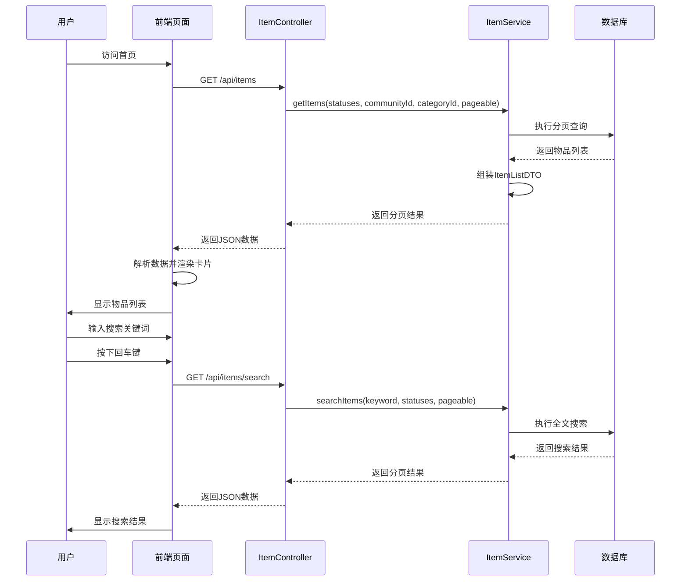
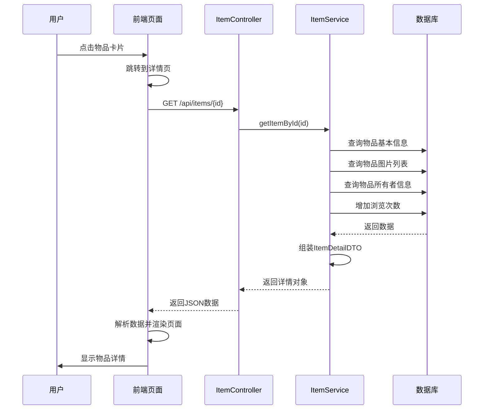
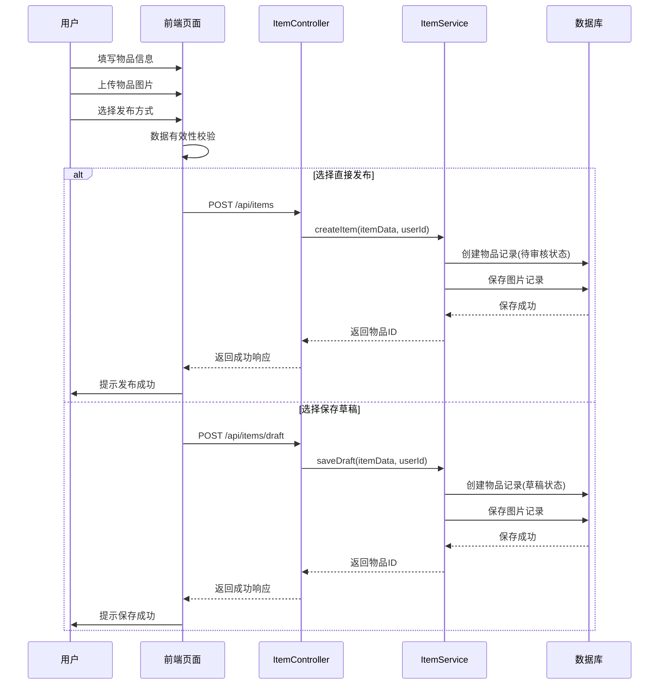

# 5.2 物品管理模块实现

## 5.2.1 功能描述与业务流程

物品管理模块是邻里共享平台的核心业务模块之一，负责物品的发布、编辑、查询和下架等功能。该模块为用户提供便捷的物品共享渠道，用户可以将自己拥有的物品发布到平台上供他人借用，实现社区资源的有效利用。

物品管理模块包含以下核心功能：物品发布功能支持用户创建新的物品记录，填写物品名称、描述、分类、所在社区、每日租金、押金、信用要求等信息，并上传物品图片。物品发布支持两种模式：直接发布和保存草稿。直接发布的物品进入待审核状态，等待管理员审批；保存草稿的物品保持草稿状态，用户可后续编辑后发布。

物品查询功能支持用户浏览平台上的可借物品列表，支持按分类筛选、按社区筛选和关键词搜索三种方式。物品列表采用分页加载，每页显示固定数量的物品卡片，用户可通过翻页查看更多物品。

物品详情功能展示物品的完整信息，包括多张图片、基本信息、借阅规则、物品故事、所有者信息等。用户可在详情页面直接发起借用申请，也可以查看该物品的历史评价。

物品编辑功能允许物品所有者修改自己发布的物品信息，包括基本信息、图片、定价等。物品下架功能允许物品所有者将物品从平台下架，下架后的物品不再展示，但已有的借阅记录不受影响。

### 业务流程图

```mermaid
flowchart TD
    A[用户访问首页] --> B{是否有筛选条件}
    B -->|无| C[加载全部可借物品]
    B -->|按分类筛选| D[按分类ID查询]
    B -->|按社区筛选| E[按社区ID查询]
    B -->|关键词搜索| F[全文搜索]
    
    C --> G[分页返回物品列表]
    D --> G
    E --> G
    F --> G
    G --> H[前端渲染物品卡片]
    
    I[用户点击物品] --> J[跳转详情页]
    J --> K[加载物品详情]
    K --> L[展示物品信息]
    
    M[用户点击借用] --> N{用户是否登录}
    N -->|未登录| O[跳转到登录页]
    N -->|已登录| P{物品状态]
    P -->|可借| Q[填写借用表单]
    P -->|不可借| R[提示不可借用]
    
    S[用户点击发布物品] --> T[填写物品信息]
    T --> U{选择发布方式}
    U -->|直接发布| V[提交审核]
    U -->|保存草稿| W[保存到草稿箱]
    
    V --> X{管理员审核}
    X -->|通过| Y[物品状态变更为可借]
    X -->|拒绝| Z[通知用户拒绝原因]
```

## 5.2.2 时序分析

物品管理模块涉及前端、后端服务和数据库三个参与方，通过HTTP请求进行数据交互。以下分别展示物品列表查询和物品详情查看的时序图。

### 物品列表查询时序图



### 物品详情查看时序图



### 物品发布时序图



## 5.2.3 页面设计与实现

### 物品列表页面设计

#### 页面布局设计

物品列表页面采用以下布局结构：顶部为搜索筛选区，中间为物品列表区，底部为页码导航区，页面底部包含页脚信息。

搜索筛选区位于页面主体区域的最上方，使用一个卡片容器包裹，包含搜索输入框、分类下拉框和社区下拉框三个控件。卡片采用浅米色背景（#F3EFEA），圆角半径为2rem。三个控件采用网格布局，在大屏幕显示为三列，中等屏幕显示为两列，移动端显示为一列。

物品列表区采用网格布局，使用CSS Grid实现。大屏幕（lg）显示4列，中等屏幕（sm）显示2列。物品卡片之间采用gap-6间距。列表区左右两侧有最大宽度限制（max-w-7xl）和水平内边距（px-6）。

页码导航区位于物品列表下方，采用Flexbox水平居中布局。包含上一页按钮、页码按钮组和下一页按钮。

#### 控件设计

搜索输入框：宽度占满容器，高度为p-4。默认边框为2像素灰色边框，获得焦点时边框变为金色。输入框左侧显示搜索图标，绝对定位放置。占位符文本显示"搜索：电钻、帐篷..."。

下拉选择框：使用原生select元素实现，宽度占满容器，高度为p-4。下拉箭头使用绝对定位放置在右侧。下拉选项使用自定义样式，设置较大的内边距提高可点击区域。

物品卡片：采用白色背景，圆角半径为3xl。卡片包含图片区域和信息区域两部分。图片区域高度为h-44，采用灰色背景，图片使用object-cover填充。信息区域包含物品名称、位置文本、标签、日租金和查看详情链接。物品名称使用加粗字体，颜色为深灰色。日租金使用金色字体和加粗样式。

分页按钮：页码按钮为正方形（w-10 h-10），圆角为xl。当前选中的页码显示金色背景和白色文字，其他页码显示灰色边框和深灰色文字。上一页和下一页按钮为矩形，使用相同的圆角和边框样式。禁用状态的按钮显示半透明效果。

### 物品详情页面设计

#### 页面布局设计

物品详情页面采用左右分栏布局。在大屏幕（lg）上，左侧显示图片和物品故事，右侧显示物品信息和借用表单。在中等及以下屏幕上，改为单列布局。

左侧区域包含以下部分：主图展示区、图片缩略图区、物品故事卡片和物品主人信息卡片。主图展示区高度为380px-420px，圆角为2xl。图片缩略图区采用4列网格布局，每张缩略图高度为16-20rem。物品故事和物品主人卡片采用白色背景，圆角为2xl，包含标题和内容区域。

右侧区域包含以下部分：物品标题和描述区、统计信息区、借阅规则卡片和借用申请表单。借阅规则卡片显示每日租金、押金和信用要求三个指标。借用申请表单仅在物品状态为可借时显示。

#### 控件设计

状态标签：显示在主图右上角，使用绝对定位。不同状态显示不同颜色：可借显示绿色，已借出显示灰色，已下架显示红色。

图片缩略图：每张缩略图大小固定，鼠标悬停时显示金色边框，表示选中状态。

借阅规则卡片：使用浅黄色背景卡片，三个指标采用三列网格布局。每个指标显示数值和标签，数值使用大号加粗字体，标签使用小号灰色文字。

归还要求标签：使用圆角胶囊样式，灰色背景和灰色文字。

借用表单：包含两个日期选择器，分别选择开始日期和结束日期。日期选择器使用原生input type="date"，设置最小日期为今天。表单下方显示借用按钮，按钮为金色背景。

### 物品发布页面设计

#### 页面布局设计

物品发布页面采用垂直布局，包含导航区、表单区和操作按钮区三个部分。

表单区按内容分为多个区块：基本信息区、图片上传区、价格设置区和归还要求区。每个区块使用卡片容器包裹，白色背景，圆角和边框样式统一。

基本信息区包含物品名称输入框、分类选择器、社区选择器、物品描述文本域等控件。图片上传区支持拖拽上传和点击上传，显示上传进度和预览效果。价格设置区包含日租金输入框、押金输入框和信用要求输入框。归还要求区包含归还要求输入框和物品标签输入框。

#### 控件设计

物品名称输入框：单行文本输入，验证规则为必填、最少2个字符、最多100个字符。

分类选择器和社区选择器：使用下拉选择框，选项从数据库加载。必填项验证。

物品描述文本域：多行文本输入，最少10个字符，最多2000个字符。提供字数统计显示。

图片上传控件：支持多图上传，显示图片预览缩略图，支持删除已上传图片。上传数量限制为最多9张。

日期选择控件：使用浏览器原生日期选择器，设置最小日期为今天，结束日期必须大于开始日期。

### 数据有效性检查

物品管理模块在前端进行以下数据有效性检查：

物品名称检查：必填，最少2个字符，最多100个字符。使用trim()方法去除首尾空格后验证长度。

物品描述检查：必填，最少10个字符，最多2000个字符。

分类和社区检查：必填项，必须选择有效的分类和社区ID。

价格检查：日租金和押金必须为非负数，信用要求必须在0-10之间。

日期检查：开始日期不能早于今天，结束日期必须大于开始日期。

图片检查：至少上传1张图片，最多上传9张图片。每张图片大小不能超过5MB。

### 核心代码实现

物品列表加载实现：

```typescript
const loadItems = async () => {
  loading.value = true
  try {
    const res = await itemApi.getItems({
      page: currentPage.value - 1,
      size: pageSize,
      communityId: selectedCommunityId.value || undefined,
      categoryId: selectedCategoryId.value || undefined
    })
    items.value = res.content
    totalPages.value = res.totalPages
  } catch (error) {
    console.error('加载物品失败:', error)
  } finally {
    loading.value = false
  }
}

const searchItems = async () => {
  if (!searchQuery.value.trim()) {
    loadItems()
    return
  }
  loading.value = true
  try {
    const res = await itemApi.searchItems({
      keyword: searchQuery.value,
      page: currentPage.value - 1,
      size: pageSize
    })
    items.value = res.content
    totalPages.value = res.totalPages
  } catch (error) {
    console.error('搜索失败:', error)
  } finally {
    loading.value = false
  }
}
```

物品详情加载实现：

```typescript
const loadItemDetail = async () => {
  loading.value = true
  try {
    const itemId = route.params.id
    const res = await itemApi.getItemById(itemId)
    item.value = res
  } catch (error) {
    console.error('加载详情失败:', error)
  } finally {
    loading.value = false
  }
}
```

物品卡片渲染实现：

```vue
<article v-for="item in items" :key="item.id" 
  class="bg-white rounded-3xl border-2 border-gray-100 overflow-hidden 
  hover:shadow-md hover:-translate-y-1 transition-all duration-300 group">
  <div class="h-44 bg-gray-100 relative overflow-hidden">
    
  </div>
  <div class="p-5 space-y-2">
    <h3 class="font-bold text-[#333333]">{{ item.name }}</h3>
    <p class="text-sm text-gray-500">{{ item.locationText }}</p>
    <div class="flex justify-between items-center pt-2">
      <span class="text-[#E2B04D] font-bold">￥{{ item.pricePerDay }}/天</span>
      <RouterLink class="text-sm font-bold text-[#E2B04D] hover:underline" 
        :to="`/item/${item.id}`">查看详情</RouterLink>
    </div>
  </div>
</article>
```

### 页面效果展示

物品列表页面整体效果如下：

- 页面采用浅米色背景，与整体设计风格保持一致
- 搜索筛选区使用圆角卡片设计，三个控件水平排列
- 物品卡片采用白色背景和圆角边框，悬停时有阴影和上移效果
- 物品图片采用圆角设计，悬停时轻微放大
- 日租金使用金色突出显示，查看详情链接使用相同金色
- 分页导航简洁明了，当前页码高亮显示

物品详情页面整体效果如下：

- 左右分栏布局，左侧以图片为主，右侧以信息为主
- 主图展示区占据较大空间，图片质量清晰
- 状态标签清晰显示物品当前状态
- 借阅规则卡片使用颜色区分三个指标
- 借用表单与页面整体风格统一

物品发布页面整体效果如下：

- 表单区块清晰分区，每区块包含标题和控件
- 图片上传支持拖拽和点击，交互友好
- 控件样式统一，输入框获得焦点时显示金色边框
- 表单验证提示清晰，错误信息显示在对应控件下方
