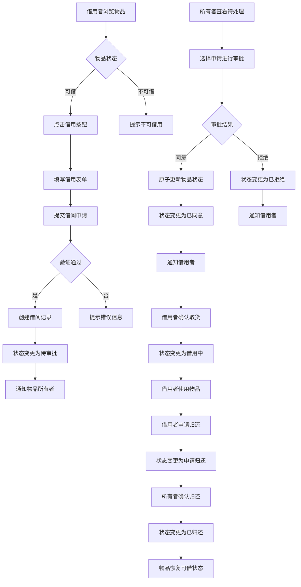
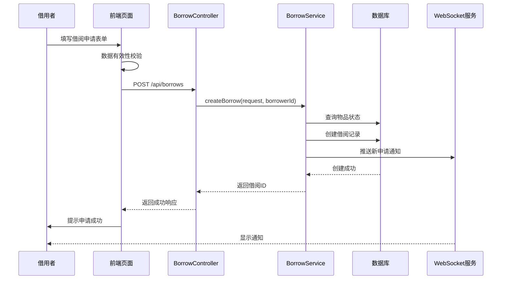
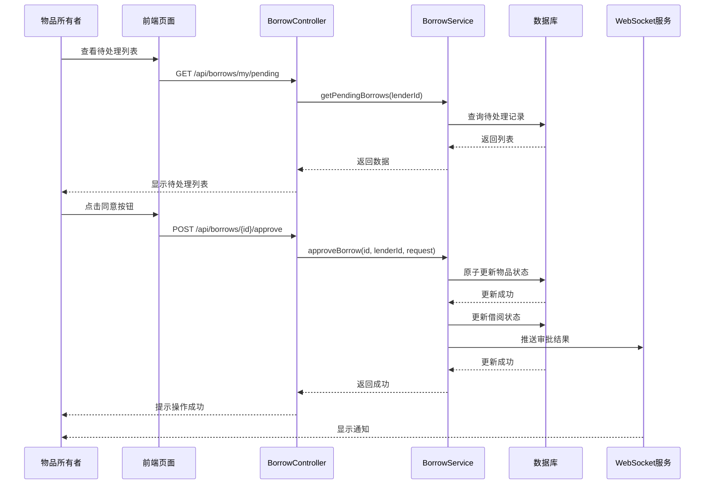

# 5.3 借阅管理模块实现

## 5.3.1 功能描述与业务流程

借阅管理模块是邻里共享平台的核心业务模块之一，负责管理物品借用的全流程。该模块连接物品所有者和借用者，实现借阅申请、审批、取货、归还等关键环节的管理。

借阅管理模块包含以下核心功能：借阅申请功能允许借用者在物品详情页面发起借用请求，选择借用开始日期、结束日期并填写借用用途。系统验证物品状态、借用日期合法性后创建借阅记录。

借阅审批功能允许物品所有者在待处理列表中查看借阅申请，选择同意或拒绝申请。同意后系统自动更新物品状态为已借出，拒绝时需填写拒绝原因。

确认取货功能允许借用者在借阅申请被同意后确认取货，确认后借阅状态变更为借用中。申请归还功能允许借用者在使用完毕后申请归还。确认归还功能允许物品所有者确认收到归还，确认后借阅状态变更为已归还，物品状态恢复为可借。

模块还实现了并发控制机制，使用乐观锁防止同一物品被多人同时借用。审批时采用原子更新操作，确保只有第一个审批通过的申请能够成功。

### 业务流程图



## 5.3.2 时序分析

### 借阅申请时序图



### 借阅审批时序图



## 5.3.3 页面设计与实现

### 个人中心借阅页面设计

个人中心页面采用左右分栏布局：左侧为用户信息侧边栏，右侧为借阅管理主内容区。

侧边栏包含用户头像、昵称、位置信息、借出借入统计、环保勋章进度和导航菜单。头像右上角显示皇冠图标表示认证状态。借出借入统计采用两列网格布局。导航菜单包括控制面板、我的物品、草稿箱、我的借入和设置等选项。

右侧主内容区包含控制面板卡片和当前物品流转表格。控制面板显示三个统计指标卡片：待审批借阅申请（橙色）、待确认归还（蓝色）和本周到期物品（绿色）。每个卡片使用图标和数字组合展示。

物品流转表格支持"我借出的"和"我借入的"两个标签页切换。表格列包括物品信息、对方信息、归还时间、状态和管理操作。物品信息列包含缩略图和物品名称。状态使用彩色标签展示。管理操作根据当前状态和用户角色动态显示按钮。

### 借阅申请表单设计

借阅申请表单显示在物品详情页面右侧，物品状态为可借时可见。

表单包含开始日期选择器、结束日期选择器和用途说明文本域。日期选择器设置最小日期为今天，结束日期必须大于开始日期。表单下方显示借用按钮，按钮宽度占满容器，为金色背景。

提交前验证：开始日期不能为空，结束日期必须大于开始日期，用途说明最多500字符。

### 状态标签设计

借阅状态使用不同颜色的标签展示：待审批（PENDING）显示黄色背景，已同意（APPROVED）显示蓝色背景，借用中（ACTIVE）显示绿色背景，申请归还（RETURN_REQUESTED）显示橙色背景，已归还（RETURNED）显示灰色背景，已拒绝（REJECTED）显示红色背景，已取消（CANCELLED）显示灰色背景。

### 数据有效性检查

借阅日期验证：开始日期不能早于当前日期，结束日期必须大于开始日期。借用天数不能超过物品所有者设置的最大借用天数。

用途说明验证：用途说明最多500字符，输入时实时显示剩余可输入字符数。

状态变更验证：只有物品所有者可以审批借阅申请，只有借用者可以取消申请和确认取货，只有物品所有者可以确认归还。

### 核心代码实现

借阅申请提交实现：

```typescript
const submitBorrowRequest = async () => {
  if (!borrowForm.startDate || !borrowForm.endDate) {
    alert('请选择借用日期')
    return
  }
  try {
    await borrowApi.createBorrow({
      itemId: item.value.id,
      startDate: borrowForm.startDate,
      endDate: borrowForm.endDate,
      purpose: borrowForm.purpose
    })
    alert('申请提交成功')
    loadItemDetail()
  } catch (error) {
    alert(error.message)
  }
}
```

借阅审批实现：

```typescript
const approveRequest = async (borrow: any, approved: boolean) => {
  try {
    await borrowApi.approveBorrow(borrow.id, {
      approved,
      message: approved ? '' : '物品已借出给别人'
    })
    loadDashboard()
  } catch (error) {
    alert(error.message)
  }
}
```

确认归还实现：

```typescript
const confirmReturn = async (borrowId: number) => {
  try {
    await borrowApi.confirmReturn(borrowId)
    loadDashboard()
  } catch (error) {
    alert(error.message)
  }
}
```

### 页面效果展示

个人中心借阅管理页面效果如下：

- 左侧用户信息卡片清晰展示用户资料和统计数据
- 控制面板统计卡片使用颜色区分不同类型的事项
- 物品流转表格信息完整，状态标签直观清晰
- 操作按钮根据权限和状态动态显示
- 标签页切换流畅，表格内容实时更新

物品详情借阅申请表单效果如下：

- 表单与页面整体风格统一
- 日期选择器交互友好
- 借用按钮突出显示，金色背景吸引用户注意
- 提交反馈清晰，错误提示友好
