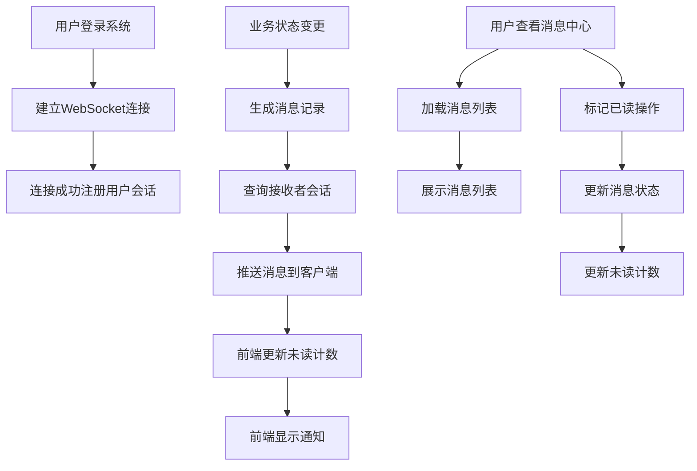
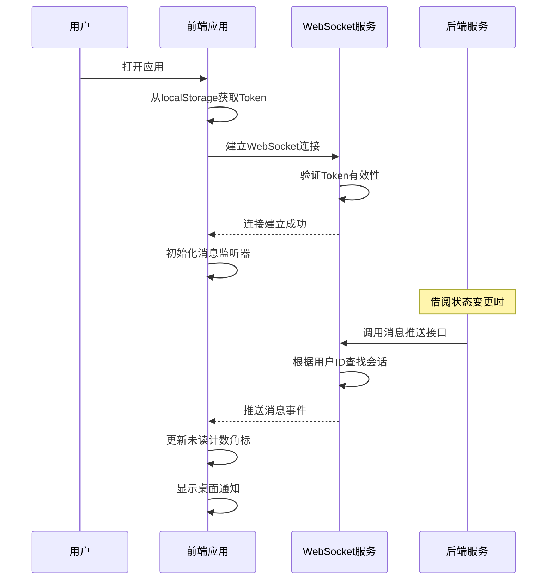
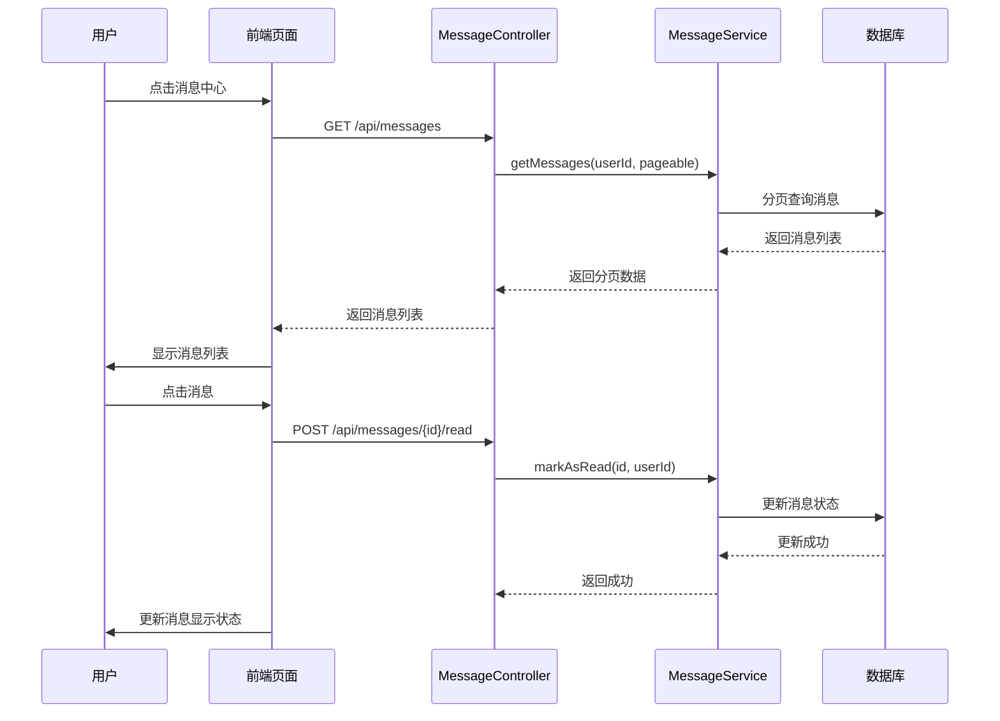

# 5.4 消息通知模块实现

## 5.4.1 功能描述与业务流程

消息通知模块负责向用户推送各类业务通知，确保用户能够及时了解借阅申请、审批结果等重要信息。该模块采用WebSocket技术实现实时消息推送，相比传统的轮询方式具有低延迟、低资源消耗的优势。

消息通知模块包含以下核心功能：实时推送功能通过WebSocket长连接实现，服务器主动向客户端推送消息，用户无需刷新页面即可收到通知。消息列表功能展示用户的所有消息记录，支持分页加载和未读筛选。未读计数功能在导航栏显示未读消息数量角标，实时更新。消息管理功能支持标记单条消息为已读和全部标记已读。

消息类型包括：新借阅申请通知（推送对象为物品所有者）、借阅申请通过通知（推送对象为借用者）、借阅申请拒绝通知（推送对象为借用者）、归还申请通知（推送对象为物品所有者）、归还确认通知（推送对象为借用者）。

### 业务流程图



## 5.4.2 时序分析

### WebSocket连接时序图



### 消息管理时序图



## 5.4.3 页面设计与实现

### 消息中心页面设计

#### 页面布局设计

消息中心页面采用居中布局，最大宽度为4xl。页面主体为一个圆角卡片容器，包含标题区、筛选区和消息列表区三个部分。

标题区位于卡片顶部，左侧显示"消息中心"标题，右侧显示"全部已读"按钮（仅在有未读消息时显示）。标题区下方有一条分隔线。

筛选区位于标题区下方，包含"全部消息"和"未读消息"两个标签按钮。未读消息标签右侧显示未读数量角标，使用红色圆形徽章展示。

消息列表区采用垂直滚动布局，每条消息占一行。消息之间使用分隔线区分。列表底部在多页时显示分页控件。

#### 控件设计

消息卡片：每条消息占用一个卡片区域，包含图标、类型标签、标题、内容预览、时间戳和未读指示器。消息卡片具有点击交互，悬停时背景色变为浅灰色。未读消息背景显示淡橙色区分。

消息图标：使用圆形背景图标，不同消息类型使用不同颜色。申请通知使用蓝色图标，审批通过使用绿色图标，审批拒绝使用红色图标，归还通知使用橙色图标。

类型标签：使用小圆角胶囊样式展示消息类型描述，背景色与图标颜色协调。

未读指示器：未读消息在右上角显示红色小圆点，已读消息不显示。

分页控件：位于列表底部，包含上一页按钮、当前页码显示和下一页按钮。

### 导航栏消息角标设计

导航栏显示消息入口图标，图标右上角显示未读消息数量角标。角标为红色圆形，使用白色数字文字。数量超过99显示为"99+"。

角标通过Pinia状态管理与消息服务同步，当收到新消息推送时自动增加计数，当用户查看消息或标记已读时自动减少计数。

### WebSocket连接管理设计

WebSocket连接采用单例模式管理，在应用初始化时建立连接。连接URL格式为ws://localhost:8080/ws/message?token={jwt}。

连接建立时自动注册用户会话，断开连接后自动重连，重连间隔为3秒。

消息处理采用事件模式，不同类型的消息触发不同的处理函数。消息格式统一为JSON，包含type（消息类型）、title（标题）、content（内容）和relatedId（关联业务ID）字段。

### 数据有效性检查

消息模块进行以下数据有效性检查：

连接Token验证：建立WebSocket连接时传递JWT Token，服务器验证Token有效性后建立会话。Token无效或过期时拒绝连接。

消息所属权验证：用户标记消息已读时，验证消息接收者是否为当前用户，防止跨用户操作。

分页参数验证：页码和每页数量必须为非负整数，超出范围时使用默认值。

### 核心代码实现

WebSocket管理器实现：

```typescript
class WebSocketManager {
  private ws: WebSocket
  private listeners: Map<string, Function[]> = new Map()
  private reconnectInterval: number = 3000
  private token: string

  constructor(url: string) {
    this.token = localStorage.getItem('token')
    this.connect(url)
  }

  private connect(url: string) {
    this.ws = new WebSocket(`${url}?token=${this.token}`)
    
    this.ws.onopen = () => {
      console.log('WebSocket connected')
    }

    this.ws.onmessage = (event) => {
      const data = JSON.parse(event.data)
      this.emit(data.type, data)
    }

    this.ws.onclose = () => {
      console.log('WebSocket disconnected')
      setTimeout(() => this.connect(url), this.reconnectInterval)
    }
  }

  on(event: string, callback: Function) {
    if (!this.listeners.has(event)) {
      this.listeners.set(event, [])
    }
    this.listeners.get(event).push(callback)
  }

  private emit(event: string, data: any) {
    const callbacks = this.listeners.get(event)
    if (callbacks) {
      callbacks.forEach(cb => cb(data))
    }
  }
}
```

消息监听器实现：

```typescript
import { wsManager } from '../utils/websocket'

wsManager.on('NEW_BORROW_APPLY', (message) => {
  unreadCount.value++
  ElMessage.info(message.title)
})

wsManager.on('REQUEST_APPROVED', (message) => {
  unreadCount.value++
  ElMessage.success(message.title)
})

wsManager.on('REQUEST_REJECTED', (message) => {
  unreadCount.value++
  ElMessage.warning(message.title)
})

wsManager.on('RETURN_REQUESTED', (message) => {
  unreadCount.value++
  ElMessage.info(message.title)
})

wsManager.on('BORROW_RETURNED', (message) => {
  unreadCount.value++
  ElMessage.success(message.title)
})
```

### 页面效果展示

消息中心页面效果如下：

- 页面采用居中卡片设计，整体简洁大方
- 消息列表采用时间线布局，最新消息显示在最上方
- 未读消息有明显的视觉区分，橙色背景和红色圆点
- 消息类型使用彩色图标和标签，一目了然
- 分页控件简洁实用

WebSocket推送效果如下：

- 新消息到达时即时显示通知
- 导航栏角标实时更新
- 连接断开后自动重连，稳定可靠
