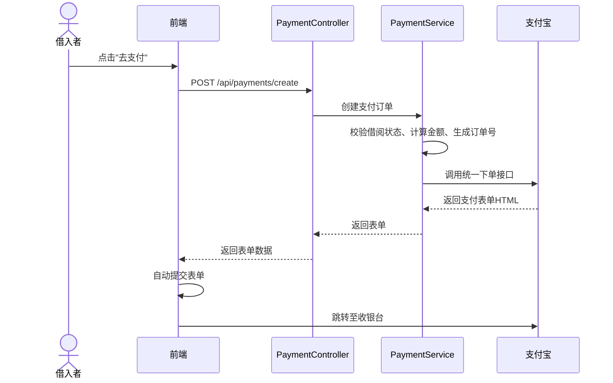
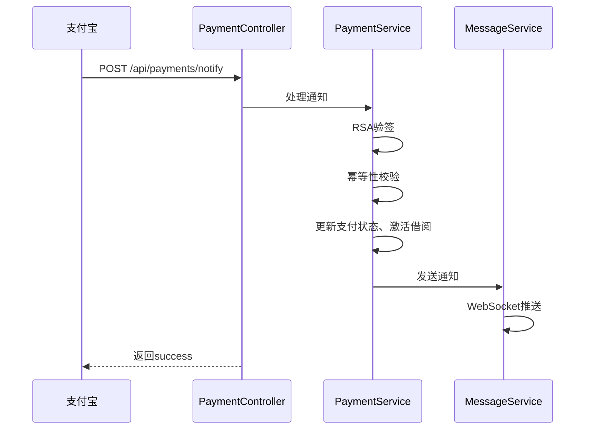
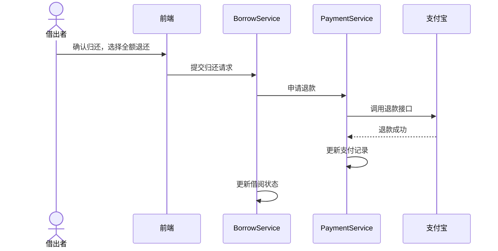

# 5.5 支付管理模块实现

## 5.5.1 功能描述与业务流程

支付管理模块负责处理借阅流程中的资金往来，集成支付宝沙箱环境提供在线支付与结算服务。模块核心功能包括支付订单创建、支付结果异步通知、押金退还三个环节。

支付订单在借阅审批通过后生成，包含租金和押金两部分。租金根据物品日租金与借阅天数计算，押金由物品发布时设定。借入者需在24小时内完成支付，超时未支付则订单自动关闭，借阅记录回退至"已批准"状态。

如图5.5所示，支付业务流程历经订单创建、前端支付、异步回调、状态更新四个阶段，最终激活借阅记录。

图5.5 支付业务流程图

押金退还流程在借阅归还确认后触发。借出者检查物品完好后点击"确认归还"，系统提供全额退还、部分扣除、全额扣除三种处理选项。全额退还时系统立即调用支付宝退款接口，将押金原路退回。部分扣除需填写扣除金额和原因，经管理员仲裁通过后执行退款。

## 5.5.2 时序分析

### 支付订单创建时序

如图5.6所示，借入者点击"去支付"后，前端携带借阅ID和JWT令牌请求创建支付订单。服务端校验借阅状态为"已批准"且当前用户为借入者后，计算租金与押金金额，生成全局唯一的商户订单号，保存支付记录至数据库，最后调用支付宝统一下单接口获取支付表单HTML返回给前端。前端渲染表单并自动提交，跳转至支付宝收银台。

图5.6 支付订单创建时序图

### 异步通知处理时序

如图5.7所示，支付宝支付完成后异步通知服务端。服务端首先使用支付宝公钥验证RSA签名，确保通知来源真实。验签通过后查询支付记录，执行幂等性校验防止重复处理。校验通过后更新支付状态为"已支付"，同步更新借阅状态为"借用中"，最后向借入者和借出者发送WebSocket通知。

图5.7 异步通知处理时序图

### 押金退还时序

如图5.8所示，借出者选择"全额退还"后，服务端校验借阅状态为"归还待确认"且操作者为借出者，调用支付宝退款接口传入原商户订单号和押金金额。退款成功后更新支付状态为"已退款"，更新借阅状态为"已归还"，向双方发送通知。

图5.8 押金退还时序图

## 5.5.3 页面设计与实现

支付确认页展示支付金额明细（租金、押金、合计）和物品信息摘要，顶部显示24小时支付倒计时。底部"立即支付"按钮点击后进入加载状态，成功后自动跳转支付宝收银台。

押金处理弹窗提供全额退还、部分扣除、全额扣除三个选项，默认选中全额退还。选择部分扣除时展开扣除金额输入框和原因文本域。弹窗底部提供"取消"和"确认处理"按钮。

支付结果页根据支付状态展示差异化内容：成功时显示绿色对勾和"查看借阅详情"按钮；失败时显示红色叉号和"重新支付"按钮；处理中时显示加载动画并自动轮询状态。
