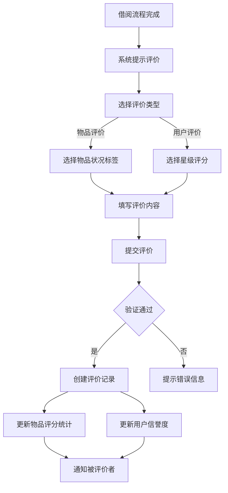
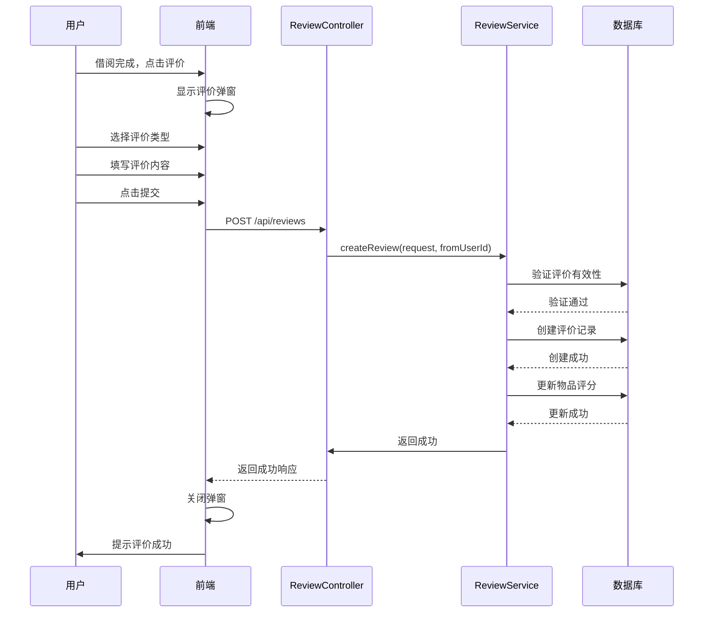

# 5.5 评价系统模块实现

## 5.5.1 功能描述与业务流程

评价系统模块用于构建社区信任机制，借用者和物品所有者可以在借阅完成后相互评价。评价内容包含评分和文字评价两部分，为其他用户提供参考依据。

评价系统模块包含以下核心功能：物品评价功能允许借用者对物品质量和使用体验进行评价，采用预设标签方式，简化评价流程。用户评价功能允许双方对彼此的租借行为进行评价，采用星级评分方式，更加客观。评价查询功能允许用户查看物品评价列表和用户收到的评价列表。

评价标签包括：物品完好、已消毒、功能正常、包装仔细、准时归还等。评价完成后不可修改和删除，确保评价的真实性和可信度。

### 业务流程图



## 5.5.2 时序分析

### 创建评价时序图



## 5.5.3 页面设计与实现

### 评价弹窗设计

评价弹窗采用Teleport组件渲染到body下，使用Transition组件实现动画效果。弹窗由半透明遮罩层和白色内容卡片组成。

弹窗头部包含标题"发表评价"和关闭按钮。标题下方是评价类型切换组件，使用胶囊形按钮组实现。"评价物品"和"评价用户"两个选项互斥选中。

物品评价区包含物品信息卡片和状况标签选择器。物品信息卡片显示物品缩略图和名称。状况标签采用2列网格布局，每行显示2个标签按钮。标签按钮使用emoji图标和文字组合，选中时显示金色边框和浅金色背景。

用户评价区包含星级评分器和评分文字说明。星级评分器由5颗星星组成，鼠标悬停时星星放大，选中后填充黄色。星星下方显示评分文字描述。

评价内容区包含多行文本输入框和字数统计。文本框最多输入500字符，输入时实时显示当前字符数。

弹窗底部包含取消按钮和提交评价按钮。两个按钮并排显示，取消按钮为白色背景，提交按钮为金色背景。

### 评价标签设计

物品评价使用预设标签方式，简化用户操作。标签包括：

| 标签值 | 标签文字 | emoji图标 |
|-------|---------|----------|
| ITEM_PERFECT | 物品完好 | ✨ |
| ITEM_STERILIZED | 已消毒 | 🧹 |
| ITEM_FUNCTIONAL | 功能正常 | ✔ |
| ITEM_WELL_PACKAGED | 包装仔细 | 📦 |
| USER_ON_TIME | 准时归还 | ⏰ |
| USER_COMMUNICATIVE | 沟通顺畅 | 💬 |

### 数据有效性检查

评价提交前进行以下数据有效性检查：

评价类型验证：必须选择"物品评价"或"用户评价"。

物品评价验证：必须选择至少一个物品状况标签，评价内容不能为空且不超过500字符。

用户评价验证：必须选择星级评分（1-5星），评价内容不能为空且不超过500字符。

重复评价验证：系统验证用户是否已对同一借阅记录提交过该类型评价，防止重复提交。

### 核心代码实现

评价表单数据处理：

```typescript
const handleSubmit = async () => {
  if (!canSubmit.value || !props.borrowInfo) return

  submitting.value = true
  try {
    const data: any = {
      borrowId: props.borrowInfo.id,
      targetType: reviewType.value,
      content: content.value.trim()
    }

    if (reviewType.value === 'ITEM') {
      data.ratingTag = selectedTag.value
    } else {
      data.ratingStar = ratingStar.value
    }

    await reviewApi.createReview(data)
    emit('success', reviewType.value)
    handleClose()
  } catch (error: any) {
    alert(error.message || '评价失败')
  } finally {
    submitting.value = false
  }
}
```

评价提交条件判断：

```typescript
const canSubmit = computed(() => {
  if (reviewType.value === 'ITEM') {
    return selectedTag.value && content.value.trim().length > 0
  } else {
    return ratingStar.value > 0 && content.value.trim().length > 0
  }
})
```

### 页面效果展示

评价弹窗效果如下：

- 弹窗居中显示，带有圆角和阴影效果
- 半透明黑色遮罩背景，点击可关闭弹窗
- 评价类型切换平滑，选中状态清晰
- 物品标签使用emoji图标，直观易懂
- 星级评分交互流畅，悬停放大效果自然
- 字数统计实时更新，输入框边框在获得焦点时变为金色
- 提交按钮在满足条件时可用，不满足时显示半透明禁用状态
