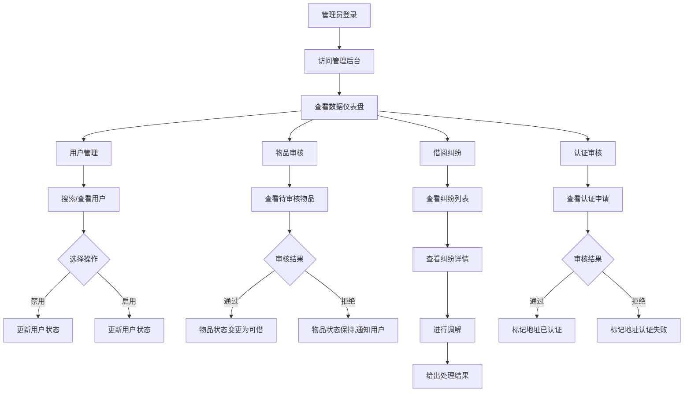
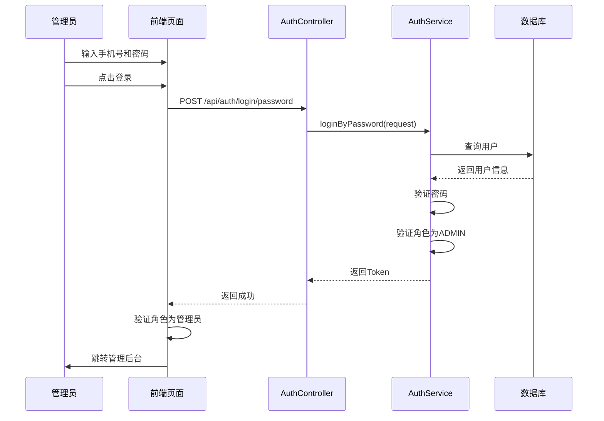
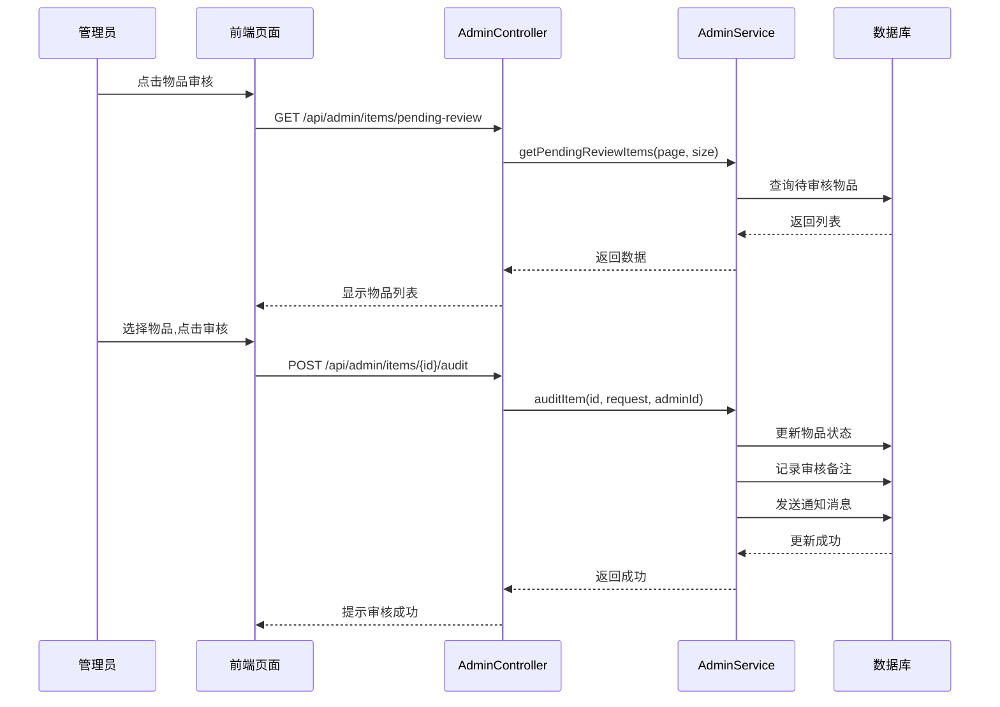

# 5.6 管理员后台模块实现

## 5.6.1 功能描述与业务流程

管理员后台模块为平台运营者提供系统管理功能，包括数据仪表盘、用户管理、物品审核、借阅纠纷处理和认证审核五个子模块。管理员通过专用后台界面管理平台运营，保障系统正常秩序。

管理员后台模块包含以下核心功能：数据仪表盘功能以可视化方式展示平台运营数据，包括用户总数、物品总数、借阅总次数等关键指标。用户管理功能支持查看用户列表、搜索用户、禁用和启用用户账号。物品审核功能对待审核物品进行审批操作，支持通过或拒绝操作。借阅纠纷功能处理用户提交的借阅纠纷申诉。认证审核功能审核用户提交的小区地址认证申请。

### 业务流程图



## 5.6.2 时序分析

### 管理员登录时序图



### 物品审核时序图



## 5.6.3 页面设计与实现

### 后台整体布局设计

管理后台采用左右分栏布局：左侧为深色侧边栏导航，右侧为浅色内容主区域。

侧边栏宽度为260px（展开状态）或76px（折叠状态），深色背景（#1A1614）。顶部显示应用Logo和管理员标识。中间为导航菜单，包含数据仪表盘、物品审核、借阅纠纷、认证审核、用户管理五个入口。底部显示当前管理员信息。导航菜单项悬停时显示浅金色背景，选中时显示金色渐变背景。

主内容区域顶部为页面标题栏，显示当前页面标题和面包屑导航。主体区域为各个功能模块的内容，采用卡片式布局。底部为版权信息。

### 数据仪表盘设计

数据仪表盘以卡片网格形式展示关键数据指标。卡片数量为大屏幕4列、中等屏幕2列。数据指标包括：

总用户数（蓝色卡片）、总物品数（绿色卡片）、总借阅数（橙色卡片）、待审核物品数（红色卡片）、待处理纠纷数（紫色卡片）、待审核认证数（青色卡片）。

每个卡片包含图标、指标数值和指标名称。卡片使用对应颜色的浅色背景，图标使用相同颜色的深色圆形背景。

### 物品审核页面设计

物品审核页面顶部显示待审核物品数量统计。下方为物品列表，采用表格形式展示。表格列包括物品名称、发布者、分类、发布时间和操作。操作列包含查看详情、通过按钮和拒绝按钮。

点击拒绝按钮时弹出审核拒绝表单，管理员需要填写拒绝原因。

### 用户管理页面设计

用户管理页面顶部显示搜索框，管理员可以输入手机号或昵称搜索用户。下方为用户列表表格，表格列包括用户信息（头像、昵称、手机号）、信用分、角色、状态和操作。操作列包含禁用按钮和启用按钮，按钮根据用户当前状态动态显示。

### 借阅纠纷页面设计

借阅纠纷页面显示所有纠纷记录列表。表格列包括纠纷ID、关联借阅、举报人、原因、状态和操作。状态显示为彩色标签：待处理显示黄色、调查中显示蓝色、已解决显示绿色、已驳回显示灰色。操作列包含查看详情和处理按钮。

点击处理按钮时弹出纠纷处理表单，管理员选择处理结果并填写处理说明。

### 认证审核页面设计

认证审核页面显示待审核的地址认证申请列表。列表项显示用户头像、昵称、申请地址信息和申请时间。操作列包含通过按钮和拒绝按钮。

### 数据有效性检查

管理员后台进行以下数据有效性检查：

登录验证：验证用户角色是否为ADMIN，非管理员用户拒绝访问。

审核拒绝原因：拒绝物品审核时，必须填写拒绝原因，原因最多500字符。

纠纷处理说明：处理纠纷时，必须选择处理结果（支持某一方、拒绝申诉等），并填写处理说明。

### 核心代码实现

侧边栏导航实现：

```typescript
const navItems = [
  { key: 'dashboard', label: '数据仪表盘', icon: 'solar:chart-square-bold' },
  { key: 'items', label: '物品审核', icon: 'solar:box-bold' },
  { key: 'borrows', label: '借阅纠纷', icon: 'solar:shield-warning-bold' },
  { key: 'verifies', label: '认证审核', icon: 'solar:verified-check-bold' },
  { key: 'users', label: '用户管理', icon: 'solar:users-group-rounded-bold' },
]

const currentTitle = computed(() => {
  const item = navItems.find(n => n.key === activeTab.value)
  return item?.label || '管理后台'
})
```

权限验证实现：

```typescript
const checkAdmin = () => {
  if (!authStore.user || authStore.user.role !== 'ADMIN') {
    router.push('/login')
    return false
  }
  return true
}
```

### 页面效果展示

管理后台整体效果如下：

- 深色侧边栏与浅色主内容区形成鲜明对比
- 导航菜单层次清晰，图标和文字组合直观易识别
- 数据仪表盘卡片使用颜色区分不同类型的数据
- 表格布局整齐，操作按钮清晰可见
- 审核表单弹窗交互友好，操作结果反馈及时
