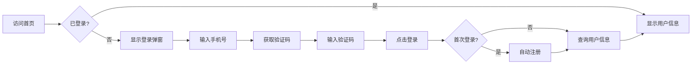

# 5.1 用户认证模块实现

## 5.1.1 功能概述与效果展示

用户认证模块承担平台身份识别与权限控制的基础职责，提供手机号验证码登录、密码登录、个人信息维护三大功能群。该模块是用户进入平台的唯一入口，所有后续业务操作均依赖此模块建立的身份上下文。

如图5.1所示，登录界面采用极简设计，仅保留手机号输入框、验证码获取按钮和登录确认按钮。首次登录的用户系统自动完成注册流程，无需额外的注册步骤，降低了使用门槛。登录成功后，顶部导航栏实时显示用户头像和昵称，点击头像下拉菜单可进入个人中心或执行退出操作。

图5.1 登录流程交互图

个人中心页面采用卡片式布局，顶部展示用户头像、昵称、信用分和社区信息，中部以标签页形式组织"我的发布""我的借入""我的借出""待处理"四个功能区块，底部提供设置入口。信用分以环形进度条可视化展示，范围0-10分，新用户初始值为10分。

## 5.1.2 前端交互与数据流转

### 登录表单交互逻辑

登录表单采用受控组件模式管理输入状态，手机号输入框实施实时格式校验。校验规则为：仅允许输入数字，长度限制11位，首位必须为1，第二位为3-9之间的数字。当输入长度达到11位且符合号段规则时，"获取验证码"按钮从禁用状态切换为可用状态，按钮颜色由灰色变为品牌主色。

验证码获取按钮具备倒计时防重发机制。点击后按钮进入60秒冷却期，显示"已发送(59s)"字样，期间不可再次点击。该状态通过前端定时器维护，页面刷新后从服务器查询剩余冷却时间，防止用户通过刷新绕过限制。

表单提交前执行完整性校验：手机号非空、手机号格式正确、验证码非空、验证码长度为6位。任一校验不通过即阻止提交并在对应输入框下方显示红色提示文字。提交过程中登录按钮显示加载动画并禁用，防止重复提交。

### 状态管理与路由守卫

用户登录状态通过Pinia全局状态库管理，存储字段包括用户ID、昵称、头像URL、JWT令牌、令牌过期时间。状态库提供登录、登出、刷新令牌三个核心方法。

路由系统配置导航守卫，访问需要登录的页面时自动检查状态库中的令牌有效性。令牌过期前5分钟， Axios请求拦截器自动触发静默刷新，使用Refresh Token换取新的访问令牌，整个过程对用户无感知。若刷新失败或令牌已过期，强制跳转至登录页并携带当前路径作为回跳参数。

### JWT令牌管理策略

前端接收到的JWT令牌分为访问令牌和刷新令牌。访问令牌有效期2小时，存储于内存中的Pinia状态库；刷新令牌有效期7天，存储于localStorage。该设计兼顾安全性与用户体验：访问令牌不持久化可防止XSS攻击窃取，刷新令牌长期有效避免频繁重新登录。

## 5.1.3 后端处理逻辑

### 登录请求处理流程

如表5.1所示，后端处理登录请求遵循严格的步骤化流程，每个步骤设置独立的校验点和异常分支。

表5.1 登录处理步骤

| 步骤 | 处理内容 | 校验规则 | 异常分支 |
|:---:|:--------|:--------|:--------|
| 1 | 接收手机号和验证码 | 参数非空 | 返回参数错误 |
| 2 | 查询验证码缓存 | Redis键存在且未过期 | 返回验证码无效 |
| 3 | 比对验证码 | 输入值与缓存值一致 | 返回验证码错误 |
| 4 | 查询用户记录 | 数据库存在性检查 | 进入自动注册流程 |
| 5 | 生成双令牌 | JWT签名，设置过期时间 | — |
| 6 | 返回用户信息 | 组装用户基础资料 | — |

验证码存储采用Redis键值对，键格式为"verify:{手机号}"，值即为6位数字验证码，过期时间5分钟。该设计确保验证码的时效性和唯一性，同一手机号在缓存未过期前重复获取验证码将覆盖旧值。

### 自动注册机制

首次登录的用户触发自动注册流程。系统生成随机昵称（格式为"邻居{随机4位数字}"），设置默认头像URL，初始化信用分为10分，账号状态设为ACTIVE。用户后续可在个人中心修改昵称和头像。该机制消除了独立的注册页面，将注册成本降至零。

### 认证过滤器链路

后端安全框架配置JWT认证过滤器，拦截所有受保护接口的请求。过滤器执行链路如下：从请求头提取Authorization字段，剥离Bearer前缀得到令牌，使用HS256算法和配置密钥验证签名，解析载荷获取用户ID和角色，将用户信息封装为Authentication对象存入SecurityContext。后续Controller通过SecurityContext直接获取当前用户身份，无需重复解析令牌。

## 5.1.4 难点与解决方案

### 令牌过期与并发请求

**问题场景**：用户长时间停留页面后令牌过期，此时触发多个并行请求（如页面初始化同时请求用户信息和消息数量），每个请求都检测到401错误并尝试刷新令牌，导致刷新接口被重复调用。

**解决方案**：前端实现请求队列锁机制。当检测到令牌即将过期时，第一个请求触发刷新操作并将后续请求加入等待队列。刷新成功后使用新令牌重试队列中的所有请求，确保仅执行一次刷新操作。后端刷新接口通过Redis分布式锁防止同一Refresh Token被并发使用。

### 跨设备登录状态同步

**问题场景**：用户在设备A登录后，又在设备B登录。设备A的令牌在过期前仍然有效，但用户期望设备A被踢下线。

**解决方案**：引入令牌版本号机制。用户表中维护token_version字段，登录时递增并嵌入JWT载荷。过滤器验证令牌时比对载荷中的版本号与用户表当前版本号，不一致则判定令牌失效。该方案实现单点登录效果，新登录自动使旧令牌失效。
