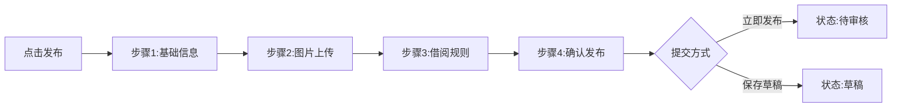

# 5.2 物品管理模块实现

## 5.2.1 功能概述与效果展示

物品管理模块是邻里共享平台的核心资源管理单元，支撑共享物品从创建到下架的完整生命周期。该模块面向两类用户角色提供差异化功能：普通用户可发布物品、管理个人物品、浏览他人物品；管理员可对上架申请进行审核。

如图5.2所示，物品发布流程采用分步引导设计。第一步填写基础信息（名称、分类、描述），第二步上传物品图片（支持拖拽排序），第三步设定借阅规则（租金、押金、归还要求），第四步确认发布。每个步骤顶部显示进度指示器，底部提供上一步/下一步导航按钮，已完成的步骤可随时回退修改。

图5.2 物品发布流程图

物品详情页采用左右分栏布局。左侧为图片轮播区，支持手势滑动和缩略图导航，主图区域双击放大查看。右侧为信息区，顶部展示物品名称和状态标签（可借用/借用中/已下架），中部显示所有者头像和昵称（点击可查看个人主页），下部为价格信息（日租金和押金分开展示）、物品描述和归还要求列表。底部固定操作栏，根据物品状态和当前用户身份动态显示"申请借阅""编辑""下架"等按钮。

物品列表页采用瀑布流卡片布局，每张卡片包含主图、名称、价格、社区标签。列表顶部提供搜索框和筛选器（分类下拉、社区下拉、排序方式），筛选条件变更后列表即时刷新。空状态展示插画和引导文案，引导用户成为首位发布者。

## 5.2.2 前端交互与数据流转

### 图片上传与预览

物品图片上传组件支持多文件选择和拖拽上传。文件选择后前端执行预校验：文件类型限制为JPEG/PNG/WEBP，单文件大小不超过10MB，单次上传不超过9张。校验通过的文件生成本地Blob URL进行即时预览，预览图显示删除按钮和设为封面按钮。

上传进度通过XMLHttpRequest的progress事件实时反馈，每张图片显示独立进度条。全部图片上传完成后，组件返回服务器分配的图片路径数组，按用户拖拽排序后的顺序存入表单状态。

### 表单状态与草稿机制

发布表单使用响应式对象管理状态，包含基础信息、图片列表、借阅规则三个子对象。表单变更时自动触发本地校验，校验规则包括：名称2-100字符、描述不超过2000字符、日租金和押金为非负数、至少上传1张图片。

草稿保存功能将当前表单状态序列化为JSON字符串存储于localStorage，键名为"item_draft_{用户ID}"。用户下次进入发布页时自动检测草稿存在性，若存在则弹窗提示"是否继续编辑上次草稿"。草稿数据与正式提交的数据结构完全一致，可直接用于最终发布。

### 列表筛选与缓存

物品列表页使用组合式API管理筛选状态和分页数据。筛选条件（关键词、分类ID、社区ID、排序方式）封装为响应式对象，任一条件变更自动触发重新查询。列表数据采用追加模式加载，首次加载8条，滚动至底部时自动加载下一页。

前端实现请求去重机制：相同筛选条件下的重复请求（如用户快速切换分类）通过防抖处理，仅执行最后一次请求。返回的数据缓存于内存中，5分钟内重复访问相同筛选条件直接读取缓存，减少服务器压力。

## 5.2.3 后端处理逻辑

### 物品创建与审核流程

如表5.2所示，物品创建请求在后端经历完整的处理链路，包括数据校验、敏感词检测、状态初始化和关联数据保存。

表5.2 物品创建处理步骤

| 步骤 | 处理内容 | 校验规则 | 异常分支 |
|:---:|:--------|:--------|:--------|
| 1 | 解析请求参数 | 必填字段完整性 | 返回参数错误 |
| 2 | 校验用户身份 | 当前用户已登录 | 返回未认证 |
| 3 | 校验分类有效性 | 分类ID存在于数据库 | 返回分类不存在 |
| 4 | 敏感词检测 | 名称和描述不含敏感词 | 返回内容违规 |
| 5 | 创建物品实体 | 设置所有者、社区、初始状态 | — |
| 6 | 保存图片关联 | 按顺序创建ItemImage记录 | — |
| 7 | 保存物品记录 | 写入数据库，返回物品ID | — |

物品创建后初始状态为"待审核"，管理员在后台审核通过后状态变更为"可借用"。审核流程采用乐观锁控制并发，物品表version字段在更新时自动递增，防止同时修改导致的数据覆盖。

### 列表查询与筛选逻辑

物品列表查询支持多维度组合筛选，后端构建动态查询条件。筛选维度包括：状态（可借用/借用中）、分类ID、社区ID、关键词（匹配名称和描述）。排序方式支持：最新发布、最多浏览、最多借阅。

关键词搜索采用数据库全文索引或LIKE模糊匹配（根据数据量动态选择）。高并发场景下，热门列表查询结果缓存于Caffeine本地缓存，缓存有效期2分钟，物品状态变更时自动清除对应缓存。

### 图片存储策略

图片文件存储于服务器本地文件系统，路径格式为"uploads/items/{UUID}.{扩展名}"，数据库仅保存相对路径。该方案降低数据库压力，便于后期迁移至对象存储服务。图片上传时生成缩略图（最大边长800px），列表页使用缩略图减少带宽消耗，详情页使用原图保证清晰度。

## 5.2.4 难点与解决方案

### 并发借阅冲突

**问题场景**：两个用户同时浏览同一件可借用物品并提交借阅申请，可能导致重复借阅或超借。

**解决方案**：采用数据库乐观锁机制。物品表设置version字段，借阅申请时校验物品状态为"可借用"并读取当前版本号，更新状态时要求版本号匹配。若版本号不一致（说明期间被其他请求修改），则返回"物品状态已变更"错误，前端提示用户刷新页面重试。该方案无需数据库行锁，性能开销低且有效防止并发冲突。

### 图片上传中断恢复

**问题场景**：用户上传多张图片时网络中断，已上传部分图片但表单未提交，再次进入页面需要重新上传全部图片。

**解决方案**：实现断点续传机制。每张图片上传前计算MD5哈希值，服务端检查是否已存在相同哈希值的文件。若存在则直接返回已有路径，无需重复上传。该机制同时实现秒传功能，同一图片多次上传仅实际传输一次。
