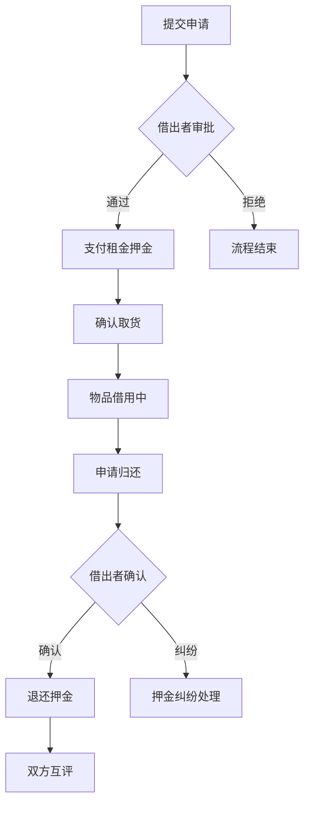

# 5.3 借阅管理模块实现

## 5.3.1 功能概述与效果展示

借阅管理模块实现物品共享的核心业务流程，连接借入者与借出者完成从申请到归还的完整闭环。该模块是平台商业价值的关键承载点，涉及状态流转、资金结算、信用评估等多个子系统的协同。

如图5.3所示，借阅流程在用户界面中以时间轴形式呈现。借入者视角的时间轴节点包括：提交申请、等待审批、支付租金、确认取货、申请归还、等待确认、评价对方。每个节点显示发生时间和操作人，当前节点高亮显示，已完成节点显示绿色对勾，待处理节点显示灰色圆点。时间轴右侧展示对应节点的详细信息，如审批通过时显示借出者留言，支付节点显示支付金额和交易号。

图5.3 借阅流程时间轴节点图

个人中心的借阅管理页面采用双标签页设计："我的借入"展示当前用户作为借入者的所有记录，"我的借出"展示作为借出者的所有记录。每条记录以卡片形式呈现，左侧显示物品缩略图，中部显示物品名称和当前状态标签，右侧显示操作按钮（根据状态动态变化）。待处理记录置顶显示并附加红色角标提示。

## 5.3.2 前端交互与数据流转

### 借阅申请表单

借阅申请表单嵌入于物品详情页底部，点击"申请借阅"按钮后从底部滑出半屏弹窗。弹窗内包含日期选择器（借阅起止日期）、用途文本域、同意协议复选框三个核心元素。

日期选择器限制可选范围：开始日期最早为明天，结束日期不早于开始日期，且不超过30天。选择日期后前端实时计算借阅天数和预估租金（日租金乘以天数），金额动态显示在表单底部。用途文本域限制500字符，输入时显示剩余字数。

表单提交前校验：起止日期已选择、用途非空、协议已勾选。提交后按钮进入加载状态，成功后关闭弹窗并跳转至借阅详情页，失败时显示错误提示（如"物品已被他人借阅"）。

### 审批操作交互

借出者收到借阅申请后，在"我的借出"列表看到待审批记录。点击记录进入详情页，顶部显示申请者信息（头像、昵称、信用分）和申请详情（日期、用途）。中部提供两个操作按钮：绿色"同意"按钮和灰色"拒绝"按钮。

点击"同意"后弹出二次确认对话框，显示"同意后将锁定物品，借入者支付后即可取货"。确认后物品状态变更为"借用中"，同时向借入者发送支付提醒通知。点击"拒绝"后弹出输入框要求填写拒绝原因（选填），提交后向借入者发送拒绝通知并释放物品状态。

### 归还确认流程

借入者在借阅详情页点击"申请归还"后，物品状态变更为"归还待确认"，同时向借出者发送归还提醒。借出者收到通知后进入详情页，检查物品完好后点击"确认归还"，系统触发押金退还流程。

若借出者发现物品损坏或丢失，可点击"申请扣款"进入纠纷处理流程，填写扣款金额和原因。此时借阅状态锁定为"纠纷处理中"，双方需等待管理员仲裁。

## 5.3.3 后端处理逻辑

### 状态机引擎

借阅模块的核心是严谨的状态机引擎，如表5.3所示，定义了六个合法状态和状态间的转换规则。

表5.3 借阅状态转换规则

| 当前状态 | 允许操作 | 目标状态 | 前置条件 |
|:--------|:--------|:--------|:--------|
| 申请中 | 审批通过 | 已批准 | 操作者为借出者 |
| 申请中 | 审批拒绝 | 已拒绝 | 操作者为借出者 |
| 已批准 | 支付完成 | 借用中 | 支付金额正确 |
| 借用中 | 申请归还 | 归还待确认 | 操作者为借入者 |
| 借用中 | 提醒归还 | 借用中 | 当日提醒次数<3 |
| 归还待确认 | 确认归还 | 已归还 | 操作者为借出者 |
| 归还待确认 | 申请扣款 | 纠纷处理中 | 操作者为借出者 |

状态转换服务在执行任何状态变更前，严格校验当前状态是否允许目标操作、操作者是否具有权限、业务前置条件是否满足。任一校验失败即抛出业务异常，状态保持不变。

### 借阅创建处理流程

借阅申请提交后，后端执行以下处理步骤：

第一步，校验物品存在性和可借用状态。查询物品记录，确认状态为"可借用"且当前用户非物品所有者。第二步，校验用户信用分是否满足物品要求。若物品设置最低信用分要求，当前用户信用分低于该值则拒绝申请。第三步，校验日期合法性。开始日期不早于明天，结束日期不早于开始日期，借阅天数不超过30天。第四步，创建借阅记录。设置借入者为当前用户，借出者为物品所有者，状态为"申请中"。第五步，更新物品状态为"借用中"，防止并发申请。第六步，发送审批通知给借出者，通过WebSocket实时推送和站内消息双通道触达。

### 提醒归还限制机制

提醒功能设置频率限制防止骚扰。每个借阅记录每日最多提醒3次，每次提醒间隔不少于2小时。后端通过remind_count和last_remind_at两个字段控制频率：检查当日remind_count是否已达上限，检查当前时间与last_remind_at的间隔是否超过2小时。校验通过后递增remind_count并更新last_remind_at，同时向借入者发送提醒通知。

## 5.3.4 难点与解决方案

### 并发申请冲突

**问题场景**：两个用户同时向同一件可借用物品提交申请，后端可能同时通过两条申请的物品状态校验，导致重复借阅。

**解决方案**：采用数据库乐观锁。物品表设置version字段，借阅申请时读取物品记录并获取当前version值，更新物品状态为"借用中"时要求version匹配。若version不一致说明期间被其他请求修改，当前请求失败并提示用户"物品已被他人申请"。该方案无需数据库锁等待，高并发下性能优异。

### 逾期未归还处理

**问题场景**：借入者超过约定归还日期仍未申请归还，系统需要识别逾期状态并触发相应处理。

**解决方案**：设计定时任务每日凌晨扫描所有"借用中"状态的借阅记录，比对当前日期与约定归还日期。逾期记录自动更新状态为"已逾期"，同时向借入者发送逾期提醒通知，向借出者发送逾期告警通知。逾期记录影响借入者信用分计算，多次逾期将降低信用分进而限制后续借阅权限。

### 支付超时释放

**问题场景**：借出者审批通过后，借入者长时间未支付，物品一直处于锁定状态无法被其他用户申请。

**解决方案**：审批通过后设置支付倒计时。后端记录审批通过时间，定时任务检查超过24小时未支付的借阅记录，自动取消该记录并将物品状态恢复为"可借用"。前端在借阅详情页显示倒计时"请在23小时15分钟内完成支付"，增强用户紧迫感。
