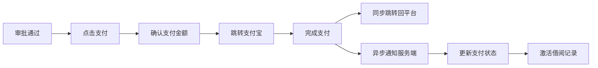

# 5.4 支付结算模块实现

## 5.4.1 功能概述与效果展示

支付结算模块处理借阅流程中的资金往来，是平台商业闭环的关键环节。该模块集成支付宝沙箱环境，模拟真实支付场景，支持租金支付和押金退还两种资金流动方向。

如图5.4所示，支付流程在用户界面中以步骤条形式呈现。借入者点击"去支付"后进入支付确认页，顶部显示支付金额明细（租金和押金分开展示），中部展示物品信息和借阅日期，底部为支付按钮。点击支付后前端渲染支付宝支付表单并自动提交跳转，用户完成支付后同步跳转回平台页面，同时后端接收支付宝异步通知更新订单状态。

图5.4 支付流程步骤图

押金退还流程在借阅归还确认后触发。借出者确认归还时，系统弹出押金处理弹窗，提供"全额退还""部分扣除""全额扣除"三个选项。选择"全额退还"后系统立即调用支付宝退款接口，资金原路退回借入者账户。选择扣除选项时需填写扣除金额和原因，进入押金纠纷处理流程。

## 5.4.2 前端交互与数据流转

### 支付确认页

支付确认页在借阅审批通过后展示，页面顶部显示倒计时"请在23小时59分钟内完成支付，超时将自动取消"。金额区域使用大字号突出显示总金额，下方展开明细列表：租金（日租金×天数）、押金（物品设定金额）、合计。

支付按钮采用品牌主色，点击后进入加载状态，按钮文字变为"正在连接支付宝..."并禁用。前端向服务端请求创建支付订单，接收返回的支付宝表单HTML字符串，动态创建表单元素并自动提交，实现无感跳转至支付宝收银台。

支付完成后，支付宝同步跳转回平台指定的回调页面。前端从URL参数中提取支付结果标识，向服务端查询该笔支付的最新状态。若支付成功，显示成功页面并提供"查看借阅详情"入口；若支付失败或取消，显示失败页面并提供"重新支付"按钮。

### 押金处理弹窗

借出者确认归还时弹出押金处理弹窗，默认选中"全额退还"选项。三个选项以卡片形式横向排列，选中项显示边框高亮。选择"部分扣除"或"全额扣除"后，下方展开扣除原因输入框（必填）和证据图片上传区（选填）。

输入框限制500字符，实时显示剩余字数。图片上传组件支持最多3张，单张不超过5MB。提交时校验：扣除金额不超过押金总额、原因非空、图片格式正确。校验通过后进入纠纷处理流程，状态变更为"纠纷处理中"。

## 5.4.3 后端处理逻辑

### 支付订单创建流程

如表5.4所示，支付订单创建遵循严格的步骤化流程，确保资金安全和数据一致性。

表5.4 支付订单创建步骤

| 步骤 | 处理内容 | 校验规则 | 异常分支 |
|:---:|:--------|:--------|:--------|
| 1 | 接收借阅ID | 参数非空 | 返回参数错误 |
| 2 | 查询借阅记录 | 状态为"已批准" | 返回状态异常 |
| 3 | 校验操作者身份 | 当前用户为借入者 | 返回无权操作 |
| 4 | 查询支付记录 | 不存在待支付订单 | 返回订单已存在 |
| 5 | 计算支付金额 | 租金=日租金×天数 | — |
| 6 | 生成商户订单号 | 格式：时间戳+随机数 | — |
| 7 | 保存支付记录 | 状态"待支付" | — |
| 8 | 调用支付宝下单 | 传入订单号和金额 | 返回支付服务异常 |
| 9 | 返回支付表单 | HTML表单字符串 | — |

商户订单号采用唯一性设计，格式为"PAY{yyyyMMddHHmmss}{6位随机数}"，确保全局唯一且可按时间排序。订单号生成后持久化至数据库，作为后续异步通知的关联键。

### 异步通知处理流程

支付宝支付完成后，通过HTTPS POST请求向平台服务端发送异步通知。服务端处理流程如下：

第一步，接收通知参数。支付宝通知包含商户订单号、支付宝交易号、交易状态、签名等字段。第二步，验证签名。使用支付宝公钥对通知参数进行RSA验签，确认通知来源真实性。验签失败则直接返回"fail"，不做任何业务处理。第三步，查询支付记录。根据商户订单号查询数据库中的支付记录，确认记录存在且状态为"待支付"。第四步，幂等性校验。检查该笔交易是否已处理过，已处理则直接返回"success"，防止重复处理。第五步，更新支付状态。将支付记录状态变更为"已支付"，记录支付宝交易号和支付时间。第六步，更新借阅状态。将关联的借阅记录状态从"已批准"变更为"借用中"，激活借阅周期。第七步，发送通知。向借入者和借出者发送支付成功通知。第八步，返回"success"。告知支付宝该笔通知已正确处理。

### 押金退还流程

全额退还流程相对简单：校验借阅状态为"已归还"、操作者为物品所有者、支付记录状态为"已支付"。校验通过后调用支付宝退款接口，传入原商户订单号和退款金额。退款成功后更新支付记录状态为"已退款"，记录退款时间和退款交易号。

部分扣除流程涉及纠纷处理：校验扣除金额不超过押金总额，创建押金纠纷记录，状态设为"处理中"。纠纷记录关联借阅ID、支付ID、扣除金额和原因。管理员在后台审核通过后，调用支付宝退款接口退还剩余金额，更新纠纷状态为"已解决"。

## 5.4.4 难点与解决方案

### 异步通知可靠性

**问题场景**：支付宝异步通知可能因网络原因未能送达，或平台服务端处理通知时发生异常导致状态未更新，造成支付状态不一致。

**解决方案**：采用双重保障机制。第一重是异步通知+主动查询：服务端收到通知后处理，同时设置定时任务在通知后5分钟主动查询支付宝订单状态，确保状态最终一致。第二重是幂等性设计：支付记录状态只能从"待支付"变更为"已支付"，重复通知不会导致重复处理。第三重是对账机制：每日凌晨与支付宝账单进行对账，发现不一致记录自动修正。

### 退款金额精度

**问题场景**：租金计算涉及小数乘法（如日租金9.99元×3天=29.97元），支付宝接口要求金额精确到分，但浮点数计算可能产生精度误差。

**解决方案**：全程使用整数表示金额，单位为分。数据库存储和接口传输均以分为单位，前端展示时除以100并格式化为两位小数。该方案彻底避免浮点数精度问题，确保资金计算100%准确。

### 支付超时处理

**问题场景**：用户创建支付订单后长时间未完成支付，支付宝订单超时关闭，但平台数据库中的支付记录仍显示"待支付"。

**解决方案**：设置支付订单有效期为24小时，创建订单时记录过期时间。定时任务每小时扫描一次待支付记录，对超过有效期的记录自动关闭，并释放关联的借阅记录（状态回退为"已批准"，允许重新发起支付）。前端倒计时显示剩余支付时间，超时后自动刷新页面并提示"支付已过期，请重新发起"。
