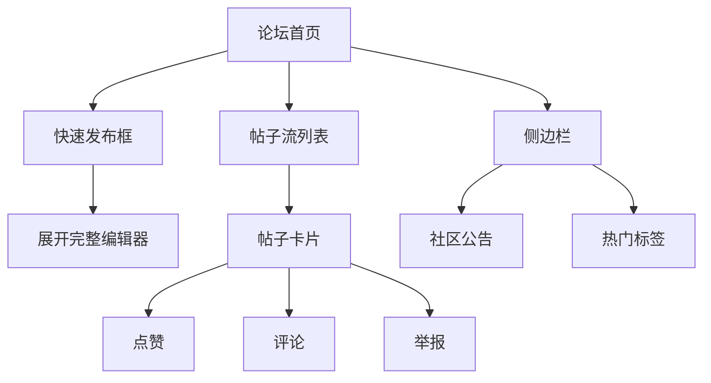

# 5.5 论坛交流模块实现

## 5.5.1 功能概述与效果展示

论坛交流模块为社区用户提供情感联结和信息分享的场所，是提升平台用户粘性的重要功能。该模块支持四种帖子类型（日常分享、感谢信、求助、技能交换），每种类型对应不同的社区场景和交互模式。

如图5.5所示，论坛首页采用左右分栏布局。左侧为主内容区，顶部是快速发布框（点击展开完整编辑器），下方为帖子流列表。每条帖子卡片包含发布者头像、昵称、发布时间、帖子类型标签、内容摘要、图片预览、点赞数和评论数。右侧为侧边栏，展示社区公告、热门标签和活跃用户排行。

图5.5 论坛首页布局结构图

帖子详情页采用单列沉浸式布局。顶部为帖子完整内容，支持多图轮播和标签展示。中部为互动操作栏（点赞、评论、分享），底部为评论区。评论支持嵌套回复结构，一级评论直接关联帖子，二级回复关联一级评论，形成树状讨论结构。每条评论显示评论者头像、昵称、内容、时间和点赞数。

## 5.5.2 前端交互与数据流转

### 帖子发布编辑器

论坛提供两种发布方式：首页的快速发布框和完整编辑器。快速发布框仅包含文本输入区和类型选择按钮，适合发布简短内容。点击输入区后自动展开完整编辑器，增加标题输入、图片上传、标签选择等功能。

类型选择以标签按钮组形式呈现，四个选项（日常、感谢、求助、技能交换）横向排列，选中项高亮显示。不同类型影响帖子的展示样式：感谢信类型在卡片左上角显示红色心形图标，求助类型显示蓝色问号图标。

图片上传组件支持最多9张图片，上传后显示缩略图网格，支持拖拽排序和删除。标签输入采用自动补全模式，输入"#"后弹出热门标签建议列表，也可手动输入新标签。

发布前执行敏感词前端预检：将输入内容与本地敏感词库（定期从服务端同步）进行匹配，命中敏感词时在输入框下方显示黄色警告"内容可能包含敏感词，请修改后发布"。该预检为非阻塞式，用户仍可提交，最终拦截由服务端完成。

### 帖子列表与筛选

帖子列表支持两种排序方式：最新（按发布时间倒序）和最热（按点赞数+评论数+浏览量加权计算）。排序切换以标签页形式置于列表顶部，切换时列表平滑过渡刷新。

类型筛选与排序独立工作，用户可同时选择"最热排序"和"求助类型"，查看最热门的求助帖子。筛选条件变更时，列表重置至第一页并重新加载。

列表滚动采用无限加载模式，首次加载10条，滚动至底部时自动加载下一页。加载过程中底部显示加载动画，全部加载完毕后显示"没有更多了"提示。列表数据缓存于内存中，5分钟内返回同一筛选条件直接读取缓存。

### 点赞与评论交互

点赞按钮采用Toggle模式，未点赞时显示空心图标，点赞后显示实心图标并伴随缩放动画。点赞数实时更新，若用户已点赞则显示为"已赞"状态。点赞操作防抖处理，快速连续点击仅发送一次请求。

评论输入框固定在帖子详情页底部，点击后自动聚焦并弹出软键盘。输入框高度自适应，支持多行文本。提交评论后，新评论以动画形式插入列表顶部，同时评论计数递增。

回复评论时，点击评论右侧的回复按钮，输入框上方显示"回复@用户名"的提示，提交后该评论作为二级回复显示在原评论下方，缩进展示。

## 5.5.3 后端处理逻辑

### 帖子创建与审核流程

如表5.5所示，帖子创建请求在后端经历内容审核和持久化两个主要阶段。

表5.5 帖子创建处理步骤

| 步骤 | 处理内容 | 校验规则 | 异常分支 |
|:---:|:--------|:--------|:--------|
| 1 | 解析请求参数 | 内容非空 | 返回参数错误 |
| 2 | 校验用户身份 | 当前用户已登录 | 返回未认证 |
| 3 | 敏感词检测 | 内容通过敏感词库匹配 | 返回内容违规 |
| 4 | 创建帖子实体 | 设置发布者、类型、状态 | — |
| 5 | 处理图片关联 | 保存图片路径列表 | — |
| 6 | 保存帖子记录 | 写入数据库 | — |
| 7 | 记录审核日志 | 自动审核通过/拦截 | — |

敏感词检测服务基于DFA（确定有限状态自动机）算法实现，将敏感词库构建为Trie树结构，对待检测文本进行单次遍历即可完成全部匹配。该算法时间复杂度为O(n)，n为文本长度，与敏感词数量无关，性能优异。

### 帖子列表查询优化

帖子列表查询涉及多表关联（用户表获取发布者信息、点赞表获取当前用户点赞状态、社区表获取社区名称），后端采用以下优化策略：

第一，分页查询使用数据库原生分页，避免全表扫描。第二，关联查询使用JOIN而非子查询，减少查询次数。第三，热门排序采用预计算策略，定时任务每小时计算一次帖子热度值（点赞数×3 + 评论数×5 + 浏览数×1），存储于帖子表hot_score字段，查询时直接按该字段排序。第四，列表数据缓存于Caffeine本地缓存，缓存键包含排序方式和类型筛选条件，有效期2分钟。

### 评论嵌套查询

评论采用单表自关联设计，通过parent_id字段实现嵌套结构。查询帖子的评论列表时，首先查询parent_id为null的一级评论，然后查询parent_id在一级评论ID列表中的二级回复。

为优化性能，限制一级评论分页加载（每页10条），二级回复一次性加载（最多50条）。前端渲染时，将二级回复按parent_id分组，挂载到对应的一级评论下方，形成树状展示结构。

## 5.5.4 难点与解决方案

### 敏感词检测性能

**问题场景**：帖子发布时进行敏感词检测，若敏感词库庞大（数万条）且文本较长，朴素匹配算法性能低下，影响用户体验。

**解决方案**：采用DFA算法构建敏感词Trie树。预处理阶段将敏感词库加载至内存，构建多分支树结构。检测阶段对待检测文本进行单次字符遍历，每个字符在树中查找匹配路径，遇到完整匹配即记录命中。该算法时间复杂度为O(n)，与敏感词数量无关，即使敏感词库达到10万条，检测1000字文本也能在毫秒级完成。

### 评论嵌套层级控制

**问题场景**：评论支持嵌套回复，理论上可无限层级嵌套，过深的层级导致前端展示混乱和查询性能下降。

**解决方案**：限制评论层级为两层（一级评论+二级回复），二级回复不再支持进一步回复。该设计兼顾了讨论深度和展示清晰度。前端渲染时，二级回复按时间顺序排列在一级评论下方，缩进展示，视觉上形成清晰的层级关系。若用户需要回复某条二级回复，实际创建一条新的二级回复并@目标用户，保持层级扁平。

### 点赞并发一致性

**问题场景**：高并发场景下，多个用户同时点赞同一帖子，可能导致点赞计数不准确（如两个用户同时读取点赞数为10，各自加1后写入，结果应为12但实际为11）。

**解决方案**：采用数据库原子更新操作。点赞时执行"UPDATE posts SET like_count = like_count + 1 WHERE id = ?"，利用数据库的行级锁和原子性保证计数准确。取消点赞时执行减1操作。该方案无需应用层锁，性能开销低且数据一致性可靠。
