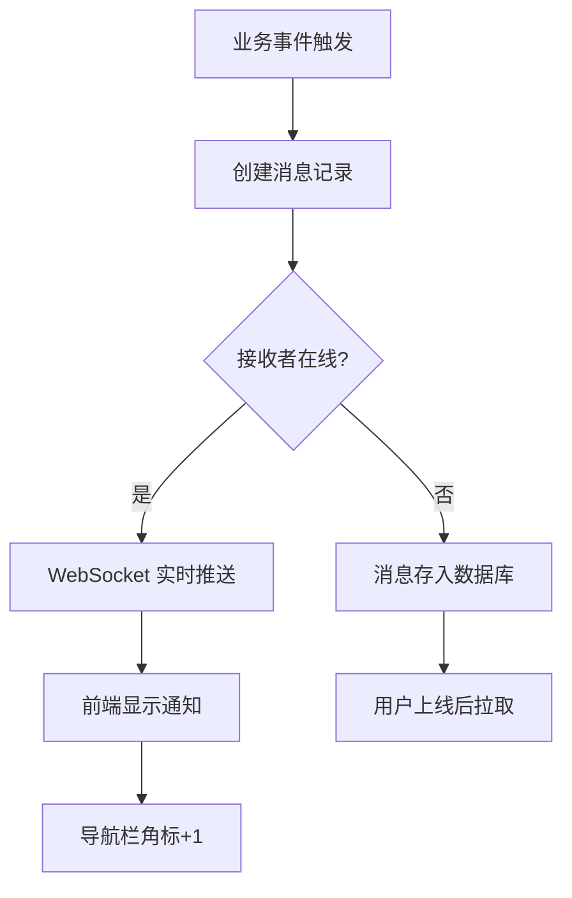

# 5.6 消息通知模块实现

## 5.6.1 功能概述与效果展示

消息通知模块承担平台内信息触达的枢纽职责，基于 WebSocket 协议实现服务端到客户端的实时推送，确保用户在借阅状态变更、收到新评论、被点赞等场景下能够即时感知。

如图 5.6 所示，消息中心页面采用左右分栏布局。左侧为消息类型筛选栏，包含"全部""借阅""论坛""系统"四个分类，每个分类显示未读数量角标。右侧为消息列表，每条消息以卡片形式呈现，包含消息类型图标、标题、内容摘要、发送时间和已读状态。未读消息左侧显示红色圆点标识，点击消息后圆点消失并标记为已读。

图 5.6 消息通知推送流程图

导航栏右侧消息图标持续显示未读数量角标，收到新消息时角标数字递增并伴随轻微抖动动画。点击消息图标下拉显示最近 5 条消息预览，点击"查看全部"跳转至消息中心页面。

## 5.6.2 前端交互与数据流转

### WebSocket 连接管理

前端在用户登录成功后建立 WebSocket 连接，连接 URL 携带 JWT 令牌作为查询参数。连接成功后，前端维护连接状态标识，断线时自动触发重连机制。

重连策略采用指数退避算法：首次断线后 1 秒尝试重连，失败后等待 2 秒，再失败后等待 4 秒，以此类推，最大等待间隔为 60 秒。重连成功后，前端主动拉取断线期间的消息列表，确保无遗漏。

消息接收后，前端根据消息类型执行差异化处理：借阅类消息播放提示音并显示系统通知（需用户授权）；论坛类消息仅更新角标计数；系统类消息同时播放提示音和显示通知。

### 消息列表与状态管理

消息中心页面加载时，前端首先查询本地未读消息数量（存储于 Pinia 状态库），然后发起分页请求获取消息列表。列表采用时间倒序排列，支持下拉刷新和底部无限加载。

已读状态管理采用乐观更新策略：用户点击消息后，前端立即将消息标记为已读并更新角标计数，同时异步发送已读请求至服务端。若请求失败，下次进入消息中心时重新同步状态。

"全部已读"按钮位于页面顶部，点击后所有未读消息状态变更为已读，角标计数清零，同时向服务端批量发送已读确认。

## 5.6.3 后端处理逻辑

### WebSocket 握手认证

WebSocket 连接建立时，服务端拦截器从 URL 查询参数中提取 JWT 令牌，执行与 HTTP 请求相同的认证流程：验证令牌签名、解析用户 ID、查询用户状态。认证通过后，将用户 ID 与 WebSocket Session 绑定存储于内存映射表中，后续可通过用户 ID 查找对应 Session 发送消息。

认证失败时，服务端拒绝连接并返回 401 状态码，前端收到后停止重连并提示用户重新登录。

### 消息推送流程

如表 5.6 所示，消息推送在后端经历创建、存储、推送三个主要阶段。

表 5.6 消息推送处理步骤

| 步骤 | 处理内容 | 校验规则 | 异常分支 |
|:---:|:--------|:--------|:--------|
| 1 | 接收业务事件 | 事件类型和参数完整 | 忽略无效事件 |
| 2 | 创建消息记录 | 设置接收者、类型、内容 | — |
| 3 | 保存至数据库 | 写入消息表 | — |
| 4 | 查询接收者 Session | 内存映射表存在性检查 | 用户离线，跳过推送 |
| 5 | 构建推送消息 | 组装标题、内容、关联 ID | — |
| 6 | WebSocket 推送 | 通过 Session 发送消息 | 推送失败，记录日志 |

消息实体设计采用统一结构，字段包括：消息类型（枚举值）、标题、内容、关联业务 ID、发送者 ID（系统消息为空）、接收者 ID、已读状态、创建时间。不同类型的消息通过消息类型字段区分，前端根据类型渲染不同的图标和跳转逻辑。

### 定时提醒任务

系统配置定时任务，每日早晨 9 点执行逾期提醒扫描。扫描逻辑如下：查询所有状态为"借用中"且归还日期为今天或已逾期的借阅记录，向借入者发送"即将到期"或"已逾期"提醒消息，向借出者发送"借入者即将到期"或"借入者已逾期"提醒消息。

定时任务采用 Spring 的 @Scheduled 注解实现，配置为固定延迟执行（上一次执行完成后 24 小时再次执行），防止任务重叠。任务执行日志记录扫描记录数和发送消息数，便于监控和排查。

## 5.6.4 难点与解决方案

### 离线消息补偿

**问题场景**：用户离线期间产生多条消息，上线后需要完整接收这些消息，但 WebSocket 仅支持实时推送，无法主动获取历史消息。

**解决方案**：采用"拉取+推送"双通道模式。用户上线建立 WebSocket 连接后，前端立即发起 HTTP 请求拉取最近 7 天的未读消息列表，服务端返回消息数据后前端渲染并更新角标。同时，WebSocket 连接保持活跃，实时接收新消息。该方案确保用户无论在线还是离线，都能完整获取消息，无遗漏。

### 消息推送可靠性

**问题场景**：WebSocket 推送过程中连接突然断开，导致消息丢失。

**解决方案**：引入消息确认机制。服务端推送消息后，前端在 3 秒内返回确认回执。若服务端未收到确认，将该消息标记为"待重推"，待用户下次上线时重新推送。同时，所有消息持久化至数据库，即使推送失败也可通过拉取接口补偿。该机制确保消息"至少送达一次"。

### 大规模并发推送

**问题场景**：平台用户量增长后，同一时间大量用户在线，广播消息（如系统公告）需要推送给所有在线用户，可能导致服务端性能瓶颈。

**解决方案**：采用消息分批推送策略。广播消息时，将在线用户列表按每批 100 人分组，逐批推送，每批之间间隔 100 毫秒。该策略平滑推送压力，避免瞬间高并发导致服务端资源耗尽。同时，广播消息同时写入数据库，离线用户上线后通过拉取接口获取。
