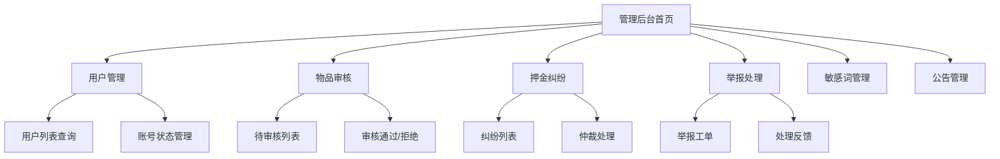

# 5.7 管理运营模块实现

## 5.7.1 功能概述与效果展示

管理运营模块为平台管理员提供内容治理、交易仲裁和系统运营能力，是保障平台健康运行的核心支撑。该模块采用独立的管理后台界面，与普通用户前端分离，通过角色权限控制访问。

如图 5.7 所示，管理后台采用经典的侧边栏+内容区布局。左侧侧边栏为功能导航菜单，包含"用户管理""物品审核""押金纠纷""举报处理""敏感词管理""公告管理"六个一级菜单。右侧内容区顶部显示面包屑导航和当前管理员信息，中部为功能操作区。

图 5.7 管理后台功能结构图

用户管理页面以表格形式展示注册用户列表，支持按手机号、昵称、状态筛选，支持分页和排序。每行显示用户基础信息、信用分、角色和状态，操作列提供"查看详情""禁用账号""设为管理员"按钮。

物品审核页面展示待审核物品列表，每行显示物品名称、分类、所有者、提交时间和图片预览。点击"审核"按钮弹出审核弹窗，左侧展示物品完整信息和图片，右侧提供"通过""拒绝"两个操作按钮，拒绝时需填写拒绝原因。

## 5.7.2 前端交互与数据流转

### 表格列表交互规范

管理后台所有列表页面遵循统一的交互规范。表格顶部为筛选栏，包含搜索框和下拉筛选器，筛选条件变更后自动触发查询。表格中部为数据行，每行悬停时背景色变化，操作按钮在悬停时显示。表格底部分页器，支持页码跳转和每页条数切换。

表格行支持批量操作：点击行首复选框选中记录，顶部工具栏显示已选数量和批量操作按钮（如"批量通过""批量拒绝"）。批量操作前弹出二次确认对话框，防止误操作。

### 审核操作弹窗

物品审核和举报处理均采用侧边滑出弹窗设计。弹窗从右侧滑入，宽度占屏幕 60%，左侧 40% 保持列表页面可见。弹窗内部分为三栏：顶部为对象基本信息，中部为详细内容（图片、描述等），底部为操作区。

操作区根据审核类型动态显示按钮组合。物品审核显示"通过"（绿色）和"拒绝"（红色）按钮，拒绝时下方展开原因输入框。举报处理显示"删除内容"（红色）"驳回举报"（灰色）和"转人工"（蓝色）三个按钮，选择删除内容时下方展开删除原因输入框。

操作提交后，弹窗关闭并刷新列表，同时显示操作成功提示（右上角 Toast 通知）。若操作失败，弹窗保持打开并显示错误信息。

### 敏感词管理编辑器

敏感词管理页面提供批量编辑功能。页面左侧为敏感词列表，以标签云形式展示，每个标签显示词汇内容和命中次数。右侧为编辑器，支持三种输入模式：单行输入（添加单个词汇）、多行输入（批量添加，每行一个词）、文件导入（上传文本文件自动解析）。

标签云支持点击删除，删除前弹出确认对话框。批量添加时，系统自动去重并过滤空行，添加成功后新词汇以动画形式插入标签云。

## 5.7.3 后端处理逻辑

### 权限控制机制

管理后台接口通过 Spring Security 的角色校验进行访问控制。所有管理接口路径以 `/api/admin` 为前缀，配置安全规则要求请求者具备 ADMIN 角色。JWT 令牌载荷中包含角色信息，过滤器解析后存入 SecurityContext，Controller 方法通过注解或代码检查角色权限。

非管理员角色访问管理接口时，返回 403 禁止访问响应，前端跳转至 403 错误页面。管理员角色变更（如取消管理员权限）后，该用户的 JWT 令牌在过期前仍然有效，但后续访问管理接口时被权限校验拦截。

### 物品审核流程

如表 5.7 所示，物品审核请求在后端经历权限校验、状态更新和通知发送三个主要阶段。

表 5.7 物品审核处理步骤

| 步骤 | 处理内容 | 校验规则 | 异常分支 |
|:---:|:--------|:--------|:--------|
| 1 | 校验管理员身份 | 当前用户角色为 ADMIN | 返回禁止访问 |
| 2 | 查询物品记录 | 物品存在且状态为"待审核" | 返回物品状态异常 |
| 3 | 执行审核决策 | 通过或拒绝 | — |
| 4 | 更新物品状态 | 通过为"可借用"，拒绝为"已拒绝" | — |
| 5 | 记录审核日志 | 记录审核人、时间、结果、原因 | — |
| 6 | 发送通知 | 向物品所有者推送审核结果 | — |

审核通过后，物品状态变更为"可借用"，立即在首页列表中展示。审核拒绝后，物品状态变更为"已拒绝"，所有者可在个人中心查看拒绝原因并修改后重新提交。

### 押金纠纷仲裁流程

押金纠纷处理涉及资金操作，后端执行严格的校验和记录流程：

第一步，查询纠纷记录。确认纠纷存在且状态为"待处理"。第二步，校验处理权限。确认当前用户为管理员角色。第三步，校验处理参数。处理决策必须为"全额退还""部分扣除"或"全额扣除"之一，部分扣除时扣除金额不超过押金总额。第四步，执行资金操作。全额退还调用支付宝退款接口退还全部押金；部分扣除退还剩余金额并记录扣除原因；全额扣除不退还押金。第五步，更新纠纷状态。记录处理结果、处理人、处理时间，状态变更为"已处理"。第六步，发送通知。向纠纷双方推送处理结果通知。

### 举报处理流程

举报处理采用工单模式，每条举报生成独立工单记录。处理流程如下：

查询举报记录，确认状态为"待处理"。校验处理权限。执行处理决策：删除内容时，更新帖子或评论状态为"已删除"，记录删除原因；驳回举报时，仅更新举报状态为"已驳回"，不修改原内容。记录处理日志，包含处理人、时间、决策和原因。发送通知给举报人，告知处理结果。

## 5.7.4 难点与解决方案

### 管理员权限变更延迟

**问题场景**：管理员 A 被取消管理员权限后，其浏览器中缓存的 JWT 令牌在过期前仍然有效，仍可访问管理后台页面（虽然接口会被拦截，但页面已加载）。

**解决方案**：管理后台页面加载时，前端发起权限校验请求查询当前用户最新角色信息。若角色已变更（不再是管理员），前端自动清除登录状态并跳转至普通用户首页。同时，JWT 令牌中嵌入角色版本号，服务端每次请求校验角色版本号是否与数据库一致，不一致则强制令牌失效。

### 批量操作性能

**问题场景**：管理员批量审核 100 条物品记录，若逐条执行数据库更新，性能低下且响应时间长。

**解决方案**：采用批量更新策略。前端将选中的记录 ID 列表一次性提交，后端使用数据库批量更新语句（如 MySQL 的 CASE WHEN）一次性更新多条记录状态。同时，批量操作采用异步处理模式：后端接收请求后立即返回"处理中"响应，后台线程执行实际更新，完成后通过 WebSocket 通知前端刷新列表。该方案将 100 条记录的更新耗时从数秒降低至毫秒级。

### 审核日志追溯

**问题场景**：物品被误审核或用户投诉审核结果，需要追溯当时的审核人和审核依据。

**解决方案**：建立完整的审核日志体系。每次审核操作记录独立日志，包含：审核对象 ID、审核前状态、审核后状态、审核人 ID、审核时间、审核决策、审核原因、客户端 IP 地址。日志记录持久化至数据库，支持按时间范围、审核人、审核对象等维度查询。审核日志不可修改和删除，确保审计追溯的可靠性。
