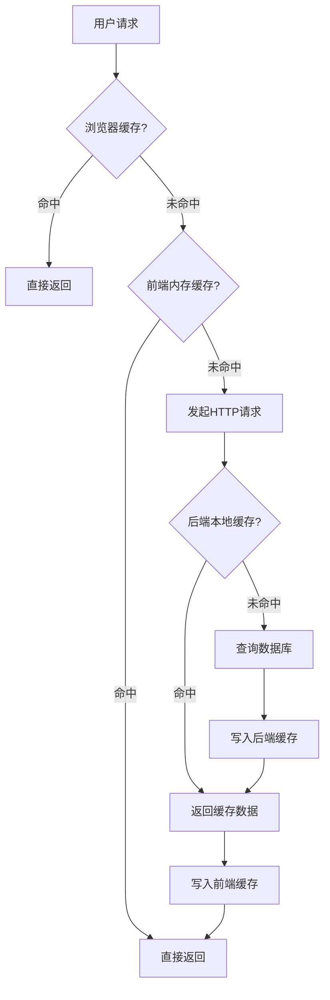

# 5.8 性能优化实现

## 5.8.1 功能概述与效果展示

性能优化模块并非独立的业务功能，而是贯穿系统各层面的横切关注点。该模块通过前端缓存、后端缓存、加载状态优化和骨架屏技术，提升系统响应速度和用户体验，降低服务器负载。

如图 5.8 所示，缓存架构采用分层设计，自顶向下分为浏览器缓存层、前端内存缓存层、后端本地缓存层和数据库层。各层缓存具有不同的有效期和失效策略，形成互补的缓存体系。

图 5.8 分层缓存架构图

优化效果在以下场景显著体现：首页物品列表在 2 分钟内重复访问无需重新请求 API，直接从内存缓存读取；分类和社区下拉框数据从 localStorage 读取，实现毫秒级响应；论坛帖子切换标签页时，已加载的数据从缓存恢复，避免空白等待；后端热门查询结果缓存于 Caffeine，降低数据库查询压力。

## 5.8.2 前端交互与数据流转

### 前端缓存策略

前端实现两套缓存机制：内存缓存（ApiCache）和持久化缓存（LocalCache）。内存缓存基于 JavaScript Map 实现，存储 API 响应数据，支持设置有效期（TTL），过期自动清除。持久化缓存基于 localStorage 实现，存储基础数据（分类列表、社区列表），支持更长的有效期（30 分钟）。

缓存键生成规则：GET 请求以 "URL?序列化参数" 作为键，确保相同请求命中同一缓存。缓存配置采用白名单模式，仅对特定接口启用缓存，避免敏感数据（如个人信息、支付记录）被缓存。

写操作自动失效机制：POST、PUT、DELETE 请求成功后，自动清除与请求路径前缀匹配的缓存。例如，发布新帖子后，自动清除 `/forum/posts` 相关的所有缓存，确保列表数据及时更新。

### 请求去重机制

前端实现请求去重（Dedupe）机制，防止同一请求在短时间内并发发送。当多个组件同时发起相同请求时（如页面初始化时导航栏和主内容区同时请求用户信息），第一个请求进入实际发送流程，后续相同请求加入等待队列，共享第一个请求的响应结果。

该机制通过 Promise 对象实现：第一个请求创建 Promise 并缓存，后续请求直接返回缓存的 Promise，待第一个请求完成后所有等待者同时获得结果。请求完成后（无论成功或失败）清除缓存的 Promise，允许后续重新发起请求。

### 骨架屏加载优化

骨架屏在数据加载时展示与真实内容结构相似的灰色占位块，给用户"内容即将呈现"的心理预期。系统实现四种骨架屏类型：

卡片骨架：模拟物品卡片布局，包含图片占位区、标题占位条、标签占位区和价格占位区。帖子骨架：模拟帖子卡片布局，包含头像占位圆、多行文本占位条和按钮占位区。表格骨架：模拟表格行布局，每行包含头像占位圆、两行文本占位条和操作按钮占位区。文本骨架：模拟段落文本布局，多行不同宽度的占位条。

骨架屏通过 CSS 动画实现脉冲闪烁效果（animate-pulse），营造加载中的动态感。数据加载完成后，骨架屏平滑过渡为真实内容，避免视觉跳跃。

### 空状态提示优化

当数据为空时，系统展示精心设计的空状态页面，替代传统的空白或简单文字提示。空状态组件包含：装饰性图标（大尺寸、浅灰色）、标题（"暂无物品""还没有帖子"等）、描述文字（解释空状态原因）、操作按钮（引导用户执行创建操作）。

空状态组件支持插槽扩展，允许自定义操作内容。例如，物品列表空状态显示"发布物品"按钮，论坛列表空状态显示"发布帖子"按钮，引导用户从消费内容转向生产内容。

## 5.8.3 后端处理逻辑

### 后端缓存配置

后端采用 Spring Cache 抽象整合 Caffeine 本地缓存。缓存管理器配置如下：最大缓存条目数 1000，写入后 10 分钟过期。该配置适用于中等规模应用，缓存热点数据的同时控制内存占用。

缓存注解应用于 Service 层方法：@Cacheable 标记查询方法，首次执行后将结果缓存；@CacheEvict 标记写操作方法，执行后清除指定缓存；缓存键采用 SpEL 表达式动态生成，包含方法参数以确保不同查询条件命中不同缓存。

### 缓存失效策略

后端缓存失效采用主动失效模式。写操作（创建、更新、删除）完成后，立即清除相关缓存，确保后续查询获取最新数据。例如，创建新帖子后，清除帖子列表缓存和热门帖子缓存；更新物品信息后，清除物品详情缓存和物品列表缓存。

对于列表类缓存，采用全部清除策略（allEntries = true），避免维护复杂的单条记录缓存键。该策略简单可靠，虽然会导致少量不必要的缓存重建，但避免了缓存不一致风险。

### 分页查询优化

分页查询是系统最常见的数据库操作，优化策略包括：

第一，数据库层面使用 LIMIT/OFFSET 实现物理分页，避免全表扫描。第二，热门分页查询结果缓存于 Caffeine，缓存键包含页码和筛选条件，有效期 2 分钟。第三，前端分页组件支持 append 和 replace 两种模式，append 模式加载更多数据时保留已有数据，减少页面重绘。

## 5.8.4 难点与解决方案

### 缓存一致性保障

**问题场景**：前端缓存和后端缓存同时存在，写操作后前端清除本地缓存，但其他用户的浏览器中仍保留旧数据，造成数据不一致。

**解决方案**：采用短有效期策略平衡一致性和性能。前端缓存有效期设置为 2 分钟，后端缓存设置为 10 分钟。该策略确保数据最终一致，最大不一致窗口为 10 分钟。对于需要强一致性的场景（如支付状态），绕过缓存直接查询数据库。

### 缓存雪崩防护

**问题场景**：大量缓存同时过期，导致短时间内大量请求直达数据库，造成数据库压力激增。

**解决方案**：采用随机过期时间策略。在基础过期时间上增加随机偏移量（如 10 分钟 ± 2 分钟），使缓存过期时间分散，避免集中失效。同时，后端缓存配置最大条目数（1000），防止内存无限增长。对于极高并发场景，可引入互斥锁机制：缓存失效后，第一个请求获取锁并查询数据库，其他请求等待结果，避免并发查询。

### 大列表内存优化

**问题场景**：论坛帖子列表和物品列表数据量增长后，前端内存缓存占用过大，影响页面性能。

**解决方案**：限制缓存数据量和条目数。前端仅缓存第一页数据（10 条），翻页后的数据不进入缓存。后端缓存同样限制最大条目数，超出后按 LRU（最近最少使用）策略淘汰旧数据。同时，列表数据仅缓存核心字段（ID、标题、摘要），不缓存完整详情，减少单条数据体积。
