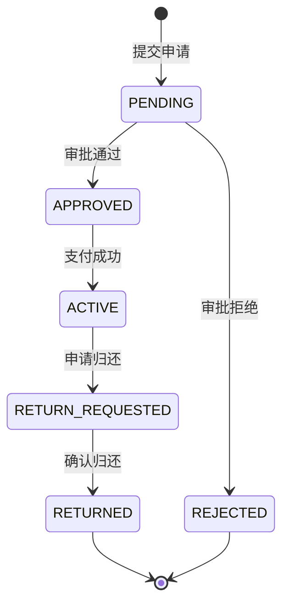

基于对项目所有文档的全面分析，我为您设计了一套完整的**论文格式文档体系**：

---

## 一、当前文档现状分析

### 文档分布情况

| 类别 | 数量 | 代表文档 |
|------|------|---------|
| 开发进度总览 | 4份 | `项目开发进度总览4.md` |
| 模块开发文档 | 6份 | 借阅、支付、论坛、评价、通知、物品 |
| 技术方案文档 | 3份 | 分页、逻辑视图分离、路径读取 |
| 接口规范文档 | 2份 | 接口规范、全局异常优化 |
| 性能优化文档 | 5份 | 缓存策略、实施清单、优化方案 |
| 管理模块文档 | 3份 | 管理模块分析、开发文档、拓展 |
| 审核举报文档 | 4份 | 审核模块、敏感词、设计、重构 |
| 问题记录文档 | 10+份 | 各类问题解决记录 |
| 论文章节 | 9份 | 4.1-5.6章节 |

**核心问题**：
- 文档分散在10+个子目录中
- 同一模块内容分散在多份文档中
- 技术方案与业务文档混杂
- 缺少统一的文档标准和模板

---

## 二、论文整体章节结构

### 推荐结构（符合计算机专业毕业论文规范）

```
第1章 绪论
  1.1 研究背景与意义
  1.2 国内外研究现状
  1.3 研究内容与创新点
  1.4 论文组织结构

第2章 相关技术介绍
  2.1 前端技术栈
    2.1.1 Vue 3 框架
    2.1.2 TypeScript 语言
    2.1.3 TailwindCSS 样式框架
  2.2 后端技术栈
    2.2.1 Spring Boot 框架
    2.2.2 Spring Data JPA
    2.2.3 Spring Security + JWT
  2.3 数据库与中间件
    2.3.1 MySQL 数据库
    2.3.2 Flyway 数据库迁移
  2.4 第三方服务
    2.4.1 支付宝沙箱支付
    2.4.2 WebSocket 实时通信

第3章 系统需求分析
  3.1 系统可行性分析
    3.1.1 技术可行性
    3.1.2 经济可行性
    3.1.3 操作可行性
  3.2 功能需求分析
    3.2.1 用户认证模块需求
    3.2.2 物品管理模块需求
    3.2.3 借阅管理模块需求
    3.2.4 支付模块需求
    3.2.5 论坛模块需求
    3.2.6 消息通知模块需求
    3.2.7 管理员模块需求
  3.3 非功能需求分析
    3.3.1 性能需求
    3.3.2 安全需求
    3.3.3 可用性需求
  3.4 用例分析
    3.4.1 普通用户用例
    3.4.2 管理员用例

第4章 系统设计
  4.1 系统总体架构设计
    4.1.1 系统架构选型
    4.1.2 技术架构图
    4.1.3 部署架构图
  4.2 功能模块设计
    4.2.1 模块划分总览
    4.2.2 用户认证模块设计
    4.2.3 物品管理模块设计
    4.2.4 借阅管理模块设计
    4.2.5 支付模块设计
    4.2.6 论坛模块设计
    4.2.7 消息通知模块设计
    4.2.8 管理员模块设计
  4.3 数据库设计
    4.3.1 数据库E-R图设计
    4.3.2 数据表结构设计
    4.3.3 数据库索引设计
  4.4 接口设计
    4.4.1 RESTful API 设计规范
    4.4.2 核心接口定义
  4.5 安全设计
    4.5.1 认证鉴权设计
    4.5.2 敏感数据保护
  4.6 性能优化设计
    4.6.1 缓存策略设计
    4.6.2 分页查询设计

第5章 系统实现
  5.1 开发环境搭建
  5.2 用户认证模块实现
  5.3 物品管理模块实现
  5.4 借阅管理模块实现
  5.5 支付模块实现
  5.6 论坛模块实现
  5.7 消息通知模块实现
  5.8 管理员模块实现
  5.9 性能优化实现
    5.9.1 前端缓存实现
    5.9.2 后端缓存实现
    5.9.3 加载状态优化实现

第6章 系统测试
  6.1 测试环境
  6.2 功能测试
  6.3 性能测试
  6.4 安全测试

第7章 总结与展望
  7.1 工作总结
  7.2 不足与展望

参考文献
致谢
```

---

## 三、系统设计与详细设计的划分

### 核心原则

| 维度 | 系统设计（第4章） | 详细设计（隐含在各节中） |
|------|------------------|------------------------|
| **抽象层次** | 宏观、架构级 | 微观、实现级 |
| **关注点** | "是什么"、"为什么" | "怎么做" |
| **内容** | 模块划分、数据流转、接口契约 | 代码结构、算法逻辑、状态机 |
| **图表** | 架构图、E-R图、流程图 | 类图、时序图、状态图 |
| **读者** | 架构师、评审老师 | 开发者、维护者 |

---

### 具体划分示例

#### 以"借阅管理模块"为例

**4.2.4 借阅管理模块设计（系统设计）**：
```markdown
## 4.2.4 借阅管理模块设计

### 1. 模块职责
负责处理用户之间的物品借阅全流程，包括申请、审批、取货、归还等环节。

### 2. 功能结构
- 借阅申请：借入者提交借阅请求
- 借阅审批：借出者审批申请
- 确认取货：借入者确认收到物品
- 确认归还：借出者确认物品归还
- 提醒归还：借出者提醒借入者归还

### 3. 状态流转设计
```
[PENDING] --审批通过--> [APPROVED] --支付成功--> [ACTIVE] 
                                              --申请归还--> [RETURN_REQUESTED] 
                                              --确认归还--> [RETURNED]
```

### 4. 接口契约
| 接口 | 方法 | 路径 | 说明 |
|------|------|------|------|
| 申请借阅 | POST | /api/borrows | 创建借阅记录 |
| 审批申请 | POST | /api/borrows/{id}/approve | 借出者审批 |
```

**5.4 借阅管理模块实现（详细设计）**：
```markdown
## 5.4 借阅管理模块实现

### 1. 代码结构
```
com.neighbor.service/
├── BorrowService.java          # 借阅服务接口
├── impl/
│   └── BorrowServiceImpl.java  # 借阅服务实现
└── dto/
    ├── BorrowRequest.java      # 申请请求DTO
    ├── BorrowDTO.java          # 借阅详情DTO
    └── ApproveRequest.java     # 审批请求DTO
```

### 2. 核心算法：状态机校验
```java
private void validateStatusTransition(BorrowStatus current, BorrowStatus next) {
    switch (current) {
        case PENDING:
            if (next != APPROVED && next != REJECTED) {
                throw new BusinessException(BORROW_STATUS_INVALID);
            }
            break;
        // ...
    }
}
```

### 3. 并发控制：乐观锁
```java
@Version
private Long version;
```

### 4. 关键时序图
[时序图：借阅申请流程]
```

---

## 四、模块划分与文档映射

### 模块划分总览

| 模块 | 系统设计章节 | 详细设计章节 | 来源文档 |
|------|------------|------------|---------|
| 用户认证 | 4.2.2 | 5.2 | `AI开发指南.md` |
| 物品管理 | 4.2.3 | 5.3 | `物品模块说明文档.md` |
| 借阅管理 | 4.2.4 | 5.4 | `借阅模块.md` |
| 支付模块 | 4.2.5 | 5.5 | `支付模块开发文档.md` |
| 论坛模块 | 4.2.6 | 5.6 | `论坛模块开发文档.md` |
| 消息通知 | 4.2.7 | 5.7 | `WebSocket完成.md` |
| 管理员模块 | 4.2.8 | 5.8 | `管理模块开发文档.md` |
| 性能优化 | 4.6 | 5.9 | `缓存优化实施总结.md` |

---

## 五、文档整合实施计划

### Phase 1：建立文档模板（1天）

创建统一的章节模板：
```
论文/
├── template/
│   ├── 章节模板.md          # 统一的章节格式
│   ├── 图表规范.md          # 图表绘制标准
│   └── 术语表.md            # 统一术语定义
```

### Phase 2：核心章节编写（3天）

| 天数 | 任务 | 输出 |
|------|------|------|
| Day 1 | 第1-2章（绪论+技术介绍） | 新建 |
| Day 2 | 第3章（需求分析） | 基于原型文档整理 |
| Day 3 | 第4章（系统设计） | 基于现有论文+开发文档整合 |

### Phase 3：实现章节编写（3天）

| 天数 | 任务 | 输出 |
|------|------|------|
| Day 4 | 第5章前半（5.1-5.5） | 基于模块开发文档 |
| Day 5 | 第5章后半（5.6-5.9） | 基于模块开发文档+优化文档 |
| Day 6 | 第6-7章（测试+总结） | 新建 |

### Phase 4：整合与校对（2天）

- 统一术语和格式
- 图表规范化
- 交叉引用检查

---

## 六、关键设计决策

### 1. 状态机统一描述

所有涉及状态流转的模块，统一使用状态图描述：

```markdown
### 状态流转图


```

### 2. 接口统一格式

所有API接口统一使用表格描述：

| 属性 | 说明 |
|------|------|
| 接口地址 | `POST /api/borrows` |
| 请求参数 | `BorrowRequest` |
| 响应数据 | `BorrowDTO` |
| 认证要求 | 需要登录 |
| 异常场景 | 物品不可借、信用分不足 |

### 3. 代码展示规范

- 系统设计：只展示接口定义、类结构
- 详细设计：展示核心算法、关键代码片段
- 统一使用语法高亮

---

这套方案的特点是**层次分明、结构清晰、易于维护**。需要我开始实施具体的文档整合工作吗？